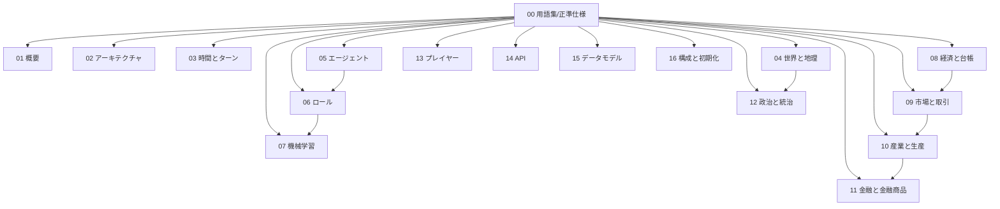
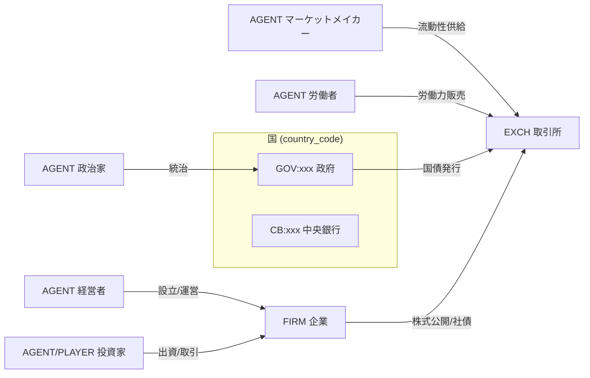
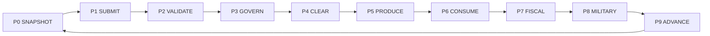

# 00. 用語集と正準仕様 (Glossary & Canonical Contract)

本書は FinBox シミュレーションの**正準仕様 (canonical contract)** である。命名規約・ID体系・列挙値・時間定数・ターンパイプライン・不変条件など、すべてのドキュメントと実装が共有しなければならない横断的な定義をここに集約する。各セクションのドキュメントは本書の定義を唯一の真実 (single source of truth) として参照し、矛盾する独自定義を持ってはならない。記載に差異が生じた場合は本書を正とし、本書側の誤りであれば本書を修正する。

## 0.1 ドキュメント体系

FinBox のドキュメントは `doc/` 配下に以下の構成で配置される。各ファイルは独立して読めるが、横断定義は本書 (00) に集約する。

| ファイル | 表題 | 主題 |
| --- | --- | --- |
| `README.md` | 目次と読み方 | ドキュメント全体の索引・読書順・全体図 |
| `00-glossary.md` | 用語集と正準仕様 | 本書。横断定義・ID体系・列挙値・不変条件 |
| `01-overview.md` | システム概要 | ビジョン・目的・全体アーキテクチャ・リアリティ設計 |
| `02-architecture.md` | アーキテクチャ | エンジン/クライアント分離・FastAPI・データフロー・権限モデル |
| `03-time-and-turns.md` | 時間とターン | 暦・ターンパイプライン詳細・提出窓口・決定論・乱数 |
| `04-world-and-geography.md` | 世界と地理 | 国・地域・マス・資源・気候・季節・地図生成・人口移動 |
| `05-agents.md` | エージェント | ニーズ状態・ライフサイクル・意思決定ループ・消費・労働 |
| `06-roles.md` | ロール | ロール分類・責務・許可される行動・配属と流動性 |
| `07-machine-learning.md` | 機械学習 | 観測/行動空間・報酬関数・学習方式・推論配信・評価 |
| `08-economy-and-ledger.md` | 経済と台帳 | Tradable Assets分類・台帳・ID・整数不変条件・決済・保存則 |
| `09-markets-and-trading.md` | 市場と取引 | 板寄せアルゴリズム・注文種別・通貨ペア・マーケットメイカー |
| `10-industry-and-production.md` | 産業と生産 | 産業・生産レシピ・設備・地域上限・建設労働力・企業ライフサイクル |
| `11-finance-and-instruments.md` | 金融と金融商品 | 通貨・国債・社債・株式・中央銀行・金融財政政策・利息計算・指標 |
| `12-politics-and-government.md` | 政治と統治 | 政治意思決定の集約・政策レバー・軍事・領土・関税・課税 |
| `13-players-and-multiplayer.md` | プレイヤーとマルチプレイヤー | プレイヤー参加・エージェントとの同等性・公平性・ランキング |
| `14-api-reference.md` | API リファレンス | FastAPI エンドポイント・認証・スキーマ・エラー・レート制限 |
| `15-data-model.md` | データモデル | 正準データスキーマ・エンティティ関係・フィールド定義 |
| `16-configuration-and-initialization.md` | 構成と初期化 | 構成パラメーター・デフォルト値・世界生成・シナリオ・再現性 |

## 0.2 設計原則 (Design Tenets)

- **エンジンは権威 (server-authoritative)**: 状態遷移はすべて中央計算エンジンが決定論的に実行する。エージェントとプレイヤーはクライアントであり、API 経由で観測の取得と行動の提出のみを行う。クライアントは状態を直接書き換えられない。
- **エージェントとプレイヤーは同一インターフェース**: 機械学習エージェントも人間プレイヤーも、同じ FastAPI エンドポイント・同じ認証・同じ行動スキーマを用いる。差異はロールによる行動の可否 (role-gating) のみで、情報の非対称性や特権は存在しない。
- **すべての自発的取引は市場経由**: エンティティ間の Tradable Assets の自発的なやり取りは、公開市場の板寄せ約定 (P4 CLEAR) を通じてのみ成立する。賃金は労働市場、国債発行・株式公開は金融商品市場で行う。例外はルールが定める**プロトコル移転** (0.10) に限る。
- **数量は整数・台帳は二重仕訳**: すべての Tradable Assets の数量は整数。すべての残高変動は原因 (trade_id / production_id / transfer_id) を持ち、資産ごとに借方と貸方が相殺する二重仕訳で記録される (0.9, 0.11)。
- **決定論と再現性**: 同一シード・同一構成・同一行動列からは同一の世界が再現される。乱数はターンごとに導出されるサブシードから供給する (`03-time-and-turns.md`)。
- **空白を作らない経済**: 抽出 → 加工 → 最終財 → 消費・資本形成までの財の流れに断絶を作らない。あらゆる生産物は市場で需要に接続する (`10-industry-and-production.md`)。

## 0.3 命名規約 (Naming Conventions)

- **エンティティID・資産IDの構造**: `識別子 = 接頭辞(クラス) ":" 経路`。経路の階層区切りは `.`、列挙キー (国コード等) は大文字、企業等の数値キーはゼロ埋め6桁。
- **国コード (country_code)**: 3文字大文字 (`ALD` 等)。通貨コードは国コードと一致させる。
- **取引ペアID**: `base "/" quote`。価格は `quote` の最小単位を `base` 1単位あたりで表す整数 (0.8, 0.9)。
- **時刻表記**: `Y{年}-M{月}-T{ターン}` (例 `Y3-M07-T2`)。ターン通し番号 `tick` (0始まり) も併用する。
- **言語**: 散文は日本語、識別子・列挙値・コード・APIパスは英語。表のセルは空白パディングしない。文・箇条書きは物理的に1行に収める (折り返し禁止)。

## 0.4 主要エンティティと識別子 (Entity IDs)

すべての残高保有・取引・生産・消費の主体は一意の `entity_id` を持ち、共通台帳 (0.9) で残高が管理される。

| エンティティ種別 | entity_id 形式 | 例 | 説明 |
| --- | --- | --- | --- |
| エージェント (Agent) | `AGENT:<6桁>` | `AGENT:000123` | 機械学習で駆動する個体。労働者・政治家・投資家・経営者・マーケットメイカー等 |
| 企業 (Firm) | `FIRM:<6桁>` | `FIRM:000042` | 生産・雇用・在庫保有を行う法人。経営者エージェントが設立・運営 |
| 政府 (Government) | `GOV:<country_code>` | `GOV:ALD` | 国家財政・国債発行・徴税・軍事の主体。政治家集団が統治 |
| 中央銀行 (Central Bank) | `CB:<country_code>` | `CB:ALD` | 通貨の発行・吸収と政策金利の執行を担う制度的主体 |
| プレイヤー (Player) | `PLAYER:<6桁>` | `PLAYER:000007` | 人間プレイヤーの口座。投資家ロールで参加 |
| 取引所/清算機関 (Exchange) | `EXCH` | `EXCH` | 板寄せ清算と決済を担うシングルトン。手数料の収受主体でもある |

- マーケットメイカーは独立のエンティティ種別ではなく、ロール `MARKET_MAKER` を持つ `AGENT` である (0.11)。
- プレイヤーとエージェントは台帳上は対等で、どちらも `entity_id` で残高を持ち、同じ注文・行動を提出できる。

## 0.5 Tradable Assets の分類と資産ID (Asset IDs)

通貨・資源・金融商品を総称して **Tradable Assets** と呼ぶ。すべての資産は一意の `asset_id = <CLASS> ":" <path>` を持つ。クラスと名前空間は以下に固定する。新規資産は構成 (`16`) で追加できるが、本表のクラス・名前空間に従う。

### 0.5.1 資産クラス

| クラス | 用途 | asset_id 例 | 保存則の生成/消滅点 |
| --- | --- | --- | --- |
| `CUR` | 法定通貨 (6種) | `CUR:ALD` | 中央銀行による発行/吸収のみ (0.10) |
| `COMM` | 資源・財・労働力・サービス・軍需品 | `COMM:agri.grain` | 生産 (P5) で生成、消費/投入/軍事 (P5,P6,P8) で消滅 |
| `BOND` | 債券 (国債・社債) | `BOND:gov.ALD.2031Q1` | 発行 (市場) で生成、償還/買戻で消滅 |
| `EQ` | 株式 (企業の持分) | `EQ:firm.000042` | 設立/増資で発行、自社株買い/清算で消滅 |
| `BILL` | 短期割引証券 (国庫短期証券) | `BILL:gov.ALD.2031Q1` | 発行/償還。`BOND` の短期・割引版 |
| `FUT` | 先物 (拡張・任意) | `FUT:agri.grain.2031Q2` | 限月で発行、満期/反対売買で消滅 |

### 0.5.2 `COMM` の名前空間 (代表値・拡張可)

| 名前空間 | 意味 | 代表 asset_id |
| --- | --- | --- |
| `agri` | 農林水産一次産品 | `COMM:agri.grain`, `COMM:agri.livestock`, `COMM:agri.vegetable`, `COMM:agri.cotton`, `COMM:agri.timber`, `COMM:agri.fish` |
| `raw` | 鉱業・採掘一次産品 | `COMM:raw.iron_ore`, `COMM:raw.copper_ore`, `COMM:raw.bauxite`, `COMM:raw.coal`, `COMM:raw.crude_oil`, `COMM:raw.rare_earth`, `COMM:raw.limestone` |
| `energy` | エネルギー | `COMM:energy.electricity`, `COMM:energy.fuel` |
| `mat` | 加工素材・中間財 | `COMM:mat.lumber`, `COMM:mat.steel`, `COMM:mat.copper`, `COMM:mat.aluminum`, `COMM:mat.cement`, `COMM:mat.concrete`, `COMM:mat.plastics`, `COMM:mat.chemicals`, `COMM:mat.fabric`, `COMM:mat.glass`, `COMM:mat.fertilizer`, `COMM:mat.flour`, `COMM:mat.components` |
| `good` | 最終財 (貯蔵可) | `COMM:good.food`, `COMM:good.clothing`, `COMM:good.appliance`, `COMM:good.electronics`, `COMM:good.vehicle`, `COMM:good.furniture`, `COMM:good.medicine` |
| `labor` | 労働力 (投入財・1ターン消滅) | `COMM:labor.unskilled`, `COMM:labor.farm`, `COMM:labor.mine`, `COMM:labor.build`, `COMM:labor.factory`, `COMM:labor.office`, `COMM:labor.service`, `COMM:labor.engineer`, `COMM:labor.health`, `COMM:labor.research`, `COMM:labor.soldier` |
| `svc` | サービス (1ターン消滅) | `COMM:svc.healthcare`, `COMM:svc.education`, `COMM:svc.leisure`, `COMM:svc.retail`, `COMM:svc.transport`, `COMM:svc.finance` |
| `build` | 建設労働力 (資本形成財) | `COMM:build.construction_labor` |
| `mil` | 軍需品 | `COMM:mil.munitions` |

> **用語の重要な区別**: `COMM:build.construction_labor`(**建設労働力**)は建設業の**産出物**であり、企業の設備・能力拡張のために購入・消費される資本財である。一方 `COMM:labor.build`(**建設労働者の労働力**)は建設業が生産のために購入する**投入財**である。両者は別物であり混同してはならない (`10-industry-and-production.md`)。

### 0.5.3 性質フラグ

- `perishable`(消滅性): `labor.*` と `svc.*` はその生産ターン中に消費・投入されなければ消滅する (在庫繰越不可)。
- `storable`(貯蔵可): `agri.*`/`raw.*`/`mat.*`/`good.*`/`build.*`/`mil.*`/`energy.fuel` は在庫として翌ターンへ繰り越せる。`energy.electricity` は perishable。
- `divisible`: すべての数量は整数。価格は整数 (最小通貨単位)。

## 0.6 国と通貨 (Countries & Currencies)

シミュレーションは6か国で構成される。各国は1つの法定通貨・1つの政府・1つの中央銀行を持つ。国名は既定シナリオの呼称であり、地理パラメーターはシードによりランダム生成される (`04-world-and-geography.md`)。

| 国名 | country_code | 通貨 asset_id | 政府 | 中央銀行 |
| --- | --- | --- | --- | --- |
| Aldoria | `ALD` | `CUR:ALD` | `GOV:ALD` | `CB:ALD` |
| Borealis | `BOR` | `CUR:BOR` | `GOV:BOR` | `CB:BOR` |
| Cyrene | `CYR` | `CUR:CYR` | `GOV:CYR` | `CB:CYR` |
| Doria | `DOR` | `CUR:DOR` | `GOV:DOR` | `CB:DOR` |
| Esmark | `ESM` | `CUR:ESM` | `GOV:ESM` | `CB:ESM` |
| Faros | `FAR` | `CUR:FAR` | `GOV:FAR` | `CB:FAR` |

## 0.7 時間モデルの定数 (Time Constants)

| 定数 | 既定値 | 定義 |
| --- | --- | --- |
| `TURNS_PER_MONTH` | 4 | 1か月あたりのターン数 (構成可) |
| `MONTHS_PER_YEAR` | 12 | 1年あたりの月数 (固定) |
| `TURNS_PER_YEAR` | 48 | `TURNS_PER_MONTH × MONTHS_PER_YEAR`。年利換算の基準 |
| `tick` | 0..∞ | シミュレーション開始からのターン通し番号 |

- **年利→ターン利率 (線形/単利)**: クーポン・利息の期間按分は `r_turn = r_annual / TURNS_PER_YEAR`(既定 48分の1)。国債クーポン・預貸金利の発生はこの単利按分を正準とする。
- **年率→ターン成長 (複利)**: 複利成長が必要な文脈 (連続的な指数化等) では `g_turn = (1 + g_annual)^(1/TURNS_PER_YEAR) - 1` を用いる。各ドキュメントは利息=単利按分、成長=複利のどちらを用いるか明示する。
- 月・四半期 (3か月)・年の境界では、それぞれ定例イベント (国債入札・配当・指標確定・政策レビュー等) が発火する (`03`, `11`, `12`)。

## 0.8 価格と決済の数値表現 (Numeric Representation)

- すべての資産数量 `quantity` は非負整数。
- 価格 `price` は「`quote` 通貨の最小単位 / `base` 1単位」を表す整数 (price tick)。最小単位は通貨ごとに構成で定義する (`16`)。
- 約定1件の現金移動額は `cash = price × quantity`(厳密な整数)。端数は発生しない。
- 取引手数料 (任意) は `EXCH` が収受し、`fee = ceil(cash × fee_rate)` の整数で控除する。

## 0.9 共通台帳 (Common Ledger)

- 台帳は `balance[entity_id][asset_id] = 非負整数` を保持する。残高が負になる遷移は禁止 (空売りは金融商品の負債計上で表現し、現物残高は負にしない)。
- すべての残高変動は**二重仕訳**で記録する。1件の移転 (transfer) は、ある資産について借方合計と貸方合計が一致する。資産ごとの総量はミント/バーン点 (0.10) を除き保存される。
- すべての台帳変動は原因識別子 (`trade_id` / `production_id` / `transfer_id` / `mint_id`) を持ち、監査可能 (`08-economy-and-ledger.md`, `15-data-model.md`)。

## 0.10 市場決済とプロトコル移転 (Market Settlement vs Protocol Transfers)

資産がエンティティ間を移動・生成・消滅する経路は次の2種類のみである。

- **市場決済 (Market Settlement)**: P4 CLEAR の板寄せ約定。参加者の自発的な売買はすべてこの経路を通る。賃金 (労働市場)・原材料・最終財・FX・国債/社債の発行と流通・株式公開と売買を含む。
- **プロトコル移転 (Protocol Transfers)**: ルールが定める非市場の義務的移転・発行・消滅。市場の板寄せを経由しない。以下に限定する。
  - 徴税・関税の徴収 (`12`): 所得税・法人税・消費税・関税。
  - 国債・社債のクーポン支払と元本償還 (`11`)。
  - 株式の配当 (`11`)。
  - 補助金・社会保障・失業給付の支給 (`12`)。
  - 中央銀行による通貨の発行/吸収 (公開市場操作の現金注入を含む。買入対象資産の授受自体は市場経由でもよい) (`11`)。
  - 軍需品の消費と戦闘解決に伴う消滅 (`12`)。
  - 倒産清算時の残余資産分配 (`10`)。
  - 初期エンドウメント (genesis 配賦) (`16`)。
  - 生産による財の生成・消費および投入による消滅 (P5/P6) は移転ではなく**生成/消滅**として記録する (0.9)。

> 構想メモの「すべての取引は市場経由」という原則は、参加者間の**自発的取引**に適用される。徴税・利払・配当・軍事などルールに基づく義務的移転は取引ではなく、上記プロトコル移転として扱う。両者を混同しない。

## 0.11 ターンパイプライン (Canonical Turn Pipeline)

1ターンの実行は以下のフェーズを固定順で通る。各ドキュメントはこのフェーズ名 (P0..P9) を参照する。詳細は `03-time-and-turns.md`。

| フェーズ | 名称 | 内容 |
| --- | --- | --- |
| P0 | SNAPSHOT | ターン T の観測状態を全クライアントへ公開 |
| P1 | SUBMIT | 提出窓口で全エージェント/プレイヤーの行動 (注文・投票・生産計画・労働供給・軍事命令・企業操作) を収集 |
| P2 | VALIDATE | 行動の検証・クランプ (残高・合法手・隣接条件等)。不正行動は棄却または丸め |
| P3 | GOVERN | 政治家投票を集約し政策を確定 (政策金利・税率・関税・国債発行枠・軍事予算・補助金) (0.12) |
| P4 | CLEAR | 全取引ペアの板寄せ清算と決済 (労働・財・FX・債券・株式)。台帳へ二重仕訳で反映 |
| P5 | PRODUCE | 企業が保有投入財を消費し産出。地域上限・設備・労働で制約。建設労働力消費による能力拡張 |
| P6 | CONSUME | エージェントが保有財・サービスを消費しニーズ回復。ニーズ減衰・加齢・出生・死亡・移住 |
| P7 | FISCAL | 徴税・関税・クーポン・配当・補助金・中央銀行操作のプロトコル移転 |
| P8 | MILITARY | 軍需品消費による攻撃解決・マス占領・領土と国境の更新 |
| P9 | ADVANCE | マクロ指標・価格指数・イベント/ニュース生成・時計前進 (tick++)・各エージェントの報酬計算 |

## 0.12 政治意思決定の集約規則 (Political Aggregation)

各国の政策は、その国に配属された政治家エージェント集団の判断を以下の規則で集約して決定する (P3, `12-politics-and-government.md`)。

- **SCALAR (連続値)**: 最終値 = 各政治家の提案値の**平均**。政策レンジでクランプし tick へ丸める。例: 政策金利を A が 100bps、B が 200bps と判断 → 150bps (1.5%)。
- **BINARY (Yes/No)**: 各政治家は `[0,1]` の値で判断。平均が `≥ 0.5` なら Yes、未満なら No。
- **CATEGORICAL (複数選択肢)**: 各政治家が各選択肢をスコアリング。選択肢ごとの合計スコアが最大の選択肢を採用 (同点は最小インデックス)。
- **ALLOCATION (配分ベクトル)**: 予算配分・軍事目標優先度などは、各政治家の正規化済み重みベクトルの平均を採用。

## 0.13 ニーズ状態 (Agent Need States)

各エージェントは Tradable Asset ではない内部状態として以下のニーズ値を持つ (既定 `0..100` の連続値)。毎ターン減衰し、対応する財・サービスの消費で回復する。詳細・減衰率・回復対応・死亡条件は `05-agents.md`。

| 区分 | ニーズ | 回復手段 (代表) |
| --- | --- | --- |
| 生理 | `satiety` 満腹度 | `COMM:good.food`, `COMM:agri.*` |
| 生理 | `hydration` 水分 | 飲料 (`good.food` のサブ/水) |
| 生理 | `stamina` 体力・活力 | 休息・住環境 |
| 生理 | `health` 健康 | `COMM:svc.healthcare`, `COMM:good.medicine` |
| 生理 | `rest` 休息 | 余暇・睡眠 (労働の抑制) |
| 心理社会 | `happiness` 幸福度 | 上位ニーズ充足・余暇・消費の総合 |
| 心理社会 | `stress` ストレス (逆値) | 余暇・安定・健康 |
| 心理社会 | `comfort` 住環境快適性 | 住居 (建設・賃借) |
| 心理社会 | `social` 社会的つながり | `COMM:svc.leisure` 等 |
| 心理社会 | `security` 安全・治安 | 国家の治安・軍事・福祉 |
| 心理社会 | `leisure` 余暇充足 | `COMM:svc.leisure`, `COMM:good.electronics` |
| 発達・派生 | `skill[*]` 技能 (労働種別ごと) | 就労・教育 (`svc.education`) |
| 発達・派生 | `education` 教育水準 | `COMM:svc.education` |
| 発達・派生 | `age` 年齢 (tick換算) | 毎ターン加齢 |
| 発達・派生 | `wealth` 純資産 (WUI換算・派生) | 取引・労働・投資の結果 |
| 発達・派生 | `loyalty` 国家忠誠 | 国家の状態・福祉・徴税 |

## 0.14 ロール分類 (Role Taxonomy)

`AGENT`/`PLAYER` は1つ以上のロールを持つ。ロールは許可される行動 (role-gating) と報酬関数 (`07`) を規定する。詳細は `06-roles.md`。

- **労働者系 (households/labor)**: `FARMER`, `MINER`, `BUILDER`, `FACTORY_WORKER`, `SERVICE_WORKER`, `OFFICE_WORKER`, `LOGISTICS_WORKER`, `ENGINEER`, `HEALTHCARE_WORKER`, `TEACHER`, `RESEARCHER`, `SOLDIER`, `STUDENT`, `UNEMPLOYED`, `RETIREE`。各々が対応する `COMM:labor.*` を生産・販売する。
- **資本・経営系**: `ENTREPRENEUR`(経営者・企業設立運営), `INVESTOR`(投資家), `MARKET_MAKER`(マーケットメイカー、投資家から派生)。
- **公共系**: `POLITICIAN`(政治家), `CENTRAL_BANKER`(中央銀行家・政策執行), `BUREAUCRAT`(官僚・財政執行), `GENERAL`(将官・軍事指揮), `DIPLOMAT`(外交・任意)。
- **プレイヤー対象**: 人間プレイヤーは既定で `INVESTOR` として参加し、構成により `ENTREPRENEUR` も解禁できる。`POLITICIAN` 等の公共ロールは既定でAI専用 (`13-players-and-multiplayer.md`)。

## 0.15 産業分類 (Industry Taxonomy)

企業 (`FIRM`) は1つの産業に属する。抽出系である `AGRICULTURE` と `MINING`(原油・石炭・鉱石などの採掘を含む) は、地域 (Region) 単位で集約した総産出量 `region_cap[asset_id][region_id]` をターンあたり上限とする (`04-world-and-geography.md`/`10-industry-and-production.md`)。`ENERGY`(発電・燃料精製) は採掘ではなく加工産業であり、地域上限ではなく投入材 (`raw.coal`/`raw.crude_oil` 等)・設備・労働で律速される。地域上限の正準識別子は region 単位の `region_cap[asset_id][region_id]` とし、cell 単位では扱わない。

- `AGRICULTURE`(農林水産), `MINING`(鉱業・採掘), `ENERGY`(発電・燃料精製), `CONSTRUCTION`(建設), `MANUFACTURING`(製造、細分: heavy/chemical/electronics/food/textile/automotive/pharma/armaments), `LOGISTICS`(物流・運輸), `FINANCE`(金融・銀行・保険・ファンド), `SERVICES`(小売・医療・教育・娯楽・接客), `RESEARCH`(研究開発)。

## 0.16 計数単位とマクロ指標 (Numéraire & Macro Indicators)

- **WUI (World Unit Index)**: 6通貨の貿易加重バスケットで定義する合成計数単位。投資家・プレイヤーの純資産評価と順位付けを通貨横断で一貫させるための基準 (numéraire)。genesis では等加重、以後は各国 GDP・貿易シェアで定期再加重する (`11-finance-and-instruments.md`)。
- **純資産評価**: ポジションは最新の板寄せ清算価格でマークし、FX を介して WUI 換算する。
- **マクロ指標 (国別/全世界)**: 名目/実質GDP、CPI とインフレ率、失業率、政策金利、為替レート、政府債務・債務対GDP比、財政収支、貿易収支、マネーサプライ、鉱工業生産、平均幸福度、人口、ジニ係数、領土マス数、軍需品在庫。全世界指標として WUI 水準・世界GDP・世界貿易量を集計する。

## 0.17 保存則と不変条件 (Invariants)

- **数量整数**: すべての Tradable Asset 数量は整数 (0.8)。
- **非負残高**: 現物残高は常に `≥ 0`(0.9)。
- **資産保存**: 各資産の総量は、定義されたミント/バーン点 (0.10) を除き保存される。通貨は中央銀行のみが増減でき、財は生産/消費でのみ増減し、債券/株式は発行/償還・買戻/清算でのみ増減する。
- **二重仕訳**: すべての移転・約定は資産ごとに借方=貸方 (0.9)。
- **決定論**: 同一シード・構成・行動列は同一結果を生む (0.2)。
- **時刻整合**: クーポン・利息・成長はすべて `TURNS_PER_YEAR`(既定48) を基準に換算する (0.7)。

## 0.18 略語 (Abbreviations)

- **WUI**: World Unit Index (計数単位バスケット)。
- **bps**: ベーシスポイント (0.01%)。
- **OHLC**: 始値・高値・安値・終値。
- **TIF**: Time In Force (注文有効期間)。
- **RL**: 強化学習 (Reinforcement Learning)。
- **CTDE**: 集中学習・分散実行 (Centralized Training, Decentralized Execution)。
- **MM**: マーケットメイカー (Market Maker)。
- **FX**: 外国為替 (通貨対通貨)。
- **tick**: ターン通し番号、または価格の最小刻み (文脈で区別)。

## 0.19 注文種別と TIF (Order Type & Time-In-Force)

市場 (`09-markets-and-trading.md`) の注文は、執行方式を表す注文種別 (`order_type`) と、注文の有効期間を表す TIF (`tif`) の2軸で指定する。本書の列挙を全ドキュメント (`07`/`09`/`14`/`15`) における唯一の正準とし、各ドキュメントは別名や独自集合を定義しない。

- **注文種別 (`order_type`)**: `LIMIT`(指値)、`MARKET`(成行)、`IOC`(即時約定・残数キャンセル / immediate-or-cancel)、`FOK`(全数即時約定・不成立なら全数キャンセル / fill-or-kill)。
- **TIF (`tif`)**: `GFT`(当ターン限り / good-for-turn、既定)、`GTC`(取消まで有効 / good-till-cancel)、`GTT`(指定ターンまで有効 / good-till-tick、`expires_tick` で失効)。
- `IOC`/`FOK` は即時系の注文種別であり TIF とは独立の軸である。`LIMIT`/`MARKET` の既定 TIF は `GFT`。`DAY` という別名は用いず `GFT` に統一する。
