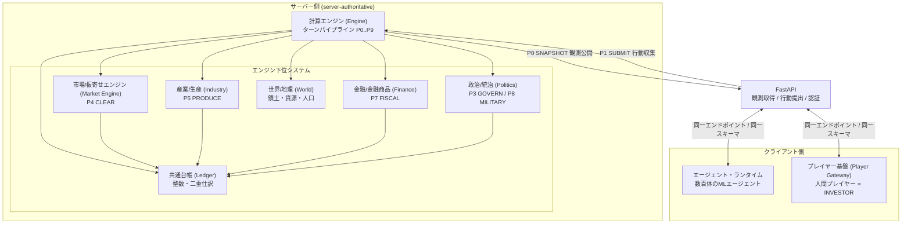

# 01. システム概要

本書は FinBox の全体像を示す入口である。ビジョン・目的・主要構成要素・リアリティ設計の柱・ステークホルダー・ターンの流れ・スコープを俯瞰し、各論ドキュメントへの導線を与える。横断的な定義 (ID体系・列挙値・時間定数・ターンパイプライン名 P0..P9・不変条件) はすべて [用語集と正準仕様](00-glossary.md) を唯一の真実とし、本書はそれを再定義せず参照・要約する。

## 1.1 ビジョン

FinBox は、機械学習で駆動する数百体のエージェントが**労働者・政治家・投資家・経営者・中央銀行家・将官**等のロールで分業し、6か国に分かれた経済を自律的に回す**ターン制マルチエージェント経済シミュレーション**である。人間プレイヤーは投資家として同じ世界に混在し、AIエージェントおよび他プレイヤーと同一のインターフェース・同一のルールの下で競争する。

世界の状態遷移はすべて中央の計算エンジンが決定論的に実行する (server-authoritative)。エージェントもプレイヤーも例外なくクライアントであり、FastAPI 経由で**観測の取得 (P0 SNAPSHOT) と行動の提出 (P1 SUBMIT) のみ**を行う。状態を直接書き換える経路は存在せず、サーバーとクライアントは完全に分離する。経済はすべて公開市場の板寄せ約定 ([P4 CLEAR](00-glossary.md)) と、整数のみで動く共通台帳の二重仕訳で表現される。

FinBox が目指すのは、個々のエージェントの局所的な意思決定 (何を作り、いくらで売り、誰に投票し、どこに投資するか) から、価格・インフレ・失業・景気循環・国家間の貿易と紛争といったマクロ現象が**創発する**ことであり、あらかじめ数式で与えられた均衡を再生することではない。

## 1.2 目的と狙い

- **創発的マクロ経済**: 価格発見・在庫循環・信用と金利・景気変動を、エージェントの分散した行動の集計結果として立ち上げる。マクロ指標 (GDP・CPI・失業率等, [0.16](00-glossary.md)) は集計の産物であって入力ではない。
- **政策・市場・地政学の相互作用の場**: 金融政策 (政策金利・公開市場操作)・財政政策 (課税・国債・補助金)・通商政策 (関税)・軍事 (領土と国境) が、市場価格と国民厚生を通じて相互に波及する閉ループを実装する。
- **人間とAIの競争の場**: 人間プレイヤーとAIエージェントを台帳上・API上で完全に対等に扱い、情報の非対称性や特権を排した公平な投資競争を成立させる ([13](13-players-and-multiplayer.md))。
- **強化学習の研究/対戦基盤**: 多数のロール特化エージェントを同時に学習・評価できる、非定常・部分観測・多目的の RL 環境を提供する ([07](07-machine-learning.md))。観測/行動空間・報酬関数は決定論的なエンジンが供給する。

## 1.3 主要構成要素の俯瞰

FinBox は権威を持つサーバー側 (計算エンジンとその下位システム) と、それに接続するクライアント側 (エージェント・ランタイムとプレイヤー基盤) に分かれる。両者の唯一の接点が FastAPI である。

| 構成要素 | 役割 | 主担当ドキュメント |
| --- | --- | --- |
| 計算エンジン (Engine) | ターンパイプライン P0..P9 を固定順・決定論で実行する権威。すべての状態遷移の唯一の実行主体 | [02 アーキテクチャ](02-architecture.md), [03 時間とターン](03-time-and-turns.md) |
| 共通台帳 (Ledger) | `balance[entity_id][asset_id]` を非負整数で保持し、すべての変動を二重仕訳・原因識別子付きで記録する | [08 経済と台帳](08-economy-and-ledger.md) |
| 市場/板寄せエンジン (Market Engine) | 全取引ペア (労働・財・FX・債券・株式) の板寄せ清算 (P4 CLEAR) と決済 | [09 市場と取引](09-markets-and-trading.md) |
| 産業/生産 (Industry) | 企業の生産レシピ・設備・地域上限・建設による能力拡張 (P5 PRODUCE) | [10 産業と生産](10-industry-and-production.md) |
| 金融/金融商品 (Finance) | 通貨・国債・社債・株式・中央銀行・利息と政策 (P7 FISCAL の一部) | [11 金融と金融商品](11-finance-and-instruments.md) |
| 世界/地理 (World) | 国・地域・マス・資源・気候・季節・人口移動・領土 | [04 世界と地理](04-world-and-geography.md) |
| 政治/統治 (Politics) | 政治家集団の意思決定集約・政策レバー・課税・関税・軍事 (P3 GOVERN, P8 MILITARY) | [12 政治と統治](12-politics-and-government.md) |
| エージェント・ランタイム (Agent Runtime) | 数百体のMLエージェントの観測取得→推論→行動提出ループ。学習と推論配信 | [05 エージェント](05-agents.md), [06 ロール](06-roles.md), [07 機械学習](07-machine-learning.md) |
| プレイヤー基盤 (Player Gateway) | 人間プレイヤーの認証・参加・公平性・ランキング | [13 プレイヤーとマルチプレイヤー](13-players-and-multiplayer.md) |
| FastAPI | 観測取得・行動提出・認証・スキーマ・レート制限を担う唯一のクライアント接点 | [14 API リファレンス](14-api-reference.md) |

## 1.4 リアリティ設計の柱

FinBox のリアリティは、抽象化で経済の連鎖を断ち切らないことに置く。以下を設計の柱とする。

- **需要→供給の連鎖を断絶させない**: 抽出 (agri/raw/energy) → 加工 (mat) → 最終財 (good) → 消費・資本形成までを途切れなく接続する。あらゆる生産物は市場で需要に接続し、中間財が消える「空白」を作らない ([0.2 設計原則](00-glossary.md), [10](10-industry-and-production.md))。
- **ニーズ駆動の消費**: エージェントは Tradable Asset ではない内部のニーズ状態 (`satiety`/`health`/`comfort`/`social` 等, [0.13](00-glossary.md)) を持ち、毎ターン減衰する。これを回復するために財・サービスを購入する内発的な需要が、最終財市場の買い圧の源泉となる ([05](05-agents.md), P6 CONSUME)。
- **市場価格発見**: 価格は外生的に与えず、各取引ペアの板寄せ約定で決まる。賃金は労働市場、調達は財市場、資金は債券・株式市場、通貨換算は FX 市場で発見される ([09](09-markets-and-trading.md))。
- **金融・財政政策の波及**: 政策金利・公開市場操作・課税・国債発行・補助金が、調達コスト・可処分所得・物価・国民厚生を通じて実体経済へ波及する閉ループを持つ ([11](11-finance-and-instruments.md), [12](12-politics-and-government.md))。
- **地政学 (領土/軍事)**: 国はマスから成る領土を持ち、資源産出は地域に紐づく。軍需品の生産・消費と戦闘解決によって領土・国境・資源アクセスが変動する ([04](04-world-and-geography.md), P8 MILITARY)。
- **通貨横断の評価 (WUI)**: 6通貨を貿易加重バスケットで合成した計数単位 [WUI](00-glossary.md) を numéraire とし、ポジションを最新の清算価格でマークして FX 換算することで、投資家・プレイヤーの純資産と順位を通貨横断で一貫評価する ([11](11-finance-and-instruments.md))。

## 1.5 ステークホルダー

| ステークホルダー | 関わり方 | 詳細 |
| --- | --- | --- |
| AIエージェント (`AGENT`) | ロールに応じた行動を機械学習方策で提出する自律個体。労働者は労働力を売り、経営者は企業を運営し、投資家は売買し、政治家は政策を決め、中央銀行家は金利を執行し、将官は軍事を指揮する | [05](05-agents.md), [06](06-roles.md), [07](07-machine-learning.md) |
| 人間プレイヤー (`PLAYER`) | 既定で投資家 (`INVESTOR`) として参加し、構成により経営者 (`ENTREPRENEUR`) も解禁可。AIと完全対等のAPI・スキーマ・公平性の下で純資産 (WUI) を競う | [13](13-players-and-multiplayer.md) |
| 運営 (Operator) | シナリオ・シード・構成パラメーターの設定、世界生成、サーバー運用、学習ジョブの管理、ランキングと再現性の保証 | [16 構成と初期化](16-configuration-and-initialization.md) |

エージェントとプレイヤーは台帳上 `entity_id` で対等であり、ロールによる行動の可否 (role-gating) 以外の差は存在しない。公共ロール (`POLITICIAN`/`CENTRAL_BANKER` 等) は既定でAI専用である ([0.14](00-glossary.md))。

## 1.6 高レベルのターンの流れ

1ターンはエンジンが固定順で P0..P9 を通す。フェーズ名と境界の詳細・提出窓口・決定論・乱数は [03 時間とターン](03-time-and-turns.md) に従う。要約は以下のとおり ([0.11](00-glossary.md))。

| フェーズ | 名称 | 要約 |
| --- | --- | --- |
| P0 | SNAPSHOT | ターン T の観測状態を全クライアントへ公開する |
| P1 | SUBMIT | 全エージェント/プレイヤーの行動 (注文・投票・生産計画・労働供給・軍事命令・企業操作) を収集する |
| P2 | VALIDATE | 行動を検証・クランプする (残高・合法手・隣接条件)。不正は棄却または丸め |
| P3 | GOVERN | 政治家投票を集約して政策を確定する (金利・税率・関税・国債枠・軍事予算・補助金) |
| P4 | CLEAR | 全取引ペアを板寄せ清算・決済し、台帳へ二重仕訳で反映する |
| P5 | PRODUCE | 企業が投入財を消費して産出。地域上限・設備・労働で制約。建設労働力で能力拡張 |
| P6 | CONSUME | エージェントが財・サービスを消費してニーズ回復。減衰・加齢・出生・死亡・移住 |
| P7 | FISCAL | 徴税・関税・クーポン・配当・補助金・中央銀行操作のプロトコル移転を実行 |
| P8 | MILITARY | 軍需品消費による攻撃解決・マス占領・領土と国境の更新 |
| P9 | ADVANCE | マクロ指標・価格指数・イベント生成・時計前進 (tick++)・各エージェントの報酬計算 |

## 1.7 スコープと非スコープ

FinBox が**表現する**もの (in scope)。

- 6か国・1通貨/国の閉じた世界経済と、その間の貿易・FX・資本移動。
- 抽出から最終財・資本形成までの全産業連鎖と、ニーズ駆動の家計消費。
- 公開市場の板寄せによる価格発見 (労働・財・FX・債券・株式)、整数台帳の二重仕訳決済。
- 金融政策 (政策金利・公開市場操作)・財政政策 (課税・国債・補助金)・通商政策 (関税)・軍事 (領土と国境)。
- 数百体のMLエージェントと人間プレイヤーの同居・対等競争、通貨横断 (WUI) の純資産評価と順位付け。
- 決定論的再現性 (同一シード・構成・行動列 → 同一世界, [0.17](00-glossary.md))。

FinBox が**抽象化する**もの (out of scope / 簡略化)。

- 連続時間・実時間: 時間はターン離散 (`TURNS_PER_MONTH=4`, [0.7](00-glossary.md)) であり、ターン内の事象順序はパイプライン P0..P9 の固定順に畳み込む。
- 個別企業の内部組織・会計細目: 企業は生産レシピ・設備・在庫・雇用・資本構成の集約として表現し、部門や個別契約までは展開しない ([10](10-industry-and-production.md))。
- 連続的な空間移動・物流の経路最適化: 地理はマスの離散集合とし、輸送はサービス/コストとして抽象化する ([04](04-world-and-geography.md))。
- 法制度・司法・選挙制度の詳細: 政治は政策レバーへの集約規則 ([0.12](00-glossary.md)) に還元し、立法過程そのものはモデル化しない。
- 端数・連続価格: すべての数量・価格は整数 (最小通貨単位) であり、約定額に端数は生じない ([0.8](00-glossary.md))。
- 国数・通貨数の可変化: 既定シナリオは6か国・6通貨に固定する (地理パラメーターのみシードで生成, [0.6](00-glossary.md))。

## 1.8 読み進め方

横断定義は常に [00 用語集と正準仕様](00-glossary.md) に立ち返る。アーキテクチャと権限モデルは [02](02-architecture.md)、ターン実行の詳細は [03](03-time-and-turns.md)、経済の土台は [08 台帳](08-economy-and-ledger.md)→[09 市場](09-markets-and-trading.md)→[10 産業](10-industry-and-production.md)→[11 金融](11-finance-and-instruments.md) の順に読むと連鎖が追いやすい。エージェント側は [05](05-agents.md)→[06](06-roles.md)→[07](07-machine-learning.md)、API とデータは [14](14-api-reference.md)・[15](15-data-model.md)、起動と再現性は [16](16-configuration-and-initialization.md) を参照する。
