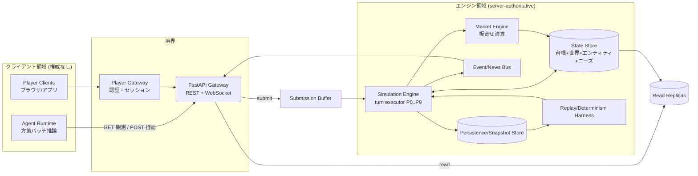
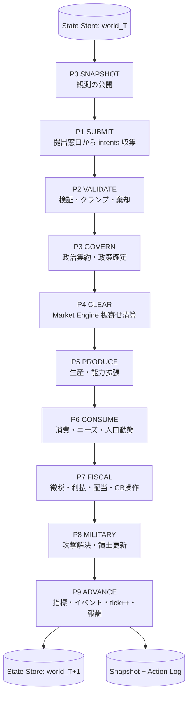
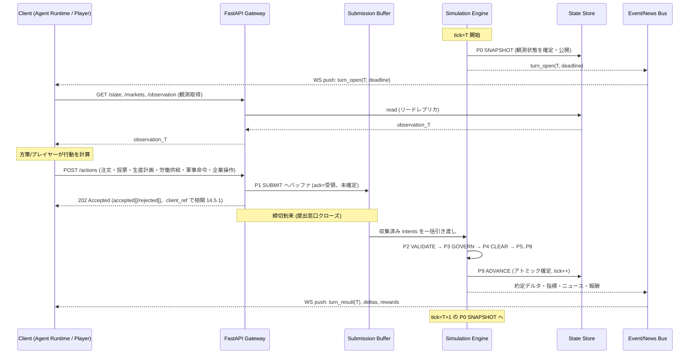
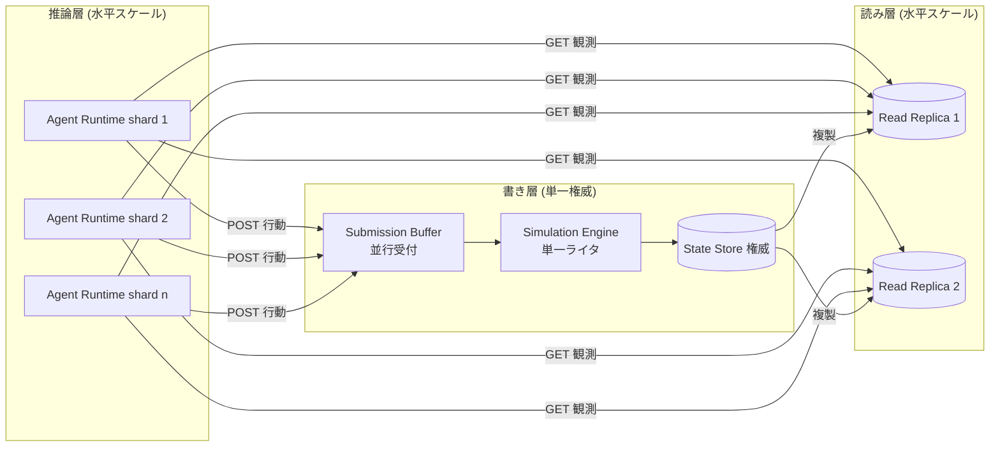
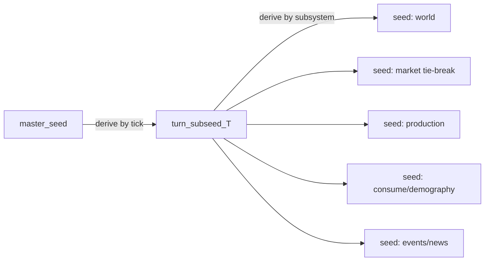

# 02. アーキテクチャ

本書は FinBox のシステムアーキテクチャを定義する。横断定義 (ID体系・列挙値・時間定数・ターンパイプライン P0..P9・保存則) は [用語集と正準仕様](00-glossary.md) を唯一の真実とし、本書はそれを再定義せず、コンポーネント構造・データフロー・並行性・権限モデル・永続化・決定論として詳細化する。関連詳細は [時間とターン](03-time-and-turns.md)、[機械学習](07-machine-learning.md)、[プレイヤーとマルチプレイヤー](13-players-and-multiplayer.md)、[API リファレンス](14-api-reference.md)、[データモデル](15-data-model.md) を参照する。

## 2.1 基本原則: エンジン/クライアント完全分離

FinBox は **server-authoritative** な単一権威モデルを採る ([用語集 0.2](00-glossary.md))。世界状態の遷移を決定できるのは中央計算エンジン (Simulation Engine) のみであり、エージェントもプレイヤーもクライアントとして API 経由で「観測の取得」と「行動の提出」のみを行う。クライアントは状態を直接書き換えられず、台帳・市場・世界・ニーズ状態への一切の変更はエンジンが決定論的に適用する。

- **状態遷移はエンジンのみ**: 残高・在庫・価格・領土・ニーズ・指標のすべての変化は P0..P9 のフェーズ実行 ([用語集 0.11](00-glossary.md)) の中でのみ起きる。クライアントの提出物は「意図 (intent)」にすぎず、エンジンが検証 (P2) と清算 (P4) を経て初めて効力を持つ。
- **クライアントは読みと提出のみ**: クライアントの能力は `GET` 系の観測取得と `POST` 系の行動提出に限定される。これは [API リファレンス](14-api-reference.md) のエンドポイント集合と一対一に対応する。
- **エージェントとプレイヤーは同一インターフェース**: 機械学習エージェントも人間プレイヤーも同じ FastAPI エンドポイント・同じ認証・同じ行動スキーマを用いる。差異はロールによる行動可否 (role-gating, [用語集 0.14](00-glossary.md)) のみで、情報の非対称性や特権は存在しない ([プレイヤーとマルチプレイヤー](13-players-and-multiplayer.md))。
- **境界の唯一性**: クライアントとエンジンの間の唯一の境界は FastAPI Gateway である。エンジン内部の State Store・Market Engine へクライアントが直接到達する経路は存在しない。

## 2.2 コンポーネント分解

FinBox は以下のコンポーネントに分解される。エンジン領域はプロセスとして単一ライタの権威を持ち、クライアント領域 (特に Agent Runtime) はエンジンとは別プロセス/別クラスタで動く。

| コンポーネント | 責務 | 権威 | 関連 |
| --- | --- | --- | --- |
| Simulation Engine (turn executor) | P0..P9 の固定順実行・全状態遷移の決定論的適用・サブシード導出・報酬計算 | あり (単一ライタ) | [03](03-time-and-turns.md) |
| State Store | 共通台帳 `balance[entity_id][asset_id]`・世界 (国/地域/マス/資源)・エンティティ (Agent/Firm/Gov/CB/Player/Exch)・ニーズ状態の権威コピー | あり | [08](08-economy-and-ledger.md), [15](15-data-model.md) |
| Market Engine | 全取引ペアの板寄せ (single-price call auction) 清算と決済を P4 で実行 | あり (エンジン内副系) | [09](09-markets-and-trading.md) |
| FastAPI Gateway | REST (観測取得・行動提出) と WebSocket (結果/デルタ push) の唯一の境界 | なし (仲介) | [14](14-api-reference.md) |
| Agent Runtime | 学習済み方策のバッチ推論サーバ。数百エージェントの観測を受けて行動を一括生成しエンジンに提出。エンジンとは別プロセス/クラスタ | なし (クライアント) | [07](07-machine-learning.md) |
| Player Gateway | プレイヤーの認証・セッション・レート制限・口座 (`PLAYER:<6桁>`) 管理 | なし (クライアント側境界) | [13](13-players-and-multiplayer.md) |
| Event/News Bus | P9 で生成されるイベント・ニュース・約定デルタ・指標更新を WebSocket 購読者へ配信 | なし (配信) | [09](09-markets-and-trading.md), [12](12-politics-and-government.md) |
| Persistence/Snapshot Store | 毎ターン (または定期) の状態スナップショット・全行動のアクションログ・マスターシードの永続化 | あり (耐久化) | [15](15-data-model.md) |
| Replay/Determinism Harness | スナップショット + アクションログ + シードから world を再生し、ハッシュ一致を検証する再現性検査系 | なし (検証) | [03](03-time-and-turns.md) |

### 2.2.1 Simulation Engine の内部構造

エンジンは P0..P9 のフェーズハンドラの列であり、各フェーズは State Store を入力に取り、決定論的に次状態へ遷移させる。フェーズ間の状態はインメモリの権威コピーで、P9 完了時にアトミックに確定する (2.7)。

## 2.3 データフロー: 1ターンのクライアント-エンジン往復

1ターンは「P0 で状態スナップショットを公開 → クライアントが観測を読む → 行動を計算 → 提出 → P1 でバッファ → エンジンが P2..P9 を実行 → WebSocket で結果/デルタを push」という往復を成す。提出窓口の締切と窓口長は [時間とターン](03-time-and-turns.md) が定める。

- **観測の確定点**: クライアントが読む観測は P0 SNAPSHOT で確定した tick=T の状態である。提出窓口の間に状態は変化しないため、全クライアントは同一の観測基盤の上で行動を決める (公平性, [13](13-players-and-multiplayer.md))。
- **提出の非確定性**: `POST /actions` の `202 Accepted` は「受領」であり「約定」ではない。実際の効力は P2 の検証と P4 の清算で決まる。クライアントは WebSocket の `turn_result` で自分の行動の確定結果 (約定/棄却/クランプ) を受け取る。
- **デルタ配信**: P9 で生成される結果は全状態の再送ではなく、約定・残高変動・指標更新・イベントのデルタとして Event/News Bus から push される。完全な再同期が必要なクライアントは `GET /state` で全量を取得できる。

## 2.4 並行性とスケール

数百エージェントの推論を低レイテンシで回しつつ、エンジンの単一ライタ権威を保つため、読み・推論・書きを分離する。

- **推論のバッチ配信**: Agent Runtime は数百エージェントの観測テンソルを集約し、共有方策ネットワークでバッチ推論して行動を一括生成する (CTDE, [機械学習](07-machine-learning.md))。これによりエンジンは推論コストを負わず、推論クラスタは GPU 上で水平スケールする。
- **エンジンは単一ライタ**: 状態遷移の決定論を保つため、State Store への書きは Simulation Engine のただ1つの実行ストリームに限る。並列化はフェーズ内のデータ並列 (例: 取引ペアごとの板寄せ、企業ごとの生産) に限定し、フェーズ間順序と確定順序は固定する ([03](03-time-and-turns.md))。
- **読みのリードレプリカ**: `GET /state` 等の観測読み取りは、P0 SNAPSHOT で確定した tick=T の不変スナップショットをリードレプリカへ複製して水平にさばく。提出窓口中は状態が不変なので、レプリカ間でリードの一貫性が自明に保たれる。
- **提出窓口の並行受付**: Submission Buffer は多数のクライアントからの `POST /actions` を並行に受け付ける。1エンティティ1ターンにつき最新の有効提出を採用 (idempotent upsert by `entity_id` × tick) し、締切時点のスナップショットをエンジンへ一括引き渡す (2.5 の重複規則)。

### 2.4.1 スケール目標と既定値

| 指標 | 既定目標 | 備考 |
| --- | --- | --- |
| 同時エージェント数 | 既定 600 (構成可、概ね 300〜600 規模) | 6か国に配分、`population.num_agents = 600` ([04](04-world-and-geography.md), [16](16-configuration-and-initialization.md)) |
| 同時プレイヤー数 | 数十名 | 既定 `INVESTOR` ロール ([13](13-players-and-multiplayer.md)) |
| Agent Runtime シャード | n (水平) | エージェントを国/ロールで分割し各シャードでバッチ推論 |
| Read Replica | 2 以上 (水平) | 観測読み取りのスループット確保 |
| Simulation Engine | 1 (単一権威) | 多重化は hot-standby のみ (2.7) |

## 2.5 権限モデルと検証 (P2 VALIDATE)

クライアント行動はすべて P2 VALIDATE で検査され、合法でないものはクランプ (丸め) または棄却される。サーバー権威の核心はこの段にある。検証は決定論的で、同一 intents 集合に対し常に同一結果を返す。

| 検査 | 内容 | 不合格時 |
| --- | --- | --- |
| 認証・帰属 | `entity_id` の所有者 (Agent Runtime トークン / Player セッション) と一致するか | 棄却 (403) |
| role-gating | 行動が当該ロールに許可されているか ([用語集 0.14](00-glossary.md), [06](06-roles.md)) | 棄却 |
| 残高 | 売り注文の現物残高・買い注文の必要証拠/現金が `≥ 0` を保てるか ([用語集 0.9](00-glossary.md)) | 不足分をクランプ、または棄却 |
| 合法手 | 注文種別・数量整数・価格 tick・TIF が市場仕様に適合 ([09](09-markets-and-trading.md)) | 丸め (整数/tick) またはクランプ |
| 隣接条件 | 軍事命令の対象マスが自領と隣接するか・物流の経路制約 ([12](12-politics-and-government.md), [04](04-world-and-geography.md)) | 棄却 |
| 数量・予算上限 | 生産計画が設備・地域上限・保有投入の範囲か ([10](10-industry-and-production.md)) | 上限へクランプ |
| 重複・期限 | 1エンティティ×tick で最新の有効提出のみ採用、提出窓口締切後は棄却 | 最新を採用 / 締切後は棄却 |

- **クランプ vs 棄却の原則**: 値域を超える連続量 (数量・価格・配分) は値域へクランプして可能な限り意図を活かす。構造的に不正なもの (権限なし・対象不在・締切後) は棄却する。いずれも結果は `turn_result` でクライアントへ返る。
- **既定行動 (no-op)**: 提出がない、または全棄却されたエンティティは既定行動 hold/no-op として扱う (注文なし・労働は前ターン継続供給または棄権・投票は棄権)。エンジンは欠落提出で停止しない (2.7)。
- **不正の排除**: クライアントは検証前の状態に直接触れられないため、残高超過の取引・他者口座の操作・締切後の差し込み・非許可ロールの行動は構造的に成立しない。

## 2.6 永続化と決定論

### 2.6.1 永続化アーティファクト

| アーティファクト | 内容 | 頻度 |
| --- | --- | --- |
| State Snapshot | tick=T の State Store 全量 (台帳・世界・エンティティ・ニーズ・市場板) の正準直列化 | 毎ターン (または `snapshot_interval` ターンごと) |
| Action Log | 各 tick の収集済み intents (検証前の生提出) を `entity_id` 付きで時系列に追記 | 毎ターン |
| Master Seed | 世界生成・乱数の起点となるマスターシード | genesis 時に1回 |
| Macro/Event Log | P9 で確定したマクロ指標・イベント・ニュース・報酬 | 毎ターン |

### 2.6.2 決定論的リプレイ

決定論は [用語集 0.2 / 0.17](00-glossary.md) の不変条件である。乱数は「マスターシード → ターンサブシード」で導出され、各フェーズ・各サブシステムは tick とサブシステム識別子から決定的に枝分かれするサブシードを使う (詳細な導出式は [時間とターン](03-time-and-turns.md))。

- **再現性検査**: Replay/Determinism Harness は `(master_seed, genesis_config, action_log[0..T])` から world を再生し、各 tick の State Snapshot の正準ハッシュが原実行と一致することを検証する。不一致は非決定性バグとして扱う。
- **正準直列化**: スナップショットのハッシュ一致を保証するため、エンティティ・資産・注文の列挙順は ID の辞書順に固定し、整数のみで直列化する (浮動小数を状態に持たない, [用語集 0.8](00-glossary.md))。
- **タイブレーク**: 板寄せの同価格・同時刻の約定配分や同点カテゴリ選択 ([用語集 0.12](00-glossary.md)) など、順序が結果に影響する箇所はすべてサブシードまたは ID 辞書順で決定的に解く。

## 2.7 整合性・障害復旧

- **ターンのアトミック確定 (all-or-nothing)**: 1ターンの P2..P9 は単一トランザクションとして扱い、P9 ADVANCE 完了時に tick=T+1 の状態としてアトミックに確定する。途中で失敗した場合は tick=T のスナップショットへロールバックし、部分適用された遷移を残さない。クライアントには確定後の `turn_result` のみが push され、未確定の中間状態は観測されない。
- **欠落提出の既定行動**: 締切までに提出がないエンティティは hold/no-op として処理され (2.5)、ターンは欠落で停止しない。Agent Runtime やプレイヤー接続の遅延・切断はそのエンティティの棄権としてのみ扱われる。
- **障害時の復旧**: エンジン障害時は最後に確定した State Snapshot から再開する。`snapshot_interval > 1` の構成では、最後のスナップショット以降の Action Log を再適用して該当 tick まで決定的に前進させる (スナップショット + アクションログ = 完全な再構成)。
- **エンジンの可用性**: Simulation Engine は単一ライタ権威を崩さないため、多重化は hot-standby (権威コピーを追従させ、障害時に昇格) に限る。アクティブ-アクティブの並行書き込みは行わない。
- **冪等な提出**: `POST /actions` は `(entity_id, tick, submission payload)` に対して冪等で、同一 tick 内の再送は最新で上書きする。締切後の再送は棄却される。これにより再接続時の二重発注を防ぐ。

## 2.8 技術スタック想定 (推奨・実装非束縛)

以下は推奨スタックであり、本書の論理アーキテクチャ (分離・権威・決定論) を満たす限り実装は束縛されない。

| 層 | 推奨技術 | 役割 |
| --- | --- | --- |
| Gateway | Python / FastAPI / asyncio | REST + WebSocket の境界、非同期 I/O で多数接続をさばく |
| スキーマ/検証 | Pydantic | 行動・観測スキーマの型定義と入力検証 (P2 の構文段) |
| 数値計算 | numpy | 台帳・板寄せ・指標の整数/ベクトル演算 |
| 学習・推論 | PyTorch | 方策・価値関数の学習と Agent Runtime のバッチ推論 ([07](07-machine-learning.md)) |
| メッセージ | JSON | REST ボディ・WebSocket メッセージの直列化形式 |
| Push | WebSocket | `turn_open` / `turn_result` / デルタ / ニュースの配信 |
| 永続化 | スナップショットファイル + DB | State Snapshot / Action Log / Macro-Event Log の耐久化 ([15](15-data-model.md)) |

- **整数規律**: 状態は整数のみで保持する ([用語集 0.8 / 0.17](00-glossary.md))。numpy/PyTorch は中間計算 (推論・指標の前処理) に用いるが、State Store に書き戻す値は必ず整数へ確定 (丸め規則は各ドキュメントが明示) する。
- **非同期と単一ライタの両立**: Gateway と Submission Buffer は asyncio で並行受付するが、State Store への適用は Simulation Engine の単一ループに直列化され、決定論を壊さない。
