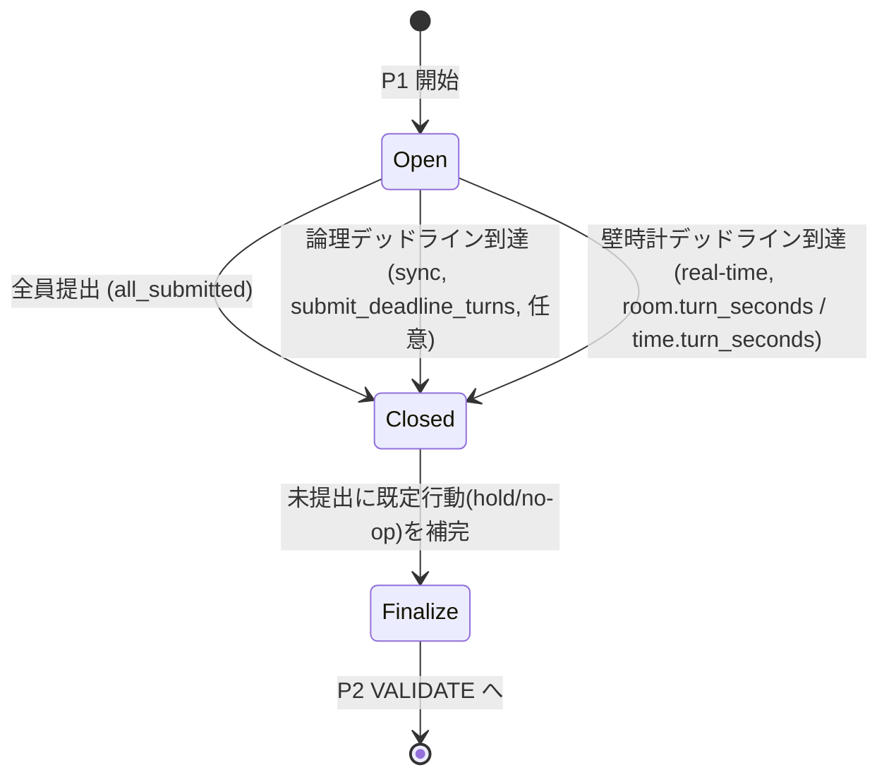
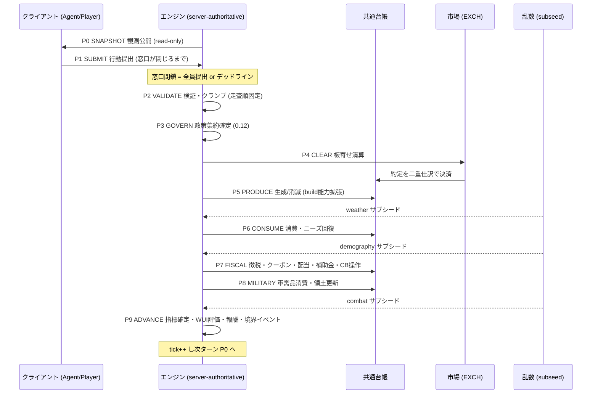

# 03. 時間とターン

本書は FinBox のシミュレーション時間モデル、ターンパイプラインの各フェーズ詳細、提出窓口の仕様、境界イベント、そして決定論と乱数供給を実装可能な水準で定義する。横断定義は [用語集と正準仕様](00-glossary.md) を唯一の真実とし、本書はそれを参照・詳細化する。時間定数は用語集 0.7、ターンパイプライン P0..P9 のフェーズ名と順序は用語集 0.11 と完全に一致する。

## 3.1 暦モデルと時刻表記

FinBox の時間は離散的な**ターン (turn)** を最小単位として前進する。ターンはシミュレーション開始時を `0` とする通し番号 **`tick`** で一意に識別される。暦は以下の定数で構成される (用語集 0.7、構成は [構成と初期化](16-configuration-and-initialization.md))。

| 定数 | 既定値 | 定義 |
| --- | --- | --- |
| `TURNS_PER_MONTH` | 4 | 1か月あたりのターン数 (構成可) |
| `MONTHS_PER_YEAR` | 12 | 1年あたりの月数 (固定) |
| `TURNS_PER_YEAR` | 48 | `TURNS_PER_MONTH × MONTHS_PER_YEAR`。年利・年率換算の基準 |
| `tick` | 0..∞ | シミュレーション開始からのターン通し番号 (0始まり) |

### 3.1.1 tick と暦表記の対応

時刻表記は `Y{年}-M{月}-T{ターン}` (例 `Y3-M07-T2`) を用いる。年は1始まり、月は1始まり (2桁ゼロ埋め)、月内ターンは1始まりとする。`tick` (0始まり) との対応は次の式で双方向に変換する。

`tick` から暦要素への分解 (整数演算、`//` は切り捨て除算、`%` は剰余):

```text
month_index = tick // TURNS_PER_MONTH          # 0始まりの通し月番号
turn_in_month = tick % TURNS_PER_MONTH          # 0..TURNS_PER_MONTH-1
year_index = month_index // MONTHS_PER_YEAR     # 0始まりの年番号
month_in_year = month_index % MONTHS_PER_YEAR   # 0..MONTHS_PER_YEAR-1

Y = year_index + 1
M = month_in_year + 1                            # 1..12
T = turn_in_month + 1                            # 1..TURNS_PER_MONTH
```

暦要素から `tick` への合成:

```text
tick = ((Y - 1) * MONTHS_PER_YEAR + (M - 1)) * TURNS_PER_MONTH + (T - 1)
```

例 (既定 `TURNS_PER_MONTH=4`):

| tick | month_index | year_index | 表記 |
| --- | --- | --- | --- |
| 0 | 0 | 0 | `Y1-M01-T1` |
| 3 | 0 | 0 | `Y1-M01-T4` |
| 4 | 1 | 0 | `Y1-M02-T1` |
| 47 | 11 | 0 | `Y1-M12-T4` |
| 48 | 12 | 1 | `Y2-M01-T1` |
| 122 | 30 | 2 | `Y3-M07-T3` |

### 3.1.2 境界判定述語

境界イベント (3.5) の発火判定は `tick` から導出する純粋関数で行う。すべて月内ターンが最終ターン (`turn_in_month == TURNS_PER_MONTH-1`) であることを前提とし、月末・四半期末・年末をその上に重ねる。

```text
is_month_end(tick)     := (tick % TURNS_PER_MONTH) == TURNS_PER_MONTH - 1
is_quarter_end(tick)   := is_month_end(tick) and ((month_index(tick) % 3) == 2)
is_year_end(tick)      := is_month_end(tick) and ((month_index(tick) % MONTHS_PER_YEAR) == MONTHS_PER_YEAR - 1)
```

四半期は3か月単位で `Q1 = M01..M03, Q2 = M04..M06, Q3 = M07..M09, Q4 = M10..M12`。債券の限月コード (`BOND:gov.ALD.2031Q1` 等、用語集 0.5) はこの四半期境界に整列する。

## 3.2 年利・成長の換算

期間換算は文脈により**単利按分**と**複利**を厳密に使い分ける (用語集 0.7, 0.17)。各ドキュメントはどちらを用いるか明示しなければならない。

### 3.2.1 単利按分 (利息・クーポンの正準)

利息・クーポンの期間按分はすべて線形 (単利) で行う。これが利息発生の正準である。

`r_turn = r_annual / TURNS_PER_YEAR`

- 用途: 国債・社債のクーポン発生 ([金融と金融商品](11-finance-and-instruments.md))、預貸金利、政策金利に基づく準備預金付利、遅延・延滞利息。
- 適用例: 年率 `r_annual = 0.048` (4.8%) の国債では 1ターンあたり `r_turn = 0.048 / 48 = 0.001` (0.1%)。
- 整数化: クーポン現金額は `coupon_cash = floor(face_value × r_turn_bps / 10000 / 1)` のように、bps 表現の整数演算で計算し端数は切り捨てる。厳密な丸め規則と端数の帰属は [金融と金融商品](11-finance-and-instruments.md) が定義する。台帳は整数のみを保持する (用語集 0.8)。

### 3.2.2 複利 (成長文脈)

連続的な指数成長を表す文脈では複利を用いる。

`g_turn = (1 + g_annual)^(1 / TURNS_PER_YEAR) - 1`

- 用途: 人口・技術・生産性などの年率指数成長を1ターン刻みへ分解する場合、為替や物価指数の年率換算 (年率インフレ → ターンインフレ) の整合表示、長期トレンド成長の供給。
- 適用例: 年率成長 `g_annual = 0.02` (2%) は `g_turn = 1.02^(1/48) - 1 ≈ 0.0004126` (約 0.0413%/ターン)。
- 逆変換 (ターン率 → 年率): `g_annual = (1 + g_turn)^TURNS_PER_YEAR - 1`。

### 3.2.3 使い分けの規則

| 文脈 | 換算 | 式 | 参照 |
| --- | --- | --- | --- |
| 債券クーポン・利息発生 | 単利按分 | `r_annual / TURNS_PER_YEAR` | [11](11-finance-and-instruments.md) |
| 預貸・準備預金付利 | 単利按分 | `r_annual / TURNS_PER_YEAR` | [11](11-finance-and-instruments.md) |
| 延滞・遅延利息 | 単利按分 | `r_annual / TURNS_PER_YEAR` | [11](11-finance-and-instruments.md) |
| 人口・生産性のトレンド成長 | 複利 | `(1+g_annual)^(1/48)-1` | [04](04-world-and-geography.md), [10](10-industry-and-production.md) |
| 年率インフレ/為替の指数化 | 複利 | `(1+g_annual)^(1/48)-1` | [11](11-finance-and-instruments.md) |

## 3.3 ターンパイプライン

1ターンの実行は P0..P9 のフェーズを**固定順**で1回ずつ通る (用語集 0.11)。エンジンが権威であり、各フェーズは決定論的に状態を遷移させる。クライアント (エージェント/プレイヤー) が介在するのは P0 (観測取得) と P1 (行動提出) のみで、P2 以降はエンジン内部の決定論的処理である。


各フェーズの入力・処理・出力・台帳への影響・詳細ドキュメントを以下に定義する。

### 3.3.1 P0 SNAPSHOT (観測公開)

- 入力: ターン T 開始時点の確定済み世界状態 (前ターン P9 までの結果)。
- 処理: 各クライアントのロール・権限に応じた観測ビューを構築し API で公開する。情報の非対称性や特権は設けない (用語集 0.2)。観測はロールにより**行動可否**が異なるのみで、公開市場情報・マクロ指標・自己の台帳・板情報は共通に取得できる。
- 出力: 観測スナップショット (read-only)。`tick`・暦表記・前ターンの約定/価格/イベントを含む。
- 台帳への影響: なし (read-only)。
- 詳細: [アーキテクチャ](02-architecture.md)、[機械学習](07-machine-learning.md) の観測空間、[API リファレンス](14-api-reference.md) の観測エンドポイント。

```text
for client in all_clients:
    view = build_observation(world_state, client.entity_id, client.roles)
    publish(client, view)   # API 経由、書き込み不可
```

### 3.3.2 P1 SUBMIT (行動提出)

- 入力: P0 の観測。クライアントからの行動 (注文・投票・生産計画・労働供給・軍事命令・企業操作)。
- 処理: 提出窓口 (3.4) で各エンティティの行動を1ターン分収集する。同期モードと実時間モードを構成で選ぶ。締切到達または全員提出で窓口を閉じる。
- 出力: エンティティごとの行動集合 (未検証)。提出順は記録するが処理順は決定論的走査順 (3.7) で再構成する。
- 台帳への影響: なし (まだ約定・移転は起きない)。
- 詳細: 本書 3.4、[API リファレンス](14-api-reference.md) の行動提出エンドポイント、[プレイヤーとマルチプレイヤー](13-players-and-multiplayer.md)。

### 3.3.3 P2 VALIDATE (検証・クランプ)

- 入力: P1 で収集した未検証行動集合と現在の台帳・状態。
- 処理: 各行動を決定論的順序 (3.7) で検証する。残高充足・ロール許可 (role-gating, 用語集 0.14)・合法手・隣接条件 (軍事の領土隣接等)・数量整数性・価格 tick 整合をチェックする。不正は**棄却**、許容範囲外は**クランプ (丸め)** する。検証は副作用を持たず、CLEAR 以降で使う正規化済み行動を生成する。
- 出力: 検証済み・正規化済みの行動集合 (注文簿への投入候補、確定投票、生産計画、軍事命令)。棄却理由は監査ログに残す。
- 台帳への影響: なし (検証のみ)。ただし P4 で約定可能とするための**与信予約 (発注証拠の残高ロック)** の判定基準を確定する。実際のロックは CLEAR の決済で消費される。
- 詳細: [API リファレンス](14-api-reference.md) のエラー体系、各行動の合法性は対応ドキュメント (注文は [09](09-markets-and-trading.md)、生産は [10](10-industry-and-production.md)、軍事は [12](12-politics-and-government.md))。

```text
validated = []
for action in deterministic_order(submitted_actions):
    if not role_allows(action.entity, action.type):      reject(action, "role"); continue
    if not is_legal(action, world_state):                reject(action, "illegal"); continue
    action = clamp_to_bounds(action, world_state)         # 残高・数量・価格tick
    validated.append(action)
```

### 3.3.4 P3 GOVERN (政策確定)

- 入力: P2 で検証済みの政治家投票・提案 (各国ごと)。
- 処理: 各国の政策を、その国に配属された政治家エージェント集団の判断を用語集 0.12 の集約規則 (SCALAR=平均, BINARY=平均≥0.5, CATEGORICAL=合計スコア最大・同点は最小インデックス, ALLOCATION=正規化重みの平均) で集約して確定する。確定する政策レバー: 政策金利・税率 (所得/法人/消費)・関税・国債発行枠・軍事予算・補助金配分。
- 出力: ターン T に適用される確定政策ベクトル (国別)。これは P4 (発行枠・金利の市場反映)・P7 (税率・補助金)・P8 (軍事予算) で参照される。
- 台帳への影響: なし (政策の確定のみ。資金移動は P4/P7/P8)。
- 詳細: [政治と統治](12-politics-and-government.md)、集約規則は用語集 0.12、中央銀行の金利執行は [金融と金融商品](11-finance-and-instruments.md)。

```text
for country in countries:
    politicians = agents_of(country, role=POLITICIAN)
    policy[country].rate    = aggregate_SCALAR(votes(politicians, "rate"))
    policy[country].taxes   = aggregate_SCALAR(votes(politicians, "taxes"))
    policy[country].tariffs = aggregate_SCALAR(votes(politicians, "tariffs"))
    policy[country].issuance= aggregate_SCALAR(votes(politicians, "bond_issuance"))
    policy[country].mil_budget = aggregate_ALLOCATION(votes(politicians, "mil_alloc"))
    policy[country].subsidy = aggregate_ALLOCATION(votes(politicians, "subsidy"))
```

### 3.3.5 P4 CLEAR (板寄せ清算・決済)

- 入力: P2 で検証済みの注文 (労働・財・サービス・FX・債券・株式・国債入札)、P3 の発行枠・政策金利。
- 処理: 全取引ペアについて板寄せアルゴリズムで単一約定価格を決定し、需給を約定させる。決済は共通台帳へ**二重仕訳**で反映 (用語集 0.9)。すべての自発的取引はこの経路を通る (用語集 0.10 市場決済)。
- 出力: 約定 (`trade_id` 付)・清算価格 (各ペアの clearing price)・板の OHLC・未約定残注文の TIF 処理。
- 台帳への影響: 現金と資産の移転 (借方=貸方)。手数料は `EXCH` が収受。残高が負になる遷移は不可 (用語集 0.17)。
- 詳細: 板寄せアルゴリズム・注文種別・同点約定の決定論は [市場と取引](09-markets-and-trading.md)。価格表現は用語集 0.8。

```text
for pair in deterministic_pair_order(all_trading_pairs):
    book = collect_orders(validated, pair)
    p_clear = call_auction_price(book)          # 単一価格板寄せ (09 が定義)
    fills   = match(book, p_clear)              # 同点はentity_id昇順 (09, 3.6)
    for f in fills:
        ledger.transfer(f.buyer, f.seller, pair.base, f.qty, cause=f.trade_id)
        ledger.transfer(f.seller, f.buyer, pair.quote, f.price * f.qty, cause=f.trade_id)
        ledger.collect_fee(EXCH, f, fee_rate)   # ceil(cash * fee_rate)
```

### 3.3.6 P5 PRODUCE (生産)

- 入力: P4 で調達済みの投入財・労働力 (各企業の在庫)、P2 で確定した生産計画、地域上限・設備・能力。
- 処理: 各企業が保有投入財・労働力を消費して産出を生成する。抽出系 (AGRICULTURE/MINING/ENERGY) は地域の総産出量を上限とする (用語集 0.15)。`COMM:build.construction_labor` の消費により企業の設備・能力を拡張する (資本形成、用語集 0.5.2)。`labor.*` と `svc.*`・`energy.electricity` は perishable で当ターンに消費・産出されなければ消滅する (用語集 0.5.3)。
- 出力: 産出財の在庫計上、能力拡張、投入の消滅。
- 台帳への影響: 財の**生成/消滅** (移転ではない、用語集 0.10 末尾)。`production_id` を原因とする。
- 詳細: 生産レシピ・設備・地域上限・建設労働力・企業ライフサイクルは [産業と生産](10-industry-and-production.md)。

```text
for firm in deterministic_order(firms):
    recipe = firm.plan.recipe
    cap = min(region_cap(firm.region, recipe.output), firm.capacity, input_limited(firm, recipe))
    qty = floor(cap)
    consume_inputs(firm, recipe, qty, cause=prod_id)        # labor/原材料の消滅
    produce_output(firm, recipe.output, qty, cause=prod_id) # 産出の生成
    apply_capacity_expansion(firm, cause=prod_id)           # build.construction_labor 消費
expire_perishables()    # labor.* / svc.* / energy.electricity の未消費分を消滅
```

### 3.3.7 P6 CONSUME (消費・人口動態)

- 入力: 各エージェントの保有財・サービス、ニーズ状態 (用語集 0.13)。
- 処理: エージェントが保有する財・サービスを消費しニーズを回復する。続いてニーズ減衰・加齢 (`age` 加算)・出生・死亡・移住を解決する。出生死亡・移住・天候由来の確率事象はターンサブシード (3.6) から供給する乱数で決定論的に解決する。`svc.*` 等 perishable の未消費分は消滅する。
- 出力: 更新後のニーズ状態、人口の増減・移動、消費による財の消滅。
- 台帳への影響: 消費財の**消滅** (`transfer_id`/`production_id` 系の消費原因)。死亡エージェントの残余資産は清算ルールに従う ([10](10-industry-and-production.md) 倒産清算に準ずる、または相続規則 [05](05-agents.md))。
- 詳細: ニーズ・ライフサイクル・消費・死亡条件は [エージェント](05-agents.md)、移住・人口は [世界と地理](04-world-and-geography.md)。

```text
for agent in deterministic_order(agents):
    consume_to_recover_needs(agent)        # 保有財/サービスを消費しニーズ回復
    decay_needs(agent)                     # 毎ターン減衰
    agent.age += 1
resolve_births_deaths_migration(rng=subseed(tick, "demography"))
```

### 3.3.8 P7 FISCAL (財政・プロトコル移転)

- 入力: P3 の確定政策 (税率・関税・補助金)、P4 の約定 (課税基礎)、債券台帳 (クーポン・償還)、株式 (配当)、中央銀行の操作方針。
- 処理: ルールに基づく義務的移転 (用語集 0.10 プロトコル移転) を実行する。徴税 (所得/法人/消費)・関税徴収・国債/社債のクーポン支払と元本償還・株式配当・補助金/社会保障/失業給付の支給・中央銀行による通貨発行/吸収。クーポン・利息は単利按分 (3.2.1) で計算する。
- 出力: 政府・中央銀行・エンティティ間の現金移転、債券の償還消滅、配当支払。
- 台帳への影響: プロトコル移転 (`transfer_id`/`mint_id`)。通貨の発行/吸収は中央銀行のみが行えるミント/バーン点 (用語集 0.10, 0.17)。
- 詳細: 課税・関税・補助金は [政治と統治](12-politics-and-government.md)、クーポン・償還・配当・中央銀行操作は [金融と金融商品](11-finance-and-instruments.md)。

```text
collect_taxes_and_tariffs(policy, trades_of_turn, cause=transfer_id)   # 12
pay_coupons_and_redeem(bond_ledger, r_turn=r_annual/48, cause=transfer_id)  # 11, 単利按分
pay_dividends(equity_ledger, cause=transfer_id)                        # 11
disburse_subsidies_and_welfare(policy, cause=transfer_id)             # 12
central_bank_operations(cb_policy, cause=mint_id)                     # 11, 通貨発行/吸収
```

### 3.3.9 P8 MILITARY (軍事解決)

- 入力: P2 で検証済みの軍事命令 (将官 `GENERAL` の指揮)、P3 の軍事予算、軍需品在庫 (`COMM:mil.munitions`)、領土・国境状態。
- 処理: 軍需品を消費して攻撃を解決し、マスの占領・領土と国境を更新する。戦闘解決の確率事象 (命中・損耗・同点) はターンサブシード (3.6) から供給する乱数で決定論的に処理する。軍需品の消費と戦闘解決に伴う消滅はプロトコル移転 (用語集 0.10)。
- 出力: 戦闘結果、マス占領・領土変更、軍需品の消滅。
- 台帳への影響: `COMM:mil.munitions` の**消滅**、占領に伴う資源マスの帰属変更 (台帳残高の移転ではなく地理状態の更新)。
- 詳細: 軍事・領土・国境・戦闘解決は [政治と統治](12-politics-and-government.md)、マス・地理は [世界と地理](04-world-and-geography.md)。

### 3.3.10 P9 ADVANCE (確定・時計前進)

- 入力: 当ターン P0..P8 のすべての結果。
- 処理: マクロ指標・価格指数 (CPI・GDP・失業率・為替・債務比率等、用語集 0.16) を集計・確定し、イベント/ニュースを生成する。WUI 換算で各エンティティの純資産を再評価する。各エージェントの報酬を計算する ([機械学習](07-machine-learning.md))。最後に時計を前進させる (`tick++`)。月/四半期/年の境界イベント (3.5) のうち P9 で発火するもの (指標確定・WUI 再加重・人口統計更新) をここで処理する。
- 出力: 確定マクロ指標、ニュース、報酬、`tick` の更新。次ターンの P0 SNAPSHOT の素材となる。
- 台帳への影響: なし (集計・評価のみ。マーク・トゥ・マーケットは評価であって移転ではない)。
- 詳細: マクロ指標・WUI は用語集 0.16 と [金融と金融商品](11-finance-and-instruments.md)、報酬は [機械学習](07-machine-learning.md)。

```text
finalize_macro_indicators(world_state)      # CPI/GDP/失業/為替/債務比 (0.16)
if is_year_end(tick) or rebalance_due(tick): reweight_WUI()   # 11
mark_to_market_and_value_net_worth()        # WUI換算 (0.16)
generate_news_and_events(rng=subseed(tick, "news"))
for agent in agents: agent.reward = compute_reward(agent)    # 07
tick += 1
```

## 3.4 提出窓口 (P1)

提出窓口は P1 SUBMIT の間だけ開く。窓口の閉鎖条件は構成で選ぶ2モードで決まる ([構成と初期化](16-configuration-and-initialization.md))。どちらのモードでも、窓口が閉じた時点での確定行動集合は決定論的に1つに定まる。

### 3.4.1 同期モード (synchronous)

- 全クライアントの提出が出揃う (`all_submitted` = `submitted == expected`) と即座に窓口を閉じ、次フェーズへ進む (全員提出での前倒し締切)。
- 完全な再現性が必要なバッチ学習・リプレイ・回帰テストの既定モード。壁時計デッドラインを一切持たず、`time.turn_seconds` / `room.turn_seconds` は同期モードでは参照しない。
- 任意で**論理デッドライン** (構成 `submit_deadline_turns`、既定無効) を設けられる。これは壁時計秒ではなく論理的なポーリング回数で定義され、学習ループで一部エージェントが応答しない場合、出揃わなくても規定回数のポーリング後に締め切る。
- したがって同期モードの締切条件は `all_submitted` または `submit_deadline_turns` 到達のいずれかであり、実時間の経過には依存しない。

### 3.4.2 実時間モード (real-time)

- **壁時計デッドライン**で締め切る。基準はエンジン既定の `time.turn_seconds` (構成可、既定 `30` 秒) で、プレイヤールームでは `room.turn_seconds` (既定 `60` 秒) が上書きする (`room.turn_seconds` が設定されていればそれを、なければ `time.turn_seconds` を採用する)。人間プレイヤーの参加を前提とするライブ運用向け。
- 全クライアントが期限前に提出を完了した場合は、デッドラインを待たず**前倒しで締切**して次フェーズへ進む。
- 提出は冪等な上書きとし、デッドライン到達時点の最新提出を採用する (同一エンティティの再提出は last-write-wins、提出順は記録)。

### 3.4.3 未提出時の既定行動

窓口が閉じた時点で行動を提出していないエンティティには、決定論的な**既定行動 (default action)** を適用する。

- 既定は `hold / no-op`: 新規注文を出さず、ニーズに基づく消費等の自動行動も発注しない (現状維持)。
- 政治家の投票が欠ける場合、その政治家は集約から除外する (棄権)。投票者がゼロの政策は前ターンの確定値を持ち越す (用語集 0.12 の集約は提出者集合に対して行う)。
- 既定行動は P2 VALIDATE で他の行動と同一の検証・走査順 (3.7) に乗る。未提出と空提出 (`no-op` を明示提出) は P1 上は等価に扱う。



## 3.5 月/四半期/年の境界イベント

境界イベントは 3.1.2 の述語で `tick` から判定し、決まったフェーズで発火する。発火フェーズは下表で固定する。すべて決定論的で、確率を伴うもの (人口統計の出生死亡等) は当ターンのサブシード (3.6) から乱数を供給する。

| イベント | 周期 | 発火述語 | 発火フェーズ | 詳細 |
| --- | --- | --- | --- | --- |
| 国債入札 (新規発行) | 四半期 | `is_quarter_end` | P4 CLEAR | [11](11-finance-and-instruments.md) |
| 国庫短期証券 (BILL) 入札 | 月 | `is_month_end` | P4 CLEAR | [11](11-finance-and-instruments.md) |
| 社債/株式の定例処理 (上場・増資窓口) | 月 | `is_month_end` | P4 CLEAR | [11](11-finance-and-instruments.md) |
| 債券クーポン支払 | 四半期 | `is_quarter_end` | P7 FISCAL | [11](11-finance-and-instruments.md) |
| 債券元本償還 (限月到来) | 四半期 | `is_quarter_end` | P7 FISCAL | [11](11-finance-and-instruments.md) |
| 配当確定・支払 | 四半期 | `is_quarter_end` | P7 FISCAL | [11](11-finance-and-instruments.md) |
| 法人税・所得税の確定 | 四半期 | `is_quarter_end` | P7 FISCAL | [12](12-politics-and-government.md) |
| 消費税・関税の徴収 | 毎ターン | (常時) | P7 FISCAL | [12](12-politics-and-government.md) |
| マクロ指標確定 (速報) | 毎ターン | (常時) | P9 ADVANCE | [11](11-finance-and-instruments.md), 0.16 |
| マクロ指標確定 (確報) | 四半期 | `is_quarter_end` | P9 ADVANCE | [11](11-finance-and-instruments.md) |
| 政策レビュー (金利・財政) | 月 | `is_month_end` | P3 GOVERN | [12](12-politics-and-government.md), [11](11-finance-and-instruments.md) |
| WUI 再加重 | 年 | `is_year_end` | P9 ADVANCE | [11](11-finance-and-instruments.md), 0.16 |
| 人口統計更新 (年次集計) | 年 | `is_year_end` | P9 ADVANCE | [04](04-world-and-geography.md) |
| 選挙・ロール再配属 | 年 | `is_year_end` | P3 GOVERN (選挙確定) / P9 (再配属適用) | [06](06-roles.md), [12](12-politics-and-government.md) |

- 毎ターン発火する処理 (消費税・関税徴収、速報指標) は境界述語を持たず常時実行される。境界イベントはそれらに上乗せされる定例処理である。
- 選挙は P3 GOVERN で投票集約により当選者を確定し、ロール再配属は当ターンの P9 ADVANCE で次ターンに反映する形で適用する (当ターン中の政策は旧構成で確定済みのため整合する)。
- 政策レビュー (月次) は GOVERN の集約を毎ターン行うことと矛盾しない。GOVERN は毎ターン政策を集約するが、月次レビューでは中央銀行・財政当局が金利・予算の見直し提案を投票に乗せる定例トリガーである ([11](11-finance-and-instruments.md), [12](12-politics-and-government.md))。

## 3.6 決定論と乱数

同一シード・同一構成・同一行動列からは同一の世界が再現される (用語集 0.2, 0.17)。確率事象はすべてターンごと・ストリームごとに導出される**サブシード**から供給する。グローバルな共有乱数状態 (mutable global RNG) は用いない。

### 3.6.1 サブシード導出

マスターシード `master_seed` (構成 `16`) から、決定論的ハッシュ `H` (SHA-256 等の暗号学的ハッシュを 64bit へ縮約) でターン・ストリーム別のサブシードを導出する。

`subseed = H(master_seed, tick, stream_id)`

- `stream_id` は確率事象の用途を表す固定文字列。例: `"weather"`, `"disaster"`, `"demography"`, `"combat"`, `"news"`, `"tiebreak"`。
- サブシードから生成した PRNG (例 PCG/xoshiro 系の固定実装) を、当該フェーズ・当該用途の中で確定走査順 (3.7) に従って消費する。これによりフェーズ間・ストリーム間で乱数が干渉しない。
- 個体単位で独立性が必要な場合 (各エージェントの出生死亡判定等) は、`stream_id` にエンティティ識別子を含めた派生 `H(master_seed, tick, stream_id, entity_id)` を用い、走査順への依存をさらに排除できる。

```text
def subseed(tick, stream_id, *extra):
    return H(master_seed, tick, stream_id, *extra)   # 64bit
def rng(tick, stream_id, *extra):
    return PRNG(subseed(tick, stream_id, *extra))    # 固定実装の決定論PRNG
```

### 3.6.2 確率事象への供給

| 事象 | stream_id | 供給先フェーズ | 詳細 |
| --- | --- | --- | --- |
| 天候 (季節・収穫変動) | `weather` | P5 PRODUCE (抽出系上限の変動) | [04](04-world-and-geography.md), [10](10-industry-and-production.md) |
| 災害 (地震・洪水等) | `disaster` | P5/P6/P8 | [04](04-world-and-geography.md) |
| 出生・死亡・移住 | `demography` | P6 CONSUME | [05](05-agents.md), [04](04-world-and-geography.md) |
| 戦闘解決 (命中・損耗) | `combat` | P8 MILITARY | [12](12-politics-and-government.md) |
| ニュース/イベント生成 | `news` | P9 ADVANCE | [09](09-markets-and-trading.md), [12](12-politics-and-government.md) |
| 同点処理の補助 | `tiebreak` | 各フェーズ | 本書 3.6.3 |

### 3.6.3 同点決定の規則

決定論を保つため、すべての同点 (タイ) は乱数ではなく**安定な辞書順タイブレーク**で解決する。乱数は規則で順序が定まらない真の最終手段にのみ用いる。

- 既定のタイブレークキーは `entity_id` の昇順 (辞書順)。同一エンティティ内の複数行動は提出記録順、次いで行動の安定キー (注文ID等) の昇順。
- 市場の同価格約定 (同一清算価格での割当順) は `entity_id` 昇順を既定とする (詳細・プロラタ等の優先規則は [市場と取引](09-markets-and-trading.md) が定義し、本規則と矛盾しない)。
- 政治の CATEGORICAL 集約の同点は最小インデックスを採用する (用語集 0.12)。
- 上記いずれでも順序が一意に定まらない場合に限り `subseed(tick, "tiebreak", context)` から決定論的に順序を生成する。

## 3.7 フェーズ内処理順序の決定論

各フェーズ内の反復処理は、提出順や到着順ではなく**固定された走査順**で行う。これにより同一入力から同一出力が保証される (用語集 0.17 決定論)。

- エンティティ走査順: `entity_id` の昇順 (辞書順)。`AGENT:000001 < AGENT:000002 < FIRM:000001 < ...` のように接頭辞+経路の文字列比較で一意。
- 取引ペア走査順 (P4): ペアID `base "/" quote` の辞書順昇順。各ペア内の約定は板寄せ規則 ([09](09-markets-and-trading.md)) に従い、同点は 3.6.3。
- 企業走査順 (P5): `FIRM:<6桁>` の昇順。地域上限は地域単位で集計し、同一地域内の配分は企業ID昇順で逐次割当する (地域上限超過分は後続企業がクランプされる)。
- エージェント走査順 (P6): `AGENT:<6桁>` / `PLAYER:<6桁>` の昇順。出生死亡等の個体判定は 3.6.1 の個体派生サブシードを用い、走査順への結果依存を排除する。
- 政策集約走査順 (P3): 国コードの辞書順 (`ALD < BOR < CYR < DOR < ESM < FAR`)、国内の政治家は `entity_id` 昇順。
- プロトコル移転順 (P7): 表 3.5 の行順 (徴税 → クーポン/償還 → 配当 → 補助金 → 中央銀行操作) を国コード昇順・エンティティID昇順で実行する。

走査順は構成や乱数に依存せず、ID体系 (用語集 0.3, 0.4) から純粋に決まる。これがリプレイ・回帰テスト・分散実行 (CTDE) における再現性の基盤である。

## 3.8 1ターンのシーケンス

クライアント (エージェント/プレイヤー) とエンジン、台帳・市場・乱数の相互作用を1ターン分のシーケンスで示す。クライアントが関与するのは P0/P1 のみで、P2 以降はエンジン内部で決定論的に進む。



## 3.9 相互リンク

- 横断定義 (時間定数・パイプライン・集約規則・不変条件): [用語集と正準仕様](00-glossary.md)
- P4 CLEAR の板寄せアルゴリズム・注文種別・同点約定: [市場と取引](09-markets-and-trading.md)
- P5 PRODUCE / P6 CONSUME のニーズ・生産・消費: [エージェント](05-agents.md), [産業と生産](10-industry-and-production.md)
- P7 FISCAL / P8 MILITARY の財政・金融・軍事: [金融と金融商品](11-finance-and-instruments.md), [政治と統治](12-politics-and-government.md)
- 提出窓口の構成値 (`time.turn_seconds` / `room.turn_seconds` / `submit_deadline_turns`)・再現性: [構成と初期化](16-configuration-and-initialization.md)
- 観測公開・行動提出のエンドポイント: [API リファレンス](14-api-reference.md)
