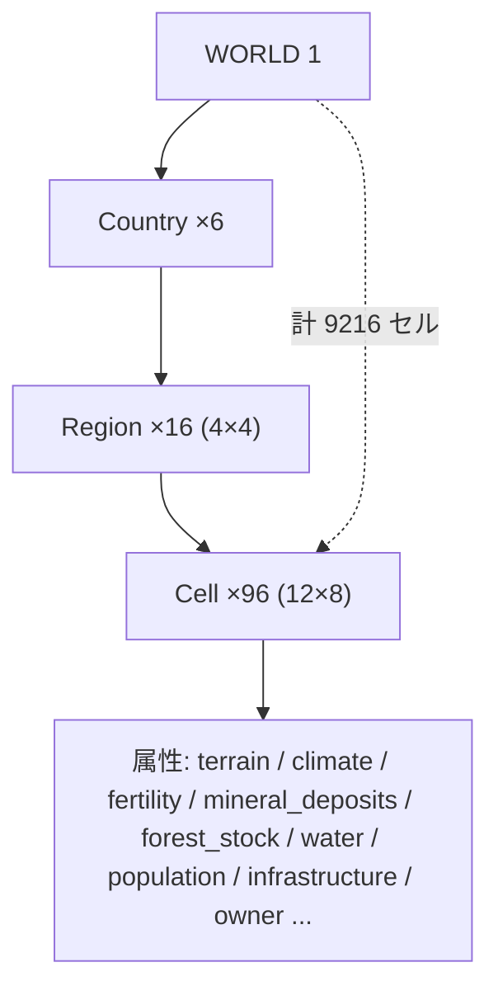
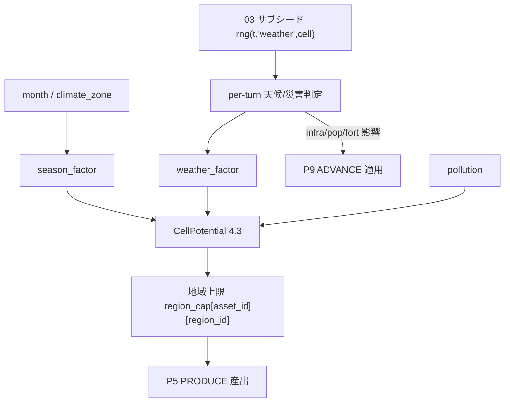
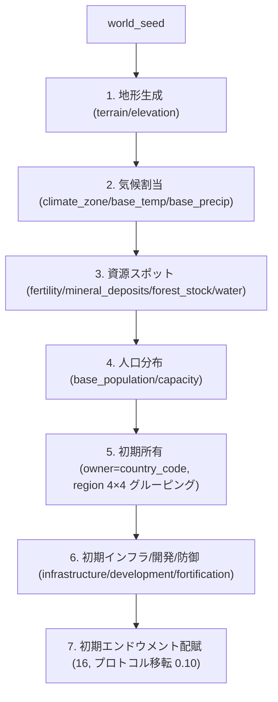
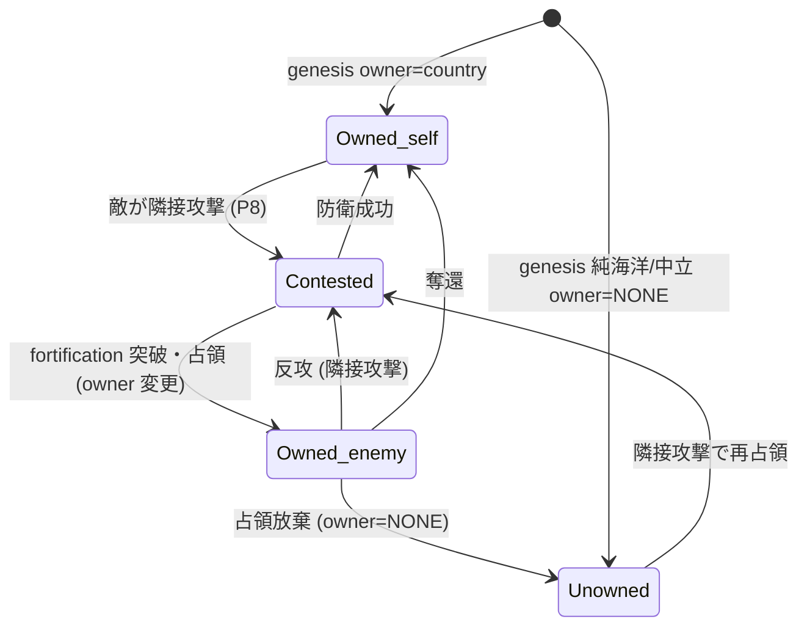

# 04. 世界と地理

本書は FinBox の物理世界 (空間階層・マス属性・資源の産出と減耗/再生・気候と季節・人口と居住・地図生成・領土と国境) を定義する。横断定義は [用語集と正準仕様](00-glossary.md) を唯一の真実として参照する。資源産出の地域上限は [産業と生産](10-industry-and-production.md) と、軍事による領土変動は [政治と統治](12-politics-and-government.md) と、人口移動は [エージェント](05-agents.md) と、地図生成パラメーターは [構成と初期化](16-configuration-and-initialization.md) と、Cell の正準スキーマは [データモデル](15-data-model.md) と整合させる。乱数はすべて [時間とターン](03-time-and-turns.md) のサブシードから決定論的に供給する。

## 4.1 空間階層 (Spatial Hierarchy)

世界は固定の4階層で構成される。サイズは構成可能だが既定値を本書で確定する ([16](16-configuration-and-initialization.md) の `worldgen` がこれらの既定を上書きできる)。

| 階層 | 識別子形式 | 個数 | 配置 | 説明 |
| --- | --- | --- | --- | --- |
| World | `WORLD` | 1 | — | シミュレーション全体。単一のシングルトン |
| Country | `country_code` (3文字大文字) | 6 | 2×3 のメタ配置 | 国。1通貨・1政府・1中央銀行 ([0.6](00-glossary.md)) |
| Region | `REGION:<country_code>.<region_index>` | 各国16 (計96) | 国内 4×4 グリッド | 初期グルーピング単位。資源の地域上限の単位 |
| Cell | `CELL:<country_code>.<region_index>.<x>.<y>` | 各地域96 (計9216) | 地域内 12×8 グリッド | 最小空間単位。資源・人口・地形・所有を保持 |

- 総セル数は `6 (国) × 16 (地域) × 96 (セル) = 9216`。
- `region_index` は `0..15`、地域内グリッドは `region_x = region_index % 4`、`region_y = region_index // 4`(4×4 配置)。
- セル内グリッドは `x ∈ 0..11`、`y ∈ 0..7`(12×8 配置)。
- 国全体は `(4×12) × (4×8) = 48 × 32 = 1536` セルの矩形として座標化できる。国のグローバル座標は `gx = region_x × 12 + x`、`gy = region_y × 8 + y`。
- 世界全体の配置はメタ 2×3 (横2・縦3) で6か国を並べる。国間の隣接 (国境) は 4.8 で定義する。



### 4.1.1 識別子の正準形

- Region ID: `REGION:ALD.5`(Aldoria の地域 index 5)。
- Cell ID: `CELL:ALD.5.7.3`(地域 5、セル内 `x=7,y=3`)。`region_index` と `x,y` はゼロ埋めしない (数値キー)。
- セルの国家所属は属性 `owner`(country_code) が表す。`region_index` は genesis 時の地理グルーピングであり所属とは独立 (占領で `owner` のみが変わる、4.8)。

## 4.2 Cell の属性 (Cell Attributes)

Cell は世界状態の最小単位であり、以下の属性を保持する。正準スキーマ (型・既定・制約) は [15-data-model.md](15-data-model.md) に委譲し、本書は意味と値域を確定する。

| 属性 | 型 | 値域 / 単位 | 意味 |
| --- | --- | --- | --- |
| `country_code` | enum | 6国コード | genesis 時の地理上の所属 (不変、座標の基準) |
| `region_index` | int | `0..15` | 所属地域 (不変) |
| `x` `y` | int | `0..11` / `0..7` | 地域内セル座標 (不変) |
| `terrain` | enum | 4.2.1 | 地形種別 (不変) |
| `climate_zone` | enum | 4.4.1 | 気候帯 (不変) |
| `temperature` | int | `-30..45`(℃, ×1 整数) | 基準気温 (季節で変動、4.4) |
| `precipitation` | int | `0..400`(mm/月相当) | 基準降水量 (季節で変動) |
| `elevation` | int | `0..8000`(m) | 標高 (terrain と整合) |
| `fertility` | map | 作物→`0..1000` | 作物別の農業ポテンシャル (4.3) |
| `mineral_deposits` | map | 鉱種→`{stock, grade}` | 鉱床の残存埋蔵量と品位 (4.3) |
| `forest_stock` | int | `0..1_000_000`(timber 単位) | 立木在庫 (再生、4.3) |
| `water` | int | `0..1000` | 淡水利用可能度 (灌漑・飲料・工業用水) |
| `base_population` | int | `≥0`(人) | 居住人口の所在 (4.6) |
| `population_capacity` | int | `≥0`(人) | 居住容量上限 (インフラ・地形依存、4.6) |
| `infrastructure` | int | `0..1000` | インフラ水準 (物流効率・産出効率に寄与) |
| `development_level` | int | `0..1000` | 開発度 (設備立地容量・需要密度に寄与) |
| `fortification` | int | `0..1000` | 防御度 (軍事の占領難易度、[12](12-politics-and-government.md)) |
| `pollution` | int | `0..1000` | 汚染 (健康ニーズ・農業ポテンシャルに負影響) |
| `owner` | enum | 6国コード または `NONE`(無主) | 現在の支配国。`NONE` は無主セル (純海洋・中立・占領放棄、4.7/4.8) |
| `terrain_locked` | bool | — | 海洋など建設不可フラグ (coast 以外の純海洋セル) |

> `fertility`/`mineral_deposits`/`forest_stock`/`water` は資源産出 (4.3) の一次入力である。`infrastructure`/`development_level` は産出効率と設備立地に作用し ([10](10-industry-and-production.md))、`fortification` は軍事 ([12](12-politics-and-government.md))、`pollution` は消費とニーズ ([05](05-agents.md)) に作用する。

### 4.2.1 terrain 列挙

| terrain | 主な性質 | 農業 | 鉱業 | 居住 |
| --- | --- | --- | --- | --- |
| `plain` | 平地・高 fertility・高居住容量 | ◎ | ○ | ◎ |
| `forest` | 高 forest_stock・中 fertility | ○ | △ | ○ |
| `mountain` | 高 elevation・高鉱床確率・低居住 | × | ◎ | × |
| `desert` | 低 precipitation・低 fertility・高 crude_oil/rare_earth 確率 | × | ○ | △ |
| `coast` | 海岸・漁業 (fish)・港湾・高居住 | ○ | × | ◎ |
| `tundra` | 寒冷・低 fertility・中鉱床 | × | ○ | △ |
| `swamp` | 湿地・低建設適性・中 fertility | △ | △ | × |

- `coast` は唯一 `COMM:agri.fish` の産出地。内陸セルの fish ポテンシャルは 0。
- `mountain`/`desert`/`tundra` は鉱床スポット (4.5) の出現確率が高く、農業ポテンシャルは低い。

## 4.3 資源産出・地域上限・減耗と再生 (Resource Yield, Caps, Depletion & Regeneration)

抽出系産業 (`AGRICULTURE` と `MINING` のみ、[0.15](00-glossary.md)) のターンあたり産出は**地域単位**で上限を持つ。`MINING` は coal/crude_oil/ore 等の採掘を含む。地域上限 `region_cap[asset_id][region_id]` = 地域内96セルのポテンシャル合計 (資源別) であり、[10-industry-and-production.md](10-industry-and-production.md) の `region_cap[asset_id][region_id]` と本書を唯一の整合点とする (同一識別子・同一粒度)。`ENERGY`(発電・燃料精製) は採掘ではなく加工産業であり、地域上限 (region_cap) を課さず、投入材 (`raw.coal`/`raw.crude_oil` 等)・設備・労働で律速される ([10](10-industry-and-production.md))。

### 4.3.1 地域上限の定義

地域 `region_id`、資源 `asset_id`、ターン `t` の地域上限 `region_cap[asset_id][region_id]`(地域内96セルのポテンシャル合計):

```
region_cap[asset_id][region_id] = Σ_{cell ∈ region_id} CellPotential(cell, asset_id, t)
```

`CellPotential` は資源クラス別に以下で与える。`season_factor`/`weather_factor` は 4.4 で定義する。

- 農林水産 (`COMM:agri.*`、再生資源):
  ```
  CellPotential(cell, crop) = floor( fertility[crop]
      × season_factor(crop, month)
      × weather_factor(cell, t)
      × (1 - pollution/2000)
      × infra_mult(cell) )
  infra_mult(cell) = 1 + infrastructure / 2000        # 1.0 .. 1.5
  ```
  - `agri.timber` は `forest_stock` を一次資源とする (4.3.3)。
  - `agri.fish` は `coast` セルのみ、`fertility[fish]` を漁場ポテンシャルとして用いる。

- 鉱業・採掘 (`COMM:raw.*`、有限ストック):
  ```
  CellPotential(cell, mineral) = floor( min( extract_rate_max(mineral),
        mineral_deposits[mineral].stock × extract_frac )
      × grade_mult(mineral)
      × weather_factor(cell, t)
      × infra_mult(cell) )
  grade_mult = 0.5 + grade/1000                        # grade∈0..1000 → 0.5..1.5
  extract_frac = 0.02                                  # 1ターンに採れる最大割合 (構成可)
  ```
  - `extract_rate_max(mineral)` は単一セルの設備・物理採掘上限 ([16](16-configuration-and-initialization.md) の `worldgen.extract_rate_max`)。
  - エネルギー一次資源 `crude_oil`/`coal` は `raw.*` と同じ有限ストック式。`energy.electricity`/`energy.fuel` は `ENERGY` 産業の加工産出であり地域上限ではなく投入制約で律速される ([10](10-industry-and-production.md))。

### 4.3.2 鉱物の減耗 (Depletion)

鉱物は有限ストック。P5 PRODUCE で実際に抽出された量 `mined(cell, mineral, t)`(地域上限の按分後に企業が実現した産出) を、当該セルのストックから減算する。

```
mineral_deposits[mineral].stock ← max(0, stock - mined(cell, mineral, t))
```

- ストックが 0 に達したセルの当該鉱種ポテンシャルは恒久的に 0 (枯渇)。`grade` は不変。
- `region_cap` はセルポテンシャル合計のため、枯渇に伴い地域上限も自動的に低下する。これが資源国の盛衰を生む。

### 4.3.3 農林水産の再生 (Regeneration)

再生資源はストックを持つもの (forest_stock) とフローのみのもの (grain/fish 等) に分かれる。

- 立木 `forest_stock` (ロジスティック再生、毎ターン P9 で更新):
  ```
  forest_stock ← min( forest_cap(cell),
      forest_stock + floor( g_timber × forest_stock × (1 - forest_stock / forest_cap(cell)) )
      - harvested_timber(cell, t) )
  g_timber = (1.10)^(1/TURNS_PER_YEAR) - 1            # 年率10%再生の複利ターン換算 (0.7)
  forest_cap(cell) = terrain_forest_cap(terrain)      # plain/desert は低、forest は高
  ```
  - `harvested_timber` は当該ターンに伐採された timber 量。過伐採 (`harvested > 再生`) は forest_stock を減らし将来の上限を下げる。

- フロー型 (grain/livestock/vegetable/cotton/fish): ストックを持たず、毎ターンの `CellPotential` がそのまま上限。`season_factor` と `weather_factor` で変動し、収穫が翌期ポテンシャルを直接は減らさない (土地は枯渇しないが、過度の汚染 `pollution` と気候で低下)。

### 4.3.4 産出と需要の接続

- `region_cap[asset_id][region_id]` は P4 CLEAR の供給上限ではなく、P5 PRODUCE における抽出系企業の総産出キャップである。複数企業が同一地域・同一資源を産出する場合、地域上限を当該地域で操業する企業に (設備 × 労働 × 投入) 比例で按分する ([10](10-industry-and-production.md) の按分規則と同一)。
- 産出された一次産品は在庫として保有され ([0.5.3](00-glossary.md) storable)、P4 CLEAR の財市場で需要に接続する ([09](09-markets-and-trading.md))。空白を作らない経済 ([0.2](00-glossary.md)) の起点。

## 4.4 気候と季節 (Climate & Seasons)

### 4.4.1 climate_zone 列挙と基準値

| climate_zone | 緯度帯イメージ | 気温幅 | 降水傾向 | 代表 terrain |
| --- | --- | --- | --- | --- |
| `tropical` | 熱帯 | 高・年変動小 | 多雨 | plain/forest/coast |
| `arid` | 乾燥帯 | 高・日較差大 | 寡雨 | desert |
| `temperate` | 温帯 | 中・四季明瞭 | 中 | plain/forest |
| `continental` | 亜寒帯 | 寒暖差大 | 中 | forest/plain |
| `polar` | 寒帯 | 低 | 少雨雪 | tundra |
| `highland` | 高地 | 標高依存で低 | 変動 | mountain |

- `temperature`/`precipitation` のターン値は基準値に季節振幅を足したもの:
  ```
  temperature(cell, month) = base_temp + amp_temp(zone) × sin(2π × (month - phase(zone)) / 12)
  precipitation(cell, month) = clamp(0, base_precip × precip_season(zone, month), 400)
  ```
- 北半球相当を既定とし、世界メタ配置の縦位置 (国の `gy` 帯) で平均気温が決まる ([16](16-configuration-and-initialization.md) の `worldgen.latitude_band`)。

### 4.4.2 月ベースの季節と農業産出係数

月 `month ∈ 1..12` から `season_factor(crop, month)` を与える。`TURNS_PER_MONTH = 4`([0.7](00-glossary.md)) のため各月内の4ターンは同一の `season_factor`。温帯既定の作物別係数 (×1000 整数で保持、表は実数表記):

| 作物 \ 月 | 1 | 2 | 3 | 4 | 5 | 6 | 7 | 8 | 9 | 10 | 11 | 12 |
| --- | --- | --- | --- | --- | --- | --- | --- | --- | --- | --- | --- | --- |
| `grain` | 0.0 | 0.0 | 0.2 | 0.6 | 1.0 | 1.3 | 1.5 | 1.3 | 0.8 | 0.3 | 0.0 | 0.0 |
| `vegetable` | 0.1 | 0.2 | 0.5 | 0.9 | 1.2 | 1.4 | 1.4 | 1.3 | 1.0 | 0.6 | 0.3 | 0.1 |
| `livestock` | 0.7 | 0.7 | 0.8 | 1.0 | 1.2 | 1.3 | 1.2 | 1.1 | 1.0 | 0.9 | 0.8 | 0.7 |
| `cotton` | 0.0 | 0.0 | 0.1 | 0.4 | 0.9 | 1.3 | 1.5 | 1.4 | 1.0 | 0.4 | 0.0 | 0.0 |
| `fish` | 0.9 | 0.9 | 1.0 | 1.1 | 1.2 | 1.2 | 1.1 | 1.0 | 1.1 | 1.1 | 1.0 | 0.9 |
| `timber` | 1.0 | 1.0 | 1.0 | 1.0 | 1.0 | 1.0 | 1.0 | 1.0 | 1.0 | 1.0 | 1.0 | 1.0 |

- 他気候帯は位相をずらす: `tropical` は年中 `≈1.1`(変動小)、`arid` は全作物に `×0.4` の乾燥ペナルティ、`continental`/`polar` は生育期 (5..9月) に集中し冬は 0、`highland` は標高に応じ温帯から低下。
- `timber` は季節非依存 (年中伐採可、再生は 4.3.3 のロジスティック)。

### 4.4.3 per-turn 確率天候と災害

毎ターン、各セル (または地域) に対し決定論乱数 ([03](03-time-and-turns.md) のサブシード `rng(t, "weather", cell_id)`) で天候・災害判定を行う。`weather_factor(cell, t)` は産出乗数 (既定 1.0)。

| 事象 | スコープ | 基準発生確率/ターン | 主効果 | 持続 |
| --- | --- | --- | --- | --- |
| 干ばつ `drought` | 地域 | 0.5%(arid 2%) | `weather_factor ×0.5`(agri)、`water -100` | 1〜3ターン |
| 洪水 `flood` | 地域 | 0.4%(tropical/coast 1%) | agri `×0.6`、`infrastructure -50`、`pollution +30` | 1ターン |
| 寒波 `coldwave` | 地域 | 0.3%(polar/continental 1%) | agri `×0.4`、`energy.fuel 需要↑`(消費側) | 1〜2ターン |
| 地震 `earthquake` | セル群 | 0.05% | `infrastructure -200`、`fortification -100`、`base_population -2%` | 即時 |
| 台風/暴風 `storm` | 地域 (coast偏在) | 0.3%(coast 1%) | agri `×0.7`、`infrastructure -80`、漁業停止 | 1ターン |
| 熱波 `heatwave` | 地域 | 0.4%(arid/tropical 1%) | agri `×0.8`、`health` ニーズ低下 | 1〜2ターン |

- 確率・効果係数はすべて [16](16-configuration-and-initialization.md) の `worldgen.weather` で構成可。本表は既定値。
- 災害の人口・インフラ・防御への効果は P9 ADVANCE で適用し、産出への `weather_factor` は P5 PRODUCE で参照する。乱数は決定論サブシード由来のため、同一シードで同一の天候系列が再現される ([0.17](00-glossary.md))。



## 4.5 鉱床と資源スポット (Mineral Deposits & Resource Spots)

`mineral_deposits` は鉱種ごとに `{stock: 残存埋蔵量, grade: 品位 0..1000}` を持つ。対象鉱種は [0.5.2](00-glossary.md) `raw.*`:

| 鉱種 asset_id | 偏在 terrain | 用途 (下流) |
| --- | --- | --- |
| `COMM:raw.iron_ore` | mountain/tundra | `mat.steel` |
| `COMM:raw.copper_ore` | mountain/desert | `mat.copper` |
| `COMM:raw.bauxite` | tropical plain/forest | `mat.aluminum` |
| `COMM:raw.coal` | mountain/continental | `energy.*`/`mat.steel` |
| `COMM:raw.crude_oil` | desert/coast(海底) | `energy.fuel`/`mat.plastics`/`mat.chemicals` |
| `COMM:raw.rare_earth` | mountain/desert | `mat.components`/`good.electronics` |
| `COMM:raw.limestone` | plain/mountain | `mat.cement`/`mat.concrete` |

- 鉱床は genesis でスポット状に配置される (全セルに薄く分布せず、少数の富鉱セルに集中)。これが地域・国による資源偏在と戦略的価値を生む。
- スポット未配置セルは当該鉱種の `stock = 0`(ポテンシャル 0)。

## 4.6 人口と居住 (Population & Habitation)

- `base_population` はセルに居住する人口であり、**労働供給の所在** (労働者エージェントが当該セルで `COMM:labor.*` を生産) と**消費需要の所在** (food/svc 等の需要) を同時に表す。
- エージェント個体 ([05](05-agents.md)) は1つのセルに居住する (`home_cell`)。人口は個体エージェントの集合 + 非個体化バックグラウンド人口 (集計需給) の二層で表現し、合計を `base_population` として観測公開する。個体化比率は [16](16-configuration-and-initialization.md) の `population.agent_ratio` で決まる。
- 居住容量 `population_capacity` を超える人口は `comfort`/`security` ニーズ ([0.13](00-glossary.md)) を圧迫し、移住圧を高める。

### 4.6.1 人口移動 (Migration)

各居住エージェントは P6 CONSUME 内で移住判定を行う。移住効用 `U(dest)` を近傍・国内・越境候補セルについて評価し、最大効用先へ確率的に移動する。

```
U(dest) = w_wage   × norm(expected_wage[skill, dest])
        + w_sec    × norm(security[dest])
        + w_happy  × norm(happiness_proxy[dest])
        - w_unemp  × norm(unemployment_rate[dest])
        - w_cost   × move_cost(home, dest)
        - w_pol    × norm(pollution[dest])
        - w_crowd  × overcrowd(dest)
```

- 駆動要因: 賃金 (`expected_wage`)・治安 (`security`)・幸福 (`happiness_proxy`)・失業 (`unemployment_rate`) が中心。重み `w_*` は [16](16-configuration-and-initialization.md) の `migration` 既定で与え、エージェントのロール・年齢で調整する ([05](05-agents.md))。
- `move_cost(home, dest)` はマンハッタン距離 + 越境ペナルティ。越境移住 (移民) は `dest.owner ≠ home.owner` のとき追加コスト `border_friction` と入国制限 (受入国の移民政策 [12](12-politics-and-government.md)) を課す。`loyalty` ニーズが低いほど越境閾値が下がる。
- 移住は決定論: 候補集合・効用・確率抽選はすべて [03](03-time-and-turns.md) サブシードから供給。移動は `home_cell` と移動元/先の `base_population` を整数で更新し、人口の総和を保存する (出生/死亡を除く、4.6.2)。

### 4.6.2 出生・死亡・加齢

- P6 CONSUME で `age` 加齢 ([0.13](00-glossary.md))、ニーズ枯渇 (`satiety`/`health` 等が死亡閾値) と高齢で死亡判定、出生率は幸福・所得・治安に依存 ([05](05-agents.md))。
- 出生は当該セル `base_population` を増やし、死亡は減らす。これらはミント/バーン点ではなく人口状態の変化であり、Tradable Asset の保存則 ([0.17](00-glossary.md)) には影響しない (死亡個体の残余資産は相続/清算で移転)。

## 4.7 地図生成 (Genesis Worldgen)

genesis は単一シード `world_seed` ([16](16-configuration-and-initialization.md)) から決定論的に世界を手続き生成する。順序は固定 (地形→気候→資源スポット→人口分布→初期所有)。各ステップは専用サブシード `rng(world_seed, step, ...)` を用いる ([03](03-time-and-turns.md) の乱数規約)。



1. **地形**: 各国 48×32 グリッドに対し値ノイズ (フラクタル) で標高場を生成し、閾値で `plain/forest/mountain/desert/tundra/swamp` を割当。外縁・水域隣接を `coast` 化。`elevation` は標高場から量子化。
2. **気候**: 国のメタ縦位置 (`latitude_band`) と `elevation` から `climate_zone` を決定し、`base_temp`/`base_precip` を導出。
3. **資源スポット**: terrain と climate に条件づけた確率場で `fertility[crop]`(plain/coast 高)、鉱床スポット `mineral_deposits{stock,grade}`(mountain/desert/tundra 高、スポット状)、`forest_stock`(forest 高)、`water`(降水・河川近接) を配置。
4. **人口分布**: `plain`/`coast`/高 `fertility`/高 `water`/低 `elevation` のセルに人口を集中。`population_capacity` を terrain と将来インフラから設定し、`base_population` を容量内で配分。
5. **初期所有**: 陸上セルは `owner = country_code`(地理上の国に一致)。純海洋 (`terrain_locked`) セルおよび国家間の中立緩衝セルは `owner = NONE`(無主) とする。`region_index` は 4×4 グルーピングとして固定 (`owner` とは独立、4.8)。
6. **初期インフラ等**: 人口密集・首都セルに高 `infrastructure`/`development_level`、国境近接・首都に高 `fortification` を初期付与。
7. **初期エンドウメント**: 通貨・在庫・設備の genesis 配賦はプロトコル移転 ([0.10](00-glossary.md)) として [16](16-configuration-and-initialization.md) が定める。

- 構成パラメーター (ノイズ周波数・terrain 閾値・鉱床密度・人口総数・各国の資源バイアス等) はすべて [16-configuration-and-initialization.md](16-configuration-and-initialization.md) の `worldgen` セクションで定義し、本書はその意味を確定する。同一 `world_seed` + 同一 `worldgen` 構成は同一世界を再現する ([0.17](00-glossary.md))。

## 4.8 領土と国境 (Territory & Borders)

- セルの国家所属は属性 `owner`(country_code) が表す。genesis では `owner = country_code`(geographic) で一致するが、軍事により変動する。
- **占領**: [12-politics-and-government.md](12-politics-and-government.md) の軍事 (P8 MILITARY) で、ある国が自国 `owner` のセルに**隣接**する敵セルへ攻撃し、`mil.munitions` 消費と戦闘解決 ([0.10](00-glossary.md) 軍事消滅) により防御 (`fortification`) を突破すると、当該敵セルの `owner` が攻撃国に変わる。
- **隣接の定義**: セル隣接は同一国内では地域 4×4 / セル 12×8 のグローバル座標 (`gx,gy`) で4近傍 (上下左右)。国境を跨ぐ隣接は世界メタ 2×3 配置で隣り合う国の縁辺セル間に定義する (具体的隣接マップは [12](12-politics-and-government.md))。`terrain_locked`(純海洋) セルは軍事の4近傍隣接判定から除外され、攻撃元・攻撃先・通過経路のいずれにもならない (海洋を挟んだ2陸上セルは隣接しない)。[12](12-politics-and-government.md) §12.5.3 の「通行不能セルを挟む場合は隣接しない」はこの定義を典拠とする。
- **国境の不整形化**: 占領は**セル単位**で `owner` を書き換えるため、初期の整然とした国矩形が侵食され、`region_index`(genesis 固定の地理グルーピング) と `owner`(現在の支配) が乖離していく。1つの region 内に複数国の `owner` セルが混在しうる。
- **region と owner の関係**: 資源の地域上限 `region_cap[asset_id][region_id]`(4.3) は `region_index` 単位で計算され続けるが、抽出可能なのはそのセルを `owner` として支配する国の企業のみ ([10](10-industry-and-production.md) の立地・支配制約)。占領は資源支配権の移転を意味する。
- **無主化 (放棄)**: 占領後に防衛も支配も維持されないセル ([12](12-politics-and-government.md) の占領放棄条件) は `owner = NONE` に戻りうる。無主セルは攻撃国・防衛国いずれの企業も抽出・建設できず、隣接攻撃で再占領可能 (genesis の中立緩衝・純海洋と同じ扱い)。
- **領土指標**: 各国の `領土マス数` = `owner` が当該国のセル数 (無主 `NONE` は計上しない)。マクロ指標 ([0.16](00-glossary.md)) として P9 ADVANCE で集計・公開する。領土総セル数の保存は無主セルを含めて成立する: 全6か国の領土マス数 + 無主セル数 = 9216 (一定)。これは [12](12-politics-and-government.md) の領土保存則と整合する。



## 4.9 観測公開 (Observation Exposure)

- セル属性のうち公開されるもの (terrain/climate/owner/base_population/infrastructure/価格に効く資源上限の集計値) は P0 SNAPSHOT で全クライアントへ公開する ([02](02-architecture.md), [14](14-api-reference.md))。鉱床の正確な残存 `stock` は探査済みのみ開示する等の情報設計は [14](14-api-reference.md) に従う。
- 情報の非対称性・特権は存在しない ([0.2](00-glossary.md)): エージェントとプレイヤーは同一の観測 API を用いる。
