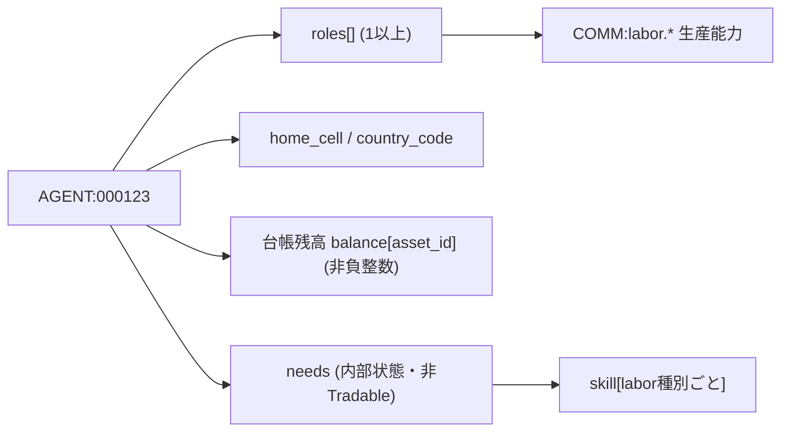
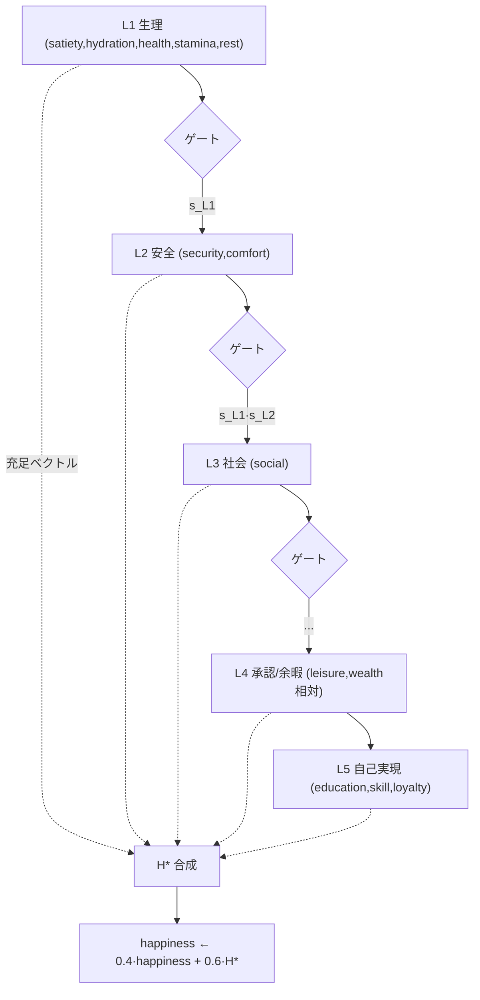
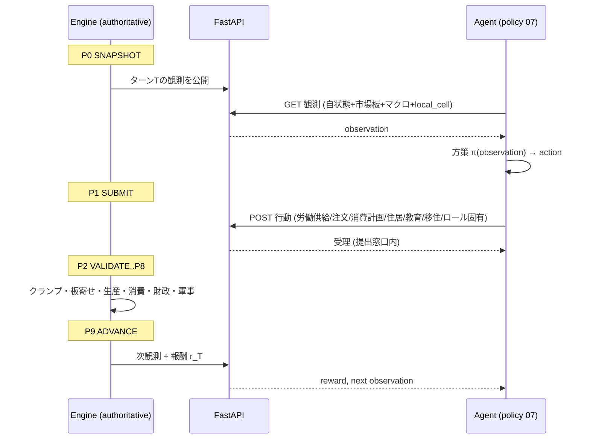
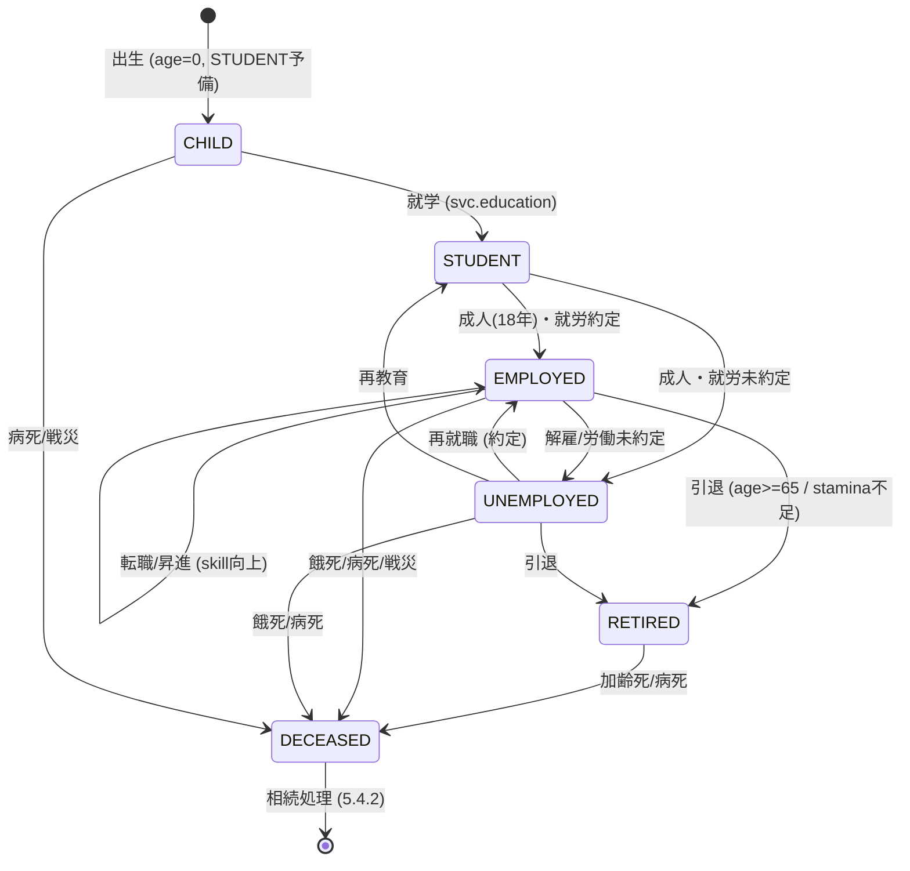

# 05. エージェント

本書は FinBox の個体エージェント (`AGENT:<6桁>`) の状態・ライフサイクル・意思決定ループ・消費・労働を定義する。横断定義 (ID体系・ニーズ一覧・ターンパイプライン P0..P9・資産ID・保存則) は [用語集と正準仕様](00-glossary.md) を唯一の真実として参照し、本書はその詳細化のみを行う。ロールの責務は [06 ロール](06-roles.md)、方策と報酬は [07 機械学習](07-machine-learning.md)、労働市場の板寄せは [09 市場と取引](09-markets-and-trading.md)、企業の雇用は [10 産業と生産](10-industry-and-production.md)、居住・移住の地理は [04 世界と地理](04-world-and-geography.md)、人間プレイヤーとの対比は [13 プレイヤーとマルチプレイヤー](13-players-and-multiplayer.md) を参照する。

## 5.1 エージェントモデル

エージェントは機械学習で駆動する経済主体の個体であり、台帳 (用語集 0.9) 上の `entity_id` を持つ第一級のエンティティである。1体のエージェントは以下を保持する。

- `entity_id`: `AGENT:<6桁>` 形式 (用語集 0.4)。ゼロ埋め6桁。シミュレーション全期間で一意かつ不変 (死亡後も再利用しない)。
- `roles`: 1つ以上のロール (用語集 0.14, [06 ロール](06-roles.md))。労働者系ロールは対応する `COMM:labor.*` の生産能力を、公共・資本系ロールは role-gating された行動を規定する。1体は同時に複数ロールを持てる (例: `OFFICE_WORKER` かつ `INVESTOR`)。主従関係は `primary_role` で表す。
- `home_cell`: 居住セル (用語集の国コードに属するマス座標。[04 世界と地理](04-world-and-geography.md))。観測の `local_cell`・通勤可能な労働市場・住居 comfort の判定基準となる。移住で変化する。
- `country_code`: `home_cell` が属する国 (用語集 0.6)。税・福祉・loyalty・徴兵の管轄を決める。移住が国境を跨ぐと変化する。
- 現物残高: 共通台帳上の `balance[entity_id][asset_id]` (非負整数, 用語集 0.9)。通貨 `CUR:*`・財 `COMM:*`・金融商品 `BOND/EQ/BILL/*` を保有する。これが唯一の経済的資産であり、ニーズは資産ではない。
- ニーズ状態 `needs`: Tradable Asset ではない内部状態 (用語集 0.13)。下記 5.2 で定義する。エンジンのみが更新でき、市場で売買できない。

ニーズと残高の関係は一方向である。エージェントは残高 (財・サービス) を P6 CONSUME で消費してニーズを回復し、ニーズの高低が P1 SUBMIT での行動 (方策の入力) と P9 ADVANCE での報酬・死亡判定に影響する。ニーズそのものは移転・取引・徴収の対象にならない。

## 5.2 ニーズ状態の詳細定義

すべてのニーズは連続値 `0..100` (内部は固定小数を整数スケール `×1000` で保持し、観測・式表記では `0..100` の実数として扱う) で、`clamp(x) = min(100, max(0, x))` で常にクランプする。各ニーズは毎ターン P6 CONSUME 内で「(1) 減衰 → (2) 消費による回復 → (3) 相互作用・閾値効果 → (4) クランプ」の順に更新される。`age` のみ P6 で加齢し、`wealth` は P9 ADVANCE で台帳から派生再計算する。

記号: `n` は当該ニーズの現在値、`q_x` はそのターンに消費した財・サービス `x` の数量 (整数)、係数は [16 構成と初期化](16-configuration-and-initialization.md) の `needs.*` で構成可能。下表の既定値は正準デフォルトである。

### 5.2.1 生理ニーズ (Physiological)

| ニーズ | 範囲 | 毎ターン減衰 | 回復関数 (消費財→回復量) | 主な相互作用・閾値効果 |
| --- | --- | --- | --- | --- |
| `satiety` 満腹度 | 0..100 | `-6.0` | `+18·q_food + 6·q_agri_food`(`good.food` 主、`agri.grain/vegetable/livestock/fish` 副) | `satiety < 20` で `health` を毎ターン `-4`。`satiety = 0` が継続すると餓死判定 (5.4) |
| `hydration` 水分 | 0..100 | `-10.0` | `+25·q_water`(`good.food` の飲料サブ `good.food#drink` または `svc.retail` の水) | `hydration < 15` で `health -3`、`stamina` 上限を `0.7×` に低下。`hydration = 0` 継続で脱水死 (5.4) |
| `stamina` 体力・活力 | 0..100 | 労働供給時 `-stamina_cost(labor種別)`、非労働時 `-2.0` | 休息で `+rest_recovery(rest, comfort)`(5.2.4 参照) | 労働の最大供給量 `Q_labor ≤ floor(stamina / stamina_cost)`。`stamina < 10` で労働供給不可 |
| `health` 健康 | 0..100 | `-1.0`(基礎老化)、`age` 高で追加減衰 (5.2.3) | `+30·q_healthcare + 12·q_medicine`(`svc.healthcare`, `good.medicine`) | `health < 25` で `stamina` 回復効率 `0.6×`・`happiness -3`。`health` 低継続で病死 (5.4) |
| `rest` 休息 | 0..100 | 労働供給時 `-rest_cost(labor種別)`、非労働時 `-3.0` | 非労働ターンの睡眠で `+20`、`comfort` が高いほど追加 `+0.15·comfort`、`svc.leisure` 消費でも `+5·q_leisure` | `rest` が `stamina` 回復関数の主入力。`rest < 20` で `stress +4`・生産性低下 |

`agri_food` は `agri.grain`・`agri.vegetable`・`agri.livestock`・`agri.fish` を指す (生鮮一次食料の直接消費)。`good.food` は加工食品で回復効率が高い。

### 5.2.2 心理社会ニーズ (Psychosocial)

| ニーズ | 範囲 | 毎ターン減衰 | 回復関数 | 主な相互作用・閾値効果 |
| --- | --- | --- | --- | --- |
| `comfort` 住環境快適性 | 0..100 | `-2.0` | 住居保有/賃借時に目標値 `comfort_target(housing_tier)` へ `+0.5·(target − comfort)` で漸近 (5.6) | `comfort` は `rest` 回復・`happiness` の主入力。住居なし (`housing_tier = 0`) は `comfort_target = 15` |
| `social` 社会的つながり | 0..100 | `-4.0` | `+10·q_leisure`(`svc.leisure`)、同一セル人口密度ボーナス `+0.05·density_norm`、世帯員数 `+1.0·household_size` | `social < 20` で `happiness -3`・`stress +2` |
| `security` 安全・治安 | 0..100 | `-1.0` | `security_target(country)` へ漸近。`security_target = base + welfare_factor − crime_factor − war_factor` (国家の福祉/治安/戦時状態から [12 政治と統治](12-politics-and-government.md) が供給) | `security < 30` で `stress +3`・移住志向上昇 (5.5)。`loyalty` の入力 |
| `leisure` 余暇充足 | 0..100 | `-7.0` | `+14·q_leisure + 6·q_electronics`(`svc.leisure`, `good.electronics`) | `happiness` の主入力。`leisure < 15` で `happiness -2`・`stress +2` |
| `stress` ストレス (逆値・高いほど悪) | 0..100 | `+3.0`(蓄積)。逆値ニーズ | `−12·q_leisure − 0.1·(health − 50) − 0.1·(security − 50) − rest_relief` で減少 | `stress > 70` で `health -3`・生産性 `0.8×`・移住/離職志向上昇。`happiness` を `-0.2·stress` で押し下げ |
| `happiness` 幸福度 | 0..100 | 直接減衰なし。下記合成で毎ターン再計算 | `happiness ← clamp(0.4·happiness + 0.6·H*)`(慣性付き)、`H* = w·マズロー充足ベクトル` (5.2.5) | `happiness < 30` で生産性 `0.85×`・移住志向強化 (5.5)。報酬 (07) の労働者系厚生項の主成分 |

`stress` は唯一「高いほど悪い」逆値ニーズである。報酬・閾値判定では `stress_inv = 100 − stress` として扱い、`happiness` 合成や厚生指標には `stress_inv` を入れる。

### 5.2.3 発達・派生ニーズ (Developmental & Derived)

| ニーズ | 範囲 | 更新 | 定義・効果 |
| --- | --- | --- | --- |
| `skill[k]` 技能 (labor種別 `k` ごと) | 0..100 | 就労で `+δ_work(k)`、教育で `+δ_edu`、不使用で `-decay_skill` | `k ∈ {unskilled,farm,mine,build,factory,office,service,engineer,health,research,soldier}` (`COMM:labor.*` と一致)。労働産出量・賃金交渉力を決める (5.5)。詳細 5.3 |
| `education` 教育水準 | 0..100 | `+δ_edu·q_education`(`svc.education`)、基礎減衰 `-0.2` | 高 `education` は `skill` 習得効率 `(1 + 0.5·education/100)` 倍・`engineer/research/office/health` 系 skill の上限を解放。`STUDENT` ロールの主目標 |
| `age` 年齢 (tick換算) | 0..∞ tick | 毎ターン `+1 tick`。年齢年 = `age / TURNS_PER_YEAR` | 死亡確率・退職・出生可能域・基礎 `health` 減衰の入力 (5.4)。`AGE_ADULT=18年`, `AGE_RETIRE=65年`, `AGE_MAX=110年` |
| `wealth` 純資産 (WUI換算・派生) | 実数 (WUI) | P9 で台帳から派生再計算 | `wealth = Σ_asset balance·mark_price·fx_to_WUI`(用語集 0.16)。投資家系の報酬・ランキング (13) の基準。ニーズだが消費で回復せず取引結果として変動 |
| `loyalty` 国家忠誠 | 0..100 | `loyalty_target(country)` へ `+0.2·(target − loyalty)` で漸近 | `target = base + 0.3·security + 0.2·welfare − 0.4·tax_burden − war_penalty`。低 `loyalty` は移住確率・徴兵忌避・政治不支持を高める ([12](12-politics-and-government.md)) |

### 5.2.4 stamina と rest の回復 (休息モデル)

労働を供給しないターン (P1 で労働行動を提出しない、または提出量が0) を「休息ターン」とみなし、`stamina` と `rest` を回復する。

- `rest` 回復: 休息ターンに `rest ← clamp(rest + 20 + 0.15·comfort + 5·q_leisure)`。労働ターンは `rest ← clamp(rest − rest_cost(k)·Q_labor)`。
- `stamina` 回復: `stamina ← clamp(stamina + base_recovery·(rest/100)·health_factor·hydration_factor)`。`base_recovery = 30`、`health_factor = 0.6 + 0.4·(health/100)`(連続式。`health=0→0.6`, `health=100→1.0`。`health<25` でも本連続式が返す低値をそのまま用い、別途 `0.6×` の倍率は重ねない=二重適用の回避)、`hydration_factor = min(1, 0.7 + 0.3·hydration/100)`。
- 部分労働は可能。`Q_labor < stamina/stamina_cost(k)` を選べば余力を残して回復を兼ねられる。これにより方策 (07) は労働と休息のトレードオフを学習する。

### 5.2.5 マズロー的優先順位と happiness 合成

ニーズは Maslow 的階層で重み付けされ、下位 (生理) が満たされない限り上位 (心理社会) の充足が幸福へ寄与しにくい「ゲート」構造を持つ。各階層の充足度 `s_layer ∈ [0,1]` を定義する。

- 階層充足度: `s_L1 = mean(satiety, hydration, health, stamina, rest)/100`、`s_L2 = mean(security, comfort)/100`、`s_L3 = social/100`、`s_L4 = mean(leisure, wealth_rel)/100`、`s_L5 = mean(education, mean_k skill[k], loyalty)/100`。`wealth_rel = clamp(50 + 25·log2(1 + wealth/wealth_median))` は中央値比の相対資産。`wealth_median` は当該エージェントの**居住国**の生存エージェントの `wealth`(WUI換算) の中央値で、P9 ADVANCE 開始時の台帳スナップショットから算定する ([16](16-configuration-and-initialization.md))。`wealth_median = 0` のとき `wealth_rel = 50`(中立) とする (ゼロ除算回避)。
- ゲート付き目標 `H*`: `H* = 100·( w1·s_L1 + w2·g1·s_L2 + w3·g1·g2·s_L3 + w4·g1·g2·g3·s_L4 + w5·g1·g2·g3·g4·s_L5 )`。ゲート `g_i = smooth(s_Li)`、`smooth(s) = s^0.5`(下位が低いと上位寄与を抑制)。既定重み `w = (0.34, 0.22, 0.16, 0.16, 0.12)`(`Σw = 1`)。
- これにより、空腹・病気のエージェントには余暇や教育が幸福へほとんど寄与せず、まず生理ニーズを満たす消費を優先する方策が学習される。重み・指数は構成可能 ([16](16-configuration-and-initialization.md))。

## 5.3 技能 (skill) の成長と労働産出

`skill[k]` は labor 種別 `k` ごとに独立して `0..100` を取り、労働の産出量と賃金交渉力を決める。

- 就労による成長 (learning by doing): あるターンに `k` の労働を約定 (P4 で売れた数量 `Q_filled(k) > 0`) すると、P9 で `skill[k] ← clamp(skill[k] + δ_work·(1 − skill[k]/100)·(1 + 0.5·education/100))`。`δ_work = 1.2`。高 skill ほど伸びが鈍化する逓減型。
- 教育による成長: `STUDENT` ロールまたは `svc.education` 消費で `skill[k]`(教育課程が対象とする種別) と `education` が伸びる。`skill[k] ← clamp(skill[k] + δ_edu·q_education)`、`δ_edu = 0.8`。教育は実務 (就労) なしでも一定まで skill を伸ばせるが、上限は `60 + 0.4·education` でクランプ (高度技能は就労経験を要する)。
- 不使用減衰: そのターンに `k` を一切供給せず教育もしないと `skill[k] ← clamp(skill[k] − decay_skill)`、`decay_skill = 0.1`。
- 産出量への反映: エージェントが種別 `k` に供給できる労働量は `Q_labor(k) = floor( base_units·(0.5 + 0.5·skill[k]/100)·stamina_factor )`。`base_units = 10`、`stamina_factor = min(1, stamina/stamina_cost(k))`。すなわち高 skill かつ高 stamina ほど多くの `COMM:labor.k` を生産できる。
- 種別と前提: 高度技能種別 (`engineer`, `research`, `health`, `office`) は最低 `education ≥ edu_gate(k)` を満たさないと skill が `cap_low(k)` 以上に上がらない。`edu_gate` 既定: engineer 40, research 50, health 45, office 25, それ以外 0。`cap_low(k)` 既定 30 (学歴ゲート未達時の skill 上限、[16](16-configuration-and-initialization.md))。これがロール配属・転職 (06) の前提条件になる。

| labor 種別 `k` | `stamina_cost` | `rest_cost` | `edu_gate` | 主要ロール |
| --- | --- | --- | --- | --- |
| `unskilled` | 8 | 6 | 0 | `UNEMPLOYED` 等の汎用 |
| `farm` | 10 | 7 | 0 | `FARMER` |
| `mine` | 14 | 9 | 0 | `MINER` |
| `build` | 13 | 9 | 0 | `BUILDER` |
| `factory` | 10 | 7 | 0 | `FACTORY_WORKER` |
| `office` | 6 | 4 | 25 | `OFFICE_WORKER` |
| `service` | 7 | 5 | 0 | `SERVICE_WORKER` |
| `engineer` | 8 | 6 | 40 | `ENGINEER` |
| `health` | 9 | 7 | 45 | `HEALTHCARE_WORKER` |
| `research` | 7 | 5 | 50 | `RESEARCHER` |
| `soldier` | 12 | 9 | 0 | `SOLDIER` |

`COMM:labor.*` は perishable (用語集 0.5.3)。生産したターンに労働市場 (09) で約定しなければ消滅し、賃金は得られない (= 失業, 5.5)。

## 5.4 死亡と出生・相続

P6 CONSUME のニーズ更新後に死亡判定、続いて出生判定を行う。すべて決定論的に、ターン導出サブシード ([03](03-time-and-turns.md)) から供給する乱数で評価する。

### 5.4.1 死亡条件

エージェントは以下のいずれかで死亡する。死亡したエージェントの `entity_id` は P9 で `DECEASED` 状態に移行し、以後行動を提出しない。

- 餓死/脱水死: `satiety = 0` または `hydration = 0` が `STARVE_TURNS = 6` ターン連続で継続。連続カウンタ `starve_streak` をニーズ状態に保持する。
- 病死 (健康崩壊): `health < HEALTH_CRIT = 10` のターンに確率死 `p_health = p_base_health·(1 − health/HEALTH_CRIT_RANGE)`、`HEALTH_CRIT_RANGE = 30`, `p_base_health = 0.08`。`health = 0` で `p = 1`。
- 加齢死 (確率死): 各ターン `p_age = 1 − exp( −(age_years / AGE_SCALE)^AGE_SHAPE / TURNS_PER_YEAR )`。Gompertz 型。`AGE_SCALE = 85`(年)、`AGE_SHAPE = 7`。`age_years ≥ AGE_MAX = 110` で `p = 1`(確定死)。
- 戦闘・災害死: [12 政治と統治](12-politics-and-government.md) (軍事 P8) と [04](04-world-and-geography.md) (災害イベント) が指定するセル単位の死亡。本書の確率死とは独立に発火する。

死因の評価順と乱数: 死因は**独立に評価し、評価順は餓死/脱水 → 病死 → 加齢死**で固定する (最初に成立した死因で確定)。各確率事象は個体派生サブシード `rng(tick, "demography", entity_id)` からの**死因ごと独立ドロー**で引き、走査順に依存しない ([03 §3.6.1](03-time-and-turns.md))。

### 5.4.2 相続 (資産の扱い)

死亡時、台帳の保存則 (用語集 0.17) を維持したまま現物残高を移転する。ニーズ状態は破棄する (Tradable でないため移転対象外)。

- 相続人の決定: 死者と同一世帯 (5.7) の生存成人 (`age_years ≥ AGE_ADULT`) のうち最年長を相続人とする (同年齢の最年長が複数のときは `entity_id` 昇順で一意化)。複数いれば世帯員へ均等割 (端数は最年長へ寄せ、整数を保つ)。
- 世帯に成人がいない場合: 未成年が残る世帯は最近接セルの里親世帯へ編入し、資産も同様に移転する (等距離の里親世帯候補が複数のときは `cell_id` 昇順、次いで `household_id` 昇順で一意化)。生存者が皆無 (世帯消滅) の場合、現物残高は所在国政府 `GOV:<country>` へ無主財産として帰属する (プロトコル移転, 用語集 0.10)。
- 金融商品の扱い: `BOND/BILL/EQ/FUT` も現物残高として相続人へ移転する。発行体や枚数は変わらないため保存則を破らない。未決済の与信・負債は [11 金融と金融商品](11-finance-and-instruments.md) の清算規則に従い相続人へ承継する。
- 企業持分: 経営者 (`ENTREPRENEUR`) が死亡しても `FIRM` は存続する。保有 `EQ:firm.*` が相続されることで支配権が移る。相続人不在で企業が無主化した場合は [10 産業と生産](10-industry-and-production.md) の倒産・清算手続に入る。

### 5.4.3 出生と新規エージェントのロール配属

人口を維持・変動させるため、世帯単位で出生を評価する。人口総数と地域分布は [04 世界と地理](04-world-and-geography.md) の人口モデルと整合させる (本書は個体生成規則、04 は総量・分布制約を担う)。

- 出生確率: 出生可能世帯 (`AGE_FERTILE = [18, 45]` 年の成人を含む世帯。エージェントは性別属性を持たず、出生判定は性別非依存で世帯内の生殖可能年齢成人の有無で行う) について `p_birth = p_base_birth·fertility(country)·f_econ·f_need`。`p_base_birth = 0.015`/ターン。`f_econ = clamp01(0.5 + 0.5·household_wealth_rel)`、`f_need = clamp01(mean(satiety,health,security,happiness)/100)`(生活が安定なほど出生増)。`fertility(country)` は政策・人口ピラミッドから [12](12-politics-and-government.md) が供給。
- 04 との整合: 各国の総人口は 04 が定める収容上限 `pop_cap(country)` と目標人口経路に対しスケーリングされる。出生・死亡・移住の純増減が `pop_cap` を超える場合、出生確率を一律係数 `min(1, headroom/expected_births)` で抑制する (決定論的クランプ)。
- 新生児の初期状態: `age = 0`、生理ニーズ `= 70`(初期エンドウメント的)、`skill[*] = 0`、`education = 0`、`home_cell = 親世帯のセル`、初期残高は親世帯からの少額移転 (プロトコル移転ではなく扶養、台帳上は親の残高に内包し独立残高は最小)。`primary_role = STUDENT`(`AGE_ADULT` 未満)。
- 成人時のロール配属: `age_years` が `AGE_ADULT = 18` に達したターンに方策 (07) と労働市場需給から初期就労ロールを決める。決定は「skill ベクトルが最も高い種別」と「居住セルで需要(求人=企業の `labor.*` 買い注文, 10) が逼迫している種別」のスコア合成で行い、対応する労働者系ロール (06) を `primary_role` に設定する。就労先が無ければ `UNEMPLOYED`。教育継続を選べば `STUDENT` を継続。
- 退職: `age_years ≥ AGE_RETIRE = 65` で方策が労働供給を止めるか、`stamina` 回復が労働コストを下回ると `RETIREE` へ遷移する。年金・福祉は [12](12-politics-and-government.md) のプロトコル移転で受給する。

## 5.5 意思決定ループ (Decision Loop)

エージェントの行動はターンパイプライン (用語集 0.11) に同期する。P0 SNAPSHOT で観測を取得し、方策 ([07 機械学習](07-machine-learning.md)) が行動ベクトルを生成し、P1 SUBMIT で提出する。エンジンが P2..P9 を権威的に実行し、P9 ADVANCE で報酬を返す。エージェントは状態を直接書き換えず、すべて API 経由 ([14 API リファレンス](14-api-reference.md)) で観測取得と行動提出のみを行う (用語集 0.2)。

### 5.5.1 観測 (Observation)

P0 で各エージェントへ公開される観測は以下を含む (詳細スキーマは [07](07-machine-learning.md) と [14](14-api-reference.md))。情報は全クライアントに対称で、特権情報は存在しない (用語集 0.2)。

- 自身状態: 全ニーズ値 (5.2)、`skill[*]`、`age`、`roles`、台帳残高 (`CUR/COMM/BOND/EQ/...`)、`home_cell`、世帯情報、`starve_streak`。
- 市場: 自セルからアクセス可能な各取引ペアの板 (最良気配・板厚・直近 OHLC・出来高)。労働市場 `COMM:labor.k/CUR:country`、消費財市場、住宅、金融商品市場 (09)。
- マクロ指標: 自国と全世界の CPI・インフレ率・失業率・政策金利・FX・平均幸福度等 (用語集 0.16)。
- ローカルセル: `local_cell` の人口密度・産業構成・求人 (企業の `labor.*` 買い板)・住宅在庫・治安・気候/季節 (04)。

### 5.5.2 行動 (Action) の種類

P1 で提出する行動ベクトルは以下のサブ行動を束ねる。role-gating により提出可能なサブ行動はロールで変わる (用語集 0.14, [06](06-roles.md))。労働者系の中核は労働供給と消費である。

| 行動 | 内容 | 経路/フェーズ | role-gating |
| --- | --- | --- | --- |
| 労働供給 (labor supply) | `COMM:labor.k` を `Q_labor(k)` 単位、指値/成行で労働市場 (09) に売り注文 | P4 CLEAR (賃金=約定価格) | 労働者系ロール (k に対応) |
| 消費 (consume) | 保有財・サービスを P6 で消費しニーズ回復。市場で不足財を買い注文 | 買いは P4、消費は P6 CONSUME | 全エージェント |
| 貯蓄/投資 (save/invest) | `CUR` を保持、または `BOND/BILL/EQ` を売買、預金 (11) | P4 CLEAR | 全 (投資の高度行動は INVESTOR 等) |
| 住居取得 (housing) | 住居の購入/賃借/解約。`comfort` を決める (5.6) | P4 (売買)/P6 (居住効果) | 全エージェント |
| 教育 (education) | `svc.education` を購入・消費、または `STUDENT` として就学 | P4/P6 | 全 (STUDENT は専従) |
| 移住 (migrate) | `home_cell`/国の変更を申請 | P6 CONSUME 内の移住処理 | 全エージェント |
| ロール固有 (role-specific) | 企業操作・出資・投票・政策提案・軍事命令・MM 気配提示など | 各フェーズ (P3/P4/P5/P8) | 該当ロールのみ ([06](06-roles.md)) |

### 5.5.3 労働と賃金 (重要)

労働は FinBox の所得の中核であり、すべて公開労働市場の板寄せ (用語集 0.2, [09 市場と取引](09-markets-and-trading.md)) を通じる。賃金はプロトコル移転ではなく市場約定価格である。

- 生産: 各ターン、労働者系エージェントは `stamina` を消費して `COMM:labor.k` を `Q_labor(k) = floor(base_units·(0.5 + 0.5·skill[k]/100)·min(1, stamina/stamina_cost(k)))` 単位まで生産できる (5.3)。生産可能種別はロールと `skill[k] > 0` の種別。
- 売り注文: 生産した `labor.k` を労働市場ペア `COMM:labor.k / CUR:<country>` に指値 (希望賃金) または成行で出す。複数種別を持つエージェントは配分を選べる。
- 約定と賃金: P4 CLEAR の板寄せで、企業 (10) の労働買い注文 (求人) とマッチした分 `Q_filled(k)` が約定し、賃金 `wage = price × Q_filled(k)`(`CUR:<country>`) を受け取る。価格は板寄せの単一約定価格 (09)。
- 失業: そのターンに労働が一切約定しない (`Σ_k Q_filled = 0`) 状態を失業とする。`labor.*` は perishable のため未約定分は消滅し賃金は得られない。失業率は約定しなかった労働供給者の比率としてマクロ指標 (0.16) に集計する。`UNEMPLOYED` ロールは `labor.unskilled` を低希望賃金で供給し続ける状態を表す。
- スキル向上: 約定した種別 `k` は P9 で `skill[k]` が向上する (5.3, learning by doing)。長期失業や不使用は skill 減衰を招き、再就職を難しくする負のフィードバックを持つ。
- 企業側との整合: 求人 (企業の `labor.k` 買い注文) の生成・賃金支払・解雇は [10 産業と生産](10-industry-and-production.md) が定義する。労働市場は両者の注文を 09 の板寄せで突き合わせる単一の市場である。

### 5.5.4 stress/happiness による生産性調整

`stress > 70`・`happiness < 30`・`health < 25`・`rest < 20` の各条件は労働産出に乗算ペナルティを与える。総合生産性係数 `prod_mult = (stress>70 ? 0.8:1)·(happiness<30 ? 0.85:1)·(health<25 ? 0.85:1)·(rest<20 ? 0.9:1)`。労働産出は `prod_mult` を 5.3 の式に乗じた上で**一度だけ floor** する: `Q_labor(k) = floor(base_units·(0.5 + 0.5·skill[k]/100)·stamina_factor·prod_mult)`(中間で丸めず最後に floor、用語集 0.20)。これにより厚生の悪化が直接所得を下げ、方策に厚生維持の動機を与える。

## 5.6 消費行動と住居

P6 CONSUME で、エージェントは P4 までに取得した保有財・サービスを消費してニーズを回復する。消費は方策が P1 で提出した「消費計画 (各 `asset_id` の消費量上限)」と保有量・ニーズ状態から決定論的に実行する。

- 予算配分 (必需 vs 余暇): 方策は所得・残高をニーズ階層 (5.2.5) に従い配分する。生理ニーズが閾値割れ (`satiety<20`, `hydration<15`, `health<25`) の場合、エンジンは食料・水・医療の消費を余暇消費より優先する安全弁 (P2 VALIDATE 時の自動補正は行わず、報酬設計 07 とマズロー合成 5.2.5 で誘導) を持つ。方策の自由度は保つが、生存を軽視する方策は報酬 (07) で淘汰される。
- 消費の確定順 (P6, 決定論): 同一ニーズに複数の財がマップする場合 (例 `satiety` は `good.food` と `agri.*`)、**単位回復量の大きい財から**充当し、同回復量は `asset_id` 昇順で一意化する。エージェント間の走査は `entity_id` 昇順 ([03 §3.7](03-time-and-turns.md))。
- 消費→回復の対応 (用語集 0.13 の詳細化):

| ニーズ | 回復に用いる asset_id | 単位回復量 (既定) |
| --- | --- | --- |
| `satiety` | `COMM:good.food` / `agri.grain,vegetable,livestock,fish` | `+18` / `+6` |
| `hydration` | `COMM:good.food#drink` / `svc.retail`(水) | `+25` |
| `health` | `COMM:svc.healthcare` / `good.medicine` | `+30` / `+12` |
| `comfort` | 住居 (`housing_tier` による目標漸近, 下記) | 目標へ `+0.5·gap` |
| `leisure` | `COMM:svc.leisure` / `good.electronics` | `+14` / `+6` |
| `social` | `COMM:svc.leisure` / 世帯・密度ボーナス | `+10` / 加算 |
| `rest` | 休息ターン / `svc.leisure` | `+20` / `+5` |
| `education` `skill` | `COMM:svc.education` / 就労 | `+δ_edu` / `+δ_work` |
| `security` `loyalty` | 国家供給 (12) | 目標漸近 |

- 住居 (comfort): 住居は住宅市場 (09) で取引される財/サービスとして扱う。住居の質は `housing_tier ∈ {0,1,2,3}`(0=なし/路上, 1=簡易, 2=標準, 3=高級) で表し、`comfort_target = {15, 45, 70, 90}[tier]`。
  - 購入: 耐久財的住居を `COMM:good.*` の住宅サブ (または 10 の建設業産出 `build.construction_labor` を投入して建設) として一括取得し、保有する限り `housing_tier` を維持。固定資産税は [12](12-politics-and-government.md) のプロトコル移転。
  - 賃借: 毎ターン家賃 `svc.housing`(`COMM:svc` サブ) を購入・消費して `housing_tier` を維持。解約すると翌ターン `tier→0` へ低下し `comfort` が減衰する。
  - セル制約: 住宅在庫はセルごとに上限があり (04)、不足セルでは家賃・住宅価格が板寄せで上昇する。これが移住 (5.5.2 の migrate) の経済的誘因になる。

## 5.7 世帯と社会の簡易モデル

エージェントは世帯 (`household_id`) に属し、社会的つながり `social` と扶養・相続の単位を形成する。

- 世帯: `household_id` は同居 (同一 `home_cell`・同一世帯) する成人・扶養児・退職者の集合。世帯は出生 (5.4.3)・婚姻 (任意イベント)・独立 (成人後の分家)・死亡で構成が変わる。世帯員数 `household_size` は `social` 回復と出生確率にボーナスを与える。
- 扶養: `STUDENT`/未成年・`RETIREE`・失業中の世帯員は、世帯の稼得者の残高から消費を賄える (P6 で世帯プールから消費可能)。これは台帳上、稼得者残高からの世帯内消費として処理し独立移転を最小化する。
- 社会的つながり `social`: `svc.leisure` 消費・世帯員数・居住セルの人口密度から回復する (5.2.2)。低 `social` は `happiness` と `stress` を悪化させ、密集地への移住・娯楽消費の誘因になる。
- 婚姻 (任意): 同一セルの独身成人2体が方策・適合度で世帯統合する任意イベント。出生可能世帯を形成し、資産は統合せず各自の台帳残高を保持したまま相続・扶養を共有する。構成で無効化可能 ([16](16-configuration-and-initialization.md))。

## 5.8 ライフサイクル (状態遷移)

エージェントは誕生から死亡まで以下の状態を遷移する。`primary_role` の変化はロール流動性 ([06 ロール](06-roles.md)) に従う。

- `EMPLOYED`/`UNEMPLOYED` は `primary_role` が労働者系である間の就労状態 (約定有無) を表す派生状態であり、ロールそのものは 06 の分類に従う。`INVESTOR`/`ENTREPRENEUR`/公共系ロールは所得を労働約定以外 (投資収益・利潤・俸給) からも得るため、`UNEMPLOYED` の定義は労働市場での労働供給を主とするエージェントに適用する。
- 状態遷移はすべてエンジンが P6 (出生/死亡/移住)・P9 (ロール・就労状態の確定) で決定論的に評価する。

## 5.9 プレイヤーとの対比

人間プレイヤー (`PLAYER:<6桁>`) は既定で `INVESTOR` として参加し、エージェントと同一の API・観測・行動スキーマを用いる (用語集 0.2)。プレイヤーはニーズ状態 (5.2) を持たず、消費・労働・出生死亡・相続の対象外であり、純資産 `wealth`(WUI) とポートフォリオで評価される。すなわち本書 5.2..5.8 のニーズ/ライフサイクル機構はエージェント (`AGENT:*`) に固有であり、プレイヤーは投資・企業操作の経済行動のみを共有する。詳細な対比・公平性・ランキングは [13 プレイヤーとマルチプレイヤー](13-players-and-multiplayer.md) を参照する。
