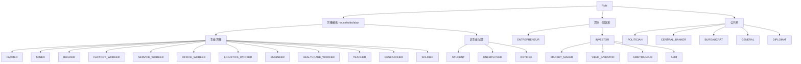
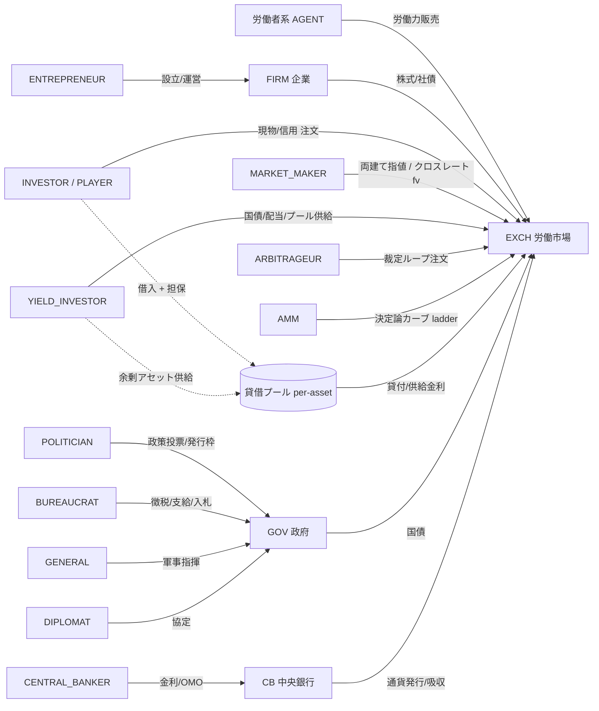
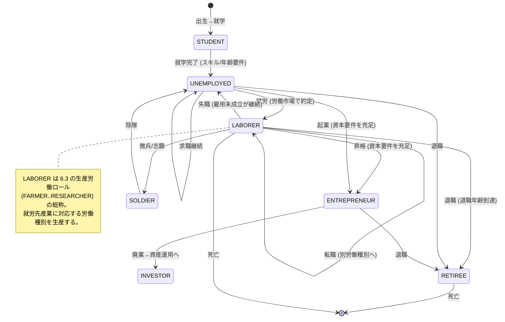

# 06. ロール

本書は FinBox における**ロール (role)** を定義する。ロールは `AGENT`/`PLAYER` が持つ属性であり、許可される行動 (role-gating)・生産する労働種別または操作対象・報酬関数の方向性を規定する。ロール分類の正準定義は [用語集 0.14](00-glossary.md) にあり、本書はそれを詳細化する。本書はロールを再定義せず、用語集の列挙値・資産ID (`COMM:labor.*` 等)・エンティティID・産業分類・集約規則を参照する。矛盾を見つけた場合は用語集を正とする。

関連: [エージェント](05-agents.md)・[機械学習](07-machine-learning.md)・[市場と取引](09-markets-and-trading.md)・[産業と生産](10-industry-and-production.md)・[金融と金融商品](11-finance-and-instruments.md)・[政治と統治](12-politics-and-government.md)・[プレイヤーとマルチプレイヤー](13-players-and-multiplayer.md)・[構成と初期化](16-configuration-and-initialization.md)。

## 6.1 ロールの位置づけと原則

- **ロールは行動空間のゲート**: エージェントとプレイヤーは同一の FastAPI インターフェース・同一の認証・同一の行動スキーマを用いる ([用語集 0.2](00-glossary.md))。両者の差異はロールによる行動の可否 (role-gating) のみであり、情報の非対称性や特権は存在しない。ある行動 `action` が提出されたとき、P2 VALIDATE はそのエンティティの保有ロール集合が当該行動を許可するかを確認し、許可されなければ棄却する ([アーキテクチャ](02-architecture.md))。
- **ロールは複数持てる**: `roles` はロールコードの集合である。例えば `INVESTOR` かつ `ENTREPRENEUR` を併せ持つエージェントは両者の行動を提出できる。ただし労働者系ロール (6.3) は同時に1つのみ保持する (労働力は1ターンに1種別しか供給しない)。
- **ロールは報酬関数を切り替える**: 各ロールは [機械学習 07](07-machine-learning.md) で定義される報酬関数の構成要素 (重み) を選ぶ。本書は報酬の**方向性**(何を最大化しようとするか) のみを述べ、厳密な式・係数は 07 に委ねる。
- **ロールは可変**: ロールは genesis で配分され ([構成と初期化 16](16-configuration-and-initialization.md))、就労・昇格・引退・徴兵などにより遷移する (6.10)。遷移はすべてエンジンが決定論的に適用する。
- **エンティティ種別との関係**: ロールは `AGENT` と `PLAYER` のみが持つ。`FIRM`/`GOV`/`CB`/`EXCH` はロールを持たない制度的・法人的主体であり、ロールを持つエージェントが操作する ([用語集 0.4](00-glossary.md))。`POLITICIAN` が `GOV` を統治し、`CENTRAL_BANKER` が `CB` を執行し、`ENTREPRENEUR` が `FIRM` を運営する。

## 6.2 ロール分類ツリー

ロールは大きく3系統に分かれる。労働者系は労働力 (`COMM:labor.*`) を市場に供給する世帯エージェント、資本・経営系は資本を運用し企業を経営するエージェント、公共系は政府・中央銀行・軍の制度を執行するエージェントである。`MARKET_MAKER`・`YIELD_INVESTOR`・`ARBITRAGEUR`・`AMM` はいずれも `INVESTOR` から派生する特化ロールであり、独立のエンティティ種別ではない ([用語集 0.4, 0.11, 0.14](00-glossary.md))。`INVESTOR` は2軸 (取引モード `trade_mode ∈ {SPOT, MARGIN}` × 投資スタイル `style ∈ {FUNDAMENTAL, TECHNICAL, YIELD}`) で細分化され、`YIELD_INVESTOR` は `style=YIELD` の具体ロール、`ARBITRAGEUR`・`AMM` は流動性供給に特化した派生ロールである (6.5.1–6.5.3、6.6)。

## 6.3 労働者系ロール (households/labor)

労働者系ロールは毎ターン1単位 (基準) の労働力 `COMM:labor.*` を生産し、P4 CLEAR の労働市場 ([市場と取引 09](09-markets-and-trading.md)) で販売する。労働力は perishable であり、そのターンに約定しなければ消滅する ([用語集 0.5.3](00-glossary.md))。供給量・スキル補正・賃金受領は [エージェント 05](05-agents.md) の労働供給ループに従う。各ロールが生産する労働種別・就労先産業・主要スキル要件は下表に固定する。

| ロール | 生産する労働種別 | 就労先産業 | 主要スキル (`skill[*]`) | 報酬の方向性 |
| --- | --- | --- | --- | --- |
| `FARMER` | `COMM:labor.farm` | `AGRICULTURE` | `farm` | 賃金収入とニーズ充足 (満腹・健康・幸福) |
| `MINER` | `COMM:labor.mine` | `MINING` | `mine` | 賃金収入とニーズ充足 |
| `BUILDER` | `COMM:labor.build` | `CONSTRUCTION` | `build` | 賃金収入とニーズ充足 |
| `FACTORY_WORKER` | `COMM:labor.factory` | `MANUFACTURING`, `ENERGY` | `factory` | 賃金収入とニーズ充足 |
| `SERVICE_WORKER` | `COMM:labor.service` | `SERVICES`(小売・娯楽・接客) | `service` | 賃金収入とニーズ充足 |
| `OFFICE_WORKER` | `COMM:labor.office` | `FINANCE`, `SERVICES`, 全産業の管理部門 | `office` | 賃金収入とニーズ充足 |
| `LOGISTICS_WORKER` | `COMM:labor.unskilled` | `LOGISTICS` | `unskilled` | 賃金収入とニーズ充足 |
| `ENGINEER` | `COMM:labor.engineer` | `MANUFACTURING`, `ENERGY`, `CONSTRUCTION` | `engineer` | 高スキル賃金とニーズ充足 |
| `HEALTHCARE_WORKER` | `COMM:labor.health` | `SERVICES`(医療) | `health` | 賃金収入とニーズ充足 |
| `TEACHER` | `COMM:labor.research` | `SERVICES`(教育) | `research` | 賃金収入とニーズ充足 |
| `RESEARCHER` | `COMM:labor.research` | `RESEARCH` | `research` | 高スキル賃金とニーズ充足 |
| `SOLDIER` | `COMM:labor.soldier` | `GOV`(軍) | `soldier` | 俸給・国家忠誠・安全 (軍事 12 の労働投入) |
| `STUDENT` | (生産しない) | — | `education`, `skill[*]` 育成 | 教育水準・将来スキルの蓄積 |
| `UNEMPLOYED` | `COMM:labor.unskilled` | 任意 (低スキル枠) | `unskilled` | 就労・失業給付・転職機会の探索 |
| `RETIREE` | (生産しない) | — | — | 年金・貯蓄取崩しによるニーズ充足 |

注記:

- `LOGISTICS_WORKER` は `COMM:labor.unskilled` を供給する。物流 (`LOGISTICS`) の生産レシピ `svc.transport` が `labor.unskilled` を投入とするため ([10 §10.1, §10.4.3](10-industry-and-production.md))、物流労働は汎用 (unskilled) 労働力プールを `UNEMPLOYED` 等と共有し、`labor.office`(管理部門) と組み合わせて雇用される。`FACTORY_WORKER` の供給する `COMM:labor.factory`(製造・エネルギー向け) とは別資産である。`labor.*` の種別集合は [00 §0.5.2](00-glossary.md) の11種に固定され、物流専用の労働種別は設けない。
- `TEACHER` は教育サービス (`COMM:svc.education`) の生産に必要な `COMM:labor.research` を供給する。`RESEARCHER` と同じ労働種別を供給するが、就労先が `SERVICES`(教育) と `RESEARCH` で分かれる。`COMM:labor.research` を供給する以上、`TEACHER` も `RESEARCHER` と同じく [05 §5.3](05-agents.md) の学歴ゲート `edu_gate(research) = 50`(`education ≥ 50` で初めて `research` skill が `cap_low` 以上に上がる) を満たす必要がある。教育サービス供給ロールにも研究と同一の学歴要件が課される。
- `STUDENT` と `RETIREE` は労働力を生産しない非生産状態であり、消費とニーズ管理のみを行う ([エージェント 05](05-agents.md))。`STUDENT` は `COMM:svc.education` を消費して `education` と `skill[*]` を蓄積し、就労可能年齢・スキル要件を満たすと労働者系ロールへ遷移する (6.10)。
- `UNEMPLOYED` は `COMM:labor.unskilled` を供給できる過渡状態であり、いずれかの産業に約定すると対応する労働者系ロールへ遷移する (就労、6.10)。
- すべての労働者系ロールは投資家ではないが、保有現金で金融商品市場に参加できる範囲は [プレイヤーとマルチプレイヤー 13](13-players-and-multiplayer.md) と本書 6.9 の行動許可マトリクスに従う (既定では現物の購入・売却=自己の生活と貯蓄の範囲に限定し、指値による流動性供給や信用取引 (`MARGIN`) は資本系の `INVESTOR` 派生ロールに限る、6.5/6.9)。

## 6.4 経営者 `ENTREPRENEUR`

`ENTREPRENEUR` は企業 (`FIRM`) を設立・運営する資本・経営系ロールである。操作対象は自らが支配する `FIRM` のエンティティであり、企業に対する操作行動を提出する。生産・能力・資本の詳細は [産業と生産 10](10-industry-and-production.md) と [金融と金融商品 11](11-finance-and-instruments.md) に従う。

許可される行動 (role-gating):

- **企業設立 (`firm.found`)**: 産業 ([用語集 0.15](00-glossary.md)) と立地地域を指定し、最低資本要件 (`16`) を満たす自己資金を払い込んで新規 `FIRM` を生成する。設立者は初期株式 `EQ:firm.<id>` を保有する。
- **生産計画 (`firm.plan`)**: 次ターン P5 PRODUCE の生産レシピ・目標産出量・稼働率を設定する。投入財は労働市場・素材市場で購入する。
- **能力拡張 (`firm.expand`)**: 建設労働力 `COMM:build.construction_labor` を市場で購入・消費して設備・生産能力を拡張する ([用語集 0.5.2 の区別](00-glossary.md))。
- **雇用 (`firm.hire`)**: 労働市場で `COMM:labor.*` の買い注文を出して労働力を購入する。雇用は P4 CLEAR の賃金約定として成立する。
- **増資 (`firm.issue_equity`)**: 新株 `EQ:firm.<id>` を金融商品市場で発行し資本を調達する ([金融 11](11-finance-and-instruments.md))。
- **社債発行 (`firm.issue_bond`)**: 社債 `BOND:<...>` を発行し負債で資金調達する ([金融 11](11-finance-and-instruments.md))。
- **配当 (`firm.dividend`)**: 利益剰余金から株主へ配当を支給する (プロトコル移転、[用語集 0.10](00-glossary.md))。
- **自社株買い (`firm.buyback`)・清算 (`firm.liquidate`)**: 自己株式取得による `EQ` のバーン、または倒産・解散時の残余資産分配 ([産業と生産 10](10-industry-and-production.md))。

報酬の方向性: 企業価値 (純資産・株価・利益剰余金) の最大化と倒産回避。詳細式は [機械学習 07](07-machine-learning.md)。AI/プレイヤー可否: AI 可。プレイヤーは構成で解禁時のみ可 ([用語集 0.14](00-glossary.md), [13](13-players-and-multiplayer.md))。

## 6.5 投資家 `INVESTOR`

`INVESTOR` は金融市場で資産を運用する資本系ロールであり、**人間プレイヤーの既定ロール** ([用語集 0.14](00-glossary.md))。

許可される行動:

- **市場取引 (`order.submit` / `order.cancel`)**: FX (通貨ペア)・国債 (`BOND`/`BILL`)・株式 (`EQ`)・コモディティ (`COMM`)・(任意で `FUT`) について成行・指値・各種 TIF の注文を提出・取消する ([市場と取引 09](09-markets-and-trading.md))。注文は取引モード `trade_mode ∈ {SPOT, MARGIN}` を持ち、`SPOT` は現物 (無レバレッジ)、`MARGIN` は信用取引 (証拠金・貸借プール借入・強制決済の対象、09 §信用取引) を指す。
- **ポートフォリオ運用**: 複数資産・複数通貨にわたるポジション構築・リバランス。純資産は WUI 換算で評価される ([用語集 0.16](00-glossary.md))。
- **信用取引 (`MARGIN`)**: `CUR/CUR`・`EQ/CUR`・storable な `COMM/CUR` について、初期証拠金率 `initial_margin`(=2000 bps、最大レバレッジ5倍) を満たす範囲でロング/ショート両方向のポジションを建てる ([金融 11](11-finance-and-instruments.md)、証拠金・維持証拠金・強制決済の正準定義は [市場と取引 09](09-markets-and-trading.md) §信用取引、純資産反映は [08](08-economy-and-ledger.md) §8.8)。
- **資金調達への参加**: 企業の増資・社債、政府の国債入札に応札する (買い手として)。
- **貸借プールへの供給**: 余剰アセットを貸借プールへ預け入れ、供給金利 `supply_rate` を得る ([市場と取引 09](09-markets-and-trading.md) §貸借プール)。

報酬の方向性: WUI 換算純資産 (`wealth`) のリスク調整後最大化。詳細式・リスク項は [機械学習 07](07-machine-learning.md)。AI/プレイヤー可否: AI 可・プレイヤー既定。

### 6.5.1 投資家ロールの細分化 (取引モード × 投資スタイル)

`INVESTOR` は2軸で細分化される派生ロール群を持つ。第1軸が**取引モード** `trade_mode ∈ {SPOT(現物), MARGIN(信用)}`、第2軸が**投資スタイル** `style ∈ {FUNDAMENTAL(ファンダメンタル), TECHNICAL(テクニカル), YIELD(利回り)}` であり、2×3 のマトリクスを成す。取引モードは role-gating (信用は証拠金・貸借プール・強制決済の対象、6.9) を、投資スタイルは観測サブセットと報酬シェーピング ([機械学習 07](07-machine-learning.md) §7.3/§7.5.2) を切り替える。`MARKET_MAKER` と同様、これらは `INVESTOR` から派生する特化ロールであり、独立のエンティティ種別ではない ([用語集 0.4, 0.14](00-glossary.md))。

| `style` \ `trade_mode` | `SPOT`(現物) | `MARGIN`(信用) |
| --- | --- | --- |
| `FUNDAMENTAL` | 本源的価値推定によるミスプライス回帰 (無レバレッジ) | 同左をレバレッジで増幅 |
| `TECHNICAL` | 価格パターン・モメンタム・出来高 (無レバレッジ) | 同左をレバレッジで増幅 |
| `YIELD` | 経常インカム収穫 (無レバレッジ、`YIELD_INVESTOR`) | レバレッジド・キャリー (`YIELD_INVESTOR` + `MARGIN`) |

- `FUNDAMENTAL`: 本源的価値を推定し、ミスプライス (乖離) の平均回帰でキャピタルゲインを狙う。
- `TECHNICAL`: 価格パターン・モメンタム・出来高でキャピタルゲインを狙う。
- `YIELD`: 価格変動ではなく経常的なキャッシュフロー (インカム/キャリー) を収穫し、元本保全を重視する。具体ロールが `YIELD_INVESTOR`(6.5.2) である。

`MARGIN` モードは `CUR/CUR`・`EQ/CUR`・storable な `COMM/CUR` のみが対象で、初期証拠金 `initial_margin` (2000 bps) と貸借プールの利用可能残高にゲートされる ([市場と取引 09](09-markets-and-trading.md) §信用取引、構成は [16](16-configuration-and-initialization.md) `margin.*`/`lending.*`)。`MARGIN` を提出できるのは margin-capable ロール集合 `{INVESTOR, YIELD_INVESTOR, ARBITRAGEUR, MARKET_MAKER}` かつ構成フラグ `allow_margin` が真のときに限る (6.9)。

### 6.5.2 利回り投資家 `YIELD_INVESTOR`

`YIELD_INVESTOR` は `style=YIELD` を体現する `INVESTOR` 派生ロールで、価格の方向性に賭けず**経常的なキャッシュフロー (インカム/キャリー) を収穫**し、リスク調整後の純キャリーを最大化する。`FUNDAMENTAL`/`TECHNICAL` が価格の上下を当てにいく相補に対し、利回りスプレッドを積み上げる第3のスタイルである。

許可される行動: `INVESTOR` のすべての行動に加え、利回り源への配分とリスク予算管理を専門化する。収穫対象とする経常フローはすべて既存の FinBox 内に実在する (架空の利回りを作らない)。

- **国債・社債クーポン** (`BOND`、四半期、[金融 11](11-finance-and-instruments.md))。
- **`BILL` の割引利回り** (割引購入→額面償還、[金融 11](11-finance-and-instruments.md))。
- **株式配当** (`EQ`、四半期、配当性向に応じて、[金融 11](11-finance-and-instruments.md))。
- **貸借プール供給金利** `supply_rate` (余剰アセットを貸し出して得る、[市場と取引 09](09-markets-and-trading.md) §貸借プール)。
- **常設預金ファシリティ金利** (政策金利での余剰現金運用、[金融 11](11-finance-and-instruments.md))。
- **FX キャリー** (高政策金利通貨を低政策金利通貨でファンディングして保有し金利差を得る。`MARGIN` では通貨プールの通貨間借入でレバレッジ)。

報酬の方向性: リターンをインカム成分とキャピタル成分に分解し、インカムを主項・キャピタル毀損回避を従として整形する。`w_impair ≫ w_income` の下方非対称ペナルティにより、信用・FX・金利 (デュレーション) リスクを織り込んだ後の純キャリー最大化を学習する (「ただ利回りが高い資産を買う」素朴な方策の排除)。正準順位は従来どおり WUI 換算純資産 ([金融 11](11-finance-and-instruments.md) §11.9.3)。詳細式 `r_yield`・係数 (`w_income`/`w_impair`(≫)/`w_stab`/`w_dd`) は [機械学習 07](07-machine-learning.md) §7.5.2 と [16](16-configuration-and-initialization.md) §16.15.5。AI/プレイヤー可否: AI 可・プレイヤー可。

> 系全体での含意: `YIELD_INVESTOR` は貸借プールの主要な供給者 (lender) かつ国債・社債の主要な買い手となり、信用取引 (借り手)・政府財政 (発行体)・企業資金調達への自然な流動性の対向となる。利回り投資家が厚いほどプール利用率が安定し、強制決済時の流動性も改善する (09 §貸借プールの持続可能性を内生的に支える)。

### 6.5.3 流動性派生ロール `ARBITRAGEUR` / `AMM`

無手数料・値幅制限なしの市場で約500ペア ([市場と取引 09](09-markets-and-trading.md) §9.2.5) の流動性希薄化を恒常的に解消するため、`INVESTOR` から派生する流動性供給ロールを2種定める。`MARKET_MAKER`(6.6) と合わせ、三層で流動性を構成する (MM=担当ペアへの能動 RL 両建てによる不均衡吸収、`AMM`=全ペアの受動決定論カーブ、`ARBITRAGEUR`=市場間リンクによる無裁定整合)。

**`ARBITRAGEUR`(裁定特化)**: 市場間・レート間の乖離が無裁定バンドを超えたときに機会的に取引し、価格を無裁定整合へ引き寄せる。

- **裁定対象**: FX 三角裁定 (3通貨ループ)、コモディティの通貨間裁定、債券の相対価値 (同一発行体・同一満期のミスプライス、利回り曲線上の歪み)、(信用併用で) 現物・先物のベーシス裁定 (`FUT` 拡張、[用語集 0.5.1](00-glossary.md))、貸借プールの金利裁定 (`borrow_rate` の低いプールで借り高利回り先へ振り向ける)。
- **執行**: 連結したペア群の乖離ベクトルを観測し、ループの各レッグへ協調注文を出す。1ループは同一 P4 の単一板寄せで同時清算され、レッグ間整合が決定論的に保たれる。一括成立を要する裁定には `IOC`/`FOK` ([市場と取引 09](09-markets-and-trading.md) §9.4) を用いる。乖離が無裁定バンド以下なら取引しない (`arb.deviation_threshold_bps`、[16](16-configuration-and-initialization.md))。
- **役割ゲート**: `INVESTOR` 派生。レバレッジドベーシス裁定には `MARGIN` を併用する (margin-capable に含む、6.9)。AI 可・プレイヤー可。報酬 `r_arb` は [機械学習 07](07-machine-learning.md) §7.5。

**`AMM`(自動マーケットメイカー)**: RL クォートに依らず、決定論的な価格カーブで全ペア (とくに薄いペア) に常時流動性を供給する受動的做市ロール。per-pair の RL 学習なしに長い裾のペアをカバーでき、流動性希薄化をスケーラブルに解消する。

- **機構**: ペアごとに準備金 `(R_base, R_quote)` を保持し、その比 `mid = R_quote / R_base` を中心に気配幅 `amm_spread`(撤廃された手数料ではなく“気配の幅”、撤廃対象外) を内蔵した価格カーブを整数 tick でサンプリングし、各価格水準へ BUY/SELL の梯子 (ladder) を `LIMIT` 注文として板寄せ ([市場と取引 09](09-markets-and-trading.md) §9.3) へ投入する。約定後は約定量だけ準備金を更新する。
- **LP 出資**: 流動性供給者が `base`+`quote` を準備金へ預け入れ持分 (pool share) を受け取り、準備金の成長 (気配幅収益) を持分按分で分配される。`AMM` は在庫以上を約定しない (非負・保存則) ため支払不能に陥らない。
- **役割ゲート**: 既定 AI 専用 (継続・自動運用のため、構成フラグ `allow_amm` は既定 False)。一方、LP としての準備金供給は任意の投資家・プレイヤーが可能 (`AMM` ロールの保有を要しない)。スキーマ `AMMPool` は [15](15-data-model.md)、構成 `amm.*` は [16](16-configuration-and-initialization.md)、報酬 `r_amm` は [機械学習 07](07-machine-learning.md) §7.5。

## 6.6 マーケットメイカー `MARKET_MAKER`

`MARKET_MAKER` は `INVESTOR` から派生する特化ロールであり、両建ての指値で市場に流動性を供給する ([用語集 0.4, 0.14](00-glossary.md))。独立のエンティティ種別ではなく `MARKET_MAKER` ロールを持つ `AGENT` である。

許可される行動:

- `INVESTOR` のすべての行動に加え、特定の取引ペアに対し継続的に**買い指値と売り指値を同時提示**(クォート) し、スプレッドを収益源とする ([市場と取引 09](09-markets-and-trading.md))。
- 在庫リスク管理 (ポジションの偏りに応じたクォートの非対称化)。在庫キャリーとして余剰アセットを貸借プールへ供給し供給金利を得てもよい (09 §貸借プール)。
- **`MARGIN` の利用**: 在庫・両建ての構築に信用取引を併用できる (margin-capable ロールに含む、6.9)。証拠金・強制決済の正準定義は [市場と取引 09](09-markets-and-trading.md) §信用取引。

**クロスレート做市義務 (connected currency sub-graph)**: `MARKET_MAKER` は担当ペアを単独で見るのではなく、通貨グラフ全体で整合した公正価格を中心に気配を出す。担当割当 (`mm_coverage`、[16](16-configuration-and-initialization.md)) は**連結した通貨サブグラフ単位**で与えられ、サブグラフ内のクロスレート整合の維持を義務とする。

- **公正価格の三角測量**: 基準通貨 `WUI_BASE_CCY`(既定 `CUR:ALD`、[金融 11](11-finance-and-instruments.md) §11.9.2) を経由して全 FX レート・全コモディティ通貨別価格を一意に整合させ、担当ペアの公正価格 `fv` を導く (FX 三角 `rate(X/Z) = rate(X/ALD) × rate(ALD/Z)`、コモディティのクロスボーダーは関税・輸送の無裁定バンド内で整合)。
- **気配の中心を `fv` に置く**: 気配の中心 `mid` を単一ペア推定ではなく**グラフ整合 `fv`** に置く (`mm.fair_value_source = CROSS_RATE`、[市場と取引 09](09-markets-and-trading.md) §9.7.3/§9.7.6)。これにより、ある通貨ペアの価格変化が他ペアの気配へ即座に波及し、薄い少額通貨ペアの流動性を裁定経路で埋める。
- **報酬**: 価格整合項に**三角整合の残差ペナルティ `w_xrate`** を加える ([市場と取引 09](09-markets-and-trading.md) §9.7.4、[16](16-configuration-and-initialization.md))。クロスレートの収束自体が利鞘を生むため、義務はカバレッジの保証に主眼を置く。

報酬の方向性: スプレッド収益と約定量の最大化、在庫リスク (片張りポジション) の最小化、クロスレート整合の維持。詳細は [機械学習 07](07-machine-learning.md) と [市場と取引 09](09-markets-and-trading.md)。AI/プレイヤー可否: 既定でAI専用 (高頻度・継続クォートのため、構成フラグ `allow_market_maker` は既定 False)。プレイヤーは `INVESTOR` として個別指値で流動性供給に近い行動は可能だが、`MARKET_MAKER` ロールは既定で付与されない。

## 6.7 公共系ロール

公共系ロールは国家の制度 (`GOV`/`CB`) を執行する。これらは既定でAI専用であり ([用語集 0.14](00-glossary.md))、プレイヤーには既定で付与されない ([13](13-players-and-multiplayer.md))。政治意思決定の集約は [用語集 0.12](00-glossary.md) と [政治と統治 12](12-politics-and-government.md) に従う。

### 6.7.1 政治家 `POLITICIAN`

各国に配属され、その国の政策を集団で決定する。各政治家は P1 SUBMIT で提案 (投票) を提出し、P3 GOVERN で [用語集 0.12](00-glossary.md) の集約規則 (SCALAR=平均, BINARY=平均≥0.5, CATEGORICAL=合計スコア最大, ALLOCATION=正規化重みの平均) に従い政策が確定する。

許可される行動:

- **政策投票 (`policy.vote`)**: 政策金利 (中央銀行への目標として、執行は `CENTRAL_BANKER`)・税率 (所得税・法人税・消費税)・関税・補助金・社会保障水準・国債発行枠・軍事予算 (ALLOCATION) を提案する ([政治と統治 12](12-politics-and-government.md))。
- **国債発行枠の決定 (`policy.debt_ceiling`)**: 政府 `GOV` が当ターン発行できる `BOND:gov.*`/`BILL:gov.*` の上限を集約により決める ([金融 11](11-finance-and-instruments.md))。
- **軍事命令 (`mil.order`)**: 攻撃目標・防衛配置の優先度を ALLOCATION で提案する。実行指揮は `GENERAL` (P8 MILITARY, [12](12-politics-and-government.md))。

報酬の方向性: 国家指標 (平均幸福度・GDP・治安・国民の `loyalty`・財政健全性) の改善。詳細は [機械学習 07](07-machine-learning.md)。

### 6.7.2 中央銀行家 `CENTRAL_BANKER`

中央銀行 `CB:<country_code>` を執行する。政治家が決定した目標 (政策金利) を制度的に執行し、独立した公開市場操作を行う。

許可される行動:

- **政策金利の執行 (`cb.set_rate`)**: P3 で確定した政策金利を `CB` の制度パラメーターとして適用する ([金融 11](11-finance-and-instruments.md))。
- **公開市場操作 (`cb.omo`)**: 国債の買入/売却による通貨の発行/吸収。通貨のミント/バーンは中央銀行のみが行える ([用語集 0.10, 0.17](00-glossary.md))。買入対象資産の授受は市場経由でもよく、現金注入はプロトコル移転として記録する。

報酬の方向性: 物価安定 (CPI・インフレ率の目標追従) と金融安定。詳細は [機械学習 07](07-machine-learning.md) と [金融 11](11-finance-and-instruments.md)。

### 6.7.3 官僚 `BUREAUCRAT`

政府 `GOV` の財政を執行する。政治家が決めた政策パラメーターを具体的なプロトコル移転として実行する。

許可される行動:

- **徴税・関税の執行 (`fisc.collect`)**: 所得税・法人税・消費税・関税を P7 FISCAL で徴収する (プロトコル移転、[用語集 0.10](00-glossary.md), [政治と統治 12](12-politics-and-government.md))。
- **補助金・社会保障・失業給付の支給 (`fisc.disburse`)**: P7 で対象エンティティへ支給する。
- **国債入札の運営 (`fisc.auction`)**: 政治家が決めた発行枠の範囲で国債/国庫短期証券を金融商品市場へ発行する ([金融 11](11-finance-and-instruments.md))。

報酬の方向性: 財政収支の均衡・債務対GDP比の管理・政策の確実な執行。詳細は [機械学習 07](07-machine-learning.md)。

### 6.7.4 将官 `GENERAL`

軍を指揮する。政治家が ALLOCATION で決めた軍事目標優先度に基づき、P8 MILITARY で具体的な戦闘・占領を解決する。

許可される行動:

- **軍事指揮 (`mil.command`)**: 軍需品 `COMM:mil.munitions` の消費による攻撃・防衛・マス占領の実行命令を出す ([政治と統治 12](12-politics-and-government.md))。
- **兵站管理 (`mil.logistics`)**: `SOLDIER` の労働投入 (`COMM:labor.soldier`) と軍需品在庫の配分。

報酬の方向性: 領土の保全・拡大、戦闘効率、軍需損耗の最小化。詳細は [機械学習 07](07-machine-learning.md) と [政治と統治 12](12-politics-and-government.md)。

### 6.7.5 外交 `DIPLOMAT` (任意)

国家間の関係を調整する任意ロール ([用語集 0.14](00-glossary.md))。構成で有効化されたときのみ存在する。

許可される行動:

- **外交行動 (`diplo.act`)**: 通商協定・関税協定・休戦/同盟の提案と締結の交渉 ([政治と統治 12](12-politics-and-government.md))。締結された協定は政策パラメーター (関税等) としてプロトコルに反映される。

報酬の方向性: 自国に有利な協定の締結・紛争コストの低減・貿易関係の改善。詳細は [機械学習 07](07-machine-learning.md)。

## 6.8 ロール別の操作対象とエンティティ

## 6.9 行動許可マトリクス (ロール × 主要行動)

下表はロールごとの主要行動の許可を示す。`Y`=許可、空欄=不可。`PLAYER` は既定で `INVESTOR` 列に従い、構成で `ENTREPRENEUR` を解禁できる ([13](13-players-and-multiplayer.md))。労働者系は代表として1列に集約する (生産する労働種別のみ各ロールで異なる、6.3)。`INVESTOR` 派生の流動性ロール `YIELD_INVESTOR`/`ARBITRAGEUR`/`AMM` は金融商品取引・信用 (`MARGIN`)・プール供給に関して `INVESTOR` と同じ列に従い、差異 (`order.quote`・`AMM` ladder・`MARGIN` 可否) のみ別途下表に記す。

金融商品取引・信用取引の正準ゲートは次の集合で定義する (実装と一致)。

- **金融商品取引が可能な資本系ロール集合 (capital roles)** = `{ENTREPRENEUR, INVESTOR, MARKET_MAKER, YIELD_INVESTOR, ARBITRAGEUR, AMM}`。FX・国債 (`BOND`/`BILL`)・株式 (`EQ`)・(任意 `FUT`) の `order.submit` はこの集合のロールを要する。
- **信用取引 (`MARGIN`) が可能なロール集合 (margin-capable)** = `{INVESTOR, YIELD_INVESTOR, ARBITRAGEUR, MARKET_MAKER}`。注文の `trade_mode = MARGIN` はこの集合に属し、かつ構成フラグ `allow_margin` が真で、初期証拠金 `initial_margin`(2000 bps) と貸借プールの利用可能残高を満たすときのみ受理される (09 §信用取引、[16](16-configuration-and-initialization.md) `margin.*`/`lending.*`)。`ENTREPRENEUR`/`AMM` は `MARGIN` を建てられない (現物のみ)。

| 行動 | 労働者系 | ENTREPRENEUR | INVESTOR | MARKET_MAKER | YIELD_INVESTOR | ARBITRAGEUR | AMM | POLITICIAN | CENTRAL_BANKER | BUREAUCRAT | GENERAL | DIPLOMAT |
| --- | --- | --- | --- | --- | --- | --- | --- | --- | --- | --- | --- | --- |
| `labor.supply` 労働供給 | Y | | | | | | | | | | | |
| `consume` 消費 | Y | Y | Y | Y | Y | Y | Y | Y | Y | Y | Y | Y |
| `order.submit` 現物売買 (生活/貯蓄) | Y | Y | Y | Y | Y | Y | Y | Y | Y | Y | Y | Y |
| `order.submit` 金融商品取引 (FX/債券/株式) | | Y | Y | Y | Y | Y | Y | | | | | |
| `order.submit` 信用取引 (`MARGIN`) | | | Y | Y | Y | Y | | | | | | |
| `order.quote` 両建てクォート | | | | Y | | | | | | | | |
| `amm.ladder` 決定論カーブ供給 | | | | | | | Y | | | | | |
| `lending.supply`/`withdraw` プール供給 | | Y | Y | Y | Y | Y | Y | | | | | |
| `firm.found`/`plan`/`expand`/`hire` 企業運営 | | Y | | | | | | | | | | |
| `firm.issue_equity`/`issue_bond`/`dividend` 資本操作 | | Y | | | | | | | | | | |
| `policy.vote`/`debt_ceiling` 政策決定 | | | | | | | | Y | | | | |
| `cb.set_rate`/`omo` 金融政策執行 | | | | | | | | | Y | | | |
| `fisc.collect`/`disburse`/`auction` 財政執行 | | | | | | | | | | Y | | |
| `mil.order` 軍事方針 (ALLOCATION) | | | | | | | | Y | | | | |
| `mil.command`/`logistics` 軍事指揮 | | | | | | | | | | | Y | |
| `diplo.act` 外交 | | | | | | | | | | | | Y |

注: `lending.supply`/`withdraw`(貸借プールへの預入・引出) と AMM の LP 準備金供給は、ロール `AMM` の保有を要せず任意の投資家・プレイヤーが行える (09 §貸借プール・§9.7)。`AMM` ロール (決定論カーブの能動運用) のみが既定 AI 専用 (`allow_amm` = False) である。

## 6.10 ロール配属と流動性

ロールは固定ではなく、エージェントのライフサイクル ([エージェント 05](05-agents.md)) と経済状況に応じて遷移する。すべての遷移はエンジンが P6 CONSUME (加齢・出生・死亡・移住) と就労 (P4 CLEAR の労働約定結果) を踏まえて決定論的に適用する。

### 6.10.1 genesis 配分

初期人口のロール構成は [構成と初期化 16](16-configuration-and-initialization.md) のシナリオパラメーターで国別に与えられる。既定の配分方針 (構成で上書き可):

| ロール群 | 既定の人口シェア (目安) | 備考 |
| --- | --- | --- |
| 労働者系 (生産労働) | 約 70% | 産業構成に応じて各労働種別へ配分 |
| `STUDENT` | 約 8% | 就労前年齢層 |
| `RETIREE` | 約 10% | 退職年齢層 |
| `UNEMPLOYED` | 約 5% | 摩擦的失業の初期プール |
| `ENTREPRENEUR` | 約 2% | 初期企業の設立者 |
| `INVESTOR` | 約 1% | AI 投資家。プレイヤーはこれに加わる |
| 公共系 (`POLITICIAN`/`CENTRAL_BANKER`/`BUREAUCRAT`/`GENERAL`/`DIPLOMAT`) | 約 1% | 国ごとに固定数を配置 (各国の政治家数・官僚数は構成) |
| `SOLDIER` | 約 3% | 平時の常備軍規模。徴兵で増減 |

公共系ロールは人口シェアではなく**国ごとの固定枠**で配置されるのが既定である (例: 各国 `POLITICIAN` を `N_POLITICIANS` 体、`CENTRAL_BANKER` を1体、など。値は `16`)。プレイヤーは genesis 後に `INVESTOR` として新規 `PLAYER` エンティティで参加する ([13](13-players-and-multiplayer.md))。

### 6.10.2 ロール遷移 (state diagram)

> 図中の `LABORER` は 6.3 の生産労働ロール (`FARMER`/`MINER`/`BUILDER`/`FACTORY_WORKER`/`SERVICE_WORKER`/`OFFICE_WORKER`/`LOGISTICS_WORKER`/`ENGINEER`/`HEALTHCARE_WORKER`/`TEACHER`/`RESEARCHER`) の総称である。`INVESTOR` とその派生ロール (`MARKET_MAKER`/`YIELD_INVESTOR`/`ARBITRAGEUR`/`AMM`) および公共系ロールは genesis 配置または構成による割当で付与され、通常のライフサイクル遷移には含めない (派生ロールは `INVESTOR` に層として付与され、`MARKET_MAKER`/`AMM` は AI 専用枠として固定数を維持する)。

### 6.10.3 遷移の条件とコスト

| 遷移 | 条件 | コスト/効果 |
| --- | --- | --- |
| 就学完了 (`STUDENT`→`UNEMPLOYED`) | `age ≥ WORK_AGE_MIN` かつ `education ≥ EDU_MIN` | 蓄積した `skill[*]` を保持して労働市場へ |
| 就労 (`UNEMPLOYED`→`LABORER`) | 当該労働種別の買い注文と P4 で賃金約定が成立 | 約定産業に対応するロールへ即時遷移。無コスト |
| 転職 (`LABORER`→別`LABORER`) | 別の労働種別の市場で約定 | 新労働種別の `skill` が低い場合は供給賃金にスキル割引 (07, 05) |
| 失職 (`LABORER`→`UNEMPLOYED`) | `UNEMP_GRACE` ターン連続で雇用未成立 | 失業給付の受給資格 (P7, 12) |
| 昇格/起業 (→`ENTREPRENEUR`) | 純資産 `wealth ≥ FOUND_CAPITAL_MIN`(`16`) を企業へ払込可能 | 最低資本を `FIRM` に拠出。失敗すると現金損失 |
| 徴兵/志願 (`LABORER`/`UNEMPLOYED`→`SOLDIER`) | 軍事動員命令 (12) または自発志願 | `COMM:labor.soldier` 供給へ切替。俸給は `GOV` から |
| 除隊 (`SOLDIER`→`UNEMPLOYED`) | 動員解除または契約満了 | 求職プールへ復帰 |
| 退職 (→`RETIREE`) | `age ≥ RETIRE_AGE` | 労働供給停止。年金受給 (P7, 12) と貯蓄取崩し |
| 死亡 (→ 終了) | `health ≤ 0` または `age ≥ AGE_MAX`(05) | 残余資産は相続/清算規則 (05, 16) で処理 |

上記の閾値定数 (`WORK_AGE_MIN`, `EDU_MIN`, `UNEMP_GRACE`, `FOUND_CAPITAL_MIN`, `RETIRE_AGE`, `AGE_MAX` 等) はすべて [構成と初期化 16](16-configuration-and-initialization.md) で定義し、本書は名前のみを参照する。スキル要件・賃金割引の式は [エージェント 05](05-agents.md) と [機械学習 07](07-machine-learning.md) に従う。

## 6.11 ロールと報酬・観測の対応

各ロールは [機械学習 07](07-machine-learning.md) の観測空間サブセットと報酬関数を選ぶ。本書はロールの責務 (何を操作し何を最大化するか) を定義し、07 はそれを学習可能な報酬・観測として具体化する。対応の概略:

- 労働者系 → 個人のニーズ充足と賃金・貯蓄 (`wealth`)。
- `ENTREPRENEUR` → 企業価値と存続。
- `INVESTOR` → WUI 換算純資産のリスク調整後最大化。投資スタイル (`FUNDAMENTAL`/`TECHNICAL`/`YIELD`) に応じて観測サブセットと報酬シェーピングを切り替える (07 §7.3/§7.5.2)。
- `MARKET_MAKER` → スプレッド収益・約定量とクロスレート整合 (残差ペナルティ `w_xrate`)、在庫リスク最小化。
- `YIELD_INVESTOR` → リスク調整後の純キャリー (`r_yield`、インカム主・キャピタル毀損回避従、`w_impair ≫ w_income`)。
- `ARBITRAGEUR`/`AMM` → 裁定 PnL とクロス整合への貢献 (`r_arb`) / 準備金価値の成長 − インパーマネントロス − 在庫リスク (`r_amm`)。いずれも WUI 換算純資産を基底とする。
- `POLITICIAN`/`BUREAUCRAT` → 国家マクロ指標と財政。
- `CENTRAL_BANKER` → 物価・金融安定。
- `GENERAL`/`DIPLOMAT` → 領土・安全保障・対外関係。

ロールを変更したエージェントは、遷移後のロールに対応する報酬関数へ切り替わる (07)。これにより、例えば失業者が就労すると報酬が賃金獲得方向へ、起業すると企業価値方向へと変化する。
