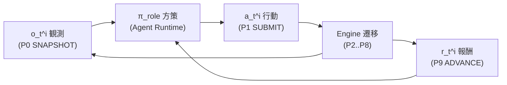
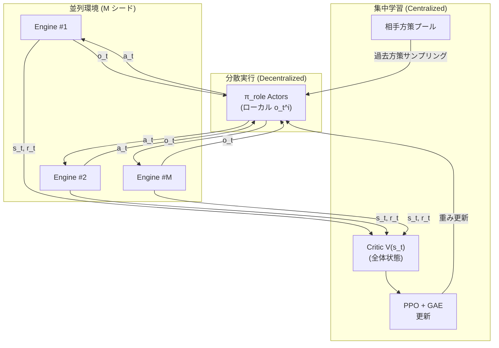
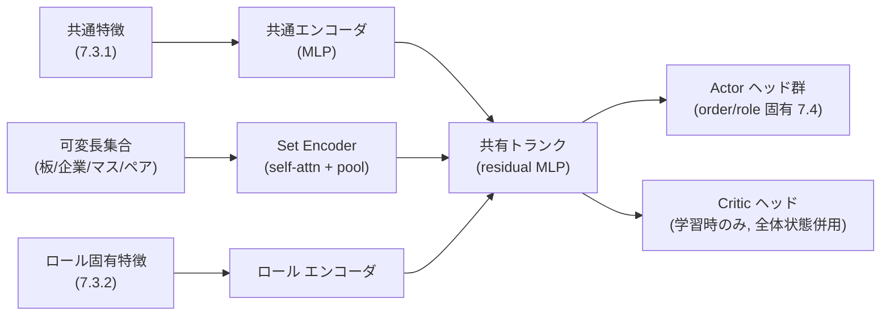

# 07. 機械学習

本書は FinBox を駆動する機械学習エージェント (`AGENT`) の学習と推論を定義する。観測空間・行動空間・報酬関数・学習方式・推論配信・評価指標を、実装可能な水準まで具体化する。横断定義 (ロール分類・ニーズ状態・WUI・ターンパイプライン・政治集約) は [00 用語集](00-glossary.md) を唯一の真実として参照し、ここでは再定義せず詳細化する。関連: [02 アーキテクチャ](02-architecture.md), [05 エージェント](05-agents.md), [06 ロール](06-roles.md), [09 市場と取引](09-markets-and-trading.md), [12 政治と統治](12-politics-and-government.md), [13 プレイヤー](13-players-and-multiplayer.md)。

## 7.1 学習目標と原則

- 目標: 各ロール ([00 0.14](00-glossary.md#014-ロール分類-role-taxonomy)) が、自身のロール固有報酬関数 (7.5) の割引累積を最大化する方策 `π_role(a|o)` を獲得すること。
- 学習パラダイム: **CTDE (集中学習・分散実行)** ([00 0.18](00-glossary.md#018-略語))。学習時はエンジン内部状態・全エージェント観測・全報酬に集中アクセスできる Critic を用い、実行 (推論) 時は各方策が自身のローカル観測のみから行動を出力する。
- サーバー権威の遵守: 学習も推論も状態を直接書き換えない。推論時の学習済み方策は **Agent Runtime** ([02](02-architecture.md)) に常駐し、エンジンの FastAPI ([14](14-api-reference.md)) を**クライアントとして**叩いて観測取得 (P0 SNAPSHOT) と行動提出 (P1 SUBMIT) のみを行う。エージェントとプレイヤーは同一インターフェース ([00 0.2](00-glossary.md#02-設計原則-design-tenets))。
- 情報非対称なし: 公開情報 (価格・板・マクロ指標・時刻) は全エンティティで同一。私的情報は自身の残高・ニーズ・スキル・企業内部状態のみ。方策は私的情報を観測に含めるが、他者の私的情報は観測できない (7.3)。
- 環境としてのエンジン: 学習はエンジンを決定論的環境 ([00 0.2](00-glossary.md#02-設計原則-design-tenets)) として多並列ロールアウトする (7.6)。1 ステップ = 1 ターン (P0→P9)。

## 7.2 強化学習の定式化

各エージェントを部分観測マルコフ決定過程 (POMDP) の主体とみなす。

- 状態 `s_t`: ターン `tick=t` 開始時 (P0) のエンジン全体状態 (Critic のみが学習時に参照)。
- 観測 `o_t^i`: エージェント `i` が P0 で取得する観測ベクトル (7.3)。
- 行動 `a_t^i`: P1 で提出する構造化行動 (7.4)。P2 VALIDATE でクランプ・棄却される。
- 遷移: エンジンが P2→P8 を決定論的に実行し `s_{t+1}` を生成。
- 報酬 `r_t^i`: P9 ADVANCE でロール別報酬関数 (7.5) により計算され、P0 の次観測に添えて配信される。
- 割引: ターン単位の割引率 `γ`(7.5.9、構成可)。目的は `E[ Σ_{k≥0} γ^k r_{t+k}^i ]` の最大化。



## 7.3 観測空間 (Observation Space)

観測は **共通特徴ブロック** (全ロール共通) と **ロール固有ブロック** の連結。すべての特徴は正規化して連結し、固定長 + 可変長 (集合) はアテンション/プーリングで畳む (7.7)。離散カテゴリは embedding、連続値は 7.3.5 の正規化を適用する。

### 7.3.1 共通特徴 (全ロール)

| 群 | 特徴 | 次元 | 出所 |
| --- | --- | --- | --- |
| self_needs | [00 0.13](00-glossary.md#013-ニーズ状態-agent-need-states) のうち `0..100` 連続値ニーズ (`satiety`..`loyalty`: `satiety`/`hydration`/`stamina`/`health`/`rest`/`happiness`/`stress`/`comfort`/`social`/`security`/`leisure`/`education`/`loyalty`) を `/100` 正規化。`skill[*]` は労働種別ごとに別スロット。`age` は self_meta、`wealth` は self_balance/WUI 換算で表現し self_needs には含めない | 〜32 | [05](05-agents.md) |
| self_balance | 自身の保有資産ベクトル。`CUR:*` (6) + 主要 `COMM`/`BOND`/`EQ` 集約。`log1p` 後 WUI 換算スケール | 〜48 | [08](08-economy-and-ledger.md) |
| self_meta | 居住セル座標 (one-hot/embedding)、所属国 (6)、ロール (one-hot)、`age`、雇用状態、所属企業有無 | 〜24 | [04](04-world-and-geography.md), [05](05-agents.md) |
| market_price | 全取引ペアの最新清算価格 (mid)・直近 OHLC・出来高・前ターン比。主要ペアを固定スロット、残りは産業別集約 | 〜96 | [09](09-markets-and-trading.md) |
| market_book | 主要ペアのトップ N 階層の板 (bid/ask 価格・累積数量)。深さ・スプレッド・インバランス指標 | 〜64 | [09](09-markets-and-trading.md) |
| macro | 国別: 名目/実質GDP・CPI・インフレ率・失業率・政策金利・FX・債務対GDP比・財政収支・貿易収支・マネーサプライ・平均幸福度・ジニ・領土マス数・軍需在庫。全世界: WUI 水準・世界GDP・世界貿易量 ([00 0.16](00-glossary.md#016-計数単位とマクロ指標-numéraire--macro-indicators)) | 〜120 | [11](11-finance-and-instruments.md), [12](12-politics-and-government.md) |
| clock | `tick`(周期エンコード)、年内月・月内ターン、四半期/年境界フラグ、定例イベント近接度 ([00 0.7](00-glossary.md#07-時間モデルの定数-time-constants)) | 〜12 | [03](03-time-and-turns.md) |

共通ブロックは全ロールが同一定義・同一スロット順を共有する (パラメータ共有のため。7.6)。

### 7.3.2 ロール固有特徴

| ロール | 追加観測 | 代表次元 |
| --- | --- | --- |
| 労働者系 (`FARMER`..`RETIREE`) | 自身の `skill[*]` 詳細、雇用提示 (賃金=`COMM:labor.*` ペア価格)、近隣求人産業構成、消費財の自セル可得性 | 〜32 |
| `ENTREPRENEUR` | 運営する各 `FIRM` の内部状態: 在庫・設備容量・産業・地域上限余裕・損益・現金・株式時価・負債・雇用充足率 ([10](10-industry-and-production.md)) | 〜64/firm |
| `INVESTOR` | 自ポートフォリオの WUI 評価・PnL 履歴・各資産保有比率・他投資家の公開ランキング順位 ([00 0.16](00-glossary.md#016-計数単位とマクロ指標-numéraire--macro-indicators), [13](13-players-and-multiplayer.md)) | 〜48 |
| `MARKET_MAKER` | 担当ペアごとの在庫・在庫価値 (前ターン比)・自提示の約定率・スプレッド・最良気配との乖離・反対玉インバランス ([09](09-markets-and-trading.md)) | 〜32/pair |
| `POLITICIAN` | 自国の国家厚生構成要素 ([12](12-politics-and-government.md))、現行政策レバー値、財政状態、他政治家の前ターン集約結果、軍事配置・領土 | 〜64 |
| `CENTRAL_BANKER` | 自国 CPI ギャップ・失業ギャップ・期待インフレ・現行政策金利・準備預金・マネーサプライ・FX ([11](11-finance-and-instruments.md)) | 〜32 |
| `BUREAUCRAT` | 国庫残高・徴税実績・補助金執行・予算配分 ([12](12-politics-and-government.md)) | 〜24 |
| `GENERAL` | 軍需在庫・部隊配置 (マスごと)・国境隣接マス・敵戦力推定・占領目標優先度 ([12](12-politics-and-government.md)) | 〜48 |
| `DIPLOMAT` | 二国間関係・関税・貿易フロー・条約状態 | 〜24 |

### 7.3.3 可変長集合の畳み込み

板の階層・複数企業・複数マス・複数取引ペアなど可変長集合は、要素ごとに同一の per-element エンコーダで埋め込み、self-attention + masked mean/max プーリングで固定長に畳む (7.7)。順序不変性とエンティティ数変動への頑健性を確保する。

### 7.3.4 マスキングと欠損

保有していない企業・割当のないペア・存在しない部隊スロットはマスクし、prefill 値ではなくマスクビットで明示する。学習時 Critic は追加で全体状態 `s_t`(全エージェント観測の連結 + エンジン内部集計) を入力に取る (7.6)。

### 7.3.5 正規化

- 価格・残高・GDP 等の正の量: `x' = sign·log1p(|x| / scale_asset)`。`scale_asset` は資産の通貨最小単位と genesis 規模から構成 ([16](16-configuration-and-initialization.md)) で与える。
- 率・比率 (インフレ率・失業率・利率・債務対GDP): そのまま、または `tanh(x / σ)` でロバスト化。
- ニーズ: `/100`。`tick`/月/ターン: 周期 (sin/cos) エンコード。
- 走行統計 (running mean/var) による標準化を学習中に更新し、推論時は凍結する。

## 7.4 行動空間 (Action Space)

行動は **連続 + 離散の混合構造化ベクトル**。方策はロール別ヘッドから各成分を出力し、P1 で提出、P2 VALIDATE でクランプ/棄却される ([00 0.11](00-glossary.md#011-ターンパイプライン-canonical-turn-pipeline))。

### 7.4.1 共通の注文ヘッド (Order Head)

全取引可能ロールが共有する。1 行動につき最大 `K_order` 件の注文スロットを出力する集合ヘッド。各注文スロット = `(pair, side, price, quantity, order_type, tif)`。

| 成分 | 型 | 範囲/エンコード |
| --- | --- | --- |
| `active` | 離散 | スロット使用 0/1 (ゲート) |
| `pair` | 離散 | 取引ペアID one-hot/embedding (ロールが許可されるペアに限定) |
| `side` | 離散 | BUY / SELL |
| `price` | 連続 | mid 相対 `p = mid · (1 + Δ)`, `Δ ∈ [-Δmax, Δmax]` を tanh で生成し price tick へ丸め ([09](09-markets-and-trading.md)) |
| `quantity` | 連続 | `q = round(σ · cap)`, `σ ∈ [0,1]`、`cap` は残高/与信から算出 |
| `order_type` | 離散 | LIMIT / MARKET / IOC / FOK ([00 0.19](00-glossary.md#019-注文種別と-tif-order-type--time-in-force), [09](09-markets-and-trading.md)) |
| `tif` | 離散 | GFT(既定) / GTC / GTT (`expires_tick` 付随) ([00 0.19](00-glossary.md#019-注文種別と-tif-order-type--time-in-force), [09](09-markets-and-trading.md)) |

### 7.4.2 ロール固有ヘッド

| ロール | 追加ヘッド | 構造 |
| --- | --- | --- |
| 労働者系 | labor_supply: 供給する `COMM:labor.*` 種別 (離散) + 供給量 `∈[0,1]·max_labor`(連続)。consumption: 各消費財カテゴリへの予算配分 (ALLOCATION、softmax) ([05](05-agents.md)) | 連続+離散 |
| `ENTREPRENEUR` | firm_op: 企業ごとに {生産計画 (レシピ別投入割当 ALLOCATION)、設備拡張投資 (建設労働力購入量)、雇用目標 (`COMM:labor.*` 別)、価格設定、増資/自社株買い/配当、設立/清算} ([10](10-industry-and-production.md)) | 混合 |
| `INVESTOR` | order_head のみ (全資産クラス) + 任意のレバレッジ/空売り上限内ポジション ([11](11-finance-and-instruments.md)) | 連続+離散 |
| `MARKET_MAKER` | quote_head: 担当ペアごとに {bid_offset, ask_offset, quote_size, skew} を連続出力 → 両側指値を生成 ([09](09-markets-and-trading.md)) | 連続 |
| `POLITICIAN` | vote_vec: 各政策レバーへの提案値。SCALAR=値、BINARY=`[0,1]`、CATEGORICAL=選択肢スコア、ALLOCATION=正規化重み ([00 0.12](00-glossary.md#012-政治意思決定の集約規則-political-aggregation), [12](12-politics-and-government.md)) | 混合 |
| `CENTRAL_BANKER` | policy_rate (連続, bps)、公開市場操作量 (連続)、準備率 (連続) ([11](11-finance-and-instruments.md)) | 連続 |
| `BUREAUCRAT` | 予算執行配分 (ALLOCATION)、補助金率 ([12](12-politics-and-government.md)) | 連続 |
| `GENERAL` | mil_cmd: 目標マス選択 (離散、隣接条件)、投入軍需品量 (連続)、防御/前進モード ([12](12-politics-and-government.md)) | 混合 |
| `DIPLOMAT` | 関税提案・条約提案 (CATEGORICAL/BINARY) | 離散 |

### 7.4.3 行動の正規化と P2 クランプ

- 方策は正規化空間 (tanh/softmax/sigmoid) で出力し、エンジン物理単位へ写像する。
- P2 VALIDATE は: 残高超過の数量を可得分へクランプ、price tick へ丸め、ロール非許可の行動を棄却、隣接条件違反 (軍事) を棄却、政治提案を政策レンジへクランプ ([00 0.12](00-glossary.md#012-政治意思決定の集約規則-political-aggregation))。
- クランプ/棄却された差分は方策へ `info` として返し、無効行動シェーピング (7.5.10) の学習信号に使う。

## 7.5 報酬関数 (Reward Functions)

報酬は P9 ADVANCE で計算 ([00 0.11](00-glossary.md#011-ターンパイプライン-canonical-turn-pipeline))。各式は正規化前の生報酬を定義し、正規化は 7.5.9 に従う。記号: `Δx = x_t − x_{t-1}`。重み `w_*`、係数は構成 ([16](16-configuration-and-initialization.md)) で与える既定値。WUI 換算純資産を `W_i`(エンティティ `i` の全資産を最新清算価格でマークし WUI へ換算、[00 0.16](00-glossary.md#016-計数単位とマクロ指標-numéraire--macro-indicators))。

### 7.5.1 WORKER (労働者系)

ニーズ充足の加重和 + 生存ボーナス + 富成長 − 死亡ペナルティ。

```
r_worker = Σ_n w_n · need_n,t / 100          # ニーズ充足 (n ∈ N_consume)
         + b_alive                            # 生存ボーナス (毎ターン生存で +b_alive)
         + w_wealth · tanh(ΔW_i / scale_w)    # 富成長 (WUI 純資産増分)
         − D_death · 1[died at t]             # 死亡ペナルティ (終端)
```

`N_consume` は [00 0.13](00-glossary.md#013-ニーズ状態-agent-need-states) のうち消費で回復する `0..100` スケールのニーズ (`satiety`..`loyalty`) に限定し、`wealth` と `age` を除外する: `{satiety, hydration, stamina, health, rest, happiness, stress(逆符号), comfort, social, security, leisure, education, loyalty}`。`stress` は負荷ニーズのため `need_stress = (100 − stress)/100` の逆値 (`stress_inv`) で組み込む。富成長は `w_wealth` 項のみで表現し `N_consume` に `wealth` を、`age` も含めないことで二重計上とスケール不整合を排除する。`b_alive>0`、`D_death ≫ 0` で生存最優先を担保する。

### 7.5.2 INVESTOR (投資家)

WUI 純資産リターン + 他投資家との相対順位ボーナス。

```
r_inv = w_ret · (ΔW_i / W_{i,t-1})                    # WUI 純資産リターン (相対変化)
      + w_rank · (1 − 2·(rank_i − 1)/(N_inv − 1))     # 相対順位 (1位=+1, 最下位=−1)
      − w_dd · max(0, drawdown_i)                     # ドローダウン抑制 (任意)
```

`rank_i` は全投資家 (`AGENT`+`PLAYER`) を `W_i` で降順順位付け ([13](13-players-and-multiplayer.md))。`N_inv` は投資家総数。順位は WUI で通貨横断に一貫させる ([00 0.16](00-glossary.md#016-計数単位とマクロ指標-numéraire--macro-indicators))。

### 7.5.3 MARKET_MAKER (マーケットメイカー)

**在庫価値の毀損回避を最優先**。資産増加より「減らさないこと」を重視する (構想メモ準拠)。

```
r_mm = − w_loss · max(0, −ΔV_inv) / scale_v     # 在庫価値毀損 (下落のみ非対称に強く罰する)
      + w_gain · max(0, ΔV_inv) / scale_v        # 在庫価値増加 (弱く報いる, w_gain ≪ w_loss)
      − w_spread · Σ_pair spread_pair / mid_pair  # スプレッドの狭さ (狭いほど報酬大)
      + w_fill · fill_ratio_t                     # 約定したターン比率 (両側約定で最大)
      − w_dev · Σ_pair |quote_mid_pair − market_mid_pair| / market_mid_pair  # 他注文との乖離抑制
```

`ΔV_inv` は担当全ペアの在庫を最新清算価格でマークした価値変化。非対称重み `w_loss ≫ w_gain` により毀損回避を優先する。`fill_ratio_t` = 当ターンに少なくとも片側が約定したペア比率 (両側約定を加点)。`spread_pair` は自提示の bid-ask 幅。

### 7.5.4 ENTREPRENEUR (経営者)

企業利益 + 株式時価 + 成長 − 倒産ペナルティ。経営する全企業 `f ∈ F_i` を集約。

```
r_ent = Σ_f [ w_profit · tanh(profit_{f,t} / scale_p)         # ターン純利益
            + w_mktcap · tanh(Δ(price_eq_f · shares_f) / scale_m)  # 株式時価の増分
            + w_growth · tanh(Δcapacity_f / scale_c) ]         # 設備容量の成長
        − D_bankrupt · 1[firm f bankrupt at t]                 # 倒産ペナルティ
```

`profit_f` = 売上 − 投入費 − 賃金 − 利息 − 税。倒産 (清算 [10](10-industry-and-production.md)) は当該企業に強い負報酬。配当は投資家への移転であり経営者報酬では二重計上しない (時価と利益で反映)。

### 7.5.5 POLITICIAN (政治家)

自国の**国家厚生関数** ([12](12-politics-and-government.md) と整合)。当該政治家が配属された国 `c` の厚生スコアの増分とレベルの加重和。

```
welfare_c = w_gdp · gdp_growth_c          # 実質GDP成長率
          + w_emp · (1 − unemployment_c)   # 雇用 (低失業)
          + w_happy · avg_happiness_c       # 平均幸福度
          + w_price · price_stability_c     # 物価安定 (= 1 − |inflation_c − target| / band)
          + w_fisc · fiscal_sustainability_c # 財政持続性 (= f(debt_to_gdp_c, deficit_c))
          + w_terr · territory_c            # 領土マス数 (正規化)
          + w_sec · security_c              # 安全保障 (軍需在庫・治安・国境安定)

r_pol = welfare_c,t  +  w_dwelfare · (welfare_c,t − welfare_c,t-1)
```

国家厚生の構成・各係数の正準定義は [12 政治と統治](12-politics-and-government.md) の国家厚生節に一致させる (本書はその参照表現)。`price_stability` は中央銀行のインフレ目標バンドを基準とする ([11](11-finance-and-instruments.md))。

### 7.5.6 CENTRAL_BANKER (中央銀行家)

**デュアルマンデート (物価安定 + 雇用)**。二乗ギャップの負和。

```
r_cb = − w_cpi · (inflation_c − π_target)^2 / scale_cpi
       − w_unemp · max(0, unemployment_c − u_natural)^2 / scale_u
       − w_vol · rate_change_penalty                # 政策金利の過度な変動抑制
```

`π_target` はインフレ目標、`u_natural` は自然失業率 (構成 [16](16-configuration-and-initialization.md))。GENERAL とは独立に自国マクロのみを評価する。

### 7.5.7 GENERAL (将官)

領土 + 安全保障。

```
r_gen = w_gain · Δterritory_c                 # 占領による領土増分
      − w_loss · max(0, −Δterritory_c)         # 失地ペナルティ (非対称に強い)
      + w_sec · security_c                      # 自国安全保障レベル
      − w_cost · munitions_consumed_t / scale_mil  # 軍需品消費コスト
```

軍需品は [00 0.10](00-glossary.md#010-市場決済とプロトコル移転-market-settlement-vs-protocol-transfers) のプロトコル移転で消費・消滅し、P8 MILITARY で戦闘解決する。

### 7.5.8 その他ロール

- `BUREAUCRAT`: 自国財政持続性 + 予算執行効率 + 平均幸福度 (POLITICIAN 厚生のうち財政・公共サービス部分を主)。
- `DIPLOMAT`: 自国貿易収支改善 + 二国間関係安定 + 関税収入と消費者余剰のバランス。
- `STUDENT`/`UNEMPLOYED`/`RETIREE`: WORKER 式の富成長項 (`w_wealth`) を弱め、`education`/`health`/`security` 充足と生存 (`b_alive`/`D_death`) を重視する係数プリセット。

### 7.5.9 正規化・割引・シェーピング

- 報酬正規化: ロールごとに走行統計で報酬を標準化 (`r' = (r − μ_role)/σ_role`)、または PopArt によるリターン正規化で Critic スケールを安定化する。
- 割引率 `γ`: ターン単位。既定 `γ = 0.997`(構成可)。長期視野ロール (POLITICIAN/ENTREPRENEUR/INVESTOR) は `γ = 0.999`、短期ロール (WORKER/MARKET_MAKER) は `γ = 0.99` をプリセットとする ([16](16-configuration-and-initialization.md))。
- GAE: 利得推定は GAE(`λ=0.95`)。
- ポテンシャルベース・シェーピング: `F = γ·Φ(s') − Φ(s)` 形式のみ採用し、最適方策を変えない。WORKER のニーズは `Φ = Σ w_n·need_n/100` を整形項にできる。

### 7.5.10 行動妥当性シェーピング

P2 でクランプ/棄却された行動には小さな負シェーピング `− w_invalid · invalid_fraction_t` を加え、実行可能な行動の学習を促す。終端 (死亡/倒産/清算) は対応する `D_*` を一度だけ与え、以後そのエージェントのエピソードを終了する。

## 7.6 学習方式 (Training)

### 7.6.1 アルゴリズム

- 基幹: **PPO (Actor-Critic, clipped surrogate)**。混合行動空間に対し、各行動ヘッドの対数尤度を合算した同時方策で更新する。
- CTDE: 学習時 Critic は中央集権価値 `V(s_t, role)` を全体状態 `s_t`(全エージェント観測連結 + エンジン集計マクロ + 相手方策の identity) から推定。Actor はローカル観測 `o_t^i` のみ。実行時は Actor のみ配信。
- 連続成分: 対角ガウス (tanh squashing)。離散成分: カテゴリ分布。集合ヘッド (注文): スロットごとに `active` ゲート + 条件付き分布、エントロピー正則化でスロット崩壊を防ぐ。

### 7.6.2 パラメータ共有と個体差

- 同一ロールはネットワーク重みを共有 (パラメータ共有) し、サンプル効率を上げる。
- 個体差は観測で表現する: `self_meta` に含む個体埋め込み (`agent_id` ハッシュ → 学習可能 embedding)、スキル・年齢・国・資産が方策を分岐させる。重みは共有しつつ行動は個体化する。
- ロール間は共通エンコーダ (共通特徴ブロック 7.3.1) を共有し、ロール固有エンコーダ + ヘッドを分岐するマルチヘッド構造 (7.7)。

### 7.6.3 セルフプレイと多並列ロールアウト

- エンジンを環境として `M` 個の独立世界 (異なるシード [00 0.2](00-glossary.md#02-設計原則-design-tenets)) を並列実行し、全エージェントの遷移を収集する。
- 全ロールが同時に学習する **セルフプレイ**。市場の対戦相手・政治の対立も学習中エージェントどうしで構成する。
- 相手方策プール (過去チェックポイント) を一定確率で混在させ、過適合・非定常性を緩和する (fictitious self-play 的サンプリング)。
- ロールアウトは P1 SUBMIT に向けてバッチ推論し、エンジンの 1 ターン進行ごとに `(o, a, r, o')` を蓄積する。

### 7.6.4 カリキュラム学習

単純経済から複雑化へ段階的に解禁する ([16](16-configuration-and-initialization.md) のシナリオで構成)。

| 段階 | 解禁範囲 | 目的 |
| --- | --- | --- |
| C0 | 1国・労働と財の現物市場のみ・固定価格なし | WORKER の生存とニーズ充足、基本的な板取引 |
| C1 | 企業・生産レシピ・雇用市場 | ENTREPRENEUR の生産/雇用、供給連鎖 |
| C2 | 金融商品 (国債・株式・社債)・MARKET_MAKER | 流動性供給・資本市場・INVESTOR |
| C3 | 政治・財政金融政策・中央銀行 | POLITICIAN/CENTRAL_BANKER/BUREAUCRAT のマクロ制御 |
| C4 | 6国・FX・関税・軍事・領土 | DIPLOMAT/GENERAL・国際経済・地政学 |

各段階で前段の方策を初期化に用い (継続学習)、KPI (7.8) が安定したら次段へ進める。



### 7.6.5 推論配信 (Inference Serving)

- 学習で凍結した Actor 重みを **Agent Runtime** ([02](02-architecture.md)) へ配置し、各 `AGENT` の方策として常駐させる。
- 推論時はエンジンの公開 API ([14](14-api-reference.md)) を叩く: P0 で観測取得 → ローカル前処理 (7.3.5 凍結統計) → 方策推論 → P1 で行動提出。Critic は推論に不要。
- 走行統計・個体 embedding は重みに同梱して凍結。決定論再現のため推論は構成で greedy/サンプリングを選択可能。

## 7.7 ネットワーク構造



- 共通エンコーダはロール横断で重み共有 (7.6.2)。集合は Set Encoder で順序不変に畳む (7.3.3)。
- Actor は混合分布ヘッド、Critic は中央集権価値 (CTDE)。系列依存が必要な場合はトランクに GRU/Transformer メモリを挿入し、`tick` 周期特徴で時間文脈を補う。

## 7.8 評価 (Evaluation)

### 7.8.1 ロール別 KPI

| ロール | 主要 KPI |
| --- | --- |
| WORKER | 平均生存ターン数、ニーズ充足平均、`wealth` 中央値、餓死/病死率 |
| INVESTOR | WUI リターン (年率換算)、シャープ比、最終順位分布、最大ドローダウン |
| MARKET_MAKER | 在庫価値毀損率 (損失日比率)、平均スプレッド、約定ターン比率、最良気配乖離 |
| ENTREPRENEUR | 企業生存率、平均利益率、株式時価成長、倒産率 |
| POLITICIAN | 国家厚生スコア、GDP成長、失業率、インフレ偏差、債務対GDP比 |
| CENTRAL_BANKER | インフレ目標乖離、失業ギャップ、政策金利ボラティリティ |
| GENERAL | 純領土変化、安全保障レベル、軍需消費効率 |

### 7.8.2 経済安定性指標

- 価格安定: CPI ボラティリティ、ハイパーインフレ/デフレスパイラル発生率。
- 市場健全性: 平均板深さ・スプレッド・約定率、流動性枯渇イベント頻度 ([09](09-markets-and-trading.md))。
- 保存則検証: 全ターンで [00 0.17](00-glossary.md#017-保存則と不変条件-invariants) (整数・非負・資産保存・二重仕訳) が成立すること (違反は学習を止める致命検知)。
- 分配: ジニ係数推移、貧困 (ニーズ恒常未充足) 人口比。
- マクロ整合: GDP・雇用・物価・貿易収支の相互整合と長期定常性。

### 7.8.3 対人評価

- 人間プレイヤー ([13](13-players-and-multiplayer.md)) を投資家として参加させ、AI 投資家との WUI 順位・リターンを比較する。
- 凍結方策プール (世代別) とのリーグ戦で Elo 様レーティングを算出し、退行 (リグレッション) を検知する。
- アブレーション: 観測ブロック除去・報酬項除去による方策性能差で、特徴・報酬設計の寄与を測る。
