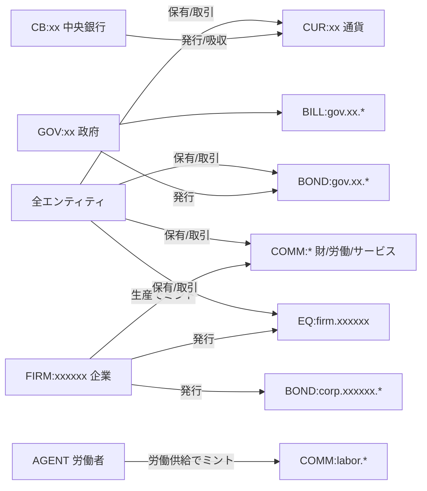
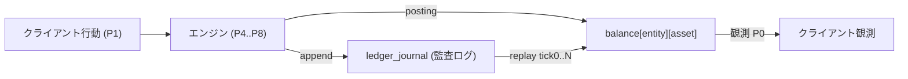
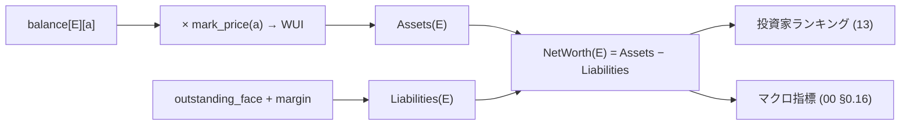
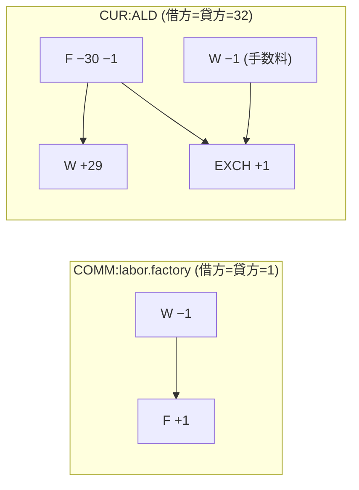

# 08. 経済と台帳

本書は FinBox の経済の基盤、すなわち **Tradable Assets の全体像**・**共通台帳 (二重仕訳)**・**整数不変条件**・**市場決済とプロトコル移転の会計**・**保存則**・**純資産評価** を実装可能な水準で定義する。横断定義は [00 用語集と正準仕様](00-glossary.md) を唯一の真実とし、本書はそれを参照・詳細化する。市場の板寄せ機構は [09 市場と取引](09-markets-and-trading.md)、生産レシピと能力拡張は [10 産業と生産](10-industry-and-production.md)、金融商品と中央銀行は [11 金融と金融商品](11-finance-and-instruments.md)、正準データスキーマは [15 データモデル](15-data-model.md) を参照する。

## 8.1 経済モデルの位置づけ

FinBox の経済は、ただ1つの整数台帳の上に構築される閉じた会計系である。すべての価値の保有・移動・生成・消滅は台帳エントリとして記録され、エンジンは各ターン (P0..P9, [00 §0.11](00-glossary.md)) においてこの台帳を権威的に更新する。クライアント (エージェント・プレイヤー) は台帳を直接書き換えられず、API 経由で観測 (残高・板・指標) を取得し行動 (注文・生産計画・移転トリガー) を提出するのみである ([02 アーキテクチャ](02-architecture.md))。

経済を流れるものは2種類しかない。ひとつは **Tradable Assets** (通貨・財・労働力・サービス・債券・株式) であり台帳の列を構成する。もうひとつは台帳に乗らない**内部状態** (エージェントのニーズ値 `satiety`/`health` 等, [00 §0.13](00-glossary.md)) であり、これは消費 (P6) によって財・サービスを消滅させた結果として回復するが、それ自体は移転・取引の対象にならない。本書が扱うのは前者、台帳上の Tradable Assets の会計である。

経済の駆動原理は次の3点に集約される。第一に、エンティティ間の**自発的な**資産移動はすべて公開市場の板寄せ約定 (P4 CLEAR) を通る。第二に、ルールが定める**義務的な**移転 (徴税・利払・配当・通貨発行・軍需消費・清算・genesis 配賦) は市場を経由しないプロトコル移転として処理される。第三に、財の**生成と消滅**は生産 (P5)・消費 (P6)・軍事 (P8) でのみ起こり、これは移転ではなくミント/バーンとして記録される。この3経路の外で資産が動くことはない。

## 8.2 Tradable Assets 全体像

Tradable Assets はすべて `asset_id = <CLASS> ":" <path>` を持つ ([00 §0.5](00-glossary.md))。クラスと名前空間は用語集で固定されており、本書はこれを再定義せず会計上の性質を詳細化する。各資産がどこでミント (生成) されどこでバーン (消滅) するかが、保存則 (8.9) の基礎となる。

### 8.2.1 資産クラスと会計上の性質

| クラス | 会計上の意味 | ミント点 | バーン点 | 発行体の負債か |
| --- | --- | --- | --- | --- |
| `CUR` | 法定通貨。すべての価格の建値と決済手段 | 中央銀行の発行 (P7) | 中央銀行の吸収 (P7) | CB の負債 (8.9.1) |
| `COMM` | 資源・中間財・最終財・労働力・サービス・軍需品 | 生産 (P5) | 消費/投入 (P5/P6)・軍事 (P8) | 負債でない (純資産項目) |
| `BOND` | 中長期債券 (国債 `gov`・社債 `corp`) | 発行 (P4 市場) | 償還/買戻 (P7/P4) | 発行体の負債 (8.7) |
| `BILL` | 短期割引証券 (国庫短期証券)。`BOND` の短期・割引版 | 発行 (P4 市場) | 償還 (P7) | 発行体の負債 (8.7) |
| `EQ` | 株式 (企業の持分・残余請求権) | 設立/増資 (P4) | 自社株買い/清算 (P4/P7) | 発行体の純資産 (負債でない) |
| `FUT` | 先物 (拡張・任意) | 限月の建て (P4) | 満期/反対売買 (P4) | 想定元本はネットゼロ (8.7.4) |

> 注 (CUR mint/burn フェーズ): 公開市場操作 (OMO) では、買入/売却対象の債券 (`BOND`/`BILL`) の現物授受は P4 市場の板寄せ約定 (`trade_id`) として記帳され、その対価となる `CUR` の mint/burn は P7 FISCAL で `mint_id` として確定する ([11 §11.3.3](11-finance-and-instruments.md))。すなわち債券授受 = P4、対価通貨の生成/消滅 = P7 とフェーズが分離する。本表の「ミント点/バーン点 = P7」は後者 (`CUR` の総量変化) を指す。

### 8.2.2 `COMM` 名前空間の会計区分

`COMM` の名前空間 (`agri`/`raw`/`energy`/`mat`/`good`/`labor`/`svc`/`build`/`mil`) は [00 §0.5.2](00-glossary.md) で定義済みである。会計上は次の3区分が重要である。

- **貯蔵性財 (storable)**: `agri.*`/`raw.*`/`mat.*`/`good.*`/`build.*`/`mil.*`/`energy.fuel`。在庫として翌ターンへ繰り越せる。台帳残高は P9 を跨いで保持される。
- **消滅性財 (perishable)**: `labor.*`/`svc.*`/`energy.electricity`。生産ターン中に消費・投入されなければ P9 ADVANCE で強制バーンされる (8.9.4)。在庫繰越不可。
- **資本財 (capital-forming)**: `build.construction_labor`。建設業の産出物であり、企業が購入・消費して設備・生産能力を拡張する (P5, [10](10-industry-and-production.md))。投入財の `labor.build` (建設労働者の労働力) とは別物であり混同しない ([00 §0.5.2](00-glossary.md) の注記)。

`COMM` の production tree (抽出 → 加工 → 最終財) の俯瞰は [10 産業と生産](10-industry-and-production.md) に委ねる。本書では production tree の各段で財がミント/バーンされるという会計事実のみを扱う。

### 8.2.3 性質フラグの正準定義

各 `asset_id` は次のブール属性を持つ。値は [00 §0.5.3](00-glossary.md) に従い、構成 ([16](16-configuration-and-initialization.md)) で資産追加時に指定する。

| フラグ | 真となる資産 | 会計上の帰結 |
| --- | --- | --- |
| `storable` | 8.2.2 の貯蔵性財・`CUR`・`BOND`/`BILL`/`EQ`/`FUT` | P9 を跨いで残高保持 |
| `perishable` | `labor.*`・`svc.*`・`energy.electricity` | P9 で未使用分を強制バーン |
| `integer` | すべての資産 (例外なし) | 数量は非負整数 ([00 §0.8](00-glossary.md)) |

> 注: `CUR`/`BOND`/`BILL`/`EQ`/`FUT` は明示的なバーン点 (償還・買戻・清算・吸収) を持つため `perishable` ではない。perishable は生産系 `COMM` の一部に限られる。

## 8.3 ID 体系 (entity_id と asset_id)

台帳は `balance[entity_id][asset_id]` の二次元写像である。両 ID は用語集で正準定義されており、本書は再定義しない。

- **entity_id**: 残高保有・取引・生産・消費の主体。`AGENT:<6桁>`・`FIRM:<6桁>`・`GOV:<country_code>`・`CB:<country_code>`・`PLAYER:<6桁>`・`EXCH`。完全な表は [00 §0.4](00-glossary.md)。
- **asset_id**: `<CLASS>:<path>`。クラス `CUR`/`COMM`/`BOND`/`EQ`/`BILL`/`FUT` と `COMM` 名前空間は [00 §0.5](00-glossary.md)。

エンティティと資産の関係 (どのエンティティがどの資産をミント/保有できるか) は次の通り。これは権限ではなく会計構造の制約である。



## 8.4 共通台帳モデル (Common Ledger)

### 8.4.1 残高と二重仕訳

台帳の状態は `balance[entity_id][asset_id] = 非負整数` ([00 §0.9](00-glossary.md))。存在しないキーは残高 0 とみなす。台帳の状態を変える唯一の手段は **posting (記帳)** であり、すべての posting は **二重仕訳 (double-entry)** で表現される。1件の posting は、ある資産 `asset_id` について借方 (debit, 減少側) 合計と貸方 (credit, 増加側) 合計が一致する仕訳行の集合である。

正準なデータ構造を擬似コードで示す (詳細スキーマは [15](15-data-model.md))。

```
LedgerLine:
  asset_id: str
  from_entity: entity_id | MINT          # MINT は新規生成 (発行体側の起点)
  to_entity:   entity_id | BURN          # BURN は消滅 (発行体側の終点)
  quantity:    int  (> 0)

Posting:
  posting_id: int                        # 単調増加の通し番号
  tick:       int                        # 記帳されたターン
  phase:      "P4"|"P5"|"P6"|"P7"|"P8"   # どのフェーズの記帳か
  cause:      Cause                       # 原因識別子 (8.4.2)
  lines:      LedgerLine[]                # 1本以上の仕訳行
```

各 `Posting` は不変条件として、含まれる各 `asset_id` ごとに「`from_entity` が実体エンティティである行の `quantity` 合計」と「`to_entity` が実体エンティティである行の `quantity` 合計」が、`MINT`/`BURN` 行を除いて一致しなければならない (8.6 の検証)。`MINT` を起点とする行はその資産の総量を増やし、`BURN` を終点とする行は減らす。それ以外の通常移転は総量を保存する。

### 8.4.2 原因識別子 (Cause)

すべての posting は原因を持ち監査可能でなければならない ([00 §0.9](00-glossary.md))。原因識別子は次の判別共用体とする。

| cause 種別 | 発生フェーズ | 主な内容 |
| --- | --- | --- |
| `trade_id` | P4 | 板寄せ約定1件 (買方・売方・EXCH 手数料) |
| `production_id` | P5 | 生産1件 (投入バーン・産出ミント・能力拡張) |
| `consumption_id` | P6 | 消費1件 (財/サービスのバーン) |
| `transfer_id` | P7 | プロトコル移転1件 (徴税・利払・配当・補助金) |
| `mint_id` | P7 | 通貨発行/吸収1件 (中央銀行) |
| `military_id` | P8 | 軍需品消費・戦闘解決による消滅 |
| `liquidation_id` | P4/P7 | 倒産清算の残余分配 |
| `genesis_id` | P-init | 初期エンドウメント配賦 ([16](16-configuration-and-initialization.md)) |

### 8.4.3 監査ログ

各 `Posting` は append-only の監査ログ `ledger_journal` に追記される。ログは決定論的に再生可能で、`tick=0` から任意の tick までの全 posting を順に適用すれば現在の `balance` が再構成される (再現性, [00 §0.17](00-glossary.md))。クライアントは API 経由で自身が関与した posting (`from_entity` か `to_entity` が自身) を照会できる ([14 API](14-api-reference.md))。ログのフィールド定義・索引は [15 データモデル](15-data-model.md)。



## 8.5 整数・価格・決済の不変条件

[00 §0.8](00-glossary.md)/[§0.9](00-glossary.md)/[§0.17](00-glossary.md) の不変条件を会計の言葉で再述する。これらは P2 VALIDATE と P4..P8 の各記帳で強制される。

- **数量整数**: すべての `LedgerLine.quantity` および `balance` 値は非負整数。小数・分数は存在しない。
- **価格の表現**: 価格 `price` は「`quote` 通貨の最小単位 / `base` 1単位」を表す整数 (price tick)。約定の現金移動は `cash = price × quantity` の厳密な整数であり端数は発生しない ([00 §0.8](00-glossary.md), [09](09-markets-and-trading.md))。
- **非負残高**: いかなる posting も、適用後に `balance[entity][asset] < 0` となってはならない。現物の空売りは禁止 (信用ポジションは `BOND`/`FUT` の発行体側負債として表現し、現物 `COMM`/`CUR` 残高は負にしない)。
- **手数料の整数性**: 取引手数料は `fee = ceil(cash × fee_rate)` の整数で `EXCH` が収受する ([00 §0.8](00-glossary.md))。手数料も二重仕訳で記帳され、現金総量を保存する (8.6.1)。

### 8.5.1 約定の現金保存

1件の市場約定では、買方が支払う現金と売方が受け取る現金 (および EXCH が受け取る手数料) の合計が一致する。`CUR` の総量は約定で変化しない (移転であってミント/バーンでない)。

```
cash       = price × quantity
fee_buy    = ceil(cash × fee_rate)
fee_sell   = ceil(cash × fee_rate)
買方の現金支出 = cash + fee_buy
売方の現金受取 = cash − fee_sell
EXCH の現金受取 = fee_buy + fee_sell
```

買方支出 = 売方受取 + EXCH受取 が常に成立し、`CUR` 総量は保存される。手数料率の既定・徴収方式は [09](09-markets-and-trading.md) に従う。

## 8.6 市場決済 vs プロトコル移転

資産がエンティティ間を移動・生成・消滅する経路は **市場決済** と **プロトコル移転** の2種のみ ([00 §0.10](00-glossary.md))。両者はいずれも二重仕訳で記帳されるが、起点が異なる。市場決済は参加者の自発的注文の板寄せ結果であり、プロトコル移転はルールが定める義務的な移転である。

### 8.6.1 市場決済の会計 (P4 CLEAR)

P4 で各取引ペアの板寄せが約定すると、約定ごとに `trade_id` を原因とする posting が記帳される。`base` 資産と `quote` 通貨の双方について借方=貸方が成立する。例として、買方 `B` が売方 `S` から `COMM:good.food` を 10 単位、価格 5 (`CUR:ALD` 最小単位/食料1単位)、手数料率 1% で取得する約定を示す。

| asset_id | from (借方) | to (貸方) | quantity |
| --- | --- | --- | --- |
| `COMM:good.food` | `S` | `B` | 10 |
| `CUR:ALD` | `B` | `S` | 50 |
| `CUR:ALD` | `B` | `EXCH` | 1 |
| `CUR:ALD` | `S` | `EXCH` | 1 |

`cash = 5×10 = 50`、`fee = ceil(50×0.01) = 1`。`CUR:ALD` の借方合計 (B:50+1, S:1 = 52) と貸方合計 (S:50, EXCH:2 = 52) は一致し総量保存。`good.food` も借方=貸方=10 で保存。

### 8.6.2 プロトコル移転の会計 (P7/P8/P4)

プロトコル移転は [00 §0.10](00-glossary.md) で列挙された義務的移転に限定される。以下に各移転の正準な会計仕訳を示す。すべて二重仕訳であり、移転 (総量保存) かミント/バーン (総量変化) かを明示する。徴税・利払・配当・補助金は P7 FISCAL、軍需消費は P8 MILITARY、発行・償還・清算の現物授受は文脈に応じ P4/P7 で記帳される。

#### 徴税 (所得税・法人税・消費税) — `transfer_id` / P7

納税者 `E` から政府 `GOV:xx` への現金移転 (総量保存)。課税標準・税率は [12 政治と統治](12-politics-and-government.md)。

| asset_id | from | to | quantity |
| --- | --- | --- | --- |
| `CUR:xx` | `E` | `GOV:xx` | `tax_amount` |

#### 関税 — `transfer_id` / P7

輸入者 `E` から輸入先国政府 `GOV:xx` への現金移転 (総量保存)。関税は P4 で成立した越境約定に対し P7 で課される。課税対象・税率は [12](12-politics-and-government.md)。

| asset_id | from | to | quantity |
| --- | --- | --- | --- |
| `CUR:xx` | `E` | `GOV:xx` | `tariff_amount` |

#### 国債/社債クーポン支払 — `transfer_id` / P7

発行体 (`GOV:xx` または `FIRM:nnnnnn`) から保有者 `H` への現金移転 (総量保存)。クーポン額は `coupon = ceil(face × r_turn)`、`r_turn = r_annual / TURNS_PER_YEAR` ([00 §0.7](00-glossary.md))。計算詳細は [11](11-finance-and-instruments.md)。

| asset_id | from | to | quantity |
| --- | --- | --- | --- |
| `CUR:xx` | 発行体 | `H` | `coupon` |

#### 元本償還 — `transfer_id` (現金) + バーン (証券) / P7

満期到来時、発行体が保有者へ額面現金を支払い (移転)、対応する `BOND`/`BILL` を保有者の手元からバーンする (総量減)。`BILL` は割引証券のため発行時に額面未満で売られ、償還で額面を払う (利息は額面と発行価格の差)。

| asset_id | from | to | quantity | 種別 |
| --- | --- | --- | --- | --- |
| `CUR:xx` | 発行体 | `H` | `face` | 移転 |
| `BOND:...` | `H` | `BURN` | `n` | バーン |

#### 配当 — `transfer_id` / P7

企業 `FIRM:nnnnnn` から株主 `H_i` への現金移転 (総量保存)。1株あたり配当 `dps` を保有株数 `q_i` に乗じる。原資は企業の留保現金、割当規則は [11](11-finance-and-instruments.md)。

| asset_id | from | to | quantity |
| --- | --- | --- | --- |
| `CUR:xx` | `FIRM:nnnnnn` | `H_i` | `dps × q_i` |

#### 補助金・社会保障・失業給付 — `transfer_id` / P7

政府 `GOV:xx` から受給者 `E` への現金移転 (総量保存)。支給条件・額は [12](12-politics-and-government.md)。

| asset_id | from | to | quantity |
| --- | --- | --- | --- |
| `CUR:xx` | `GOV:xx` | `E` | `benefit_amount` |

#### 通貨発行/吸収 — `mint_id` / P7

中央銀行 `CB:xx` による `CUR:xx` のミント/バーン (総量変化)。発行は CB を起点とする MINT、吸収は CB を終点とする BURN。会計的には CB の負債計上/取消に対応する (8.9.1)。公開市場操作では、買入対象資産 (国債等) の授受自体は P4 市場経由でもよく、その現金注入部分が本 mint である ([00 §0.10](00-glossary.md), [11](11-finance-and-instruments.md))。

| asset_id | from | to | quantity | 種別 |
| --- | --- | --- | --- | --- |
| `CUR:xx` | `MINT` | `CB:xx` | `m` | 発行 |
| `CUR:xx` | `CB:xx` | `BURN` | `m` | 吸収 |

#### 軍需品消費 — `military_id` / P8

戦闘解決で軍需品 `COMM:mil.munitions` を消費し消滅させる (バーン、総量減)。攻撃主体 (`GOV:xx` または指揮下の `FIRM`/部隊) の在庫から差し引く。戦闘解決規則は [12](12-politics-and-government.md)。

| asset_id | from | to | quantity | 種別 |
| --- | --- | --- | --- | --- |
| `COMM:mil.munitions` | `GOV:xx` | `BURN` | `k` | バーン |

#### 倒産清算 — `liquidation_id` / P4・P7

企業 `FIRM:nnnnnn` の清算では、まず保有資産 (在庫 `COMM`・有価証券) を P4 市場で売却して現金化し、得た現金を弁済順位 (税・賃金 → 担保債権 → 一般債権 (社債) → 株主) に従い債権者・株主へ分配する (移転)。最後に残った `EQ:firm.nnnnnn` をバーンする。順位と按分は [10](10-industry-and-production.md)/[11](11-finance-and-instruments.md)。

| asset_id | from | to | quantity | 種別 |
| --- | --- | --- | --- | --- |
| `CUR:xx` | `FIRM:nnnnnn` | 債権者/株主 | 弁済順位に従う | 移転 |
| `EQ:firm.nnnnnn` | 全保有者 | `BURN` | 全数 | バーン |

#### genesis 配賦 — `genesis_id` / 初期化

シミュレーション開始前の初期エンドウメント。各エンティティへ初期現金・初期在庫・初期証券を配賦する (ミント)。これは唯一、ターンパイプライン外で実行される posting である ([16](16-configuration-and-initialization.md))。

| asset_id | from | to | quantity | 種別 |
| --- | --- | --- | --- | --- |
| `CUR:xx` | `MINT` | エンティティ | 初期額 | ミント |
| `COMM:*` | `MINT` | エンティティ | 初期在庫 | ミント |

## 8.7 保存則とミント/バーン点

各資産クラスは固有のミント/バーン点を持ち、それ以外では総量が保存される ([00 §0.17](00-glossary.md))。以下に各クラスの保存則と代表的会計仕訳を整理する。

### 8.7.1 通貨 (`CUR`): 中央銀行の負債計上

`CUR:xx` の総量は中央銀行 `CB:xx` のミント/バーンによってのみ変化する。発行された通貨は会計上 CB の負債であり、CB の純資産はミント自体では増えない (負債と資産が同額増える)。例: CB が公開市場操作で国債 100 を買入れ現金 500 を注入する場合、現金 500 をミントして CB の負債に計上し (`mint_id`)、国債 100 を市場で取得する (`trade_id`, P4)。詳細は [11](11-finance-and-instruments.md)。

### 8.7.2 財・労働・サービス (`COMM`): 生産でミント、消費/投入でバーン

`COMM:*` は生産 (P5) で在庫増 (ミント)、投入消費 (P5) と最終消費 (P6) と軍事 (P8) で在庫減 (バーン)。生産1件 (`production_id`) の典型仕訳は「投入財バーン + 産出財ミント」である。例: 製粉 (`mat.flour` 産出) が `agri.grain` 8・`labor.factory` 2・`energy.electricity` 1 を投入し `mat.flour` 10 を産出する。

| asset_id | from | to | quantity | 種別 |
| --- | --- | --- | --- | --- |
| `COMM:agri.grain` | `FIRM` | `BURN` | 8 | バーン (投入) |
| `COMM:labor.factory` | `FIRM` | `BURN` | 2 | バーン (投入) |
| `COMM:energy.electricity` | `FIRM` | `BURN` | 1 | バーン (投入) |
| `COMM:mat.flour` | `MINT` | `FIRM` | 10 | ミント (産出) |

能力拡張 (建設) は `build.construction_labor` をバーンして企業の設備パラメーター (台帳外の生産能力) を増やす ([10](10-industry-and-production.md))。

### 8.7.3 債券 (`BOND`/`BILL`): 発行体の負債、保有者の資産

国債/社債の発行は、発行体側で負債を計上し、保有者側で資産を計上する。発行 (P4 市場) では証券 `BOND`/`BILL` を発行体から MINT して入札落札者へ引き渡し、対価の現金を受け取る。会計的に証券残高はミントだが、発行体の**負債**として認識される (8.8 の純資産計算で控除)。償還で証券をバーンし負債を取り消す (8.6.2)。

発行 (額面 `face`・落札価格 `p` で `n` 単位) の仕訳:

| asset_id | from | to | quantity | 種別 |
| --- | --- | --- | --- | --- |
| `BOND:gov.xx.YYYYQk` | `MINT` | 落札者 | `n` | ミント (発行体負債) |
| `CUR:xx` | 落札者 | 発行体 | `p × n` | 移転 |

### 8.7.4 株式 (`EQ`) と先物 (`FUT`)

`EQ:firm.nnnnnn` は設立/増資でミント、自社株買い/清算でバーン ([00 §0.5.1](00-glossary.md))。株式は発行体の**負債ではなく純資産** (残余請求権) であり、企業価値の評価対象 (8.8)。`FUT` は限月の建てでロング側・ショート側に対称的に発行され、想定元本のネットはゼロである。満期/反対売買でバーンされる。値洗い (mark-to-market) の現金授受は [11](11-finance-and-instruments.md) に従う。

### 8.7.5 保存則の総括表

| クラス | ミント点 | バーン点 | 保存される文脈 |
| --- | --- | --- | --- |
| `CUR` | CB 発行 (P7) | CB 吸収 (P7) | 市場約定・全プロトコル移転 |
| `COMM` | 生産 P5 | 投入/消費 P5/P6・軍事 P8・perishable 失効 P9 | 市場約定・在庫繰越 |

> 注: `CUR` の mint/burn 点は P7 で確定する。OMO に伴う債券の現物授受は P4 だが、対価通貨の生成/消滅フェーズは P7 である (8.2.1 の注・[11 §11.3.3](11-finance-and-instruments.md))。
| `BOND`/`BILL` | 発行 P4 | 償還/買戻 P7/P4 | 流通市場の売買 |
| `EQ` | 設立/増資 P4 | 自社株買い/清算 P4/P7 | 流通市場の売買・配当 |
| `FUT` | 建て P4 | 満期/反対売買 P4 | 値洗い (現金のみ移動) |

## 8.8 純資産と評価 (Net Worth & Valuation)

エンティティの純資産は、保有資産の時価総額から負債を差し引いた値であり、WUI ([00 §0.16](00-glossary.md)) に換算して通貨横断で一貫評価する。投資家・プレイヤーの順位付けはこの WUI 建て純資産で行う ([13 プレイヤー](13-players-and-multiplayer.md))。

### 8.8.1 評価式

エンティティ `E` の純資産 `NetWorth(E)` を次で定義する。価格は最新の P4 板寄せ清算価格 (mark-to-market)、為替は最新 FX クリア価格を用いる。

```
資産時価 Assets(E) = Σ_a  balance[E][a] × mark_price(a)        # WUI 建て
負債 Liabilities(E) = Σ_b  outstanding_face(E, b)              # 発行体側の BOND/BILL 額面 (WUI 建て)
                    + margin_owed(E)                          # FUT 値洗い差損等
NetWorth(E)        = Assets(E) − Liabilities(E)
```

- `mark_price(a)`: 資産 `a` の WUI 建て単価。`CUR:xx` は FX を介して WUI 換算。`COMM`/`EQ`/`BOND` は直近約定価格を建値通貨で取り、FX で WUI 換算。直近約定が無い資産は構成の参照価格 ([16](16-configuration-and-initialization.md)) または直前 tick の価格を用いる。
- `outstanding_face`: `E` が発行体である未償還 `BOND`/`BILL` の額面合計 (WUI 換算)。保有者側ではこれは資産 (Assets に含まれる) だが、発行体側では負債として控除する。これにより世界全体で債券のネット価値はゼロに近づく (発行体の負債 = 保有者の資産)。
- `EQ` は発行体の負債に含めない (残余請求権)。株式の時価は保有者の Assets に計上され、発行企業の純資産とは二重計上しない (企業の純資産はその保有資産−負債であり、株式時価はその純資産を市場が評価したもの)。

### 8.8.2 マーク・トゥ・マーケットの決定論

`mark_price` は各 tick の P4 完了後に確定し、P9 で純資産・ランキング・マクロ指標 ([00 §0.16](00-glossary.md)) の計算に用いる。同一シード・同一約定列からは同一の `mark_price` が得られる (決定論, [00 §0.17](00-glossary.md))。価格が複数通貨に跨る場合の WUI 換算経路は、その tick の FX クリア価格で一意に定まる ([11](11-finance-and-instruments.md))。



## 8.9 資金循環と財の循環

経済全体の資金 (`CUR`) と財 (`COMM`) の流れを、家計 (労働者エージェント)・企業 (`FIRM`)・政府 (`GOV`)・中央銀行 (`CB`)・海外 (他国エンティティ)・金融 (`EXCH` を介した市場と投資家) の間で示す。実線は市場決済 (P4)、破線はプロトコル移転 (P7/P8)。

### 8.9.1 資金の循環 (`CUR`)

```mermaid
flowchart LR
  HH["家計 (労働者 AGENT)"]
  FIRM["企業 (FIRM)"]
  GOV["政府 (GOV)"]
  CB["中央銀行 (CB)"]
  FIN["金融市場 (EXCH/投資家)"]
  ROW["海外 (他国)"]
  FIRM -->|賃金 P4| HH
  HH -->|消費支出 P4| FIRM
  FIRM -->|原材料/中間財 P4| FIRM
  HH -.->|所得税 P7.-> GOV
  FIRM -.->|法人税 P7.-> GOV
  HH -.->|消費税 P7.-> GOV
  GOV -.->|補助金/給付 P7.-> HH
  GOV -->|国債発行 P4| FIN
  FIN -->|クーポン/償還 受取 P7| FIN
  GOV -.->|クーポン/償還 P7.-> FIN
  FIRM -.->|配当 P7.-> FIN
  FIRM -->|株式/社債 発行 P4| FIN
  CB -.->|通貨発行 P7.-> FIN
  FIN -.->|通貨吸収 P7.-> CB
  HH -->|貿易 FX P4| ROW
  ROW -.->|関税 P7.-> GOV
```

### 8.9.2 財の循環 (`COMM`)

```mermaid
flowchart LR
  EXT["抽出 (agri/raw/energy)"]
  PROC["加工 (mat)"]
  FIN2["最終財 (good)"]
  HH["家計 (消費)"]
  FIRM["企業 (生産/資本)"]
  BUILD["建設 (build.construction_labor)"]
  MIL["軍事 (mil.munitions)"]
  HH -->|労働力 labor.* P4| FIRM
  EXT -->|一次産品 P4| PROC
  PROC -->|中間財 P4| FIN2
  FIN2 -->|最終財/サービス P4| HH
  BUILD -->|資本形成 P5| FIRM
  FIRM -->|軍需品 P4| MIL
  MIL -.->|戦闘で消滅 P8.-> BURN["BURN"]
  HH -->|消費でニーズ回復 P6| BURN
```

### 8.9.3 二重仕訳の例 (賃金支払約定)

労働市場で労働者 `W` が `COMM:labor.factory` を 1 単位、企業 `F` へ価格 30 (`CUR:ALD`/労働1単位)、手数料率 1% で販売する1約定の仕訳。`fee = ceil(30×0.01) = 1`。



借方合計と貸方合計は資産ごとに一致する。`labor.factory` は perishable のため、この労働力は同じ P5 で `F` の生産に投入されなければ P9 で失効する (8.9.4)。

### 8.9.4 perishable の失効 (P9 ADVANCE)

P9 で、`perishable` 資産 (`labor.*`/`svc.*`/`energy.electricity`) のうち未使用の残高を強制バーンする。これは保存則の例外ではなく定義されたバーン点である ([00 §0.5.3](00-glossary.md), [00 §0.17](00-glossary.md))。原因は専用の `transfer_id` (失効) で記帳され監査可能。

| asset_id | from | to | quantity | 種別 |
| --- | --- | --- | --- | --- |
| `COMM:labor.*` / `svc.*` / `energy.electricity` | 保有者 | `BURN` | 残高全量 | バーン (失効) |

## 8.10 倒産・債務不履行の会計

企業の倒産・債務不履行の判定基準・トリガー条件は [10 産業と生産](10-industry-and-production.md)、債務不履行が金融商品 (社債) に与える影響は [11 金融と金融商品](11-finance-and-instruments.md) に従う。本書は会計処理のみを定義する。

- **支払不能 (デフォルト)**: 発行体がクーポン/元本のプロトコル移転 (8.6.2) を実行しようとして `CUR` 残高が不足する場合、その移転は実行可能額まで部分履行され、不足分は債務不履行として記録される。非負残高不変条件 ([00 §0.9](00-glossary.md)) により残高を負にはしない。
- **倒産清算**: 8.6.2 の `liquidation_id` 手続きで、保有資産を P4 で現金化し弁済順位に従い分配、最後に `EQ` をバーンする。国債のソブリン・デフォルト (政府の支払不能) は清算ではなく、未払い分を債務不履行として記録し将来の借換条件・信用に反映する ([11](11-finance-and-instruments.md)/[12](12-politics-and-government.md))。
- **保存則との整合**: デフォルトでは資産が消滅するのではなく、保有者側の `BOND`/`BILL` 時価評価 (`mark_price`) が下落し、純資産 (8.8) に反映される。証券自体のバーンは償還または清算時にのみ起こる。

## 8.11 関連ドキュメント

- 板寄せ清算・注文種別・手数料・FX ペア: [09 市場と取引](09-markets-and-trading.md)
- 生産レシピ・能力拡張・地域上限・企業ライフサイクル・倒産トリガー: [10 産業と生産](10-industry-and-production.md)
- 通貨・国債/社債・株式・中央銀行・利息計算・WUI 再加重: [11 金融と金融商品](11-finance-and-instruments.md)
- 台帳・posting・監査ログの正準スキーマ: [15 データモデル](15-data-model.md)
- 横断定義の唯一の真実 (ID・列挙・不変条件): [00 用語集と正準仕様](00-glossary.md)
