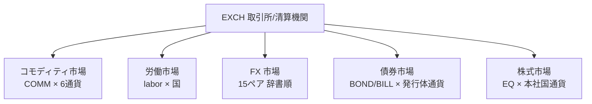
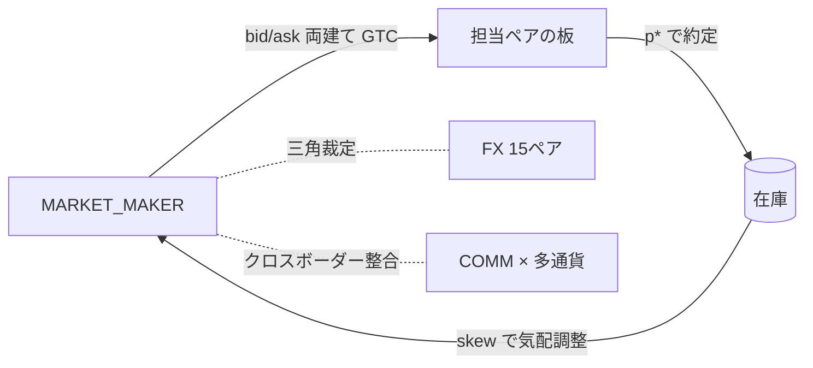
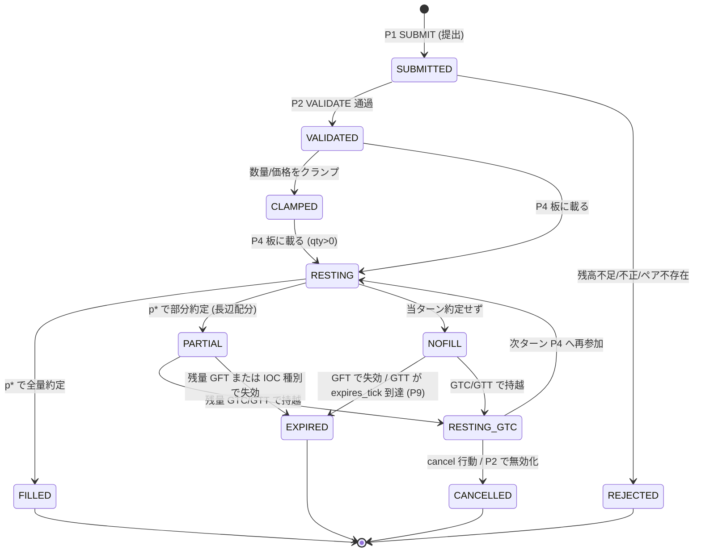
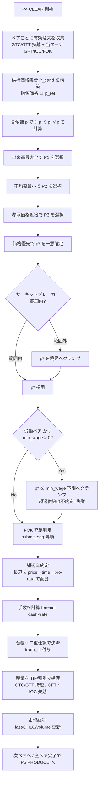

# 09. 市場と取引

本書は FinBox の公開市場と板寄せ約定の正準仕様である。すべての自発的な Tradable Assets のやり取りは、本書が定義する板寄せ約定 (P4 CLEAR) を通じてのみ成立する ([00 用語集 0.10](00-glossary.md))。市場構造・板寄せアルゴリズム・注文種別・決済・流動性供給 (マーケットメイカー)・価格指数までを、実装可能な水準で定義する。

横断定義 (ID体系・列挙値・価格表現・保存則) はすべて [00 用語集](00-glossary.md) を唯一の真実とし、本書はこれを再定義せず参照・詳細化する。台帳と決済の二重仕訳は [08 経済と台帳](08-economy-and-ledger.md)、債券/株式市場の発行・流通の固有規則は [11 金融と金融商品](11-finance-and-instruments.md)、労働市場は [05 エージェント](05-agents.md) と [10 産業と生産](10-industry-and-production.md)、財市場は [10 産業と生産](10-industry-and-production.md)、注文 API は [14 API リファレンス](14-api-reference.md)、ターン中の位置づけは [03 時間とターン](03-time-and-turns.md) を参照する。

## 9.1 市場の基本性質

- **ターン制・離散時刻の単一価格オークション**: FinBox の市場は連続約定 (continuous double auction) を採用せず、各ターンの P4 CLEAR で全ペアを同時に**板寄せ (itayose / call auction)** で清算する。1ターン・1ペアにつき単一の清算価格 `p*` が決定され、その価格で全約定が成立する。これにより、提出順序に依存しない決定論的清算が保証される ([00 用語集 0.2 決定論](00-glossary.md))。
- **server-authoritative**: 板の構築・突き合わせ・約定・決済はすべて中央エンジンが行う。クライアント (エージェント/プレイヤー) は P1 SUBMIT で注文を提出するのみで、板の内部状態を直接操作できない ([02 アーキテクチャ](02-architecture.md))。
- **整数のみ**: 数量・価格・現金移動はすべて整数。端数は発生しない ([00 用語集 0.8](00-glossary.md))。
- **公開情報の対称性**: 板の集計情報 (各価格水準の需給・直近清算価格・OHLC) は P0 SNAPSHOT で全クライアントに対称に公開される。個々の未約定注文の提出者を識別する情報は公開しない (注文は P4 で匿名に突き合わされる)。

## 9.2 市場構造と取引ペア

### 9.2.1 取引ペアの規約

取引ペアID は [00 用語集 0.3/0.5](00-glossary.md) に従い `pair_id = base "/" quote` で表す。`base` は取引対象の資産、`quote` は値付けに用いる通貨である。価格 `price` は「`quote` 通貨の最小単位を `base` 1単位あたりで表す整数」(price tick) であり、約定1件の現金移動は `cash = price × quantity`(厳密な整数, [00 用語集 0.8](00-glossary.md))。

`base` の数量単位は資産の `quantity` 単位 (整数1単位)。例えば `COMM:agri.grain/CUR:ALD` の `price=37` は「grain 1単位 = ALD 通貨 37 最小単位」を意味する。

### 9.2.2 ペアの分類

市場は次の5種類のペア集合からなる。

| 市場 | base のクラス | quote | 値付け規約 | 担当ドキュメント |
| --- | --- | --- | --- | --- |
| コモディティ市場 (財・資源・サービス) | `COMM:*`(`labor.*` を除く) | 各国通貨 `CUR:*` | コモディティ × 6通貨の全組合せ | [10 産業と生産](10-industry-and-production.md) |
| 労働市場 | `COMM:labor.*`, `COMM:build.construction_labor` | 立地国の通貨 `CUR:*`(その労働力が供給される国の通貨1種のみ) | 国ごとに分割。賃金 = 清算価格 | [05 エージェント](05-agents.md), [10 産業と生産](10-industry-and-production.md) |
| FX 市場 (外国為替) | 通貨 `CUR:X` | 通貨 `CUR:Y`(X≠Y) | 正準方向は通貨コード辞書順 (9.2.4) | 本書 9.2.4, [11 金融と金融商品](11-finance-and-instruments.md) |
| 債券市場 | `BOND:*`, `BILL:*` | 発行体の基軸通貨 `CUR:<発行体国>` | 発行体の自国通貨ペアのみ | [11 金融と金融商品](11-finance-and-instruments.md) |
| 株式市場 | `EQ:firm.*` | 企業の基軸通貨 `CUR:<本社国>` | 企業の本社国通貨ペアのみ | [11 金融と金融商品](11-finance-and-instruments.md) |

> 設計上の決定: コモディティは流動性を集約するため**全6通貨でペアを開く**(クロスボーダー取引を市場経由で表現する)。一方、労働・債券・株式は固有の単一通貨でのみ値付けし、別通貨での取引が必要な場合は FX を介在させる (アービトラージはマーケットメイカーが整合させる, 9.7.6)。

### 9.2.3 労働市場の通貨分割

労働力 (`COMM:labor.*`, `COMM:build.construction_labor`) は perishable (1ターンで消滅, [00 用語集 0.5.3](00-glossary.md)) であり、立地に固有である。労働ペアは**労働種別 × 国**で分割し、その国の通貨でのみ値付けする。例: Aldoria の工場労働は `COMM:labor.factory@ALD / CUR:ALD`。`base` の表記は `asset_id "@" country_code` を用い、同一労働種別でも国ごとに別ペア・別清算価格 (= 国別賃金) を持つ。これにより国際的な賃金差を市場が表現する ([05 エージェント](05-agents.md))。

### 9.2.4 FX 市場の正準方向

FX ペアの正準方向は**通貨コードの辞書順**で固定する。`base = min(X,Y)`, `quote = max(X,Y)`(文字列辞書順)。6通貨 `{ALD, BOR, CYR, DOR, ESM, FAR}` から生成される無向ペアは `C(6,2) = 15` 本。正準FXペアは次の15本に固定する。

```
ALD/BOR  ALD/CYR  ALD/DOR  ALD/ESM  ALD/FAR
BOR/CYR  BOR/DOR  BOR/ESM  BOR/FAR
CYR/DOR  CYR/ESM  CYR/FAR
DOR/ESM  DOR/FAR
ESM/FAR
```

逆方向レート (例 `BOR/ALD`) は別ペアを開かず、`price(Y/X) = 1 / price(X/Y)` の関係で観測時に導出する (整数価格のため実際には正準方向の `price` のみを保持し、逆数は実数表示としてのみ提供する)。クロスレート (例 ALD↔CYR を BOR 経由で) の整合はマーケットメイカーのアービトラージで維持される (9.7.6)。

FX ペア (base/quote の双方が `CUR:*`) の取引手数料は他市場と異なり、低スプレッドの通貨取引を促すため `market.fx_fee_rate_bps = 2`(2 bps) を適用する (それ以外のコモディティ・労働・債券・株式ペアは `market.fee_rate_bps = 5`、課金構造は 9.6.1 と共通で買い手・売り手双方から `ceil(cash × fee_rate)` を徴収する)。

### 9.2.5 ペア総数の見積り

既定シナリオ ([16 構成と初期化](16-configuration-and-initialization.md)) における同時開設ペア数の概算を示す。`storable`/`good`/`mat`/`raw`/`agri`/`energy`/`mil`/`svc` の取引可能コモディティ数を `N_comm`、労働種別数を `N_labor`、国数を `K=6` とする。

| 市場 | 本数の式 | 概算 |
| --- | --- | --- |
| コモディティ (svc 含む) | `N_comm × K` | `≈ 56 × 6 = 336` |
| 労働 (国別) | `N_labor × K` | `≈ 12 × 6 = 72` |
| FX | `C(K,2)` | `15` |
| 債券 (国債+国庫短期) | 発行残の限月数 × 6国 | 可変 (genesis 直後 `≈ 6×8 = 48`) |
| 株式 | 上場企業数 | 可変 (genesis 直後 `≈ 30`) |
| 合計 (genesis 直後) | — | `≈ 500` 前後 |

`N_comm` の内訳 (取引対象となる `COMM` のうち `labor.*` を除く): `agri` 6, `raw` 7, `energy` 2, `mat` 13, `good` 7, `svc` 6, `build` 1, `mil` 1 で合計 43。`mat`/`good`/`raw` の拡張で変動するため、上表の `56` は svc・build・mil を含めた拡張余地を見込んだ概算である。実数は構成で確定する。



## 9.3 板寄せ (itayose / call auction) アルゴリズム

板寄せは1ペアの全注文を集めて**単一清算価格 `p*`** と各注文の約定数量を決定論的に決める手続きである。中心原則は**出来高最大化** (約定する総数量を最大にする `p*` を選ぶ) であり、これは call auction の標準であると同時に決定論を満たす唯一の自然な目的関数である。

### 9.3.1 入力と前提

- 対象ペア `pair_id` の有効注文集合 `O`(P2 VALIDATE を通過し、残高・合法性でクランプ済み, 9.5)。
- 各注文 `o ∈ O` は `{order_id, side ∈ {BUY,SELL}, type, limit_price(指値のみ), qty, tif, submit_seq}` を持つ。`submit_seq` は P1 SUBMIT 内での決定論的な提出順位 (時間優先の基準, 9.6.3)。
- 参照価格 `p_ref` = 前ターンの当該ペア清算価格 (初回ターンは genesis 構成の基準価格, [16](16-configuration-and-initialization.md))。
- 成行注文 (market) は約定価格制約を持たず、常に約定候補に含める (9.4.1)。

### 9.3.2 需給関数

価格 `p` における約定可能量を需給の累積で定義する。

- **需要 (買い) 累積** `D(p)` = `p` 以上で買う意思のある総数量 = (limit_price ≥ p の BUY 指値数量) + (全 BUY 成行数量)。
- **供給 (売り) 累積** `S(p)` = `p` 以下で売る意思のある総数量 = (limit_price ≤ p の SELL 指値数量) + (全 SELL 成行数量)。
- 価格 `p` での約定可能出来高 `V(p) = min(D(p), S(p))`。
- 候補価格集合 `P_cand` = 板に現れる全指値価格の集合 ∪ `{p_ref}`(成行のみで指値が存在しない場合に `p_ref` を採用するため)。`p*` は必ず `P_cand` の要素になる (連続関数 `V` は折れ点 = 指値価格でのみ最大を取る)。

### 9.3.3 清算価格 `p*` の決定規則 (厳密)

候補 `p ∈ P_cand` を次の優先順位で評価し、最良の `p` を `p*` とする。

1. **出来高最大化**: `V(p)` を最大にする `p` の集合 `P1` を選ぶ。
2. **不均衡最小化 (同点処理1)**: `P1` 内で約定不均衡 `Imb(p) = |D(p) − S(p)|` を最小にする `p` の集合 `P2` を選ぶ。`p*` における長辺の余剰 = `Imb(p*)` であり、これを最小化することで価格発見の歪みを抑える。
3. **参照価格近接 (同点処理2)**: `P2` 内で `|p − p_ref|` を最小にする `p` の集合 `P3` を選ぶ。直近の清算価格に最も近い価格を選び、価格の連続性を保つ。
4. **価格優先 (最終決定)**: `P3` がなお複数なら、買い圧力が残るとき (`D(p) > S(p)` 側が支配的な状況、すなわち `D(p_ref) ≥ S(p_ref)`) は**高い方**、売り圧力が残るときは**低い方**を採る。圧力が拮抗する場合 (`D=S`) は**高い方**を採る。これにより一意に `p*` が定まる。

この4段で `p*` は常に一意に決まる (決定論, [00 用語集 0.17](00-glossary.md))。

### 9.3.4 約定対象の確定

`p*` 決定後、約定するのは「`p*` で取引が成立する注文」である。

- 約定する BUY: `limit_price ≥ p*` の BUY 指値、および全 BUY 成行。
- 約定する SELL: `limit_price ≤ p*` の SELL 指値、および全 SELL 成行。
- 実際の総約定量は `Q* = min(D(p*), S(p*)) = V(p*)`。短辺 (数量の少ない側) は全量約定し、長辺 (数量の多い側) は `Q*` 単位だけが約定する。長辺のどの注文が約定するかは 9.6 の配分規則で決める。

### 9.3.5 擬似コード (listing)

```
function itayose(O, p_ref):
    # 候補価格集合
    P_cand = { o.limit_price for o in O if o.type != MARKET } ∪ { p_ref }

    best = null
    for p in sort_desc(P_cand):                  # 降順走査 (価格優先の決定性確保)
        D = sum(o.qty for o in O if o.side==BUY  and (o.type==MARKET or o.limit_price >= p))
        S = sum(o.qty for o in O if o.side==SELL and (o.type==MARKET or o.limit_price <= p))
        V   = min(D, S)
        Imb = abs(D - S)
        dist= abs(p - p_ref)
        cand = (V, -Imb, -dist, tie_price_pref(D, S, p, p_ref))
        if best == null or cand > best.key:
            best = { key: cand, p: p }
    p_star = best.p

    if V(p_star) == 0:                            # クロスする注文が無い
        return { p_star: p_ref, fills: [] }       # 約定なし。p_ref を維持

    # 短辺全約定・長辺配分
    buys  = [o for o in O if o.side==BUY  and (o.type==MARKET or o.limit_price >= p_star)]
    sells = [o for o in O if o.side==SELL and (o.type==MARKET or o.limit_price <= p_star)]
    Qstar = min(sum_qty(buys), sum_qty(sells))

    short_side = buys if sum_qty(buys) <= sum_qty(sells) else sells
    long_side  = sells if short_side is buys else buys

    fill[o] = o.qty for o in short_side           # 短辺は全量
    fill   += allocate(long_side, Qstar)          # 長辺は 9.6 の規則で Qstar を配分
    return { p_star, fills: fill }
```

`tie_price_pref(D,S,p,p_ref)` は 9.3.3 ステップ4を符号化した補助比較値であり、買い支配なら高価格に正の優先、売り支配なら低価格に正の優先を与える。タプル `cand` の辞書順最大が `p*` を一意に与える。

### 9.3.6 数値例 (需給と `p*` 決定)

ペア `COMM:agri.grain/CUR:ALD`、`p_ref = 36` とする。提出された指値・成行注文を価格水準ごとに集計した板は次の通り。

| price `p` | この価格での BUY 指値量 | この価格での SELL 指値量 |
| --- | --- | --- |
| 39 | 0 | 50 |
| 38 | 20 | 40 |
| 37 | 30 | 30 |
| 36 | 40 | 10 |
| 35 | 60 | 0 |

加えて BUY 成行 10、SELL 成行 0 が存在するとする。各候補価格での累積需給と出来高は以下。

| `p` | `D(p)`(BUY≥p + 成行) | `S(p)`(SELL≤p + 成行) | `V=min` | `Imb=\|D−S\|` | `\|p−p_ref\|` |
| --- | --- | --- | --- | --- | --- |
| 39 | 0+10=10 | 130 | 10 | 120 | 3 |
| 38 | 20+10=30 | 80 | 30 | 50 | 2 |
| 37 | 50+10=60 | 40 | 40 | 20 | 1 |
| 36 | 90+10=100 | 10 | 10 | 90 | 0 |
| 35 | 150+10=160 | 0 | 0 | 160 | 1 |

`V` の最大は `p=37` の `40`(単独最大)。よって `p* = 37`、総約定量 `Q* = 40`。`D(37)=60 > S(37)=40` なので売り (SELL) が短辺で全量40約定、買い (BUY) が長辺で60のうち40だけ約定し、20が未約定 (good-for-turn なら失効)。仮に同点だった場合は 9.3.3 の不均衡最小 → 参照価格近接 → 価格優先で一意化する。

### 9.3.7 労働市場の最低賃金フロア (P4 CLEAR)

労働ペア (`COMM:labor.*@<cc>` または `COMM:build.construction_labor@<cc>` を `CUR:<cc>` で値付けするペア、9.2.3) の板寄せでは、当該国の政策レバー `min_wage` ([12 §12.3](12-politics-and-government.md)) が約定価格の下限として作用する。`min_wage` はその国の通貨単位/labor 1単位で表す整数で、政治家投票 (P3 GOVERN) で確定した値を P4 が参照する。

- `min_wage = 0`(既定) のときは通常の板寄せ (9.3.3) をそのまま適用し、フロアは作用しない。
- `min_wage > 0` のとき、9.3.3 で求めた出来高最大化清算価格 `p*_raw` が `min_wage` 未満なら、清算価格を `p* = min_wage` にクランプする。`p*_raw ≥ min_wage` ならクランプ不要で `p* = p*_raw`。
- クランプ後の `p* = min_wage` で約定対象を再確定する (9.3.4): 約定する SELL (労働供給) は `limit_price ≤ min_wage` の指値と全成行、約定する BUY (労働需要) は `limit_price ≥ min_wage` の指値と全成行。このとき供給超過 (`S(min_wage) > D(min_wage)`) となる労働は短辺=需要側の総量 `Q* = min(D(min_wage), S(min_wage)) = D(min_wage)` までしか約定せず、超過供給分は**不約定 (= 失業)** として当ターン未消化となる (`COMM:labor.*` は perishable のため翌ターンへ持越されず消滅, [00 用語集 0.5.3](00-glossary.md))。
- フロアは価格形成のみを制約し、個別注文を P2 で棄却しない (サーキットブレーカー 9.8.3 と同様に P4 の `p*` 段階で作用)。`min_wage` フロアとサーキットブレーカー幅 (9.8.3) が同時に効く場合は、`p*` を `[floor(p_ref × (1 − band)), ceil(p_ref × (1 + band))]` にクランプした後、下限を `max(min_wage, floor(p_ref × (1 − band)))` として適用する (賃金フロアは下方制限を強める向きにのみ作用する)。

この清算は 12 §12.3 の波及記述 (「`min_wage` は労働市場の約定価格下限として作用し、下限未満の労働需要は不約定」) と一致する。フロアにより賃金が押し上げられた国では労働需要が縮小し、超過供給が失業として現れる。

## 9.4 注文種別 (order_type) と有効期間 (TIF)

注文は執行方式を表す注文種別 (`order_type`) と有効期間を表す TIF (`tif`) の2軸で指定する。両軸の列挙と既定は [00 用語集 0.19](00-glossary.md) を唯一の正準とし、本書はこれを再定義せず詳細化する。`order_type ∈ {LIMIT, MARKET, IOC, FOK}`、`tif ∈ {GFT(既定), GTC, GTT}`。`IOC`/`FOK` は TIF ではなく注文種別であり TIF とは独立に組み合わせる。

### 9.4.1 注文種別 (order_type)

| order_type | 意味 | 約定挙動 |
| --- | --- | --- |
| `LIMIT` | 指値。`limit_price` を満たす範囲でのみ約定 | BUY は `p* ≤ limit_price`、SELL は `p* ≥ limit_price` のとき約定対象 |
| `MARKET` | 成行。価格制約なし。常に約定対象に含める | 約定価格は他注文と同じ `p*`。供給が尽きれば未約定残は失効 |
| `IOC`(Immediate-or-Cancel) | 約定可能な範囲で部分約定、残量は即時取消 | 当ターンの `p*` で約定可能な分のみ約定し残量は GTC 化せず即時失効 (tif と独立に振る舞う) |
| `FOK`(Fill-or-Kill) | 全量約定可能なときのみ約定、不可なら全量取消 | 9.4.3 で判定 |

成行は `limit_price` を持たないが、`p*` 決定後に資金/在庫制約 (9.5) でクランプされる。買い成行が `p*` で買える数量は提出者の現金 `≥ p* × qty` に制限される。`IOC`/`FOK` は約定可否を当ターン内で即時確定する種別であり、`tif` を併記する場合も当ターンを越えて板に残らない (実質 GFT 相当に縮退する)。

### 9.4.2 TIF (Time In Force, [00 用語集 0.18/0.19](00-glossary.md))

| tif | 意味 | 既定 |
| --- | --- | --- |
| `GFT`(good-for-turn) | 当ターンの P4 でのみ有効。未約定残は P9 で失効 | 既定値 |
| `GTC`(good-till-cancel) | 約定または明示取消まで板に残る。複数ターン持越 | — |
| `GTT`(good-till-tick) | `expires_tick` で指定した tick まで有効。当該 tick の P4 を最後に未約定残は失効 | — |

- 既定 TIF は `GFT`。明示しない注文は当ターン限りで失効する。
- `GTC` 注文は毎ターンの板寄せに繰り返し参加する。提出者が `cancel` 行動 ([14 API](14-api-reference.md)) を出すか、残高不足で P2 が無効化するまで残る。`GTC` 指値はマーケットメイカーや投資家の常設指値に用いる。
- `GTT` 注文は `GTC` と同様に毎ターンの板寄せへ繰り返し参加するが、`expires_tick` に達した時点 (当該 tick の P9) で未約定残が失効する。期限付きの常設指値・条件付き注文に用いる。
- `GTC`/`GTT` の `submit_seq` (時間優先) は**最初に板へ載ったターンの tick と提出順**で固定し、新しい GFT 注文より優先される (古い持越注文ほど時間優先が高い, 9.6.3)。
- `tif` は `order_type` と独立の軸である。`IOC`/`FOK` 種別は当ターンで即時確定するため、付与された `tif` の値にかかわらず板へは残らない (9.4.1)。

### 9.4.3 FOK の判定

FOK 注文 `o` は、当ターンの `p*` を**他の注文だけで先に確定させた上で**、`o` を加えても `o.qty` 全量が `p*` で約定可能かを判定する。可能なら全量約定、不可能なら全量取消。FOK は `p*` 自体を動かさない (自己約定を誘発しないため、FOK は価格決定後に充足判定する非価格形成注文として扱う)。複数 FOK がある場合は `submit_seq` 昇順に逐次判定する。

### 9.4.4 マーケットメイカーの両建てとアイスバーグ

- **両建て指値 (two-sided quote)**: マーケットメイカー (`MARKET_MAKER`, [00 用語集 0.14](00-glossary.md)) は1ペアに対し BUY 指値 (bid) と SELL 指値 (ask) を同時に提出し、スプレッドを取りつつ流動性を供給する (9.7)。両建ては通常の `LIMIT` 2本として板寄せに参加する。
- **アイスバーグ注文 (iceberg, 任意)**: 総量 `qty_total` のうち板に表示する量を `qty_visible` に限定し、約定で表示分が減ると次の表示分を補充する注文。FinBox は単一価格板寄せのため表示量秘匿の意味は限定的だが、**長辺配分 (9.6) における比例配分の基準量を `qty_visible` に制限する**ことで、大口が長辺配分を独占するのを防ぐ目的で任意提供する。表示量での約定が尽き未約定なら、次ターンに `qty_visible` を補充して再参加する (GTC 必須)。既定では無効、構成 `iceberg_enabled` で有効化 ([16](16-configuration-and-initialization.md))。

## 9.5 検証・クランプ (P2 VALIDATE)

注文は P4 の板寄せに入る前に P2 VALIDATE で検証・クランプされる ([03 時間とターン](03-time-and-turns.md), [00 用語集 0.11](00-glossary.md))。

- **残高チェック**: SELL は売却対象資産の現物残高 `≥ qty` を要求 (現物の空売り禁止, [00 用語集 0.17 非負残高](00-glossary.md))。空売りは金融商品の負債計上でのみ表現し、現物板には出さない ([11](11-finance-and-instruments.md))。残高不足は `qty` を保有量にクランプ。
- **資金チェック**: BUY は最悪約定額に対する現金を確保する。指値は `limit_price × qty`、成行は P4 内で `p*` 確定後に現金でクランプ (買える分まで `qty` を縮小)。
- **資金・在庫の予約**: 同一エンティティが同一ターンに複数注文を出す場合、P2 は提出順に資金/在庫を予約し、予約超過分をクランプする。これにより1単位の資金/在庫を二重に約束できない。
- **合法手チェック**: role-gating ([06 ロール](06-roles.md))・ペアの存在・最小/最大数量・サーキットブレーカー幅 (9.8.3) を検証。違反は棄却または幅へクランプ。
- **無効化**: クランプ後 `qty = 0` となった注文、または存在しないペア/資産への注文は棄却される。

## 9.6 約定・決済

### 9.6.1 約定価格と手数料

全約定は単一価格 `p*` で成立する。約定1件 (long 側の1注文と short 側の充当の結果) の現金移動は `cash = p* × qty_filled`(整数, [00 用語集 0.8](00-glossary.md))。取引所手数料は `EXCH` が収受し、`fee = ceil(cash × fee_rate)` を**買い手・売り手それぞれから**控除する (taker/maker 区別なし。両者対称)。手数料率は資産クラス別に定める ([16](16-configuration-and-initialization.md))。既定は `market.fee_rate_bps = 5`(5 bps) で全ペアに適用し、FX ペア (両 base/quote が `CUR:*`、9.2.4) のみ例外的に `market.fx_fee_rate_bps = 2`(2 bps) を適用する。手数料率0も許容。

### 9.6.2 長辺の数量配分 (price → time → pro-rata)

長辺 (`Q* < 長辺総量` の側) で、どの注文がどれだけ約定するかを次の優先順で配分する。短辺は全量約定するため配分不要。

1. **価格優先 (price priority)**: より有利な指値ほど先に約定する。買い長辺なら高い `limit_price`、売り長辺なら低い `limit_price` を優先。成行は「無限に有利な指値」とみなし最優先。
2. **時間優先 (time priority)**: 同一価格水準内では `submit_seq` 昇順 (先に提出された注文) を優先。`GTC`/`GTT` は載ったターンの古さで優先 (9.4.2)。
3. **比例配分 (pro-rata)**: 価格・時間で完全に順序づけても端数で割り切れない最後の1水準では、残り約定量を当該水準の各注文の (残) 数量に比例して整数配分する。比例配分の端数は `largest_remainder`(最大剰余) 法で決定論的に割り当て、剰余が同点なら `submit_seq` 昇順を優先する。アイスバーグは `qty_visible` を比例配分の基準量とする (9.4.4)。

> 既定は price → time の厳密な優先で、純粋な pro-rata ではない。最後の境界水準でのみ比例配分が働く。これにより、最良価格・先着注文が確実に報われ (流動性供給インセンティブ)、なお決定論的に一意化される。

### 9.6.3 `submit_seq`(時間優先キー)の決定

`submit_seq` は P1 SUBMIT 内で全注文に与える決定論的な通し番号で、(注文の論理時刻, entity_id, order_id) を辞書順に並べた順位とする。論理時刻は提出 API の受理順だが、決定論のため最終的にはターンのサブシードと entity_id で安定ソートする ([03 時間とターン](03-time-and-turns.md))。`GTC`/`GTT` 注文は初回搭載時の `submit_seq` を保持し続ける。

### 9.6.4 決済 (P4 で台帳へ二重仕訳)

約定は P4 CLEAR の中で即座に台帳へ反映される。1約定 (matched pair) は資産ごとに借方=貸方の二重仕訳になる ([00 用語集 0.9](00-glossary.md), [08 経済と台帳](08-economy-and-ledger.md))。`COMM:agri.grain/CUR:ALD` で買い手 B が売り手 S から grain `q` 単位を `p*` で買う約定の仕訳は次の通り。

| 資産 | 借方 (増) | 貸方 (減) | 金額/数量 |
| --- | --- | --- | --- |
| `COMM:agri.grain` | `balance[B]` | `balance[S]` | `q` |
| `CUR:ALD`(代金) | `balance[S]` | `balance[B]` | `p* × q` |
| `CUR:ALD`(手数料) | `balance[EXCH]` | `balance[B]` | `ceil(p*·q × fee_rate)` |
| `CUR:ALD`(手数料) | `balance[EXCH]` | `balance[S]` | `ceil(p*·q × fee_rate)` |

各 grain 単位・各通貨単位について、増えた残高と減った残高が一致し資産保存が成り立つ (手数料は EXCH への移転であり通貨総量は保存)。各仕訳は `trade_id` を原因識別子として持つ ([00 用語集 0.9](00-glossary.md))。部分約定は約定数量 `q = qty_filled` をそのまま用いるだけで、仕訳構造は同一。

### 9.6.5 部分約定と残量の扱い

- 長辺で部分約定した注文の未約定残は、TIF と注文種別に従う。`GFT` および `IOC` 種別は失効、`GTC` は次ターンへ持越 (残量で再参加)、`GTT` は `expires_tick` まで持越して以後失効、`FOK` 種別は 9.4.3 によりそもそも部分約定しない。
- 成行注文が供給不足で全量約定できなかった場合、未約定残は常に失効する (成行は持越不可)。

## 9.7 流動性とマーケットメイカー

### 9.7.1 流動性希薄化の問題

FinBox は最大で約500ペアを同時に開く (9.2.5)。エージェント/プレイヤーの自然な注文だけでは、各通貨ペア・各限月・各銘柄に十分な対当注文が集まらず、`V(p*) = 0`(約定不成立) や極端な価格跳ねが頻発する。とくに FX の少額通貨ペア、上場直後の株式、新規限月の債券は流動性が枯渇しやすい。これを恒常的に解消するため、`MARKET_MAKER` ロールのエージェントが各ペアに常設の両建て指値を供給する。

### 9.7.2 MM の役割と genesis 配賦

- MM は投資家ロールから派生する専門エージェント ([00 用語集 0.14](00-glossary.md))。genesis ([16](16-configuration-and-initialization.md)) で**全通貨の大量配賦**と主要コモディティ/銘柄の在庫配賦を受け、各市場に流動性を供給できる初期バランスシートを持つ。
- 1体の MM は複数ペアを担当できる。既定では各 FX ペア・各主要コモディティ通貨ペア・各上場株式に最低1体の MM を割り当てる ([16](16-configuration-and-initialization.md) `mm_coverage`)。

### 9.7.3 MM の行動: 常に最適価格で約定する両建て指値

MM は P1 SUBMIT で、担当ペアごとに参照価格 `p_ref`(前ターン清算値) と自己の在庫・目標在庫から bid/ask を計算して提出する。基本形は以下。

```
mid   = fair_value(pair)          # p_ref とクロスレート整合から推定する公正価格
spread= base_spread(pair) + inventory_skew(inv, target)   # 在庫過多なら売り寄せ
bid   = floor(mid * (1 - spread/2))
ask   = ceil (mid * (1 + spread/2))
qty   = quote_size(pair, capital) # 1ターンに供給する片側数量
submit LIMIT BUY  bid qty (tif=GTC)
submit LIMIT SELL ask qty (tif=GTC)
```

- **常に最適価格で約定する**とは、MM が板の最良気配近傍にタイトな両建てを出し続け、対当注文があれば確実に約定が成立する状態を維持することを指す。MM のスプレッドが狭いほど `V(p*) > 0` が成立しやすくなる。
- `inventory_skew` は在庫が目標を上回ると ask を下げ bid も下げ (売りを誘う)、下回ると逆に動かす。これにより在庫を目標水準へ平均回帰させる (在庫リスク管理, 9.7.5)。

### 9.7.4 MM の報酬 (07 と整合)

MM の報酬関数は [07 機械学習](07-machine-learning.md) と [00 用語集 0.14](00-glossary.md) のロール定義に整合し、次の3要素を主成分とする (係数は [07](07-machine-learning.md)/[16](16-configuration-and-initialization.md) で確定)。

- **資産を減らさない (PnL 保全)**: WUI 換算純資産 ([00 用語集 0.16](00-glossary.md)) の非減少。マーク・トゥ・マーケットの含み損益と確定損益を合算。在庫を清算価格でマークするため、買い溜めた在庫の値下がりは罰せられる。
- **他注文と乖離しない (価格整合)**: MM の提示気配 mid が市場の `p*` および他 MM のクロスレート整合 (9.7.6) から乖離すると負の報酬。これにより MM は公正価格周辺に気配を集める。
- **高約定率 (流動性供給量)**: 担当ペアで成立した出来高に対する MM 寄与分、および `V(p*) > 0` を成立させた貢献に正の報酬。約定が起きない放置気配には報酬を与えない。

この設計により、MM は「狭いスプレッドで両建てを出し、在庫を目標へ戻し、損を出さず、クロスレートを整合させる」方向に学習する。

### 9.7.5 在庫リスク管理

- MM は各資産に**目標在庫** `target_inv` と上限/下限を持つ。在庫が偏ると `inventory_skew` で気配を傾け平均回帰させる (9.7.3)。
- 在庫の評価損益は毎ターン `p*` でマークされ報酬に反映される (9.7.4) ため、MM は過大な方向性リスクを避ける。
- 在庫が下限 (現物枯渇) に近づくと ask 数量を縮小し、上限に近づくと bid 数量を縮小して、非負残高制約 ([00 用語集 0.17](00-glossary.md)) と資金制約の範囲で動く。

### 9.7.6 クロスレート整合 (アービトラージ)

FX とコモディティの多通貨ペアは、三角裁定が成立する整合状態へ MM が引き寄せる。

- **三角裁定 (FX)**: 任意の3通貨 X,Y,Z について `rate(X/Z) ≈ rate(X/Y) × rate(Y/Z)` を維持する。乖離があれば MM は割安経路で買い割高経路で売る両建てを出し、利鞘を取りつつレートを収束させる。
- **コモディティのクロスボーダー整合**: 同一コモディティの通貨別価格 `price(COMM/CUR:X)` と `price(COMM/CUR:Y)` は、FX レート `rate(X/Y)` を介して整合すべきである。乖離は財の通貨間裁定 (どの通貨で買い、どの通貨で売るか) を生み、MM とアービトラージャー (投資家) がこれを縮める。関税・輸送コストの存在下では完全一致ではなく「無裁定バンド」へ収束する ([10](10-industry-and-production.md), [12 政治と統治](12-politics-and-government.md) の関税)。
- 裁定は P4 の単一板寄せ内で全ペア同時に清算されるため、ある1ターンの注文集合に対し決定論的に収束方向の約定が起きる。完全均衡は複数ターンの繰り返しで漸近的に達成される。



## 9.8 価格指数・OHLC・サーキットブレーカー

### 9.8.1 ペアごとの市場統計

各ペアについて、エンジンは P9 ADVANCE で当ターンの市場統計を確定し、次ターンの P0 SNAPSHOT で公開する ([03 時間とターン](03-time-and-turns.md))。

| フィールド | 定義 |
| --- | --- |
| `last_price` | 当ターン清算価格 `p*`。約定が無ければ前値を維持 |
| `volume` | 当ターン総約定量 `Q* = V(p*)` |
| `turnover` | 当ターン現金出来高 `Σ cash = p* × Q*` |
| `open` | OHLC 始値。集計窓の最初のターンの `p*` |
| `high` | 集計窓の最大 `p*` |
| `low` | 集計窓の最小 `p*` |
| `close` | 集計窓の最後の `p*`(= 最新 `last_price`) |
| `bid` / `ask` | 当ターン板の最良買気配/最良売気配 (未約定含む) |
| `imbalance` | `D(p*) − S(p*)`(長辺の符号付き余剰) |

### 9.8.2 参照価格と OHLC 集計窓

- **参照価格** `p_ref` は前ターンの `last_price`(= 前ターン `p*`)。板寄せの同点処理 (9.3.3) と MM の公正価格推定 (9.7.3)、サーキットブレーカー基準 (9.8.3) に用いる。初回ターンは genesis 基準価格 ([16](16-configuration-and-initialization.md))。
- **OHLC 集計窓** は標準でターン (1tick)、加えて月 (`TURNS_PER_MONTH`)・四半期・年 (`TURNS_PER_YEAR`) の OHLC を派生集計する ([00 用語集 0.7](00-glossary.md))。月次以上の OHLC はチャート表示とマクロ指標 ([00 用語集 0.16](00-glossary.md)) に供する。
- 約定の無かったターンは `volume=0`、`open=high=low=close=p_ref` とする (前値フラット)。

### 9.8.3 サーキットブレーカー (任意の価格制限幅)

価格の異常跳ねを抑えるため、ペアごとに制限幅 `band` を設けられる (既定有効、構成可)。

- 当ターンの `p*` は `[floor(p_ref × (1 − band)), ceil(p_ref × (1 + band))]` の範囲にクランプする。`band` の既定は資産クラス別に定める (例: FX `0.05`、コモディティ `0.15`、株式 `0.20`、債券 `0.05`, [16](16-configuration-and-initialization.md))。
- 制限により本来の出来高最大化価格が範囲外になる場合、`p*` を境界値に丸め、その境界価格での `V` に基づき約定する (約定量は通常どおり短辺全約定・長辺配分)。範囲外に出ようとした不均衡は当ターン未消化として残る (`GTC`/`GTT` は持越、`GFT` は失効)。
- サーキットブレーカーは P2 VALIDATE で個別注文の `limit_price` を拒否はせず、P4 の `p*` 段階でのみ作用する (注文は出せるが価格形成が制限される)。

## 9.9 注文ライフサイクルとフェーズ対応

### 9.9.1 ライフサイクル状態遷移



### 9.9.2 板寄せ処理フロー (P4 CLEAR 内)



板寄せは全ペアについて独立・並列に実行できる (1ペアの清算が他ペアの清算に当ターン内で依存しない) が、決定論のためペアIDの辞書順に走査し、結果を確定する。クロスレート整合 (9.7.6) はペア間ではなく**ターン間**の繰り返しで達成される。

## 9.10 相互リンク要約

- 台帳構造・二重仕訳・資産保存: [08 経済と台帳](08-economy-and-ledger.md)
- 債券/株式の発行・流通・配当・クーポンの市場固有規則: [11 金融と金融商品](11-finance-and-instruments.md)
- 労働市場の供給・賃金・スキル: [05 エージェント](05-agents.md), [10 産業と生産](10-industry-and-production.md)
- 財市場・生産・在庫・関税の影響: [10 産業と生産](10-industry-and-production.md), [12 政治と統治](12-politics-and-government.md)
- 注文・取消・観測の API スキーマ: [14 API リファレンス](14-api-reference.md)
- 板寄せのターン内位置 (P4 CLEAR)・決定論・乱数: [03 時間とターン](03-time-and-turns.md)
- MM 報酬・学習: [07 機械学習](07-machine-learning.md)
- 手数料率・スプレッド・サーキットブレーカー幅・MM カバレッジ等の既定値: [16 構成と初期化](16-configuration-and-initialization.md)
