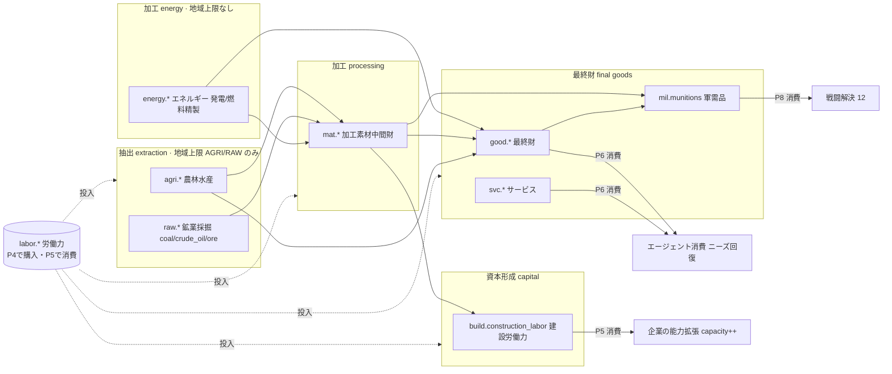
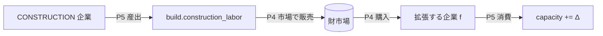
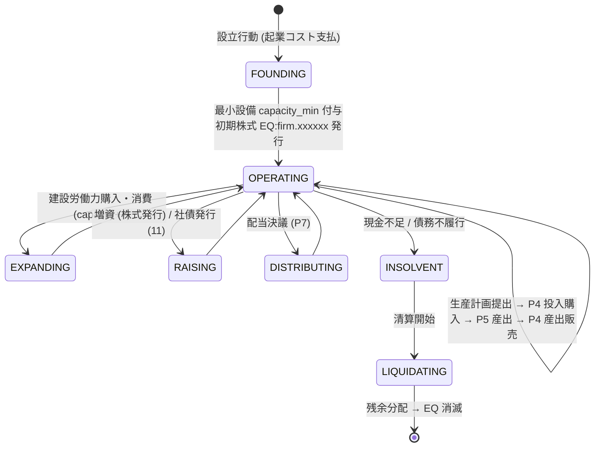

# 10. 産業と生産

本書は FinBox の実体経済の中核である **産業 (industry)・生産レシピ (production graph)・企業 (FIRM) のライフサイクル**を正準仕様として定義する。横断定義はすべて [用語集](00-glossary.md) を唯一の真実として参照する。特に資産クラス・名前空間 (0.5)、産業分類 (0.15)、ターンパイプライン P0..P9 (0.11)、保存則 (0.17)、市場決済とプロトコル移転の区別 (0.10) に従う。生産はターンパイプラインの **P5 PRODUCE** で実行され、投入財の購入は **P4 CLEAR**、産出財の販売は次ターン以降の P4 CLEAR、消費は **P6 CONSUME** で行われる。すべての数量は非負整数、価格は最小通貨単位の整数である (0.8)。

関連: [世界と地理 (地域上限)](04-world-and-geography.md)、[市場と取引 (労働/財市場)](09-markets-and-trading.md)、[金融と金融商品 (株式/社債)](11-finance-and-instruments.md)、[経済と台帳](08-economy-and-ledger.md)、[エージェント (労働者)](05-agents.md)、[政治と統治 (軍需品)](12-politics-and-government.md)。

## 10.1 産業分類 (Industry Taxonomy) の詳細化

企業 (`FIRM`) はちょうど1つの産業 `industry` に属する。産業は、その企業が産出できる資産クラス・名前空間、利用できる生産レシピ (10.4)、適用される制約 (地域上限・設備・労働) を規定する。用語集 0.15 の分類を以下に詳細化する。`MANUFACTURING` のみ細分 (`subindustry`) を持ち、細分が生産可能なレシピ集合を絞り込む。

| `industry` | 細分 `subindustry` | 主な産出 (asset_id) | 主な投入 | 地域上限 (04) |
| --- | --- | --- | --- | --- |
| `AGRICULTURE` | — | `agri.*` | `labor.farm`, `mat.fertilizer`, `energy.fuel` | 適用 (耕地・気候) |
| `MINING` | — | `raw.*` | `labor.mine`, `energy.electricity`, `energy.fuel` | 適用 (鉱床賦存量。`raw.coal`/`raw.crude_oil`/`raw.*_ore` 等の採掘を含む) |
| `ENERGY` | — | `energy.electricity`, `energy.fuel` | `raw.coal`, `raw.crude_oil`, `labor.factory`, `labor.engineer` | 非適用 (加工産業。投入・設備・労働で律速) |
| `CONSTRUCTION` | — | `build.construction_labor` | `mat.lumber`, `mat.concrete`, `labor.build` | 非適用 |
| `MANUFACTURING` | `heavy` | `mat.steel`, `mat.aluminum`, `mat.copper`, `mat.glass`, `mat.components` | `raw.*`, `energy.*`, `labor.factory` | 非適用 |
| `MANUFACTURING` | `chemical` | `mat.plastics`, `mat.chemicals`, `mat.fertilizer` | `raw.crude_oil`, `energy.*`, `labor.factory`, `labor.engineer` | 非適用 |
| `MANUFACTURING` | `electronics` | `good.electronics`, `good.appliance`, `mat.components` | `mat.components`, `mat.copper`, `mat.plastics`, `energy.electricity`, `labor.factory`, `labor.engineer` | 非適用 |
| `MANUFACTURING` | `food` | `good.food`, `mat.flour` | `agri.grain`, `agri.livestock`, `agri.fish`, `mat.flour`, `labor.factory` | 非適用 |
| `MANUFACTURING` | `textile` | `good.clothing`, `mat.fabric`, `good.furniture` | `agri.cotton`, `mat.lumber`, `mat.fabric`, `labor.factory` | 非適用 |
| `MANUFACTURING` | `automotive` | `good.vehicle` | `mat.steel`, `mat.aluminum`, `good.electronics`, `mat.plastics`, `labor.factory`, `labor.engineer` | 非適用 |
| `MANUFACTURING` | `pharma` | `good.medicine` | `mat.chemicals`, `agri.*`, `labor.factory`, `labor.research` | 非適用 |
| `MANUFACTURING` | `armaments` | `mil.munitions` | `mat.steel`, `mat.chemicals`, `good.electronics`, `labor.factory` | 非適用 |
| `LOGISTICS` | — | `svc.transport` | `energy.fuel`, `labor.unskilled`, `labor.office` | 非適用 |
| `FINANCE` | — | `svc.finance` | `labor.office`, `labor.engineer` | 非適用 |
| `SERVICES` | — | `svc.healthcare`, `svc.education`, `svc.leisure`, `svc.retail` | `labor.service`, `labor.health`, `labor.office`, `good.*` | 非適用 |
| `RESEARCH` | — | `svc.education`, 技術アンロック (10.9) | `labor.research`, `labor.engineer`, `energy.electricity` | 非適用 |

- 抽出系 (`AGRICULTURE`/`MINING` のみ。`MINING` は coal/crude_oil/ore 等の採掘を含む) は、その企業が立地する地域 (Region) の資産別総産出量を上限とする。地域上限は [世界と地理](04-world-and-geography.md) が定義する region 単位の `region_cap[asset_id][region_id]`(地域内96セルのポテンシャル合計) を、同一地域・同一資産の全企業で按分する (10.6)。
- `ENERGY`(発電・燃料精製) は加工産業であり地域上限を適用しない。一次燃料の採掘 (`raw.coal`/`raw.crude_oil` 等) は `MINING` に属し、`ENERGY` は採掘済み燃料を投入として購入する。`ENERGY` および非抽出系は地域上限を持たず、設備・労働・投入材のみで制約される。

## 10.2 生産グラフの全体像 (Production Graph)

経済は **抽出 → 加工 → 最終財 → 消費・資本形成** の有向グラフで接続される。あらゆる産出は市場 (P4 CLEAR) で需要に接続し、断絶を作らない (用語集 0.2「空白を作らない経済」)。



- **抽出 (extraction)**: `agri.*`/`raw.*`(coal/crude_oil/ore を含む) を地域上限 (`AGRICULTURE`/`MINING`) の範囲で産出する。投入は労働力と一部の素材 (肥料・燃料・電力)。
- **加工 (processing)**: 抽出物・他の素材を投入して `mat.*` を産出する (`MANUFACTURING:heavy/chemical` 等)。`energy.*`(発電・燃料精製) も地域上限を持たない加工産業であり、`raw.coal`/`raw.crude_oil` 等を投入として `energy.electricity`/`energy.fuel` を産出する。
- **最終財 (final goods)**: `mat.*`・`agri.*` を投入して `good.*` を産出し、エージェントが P6 で消費する。`svc.*` (サービス) は労働中心で産出され、生産ターンに消費されなければ消滅する (perishable, 0.5.3)。
- **軍需品 (munitions)**: `mil.munitions` は最終財だがエージェント消費ではなく軍事 (P8) で消滅する ([政治と統治](12-politics-and-government.md))。
- **資本形成 (capital)**: 建設業が `build.construction_labor` を産出し、他企業がこれを購入・消費して設備能力を拡張する (10.7)。

## 10.3 生産関数 (Production Function)

各企業の各レシピ `r` の当ターン産出量 `q_out` は、4つの上限の最小値で決まる **Leontief 型 (固定比率) 生産関数**である。固定投入係数により、ボトルネックとなる単一要素が産出を律速する。

```
q_out[r] = floor( min(
    L_cap,                                   # 設備上限 (資本ストック由来)
    L_labor,                                 # 労働上限 (当ターン購入した labor.* 由来)
    L_input,                                 # 投入材上限 (保有する mat/raw/agri/energy 由来)
    L_region                                 # 地域上限 (抽出系 AGRICULTURE/MINING のみ。ENERGY 含む非抽出系は +∞)
) )
```

各上限は次で定義する。レシピ `r` は産出1単位あたりの投入係数 `a[r][asset]`(整数または有理数。実装は分子分母の整数対で保持し floor で確定) を持つ。

- **設備上限**: `L_cap = capacity[firm] × utilization_max`。`capacity` は企業の資本ストック (10.7) が定める単位ターンあたり最大産出能力。`utilization_max`(既定 1.0) は瞬間的な過負荷を許す場合のみ >1。`capacity` はレシピ非依存の総能力で、複数レシピを持つ企業は能力配分ベクトル `alloc[r]`(Σ≤1, 提出計画で指定。10.8.2 と同一。未割当分は遊休能力) により `L_cap[r] = floor(capacity × alloc[r])` と分割する。
- **労働上限**: `L_labor = min over k of floor( held_labor[firm][labor.k] / a[r][labor.k] )`(レシピが要求する各労働種別 `labor.k` のうち最も不足するもの)。`held_labor` は当ターン P4 で購入した量。`labor.*` は perishable のため繰越在庫はゼロ (0.5.3)。
- **投入材上限**: `L_input = min over m of floor( held_input[firm][m] / a[r][m] )`(レシピが要求する各素材 `m`(`mat/raw/agri/energy/good`) のうち最も不足するもの)。`held_input` は繰越在庫 + 当ターン P4 購入分。
- **地域上限**: 抽出系 (`AGRICULTURE`/`MINING`) のみ `L_region = region_share[firm][asset_out]`(10.6 で按分された当ターンの取り分)。`ENERGY` を含む非抽出系は `L_region = +∞`。

産出確定後、消費された投入は台帳から **消滅 (burn)** として `production_id` 付きで記録され、産出財は **生成 (mint)** として同 `production_id` で計上される (0.9, 0.10)。投入と産出は資産ごとに別々の生成/消滅であり、現金移動を伴わない (購入は P4 で完了済み)。余剰投入材 (storable) は在庫として翌ターンへ繰り越す。余剰労働力 (perishable) は消滅する。

## 10.4 代表的生産レシピ (Representative Recipes)

投入係数 `a[r][asset]` は「産出1単位あたりの投入量」である。下表は既定シナリオの代表値であり、構成 ([16](16-configuration-and-initialization.md)) で上書き・追加できる。係数はすべて非負整数 (必要に応じて有理数を整数対で保持)。

### 10.4.1 抽出 (extraction)

| レシピ | 産出 | 投入係数 (産出1単位あたり) | 制約 |
| --- | --- | --- | --- |
| `agri.grain` | `COMM:agri.grain` ×1 | `labor.farm` ×1, `mat.fertilizer` ×1, `energy.fuel` ×1 | 地域上限 + 季節係数 (04) |
| `raw.iron_ore` | `COMM:raw.iron_ore` ×1 | `labor.mine` ×2, `energy.electricity` ×1, `energy.fuel` ×1 | 地域上限 |
| `raw.coal` | `COMM:raw.coal` ×1 | `labor.mine` ×2, `energy.fuel` ×1 | 地域上限 |
| `raw.crude_oil` | `COMM:raw.crude_oil` ×1 | `labor.mine` ×2, `energy.electricity` ×1 | 地域上限 |
| `energy.electricity` | `COMM:energy.electricity` ×4 | `raw.coal` ×1, `labor.factory` ×1, `labor.engineer` ×1 | 地域上限なし (加工。投入 `raw.coal`・設備・労働で律速) |
| `energy.fuel` | `COMM:energy.fuel` ×3 | `raw.crude_oil` ×1, `labor.factory` ×1, `labor.engineer` ×1 | 地域上限なし (加工。投入 `raw.crude_oil`・設備・労働で律速) |

### 10.4.2 加工 (processing, `mat.*`)

| レシピ | 産出 | 投入係数 (産出1単位あたり) |
| --- | --- | --- |
| `mat.steel` | `COMM:mat.steel` ×1 | `raw.iron_ore` ×2, `raw.coal` ×1, `energy.electricity` ×1, `labor.factory` ×1 |
| `mat.aluminum` | `COMM:mat.aluminum` ×1 | `raw.bauxite` ×2, `energy.electricity` ×3, `labor.factory` ×1 |
| `mat.copper` | `COMM:mat.copper` ×1 | `raw.copper_ore` ×2, `energy.electricity` ×1, `labor.factory` ×1 |
| `mat.cement` | `COMM:mat.cement` ×1 | `raw.limestone` ×2, `energy.electricity` ×1, `labor.factory` ×1 |
| `mat.concrete` | `COMM:mat.concrete` ×1 | `mat.cement` ×1, `raw.limestone` ×1, `labor.build` ×1 |
| `mat.lumber` | `COMM:mat.lumber` ×1 | `agri.timber` ×2, `labor.factory` ×1 |
| `mat.chemicals` | `COMM:mat.chemicals` ×1 | `raw.crude_oil` ×2, `energy.electricity` ×1, `labor.factory` ×1, `labor.engineer` ×1 |
| `mat.plastics` | `COMM:mat.plastics` ×1 | `mat.chemicals` ×1, `energy.electricity` ×1, `labor.factory` ×1 |
| `mat.fertilizer` | `COMM:mat.fertilizer` ×1 | `mat.chemicals` ×1, `labor.factory` ×1 |
| `mat.glass` | `COMM:mat.glass` ×1 | `raw.limestone` ×1, `energy.electricity` ×2, `labor.factory` ×1 |
| `mat.fabric` | `COMM:mat.fabric` ×1 | `agri.cotton` ×2, `labor.factory` ×1 |
| `mat.flour` | `COMM:mat.flour` ×1 | `agri.grain` ×2, `labor.factory` ×1 |
| `mat.components` | `COMM:mat.components` ×1 | `mat.copper` ×1, `mat.plastics` ×1, `energy.electricity` ×1, `labor.factory` ×1, `labor.engineer` ×1 |

### 10.4.3 最終財・サービス (final goods, services)

| レシピ | 産出 | 投入係数 (産出1単位あたり) |
| --- | --- | --- |
| `good.food` | `COMM:good.food` ×1 | `agri.grain` ×1, `mat.flour` ×1, `labor.factory` ×1 |
| `good.clothing` | `COMM:good.clothing` ×1 | `mat.fabric` ×2, `labor.factory` ×1 |
| `good.electronics` | `COMM:good.electronics` ×1 | `mat.components` ×2, `mat.plastics` ×1, `energy.electricity` ×1, `labor.factory` ×1, `labor.engineer` ×1 |
| `good.appliance` | `COMM:good.appliance` ×1 | `mat.steel` ×1, `good.electronics` ×1, `mat.plastics` ×1, `labor.factory` ×1 |
| `good.vehicle` | `COMM:good.vehicle` ×1 | `mat.steel` ×2, `mat.aluminum` ×1, `good.electronics` ×1, `mat.plastics` ×1, `labor.factory` ×1, `labor.engineer` ×1 |
| `good.furniture` | `COMM:good.furniture` ×1 | `mat.lumber` ×2, `mat.fabric` ×1, `labor.factory` ×1 |
| `good.medicine` | `COMM:good.medicine` ×1 | `mat.chemicals` ×2, `agri.vegetable` ×1, `labor.factory` ×1, `labor.research` ×1 |
| `svc.healthcare` | `COMM:svc.healthcare` ×1 | `labor.health` ×1, `good.medicine` ×1 |
| `svc.education` | `COMM:svc.education` ×1 | `labor.research` ×1, `labor.office` ×1 |
| `svc.leisure` | `COMM:svc.leisure` ×1 | `labor.service` ×1, `good.electronics` ×1 (一部) |
| `svc.retail` | `COMM:svc.retail` ×1 | `labor.service` ×1 |
| `svc.transport` | `COMM:svc.transport` ×1 | `energy.fuel` ×1, `labor.unskilled` ×1 |
| `svc.finance` | `COMM:svc.finance` ×1 | `labor.office` ×1 |

### 10.4.4 軍需品・建設労働力 (munitions, construction labor)

| レシピ | 産出 | 投入係数 (産出1単位あたり) | 備考 |
| --- | --- | --- | --- |
| `mil.munitions` | `COMM:mil.munitions` ×1 | `mat.steel` ×2, `mat.chemicals` ×1, `good.electronics` ×1, `labor.factory` ×1 | `MANUFACTURING:armaments`。消滅は P8 (12) |
| `build.construction_labor` | `COMM:build.construction_labor` ×1 | `mat.lumber` ×1, `mat.concrete` ×2, `labor.build` ×2 | `CONSTRUCTION`。資本財として他企業へ販売 (10.7) |

## 10.5 雇用 (Employment)

企業は労働者から労働力を購入することで雇用を行う。雇用は専属契約ではなく、**ターンごとの労働市場 (P4 CLEAR) での `labor.*` 現物購入**として表現される。

- **賃金 = 労働市場の板寄せ清算価格**。労働種別 `labor.k` ごとに独立した取引ペア `COMM:labor.k / CUR:<country>` が立ち、その国の清算価格が当ターンの賃金となる ([市場と取引](09-markets-and-trading.md), [エージェント](05-agents.md))。
- **従業員数 = 当ターン購入した労働力量**。企業 `f` の従業員数 `headcount[f] = Σ_k held_labor[f][labor.k]`。労働力は perishable のため、P5 で消費されなかった分は消滅し、翌ターンには持ち越せない。
- 労働者エージェントは自分の `skill[*]`(0.13) に応じた `labor.k` を1ターンあたり1単位 (構成で上限可) 供給し、休息ニーズ `rest` とのトレードオフで供給量を決める ([エージェント](05-agents.md))。
- 企業は P1 SUBMIT で生産計画 (10.8) を提出し、その計画に必要な `labor.*` の買い注文を P4 に出す。約定した分だけが `held_labor` となり、不足すれば `L_labor` が産出を律速する (10.3)。

雇用は市場決済であり、プロトコル移転ではない。失業給付・補助金のみがプロトコル移転として P7 で処理される (0.10, [政治と統治](12-politics-and-government.md))。

## 10.6 地域上限の按分 (Regional Cap Allocation)

抽出系企業 (`AGRICULTURE`/`MINING` のみ。`MINING` は coal/crude_oil/ore 等の採掘を含む) は、立地する地域 `region_id` の資産別総産出量 `region_cap[asset_id][region_id]`([世界と地理](04-world-and-geography.md) が地域内96セルのポテンシャル合計を季節・賦存量・気候から決定) を共有する。`ENERGY` は加工産業であり地域上限を持たない。同一地域・同一資産を採取する複数企業は次の規則で当ターンの取り分 `region_share` を得る。按分粒度は region 単位であり cell 単位では扱わない (04 と同一識別子・同一粒度)。

```
demand[f] = min(L_cap[f], L_labor[f], L_input[f])             # 地域上限を除いた各社の希望産出 (設備×労働×投入の最小)
total_demand = Σ_f demand[f]
if total_demand <= region_cap[asset_id][region_id]:
    region_share[f] = demand[f]                                # 全社が希望どおり
else:
    # demand (設備×労働×投入) に比例配分し、floor の余りを demand 降順 (同点は entity_id 昇順) で1単位ずつ配分
    region_share[f] = floor( region_cap[asset_id][region_id] * demand[f] / total_demand )
    distribute_remainder(region_cap[asset_id][region_id] - Σ floor, key = (-demand[f], entity_id))
```

按分は決定論的 (0.2) であり、過剰需要時は地域で操業する各社の希望産出 (設備 × 労働 × 投入で定まる `demand[f]`) に比例して地域上限を分け合う。これにより地域の枯渇 (オーバーシュート) を防ぎつつ、非市場の恣意的割当を避ける。

## 10.7 資本ストックと能力拡張 (Capital Stock & Capacity Expansion)

企業の設備能力 `capacity[f]` は単位ターンあたり最大産出量を与える資本ストックである。能力拡張は **建設労働力 (`COMM:build.construction_labor`) の購入と消費**を通じてのみ行う。



- 建設業は `mat.lumber`・`mat.concrete` を投入し `labor.build` を雇用して `build.construction_labor` を産出する (10.4.4)。これを財市場で他企業へ販売する。`build.construction_labor` は storable (0.5.3) であり在庫繰越できる。
- 能力を拡張する企業は P4 で `build.construction_labor` を購入し、P5 でこれを消費して `capacity` を増やす。逓減・上限を伴う拡張関数:

```
Δcapacity[f] = floor( g * consumed_build[f] / (1 + capacity[f] / k_scale) )
capacity_next[f] = min( capacity[f] + Δcapacity[f], capacity_max[industry] )
```

  - `consumed_build[f]`: 当ターン消費した建設労働力量。
  - `g`(既定 1.0): 建設労働力1単位あたりの基礎能力増分。
  - `k_scale`(既定 100): 規模逓減の基準。既存 `capacity` が大きいほど追加1単位の効果が逓減する (規模の収穫逓減)。
  - `capacity_max[industry]`: 産業別の能力上限 (構成 [16](16-configuration-and-initialization.md))。単一企業の独占的肥大化を抑える。
- **減耗 (depreciation)**: 毎ターン P5 末に `capacity[f] = floor(capacity[f] * (1 - δ))`(既定 `δ = 0.005`/ターン ≒ 年率約21.4% = `1 - (1 - 0.005)^48 ≈ 0.214`、`TURNS_PER_YEAR=48` 基準の複利, 0.7) で逓減する。減耗は資本ストックの指数的減衰であり、年率換算は用語集 0.7 の成長=複利 (`g_turn` の48乗) に従う (単利の `0.005 × 48` ではない)。維持には継続的な建設労働力投入が必要であり、放置した設備は朽ちる。
- 設立直後の最小設備は `capacity_min`(既定 10、構成可) で与えられる (10.8)。

建設労働力の売買は市場決済 (P4)、消費による能力増加は生産フェーズ (P5) の生成/消滅処理であり、いずれも現金以外の二重仕訳で台帳に記録される (0.9, 0.10)。

## 10.8 企業ライフサイクル (Firm Lifecycle)

経営者エージェント (`ENTREPRENEUR`、および構成で解禁時はプレイヤー) が企業を設立・運営する。状態遷移は以下。



### 10.8.1 設立 (founding)

- 経営者は設立行動 (P1 SUBMIT) で `industry`・`subindustry`・立地マス `cell`・初期出資額を指定する。P2 VALIDATE で合法性 (出資額 ≥ 起業コスト、ロール = `ENTREPRENEUR`、抽出系は立地マスの賦存条件) を検査する。
- **起業コスト** `founding_cost`(既定: その国通貨建ての固定額、構成 [16](16-configuration-and-initialization.md)) はプロトコル移転で政府 (`GOV:<country>`) へ支払う (登録料相当)。
- **初期資本**: 経営者の自己資金 (現金) を企業口座 `FIRM:xxxxxx` へ拠出するか、設立と同時に株式公開 (IPO) を行う。新規企業に対し総株数 `S0`(既定 1,000,000 株) の `EQ:firm.xxxxxx` を発行し、経営者拠出分と IPO 投資家への割当に応じて持分を確定する (発行は 0.10 のミント点, 詳細は [金融と金融商品](11-finance-and-instruments.md))。
- 設立時点で `capacity = capacity_min`(既定 10) を付与し `OPERATING` へ遷移する。

### 10.8.2 運営 (operating)

毎ターンの企業フローは次の順で進む (ターンパイプライン 0.11 に対応)。

1. **P1 SUBMIT**: 生産計画 `ProductionPlan` を提出する。内容: 稼働させるレシピ集合と能力配分 `alloc[r]`(Σ≤1)、必要 `labor.*`/`mat.*` の買い注文 (価格・数量)、在庫からの産出物売り注文、能力拡張のための `build.construction_labor` 買い注文。
2. **P4 CLEAR**: 買い注文が約定し `held_labor`・`held_input` が積み上がる。売り注文 (前ターン在庫) が約定し現金が入る。約定はすべて板寄せ ([市場と取引](09-markets-and-trading.md))。
3. **P5 PRODUCE**: 生産関数 (10.3) で各レシピの `q_out` を確定。投入消滅・産出生成を `production_id` で台帳記録。能力拡張・減耗を適用 (10.7)。
4. **以降のターンの P4**: 産出在庫を売り注文として市場へ出し、現金化する。

企業の純資産は現金 + 在庫評価 (最新清算価格でマーク) + 資本ストック評価 − 債務 (社債・借入) で算定し、株主持分の裏付けとなる ([金融と金融商品](11-finance-and-instruments.md), WUI 換算は 0.16)。

### 10.8.3 資金調達 (financing)

- **増資 (株式発行)**: 追加の `EQ:firm.xxxxxx` を発行して投資家へ売り出し、現金を調達する。発行は 0.10 のミント、既存株主は希薄化する ([金融と金融商品](11-finance-and-instruments.md))。
- **社債発行**: `BOND:firm.xxxxxx.<満期>` を発行して市場で資金調達する。クーポンは単利按分 `r_turn = r_annual / TURNS_PER_YEAR`(0.7) で P7 にプロトコル移転として支払う ([金融と金融商品](11-finance-and-instruments.md))。
- 調達した現金は投入材・労働・建設労働力の購入に充当される。

### 10.8.4 配当 (dividends)

- 経営者は四半期境界 (3か月 = 12ターン, 0.7) 等に配当を決議できる。配当総額を発行済株数で按分し、株主の `entity_id` ごとに **P7 FISCAL のプロトコル移転**として現金を支払う (0.10, [金融と金融商品](11-finance-and-instruments.md))。配当原資は企業の現金残高に限られ、残高を超える配当は P2 で棄却される。

### 10.8.5 倒産と清算 (insolvency & liquidation)

- **倒産判定**: P7 で確定債務 (社債クーポン・元本償還・借入返済) を支払えず現金残高が不足する、または運営に必要な現金が継続的に枯渇した企業を `INSOLVENT` と判定する。
- **清算 (liquidation)**: 企業の現物在庫・資本ストックを市場で強制売却 (P4 の成行売り) して現金化し、次の優先順位で弁済する。
  1. 滞納税・手数料 (政府・`EXCH`)。
  2. 社債・借入 (債権者) を残額按分で弁済。
  3. 残余があれば株主へ持分按分で分配 (**残余分配**, 0.10 のプロトコル移転)。
- 弁済・分配の完了後、`EQ:firm.xxxxxx` を全消滅 (バーン, 0.5.1) し、企業 `entity_id` を `LIQUIDATING → 終了` とする。残債が残れば債権者は損失を確定する (有限責任)。資本ストック `capacity` は消滅し、地域上限の按分対象から除外される。

## 10.9 研究開発と技術 (R&D & Technology, 任意拡張)

`RESEARCH` 産業および `MANUFACTURING` の研究投入は、`labor.research`・`energy.electricity` を消費して技術ポイントを蓄積し、しきい値到達でレシピ改良 (投入係数の低減 or `capacity` 効率向上) をアンロックする。技術効果は決定論的なしきい値関数で適用し、構成 ([16](16-configuration-and-initialization.md)) で有効化・係数を定義する。既定シナリオでは無効 (係数据え置き) でも経済が完全に回るよう、本書のレシピは技術なしの基準値である。

## 10.10 サプライチェーンの接続保証 (Supply Chain Closure)

「空白を作らない経済」(用語集 0.2) を構造的に保証するため、次の不変条件を満たす。

- **需要への接続**: すべての産出 asset_id は、(a) 別レシピの投入、(b) エージェントの P6 消費 (`good.*`/`svc.*`)、(c) 企業の能力拡張 (`build.construction_labor`)、(d) 軍事 (`mil.munitions`)、のいずれかの需要先を必ず持つ。需要先のない産出物は構成上定義できない (生産グラフ 10.2 のシンクに到達することを genesis 検証で確認, [構成と初期化](16-configuration-and-initialization.md))。
- **均衡メカニズム**: 需給は在庫 (storable の繰越) と価格 (板寄せ清算価格の変動) で調整される。供給過剰なら清算価格が下がり生産が抑制され、需要過剰なら価格が上がり生産が誘発される。企業は前ターンの清算価格を観測 (P0 SNAPSHOT) して翌ターンの生産計画 (10.8.2) を決める。
- **labor/svc の即時消費**: perishable な `labor.*`/`svc.*` は生産ターン内に投入・消費されなければ消滅する (0.5.3)。これにより労働市場と生産が各ターンで強く結合し、慢性的な在庫滞留を排除する。

これらにより、抽出から消費・資本形成までの財の流れに断絶が生じず、台帳の保存則 (0.17) を保ちながら経済が連続的に循環する。
