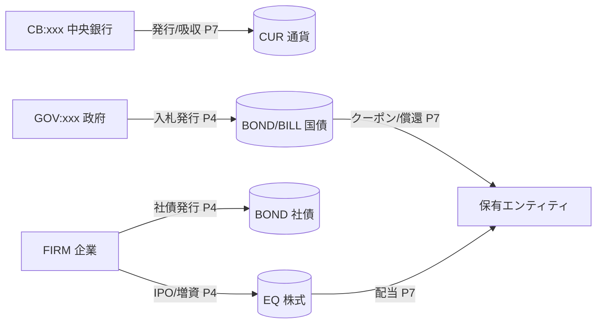
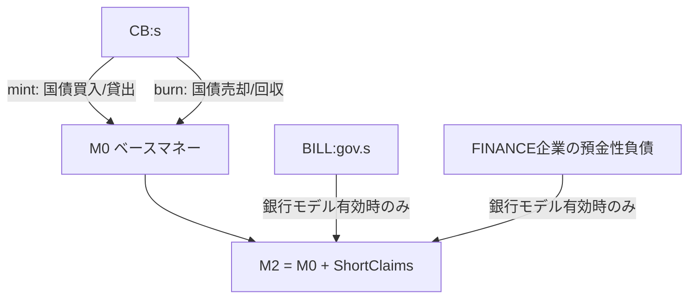
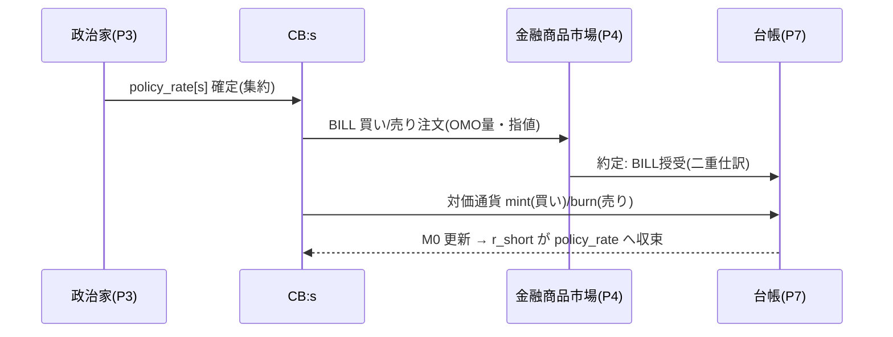
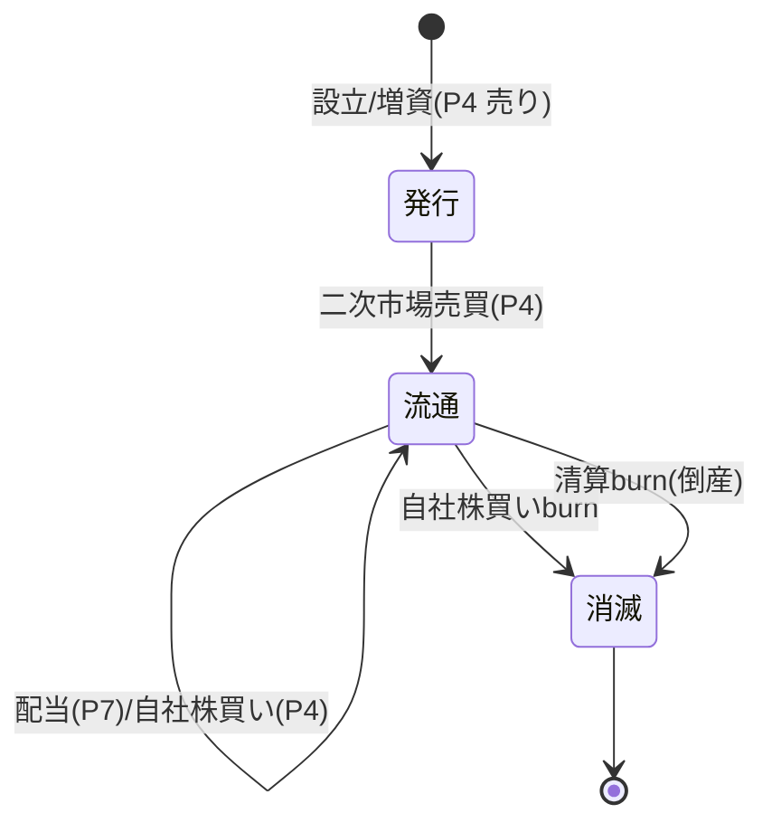
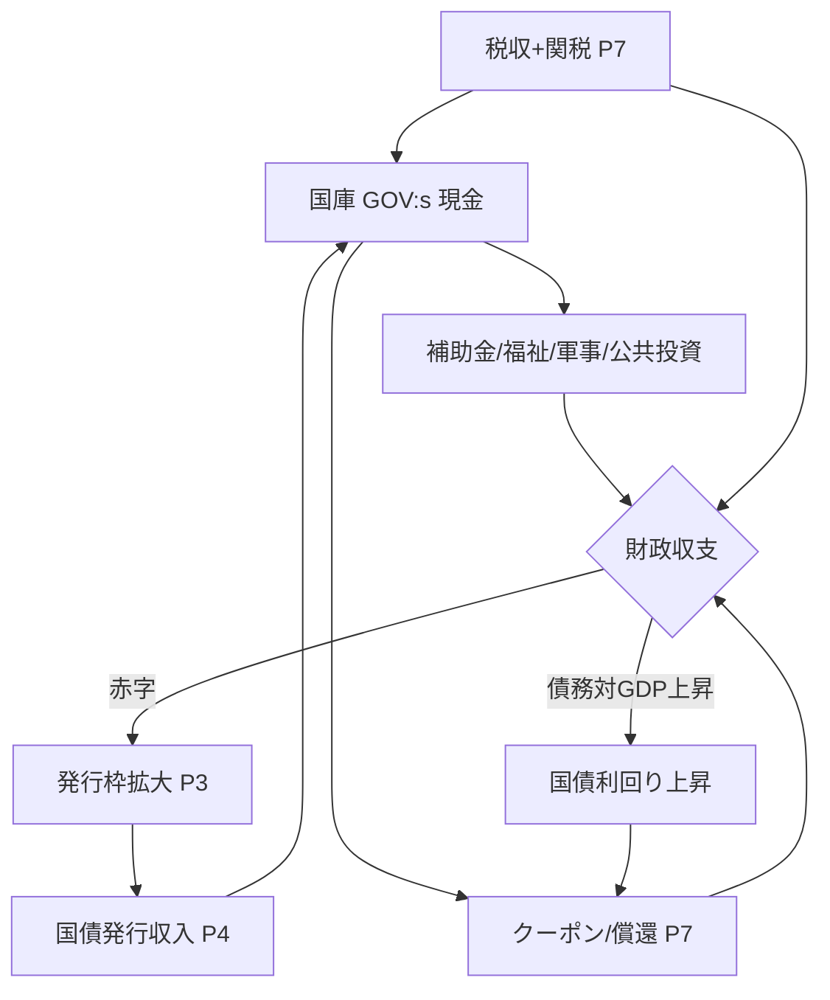

# 11. 金融と金融商品

本書は FinBox の金融サブシステム — 通貨・中央銀行・金融政策・国債・社債・株式・利息と利回り・WUI 評価・マクロ金融指標・財政 — を実装可能な水準で定義する。横断定義は [用語集と正準仕様](00-glossary.md) を唯一の真実として参照し、ここでは再定義せず詳細化する。資産クラス (`CUR`/`BOND`/`BILL`/`EQ`) は用語集 0.5、ターンパイプライン (P0..P9) は 0.11、時間定数 (`TURNS_PER_YEAR=48`) と単利按分は 0.7、二重仕訳台帳は 0.9、市場決済とプロトコル移転の区別は 0.10、政治意思決定の集約は 0.12 に従う。金融商品の発行・流通・約定の機構は [市場と取引](09-markets-and-trading.md)、財政・課税・政策決定の上流は [政治と統治](12-politics-and-government.md)、台帳と保存則は [経済と台帳](08-economy-and-ledger.md)、初期金利・初期残高・通貨最小単位は [構成と初期化](16-configuration-and-initialization.md) を参照する。

## 11.1 範囲と基本不変条件

金融サブシステムが扱う資産クラスと、その生成/消滅点 (用語集 0.5.1, 0.17) を以下に整理する。

| 資産クラス | 本書での主題 | 生成点 | 消滅点 |
| --- | --- | --- | --- |
| `CUR` | 通貨・マネーサプライ | 中央銀行の発行 (mint, P7) | 中央銀行の吸収 (burn, P7) |
| `BOND` | 国債・社債 (利付) | 入札発行 (P4) | 満期償還・買戻 (P7/P4) |
| `BILL` | 国庫短期証券 (割引) | 割引入札発行 (P4) | 満期償還 (P7) |
| `EQ` | 株式 (持分) | 設立/増資 (P4) | 自社株買い・清算 (P4/P7) |

本書全体を貫く不変条件:

- すべての金額・数量・価格・クーポン・利息は整数 (最小通貨単位、用語集 0.8)。按分・割引・利回り計算の中間結果は実数で計算してよいが、台帳に反映する移転額は必ず整数へ丸める (丸め規則は 11.7.5)。
- 通貨の総量は中央銀行のミント/バーンを除き保存される。債券・株式の口数はそれぞれ発行/償還・買戻/清算を除き保存される (用語集 0.17)。
- クーポン・利息・割引・配当の支払はすべて**プロトコル移転** (P7 FISCAL) であり市場を経由しない。発行・流通・買戻・自社株買いは**市場決済** (P4 CLEAR) を経由する (用語集 0.10)。
- 金融商品の数量は「口数」で整数。`BOND`/`BILL` 1口の額面 `face` は構成で固定 (既定 `face = 1000` 最小単位)。`EQ` 1口は株式1株。



## 11.2 通貨とマネーサプライ

### 11.2.1 6法定通貨と最小単位

通貨は用語集 0.6 の6種 (`CUR:ALD`, `CUR:BOR`, `CUR:CYR`, `CUR:DOR`, `CUR:ESM`, `CUR:FAR`) に固定する。各通貨の残高は整数で、その整数の1単位が**最小通貨単位** (minor unit) である。表示上の「1通貨」は `unit_scale` 最小単位に等しい (既定 `unit_scale = 1000` = `money.minor_unit`、すなわち小数第3位相当を整数で保持)。価格・約定・利息はすべて最小単位の整数で行い、**表示時のみ** `unit_scale` で除して人間可読化する (小数3桁＋3桁区切り、例 内部 `1500000000` → `1,500,000.000`。整形規則は [16 §16.3.1](16-configuration-and-initialization.md))。表示整形は提示専用で台帳・約定・観測・決定論には影響しない。`unit_scale`(=`money.minor_unit`) は通貨ごとに構成可 ([16](16-configuration-and-initialization.md))。

### 11.2.2 マネーサプライの定義

各国通貨について以下の集計量を P9 ADVANCE で確定する。`s ∈ {ALD,BOR,CYR,DOR,ESM,FAR}` を国コードとする。

- **ベースマネー (M0)** `M0[s]`: 中央銀行が発行した通貨総量 = 全エンティティの `CUR:s` 現物残高の総和 (中央銀行自身の保有を除く)。FinBox には部分準備銀行の信用創造を持たない単純化モデルを採るため、M0 がマネーサプライの中核である。
- **広義マネーサプライ (M2)** `M2[s] = M0[s] + ShortClaims[s]`。`ShortClaims[s]` は満期1年未満の `BILL:gov.s.*` と社債のうち FINANCE 産業企業 (銀行) が発行した預金性負債の額面合計。銀行モデルを構成で無効化した場合 (既定: 簡易モード) は `M2 = M0` とする。
- マネーサプライの増減は中央銀行の発行/吸収 (11.3.3) のみが起点となる。徴税・利払・配当・賃金は既存通貨の再配分であり総量を変えない (用語集 0.10, 0.17)。



> 簡易モード (既定) では `M2 = M0` とし、`ShortClaims` は加算しない。`BILL`・FINANCE 企業の預金性負債を `ShortClaims` として M2 に加算するのは銀行モデル有効時のみである (11.2.2 の M2 定義に整合)。

## 11.3 中央銀行と金融政策

### 11.3.1 中央銀行の位置づけ

中央銀行 `CB:<country_code>` は通貨の発行/吸収と政策金利の執行を担う制度的主体 (用語集 0.4)。中央銀行は自発的な利益最大化主体ではなく、政治家が P3 GOVERN で決定した政策目標を P4/P7 で機械的に執行する。執行を担うエージェントは `CENTRAL_BANKER` ロール ([06](06-roles.md)) を持ち、政策金利そのものを決める権限は持たない (それは政治家の集約決定、用語集 0.12)。`CENTRAL_BANKER` は公開市場操作の入札パラメーター (買入/売却量・指値) を、与えられた政策金利目標に整合するよう生成する執行アクター ([07](07-machine-learning.md) の報酬は目標金利への追従誤差で与える)。

### 11.3.2 政策金利の決定と執行

- **決定 (P3, 政治家)**: 政策金利 `policy_rate[s]` は SCALAR 政策レバー (用語集 0.12, [12](12-politics-and-government.md))。各政治家が bps 単位で提案し、平均を政策レンジ `[POLICY_RATE_MIN, POLICY_RATE_MAX]` (既定 `[-100, 4000]` bps、すなわち -1.00%〜40.00%) でクランプし `POLICY_RATE_TICK` (既定 25bps) へ丸める。
- **意味**: `policy_rate[s]` は年率。中央銀行がオーバーナイト相当 (1ターン) で資金を供給/吸収する基準金利であり、ターン按分は単利 `policy_rate_turn = policy_rate / TURNS_PER_YEAR`(用語集 0.7) で計算する。
- **執行 (P4/P7)**: 中央銀行は短期金利を政策金利へ誘導するため、自国短期国債 `BILL:gov.s.*` の公開市場操作 (11.3.3) を P4 で行い、それに伴う現金注入/回収を P7 のプロトコル移転で確定する。

### 11.3.3 公開市場操作 (OMO)

公開市場操作は「中央銀行が市場で国債/短期証券を売買し、その対価通貨を発行 (mint) または吸収 (burn) する」操作である。債券の授受は市場経由 (P4 CLEAR、用語集 0.10) でよいが、対価通貨の生成/消滅は中央銀行のみに許された mint/burn 点である。

- **買いオペ (緩和)**: 中央銀行が `BILL`/`BOND` を市場で買う。支払う通貨を **mint** して市場決済に充てる → M0 増加 → 短期金利低下圧力。
- **売りオペ (引締)**: 中央銀行が保有 `BILL`/`BOND` を市場で売る。受け取った通貨を **burn**(中央銀行口座から消滅) → M0 減少 → 短期金利上昇圧力。
- **数量の決定**: `CENTRAL_BANKER` は当ターンの短期市場実効金利 `r_short[s]`(直近 `BILL` 約定利回り、11.5.4) と目標 `policy_rate[s]` の乖離を縮小する向きにオペ量を提示する。比例制御 `omo_qty = clamp( K_omo × (r_short - policy_rate) × OutstandingShort, -OMO_MAX, +OMO_MAX )` を既定とする (`K_omo`, `OMO_MAX` は構成、[16](16-configuration-and-initialization.md))。`OutstandingShort[s]` は残存満期1年未満の `BILL:gov.s.*` 額面合計 ([16 §16.15.7](16-configuration-and-initialization.md)、11.2.2 の `ShortClaims` と同基準)。`omo_qty` は round-half-up で整数化 (用語集 0.20)。正なら売りオペ、負なら買いオペ。
- **mint/burn の記録**: 通貨の生成/消滅は `mint_id` を原因として台帳に単側記録される (二重仕訳の相手は「発行勘定」、用語集 0.9, 0.10)。債券側の授受は通常の二重仕訳約定。



### 11.3.4 標準預金ファシリティ (準備預金) と物価波及

- **準備預金/常設ファシリティ (無担保1ターン現金)**: 銀行モデル無効の簡易モードでは、すべてのエンティティが中央銀行に対し政策金利で1ターンの現金を預入/借入できる**常設ファシリティ**を持つと近似する。ターン末に余剰現金を預ければ `+policy_rate_turn`、不足を借りれば `-policy_rate_turn` の利息が P7 で発生する (借入は金融負債として計上、現物残高は負にしない、用語集 0.9)。このファシリティ利息は資金の機会費用を市場価格へ織り込ませる装置であり、既定では `RESERVE_FACILITY_ENABLED = true`。
- **ファシリティと貸借プールの役割分離**: 本ファシリティは**市場性のない余剰現金の運用・調達 (政策金利での無担保1ターン貸借)** を担い、信用取引のレバレッジ調達原資となる**貸借プール (Lending Pool、有担保のレバレッジ調達、[09](09-markets-and-trading.md) 信用取引節)** とは別系統である。ファシリティは無担保・政策金利固定・1ターン精算で現金の機会費用を表現し、貸借プールは証拠金担保・利用率連動金利でレバレッジ需給を仲介する。両者を分離することで「リスクフリーの現金運用」と「有担保のレバレッジ与信」を独立に扱う。
- **物価・レバレッジへの波及 (伝達経路)**: 政策金利の変化は次の経路で CPI・産出・レバレッジへ波及する。(1) 金利上昇 → 債券利回り上昇・割引現在価値低下 → 投資・企業の資金調達コスト増 → 生産投資抑制。(2) ファシリティ金利上昇 → 現金保有の機会費用増 → 消費需要の繰延べ → 財市場の需要曲線左シフト → 約定価格低下 → CPI 低下。(3) 政策金利上昇 → 通貨貸借プールの `base_rate = policy_rate[s]` 上昇 → レバレッジ調達コスト上昇 → 投機的レバレッジ縮小、という金融政策の信用波及経路 ([09](09-markets-and-trading.md) 貸借プール節の通貨プール `base_rate` が `policy_rate[s]` に連動)。波及は価格の内生的形成 (P4 板寄せ) を通じて自然に生じ、外生の価格操作は行わない。緩和は逆。

## 11.4 国債 (Sovereign Bond) と国庫短期証券 (BILL)

### 11.4.1 資産IDと属性

- 利付国債: `BOND:gov.<country_code>.<YYYY>Q<quarter>`(例 `BOND:gov.ALD.2031Q1`)。`<YYYY>Q<quarter>` は満期 (四半期境界)。
- 国庫短期証券: `BILL:gov.<country_code>.<YYYY>Q<quarter>`。割引発行・額面償還、クーポンなし。

各銘柄は以下の不変属性 (発行時に確定し、流通中は変化しない) を持つ。これらは [データモデル](15-data-model.md) の `instrument` テーブルに格納する。

| 属性 | 型 | 説明 |
| --- | --- | --- |
| `issuer` | entity_id | `GOV:s`(国債) |
| `face` | int | 1口あたり額面 (既定 1000 最小単位) |
| `coupon_bps` | int(bps) | 年率クーポン (bps、BILL は 0) |
| `issue_tick` | int | 発行ターン |
| `maturity_tick` | int | 満期ターン (四半期/年境界) |
| `quote_ccy` | asset_id | 表示・約定通貨 = `CUR:s` |

- 利付国債 (`BOND:*`) と割引短期証券 (`BILL:*`) は `asset_id` の接頭辞で識別する。`BILL:*` は `coupon_bps == 0`(割引発行) で表し、別途の `kind` 属性は持たない (データモデル [15 §15.8](15-data-model.md) と整合)。

### 11.4.2 発行枠の決定と入札発行

- **発行枠の決定 (P3)**: 各国の当ターン純発行枠 `bond_issue_cap[s]` は SCALAR/ALLOCATION 政策 (用語集 0.12)。政治家は財政赤字 (11.8) と債務対GDP比を見て、発行する額面総額と満期構成 (短期 BILL / 中長期 BOND の配分) を提案し、集約値を採る。発行枠は当該国の単一国債限度 `DEBT_ISSUE_MAX_PER_TURN` (構成) でクランプ。
- **入札発行 (P4 = 売り注文)**: 政府は確定した発行枠の銘柄を**金融商品市場へ売り注文として投入**する。価格は板寄せで内生決定 (用語集 0.10「国債発行は金融商品市場で行う」)。発行方式は構成 `BOND_AUCTION_STYLE`:
  - `UNIFORM_PRICE`(既定): 板寄せ均衡価格 (用語集の単一約定価格、[09](09-markets-and-trading.md)) で全落札。
  - `MARKET_LIMIT`: 政府が指値 (=最低落札価格 = 利回り上限) を設定し、それを満たす買い注文のみ約定。未達分は失権 (当ターン未発行) し、不足する財政資金は中央銀行の直接引受 (`CB_DIRECT_UNDERWRITE = true` のとき) または翌ターン繰越。
- **発行収入の使途**: 入札で政府が受け取る通貨は既存通貨の移動 (投資家→政府) であり mint ではない。中央銀行直接引受の場合のみ通貨が mint される (財政ファイナンス、インフレ要因)。

### 11.4.3 クーポン支払・流通・償還

- **クーポン支払 (P7)**: 利付国債は四半期境界 (`is_quarter_end(tick)`、3.1.2、既定 `TURNS_PER_MONTH×3 = 12` ターン周期) ごとに、保有口数 `q` に対し `coupon = floor( q × face × coupon_bps / 10000 / 4 )` をプロトコル移転で支払う (10 §10.8.4・15 §15.8 と同一表現。四半期一括が正準、年率の四半期按分=単利、用語集 0.7。`/4` は1年=4四半期。丸めは `floor` で用語集 0.20 に従い、按分残差は発行体側で吸収)。支払元は `GOV:s`、支払先は当該銘柄の保有者全員 (台帳の保有スナップショットを P7 開始時点で確定)。
- **流通市場での売買 (P4)**: 発行後の `BOND`/`BILL` は二次市場で自由に売買され、価格・利回りは板寄せで内生的に変動する。`BOND`/`BILL` は現物取引のみ (信用取引の対象外、[09](09-markets-and-trading.md) 信用取引節)。信用ショートを伴う他資産 (`CUR`/`EQ`/storable `COMM`) のショートは現物残高をマイナスにせず `Position` の借入負債 (`borrowed_value + accrued_interest`) として計上する (用語集 0.9、[08](08-economy-and-ledger.md) §8.8、[09](09-markets-and-trading.md) 信用取引節、[15](15-data-model.md) §15.6 の `Position`)。
- **元本償還 (P7, 満期 `tick == maturity_tick`)**: 政府は保有者へ `redeem = q × face` を支払い、当該口数を **burn**(債券消滅、用語集 0.5.1)。BILL は割引発行のため償還=額面支払のみ (クーポンなし)。償還資金が不足する場合、政府は同ターン P3 で借換債 (roll-over) を発行枠に組み込む。
- **デフォルト**: 政府が償還・クーポンを支払えない場合 (国庫残高不足かつ借換不成立) は `SOVEREIGN_DEFAULT` イベント (P7) を発火。未払分は債権者へ `haircut_rate`(構成、既定 100% = 全額デフォルト) で減額され、当該国の信用スプレッドが上昇 (11.4.4) する。

### 11.4.4 利回りとスプレッド

- **満期利回り (YTM)** は二次市場価格 `P`(1口の約定価格、最小単位) から導く。利付国債の年率 YTM `y` は次の現在価値方程式の解 (11.6 の単利現在価値で近似する正準式):

```text
P = Σ_{k=1..N} ( c / (1 + y·(t_k / TURNS_PER_YEAR)) ) + face / (1 + y·(T / TURNS_PER_YEAR))
  c   = face × coupon_bps / 10000 / 4         (四半期クーポン額, 整数丸め前)
  t_k = 第k回クーポンまでの残存ターン数
  T   = 満期までの残存ターン数 (= maturity_tick − tick)
  N   = 残存クーポン回数
```

  単利割引を正準とする (用語集 0.7 の利息=単利按分に整合)。`y` は二分法で `[−0.5, 5.0]` 区間を**固定 64 反復**で求め bps へ丸める ([16 §16.15.7](16-configuration-and-initialization.md))。許容誤差ではなく固定反復回数で打ち切ることでプラットフォーム間でビット一致する (検証で誤差 1e-9 は約33反復、64反復で区間幅はサブ bps)。

- **BILL の利回り (割引利回り)**: `y_bill = ((face − P) / P) × (TURNS_PER_YEAR / T)`。割引証券は満期に額面、購入時は `P < face`。
- **対国債スプレッド**: 後述の社債・他国債の利回りから、同満期の自国国債 YTM を引いた差 (bps) を信用スプレッドとする。`SOVEREIGN_DEFAULT` 後はその国の発行銘柄のクリアリング価格が低下し、内生的に利回り (=調達コスト) が上昇する。

## 11.5 社債 (Corporate Bond)

### 11.5.1 資産IDと発行

- 社債: `BOND:firm.<6桁>.<YYYY>Q<quarter>`(例 `BOND:firm.000042.2032Q3`)。属性は国債と同形 (`issuer = FIRM:nnnnnn`)。
- **発行 (P4 = 売り注文)**: 経営者 (`ENTREPRENEUR`) が企業の負債調達として、額面・クーポン・満期を指定した銘柄を金融商品市場へ売り注文として投入する。発行可能額は企業の信用枠 `credit_limit = round(equity_value × LEVERAGE_MAX)` でクランプ (`equity_value` は時価総額、`LEVERAGE_MAX` は構成、既定 3.0)。

### 11.5.2 デフォルトリスクとスプレッド

- 社債のクーポン・元本支払は P7 のプロトコル移転。支払元は `FIRM:nnnnnn` の現金残高。
- **デフォルト**: 企業がクーポンまたは元本を支払えない場合、企業は債務超過とみなされ倒産処理 ([10](10-industry-and-production.md) の清算) へ入る。清算時は残余資産を優先順位 (担保付債務 → 無担保社債 → 株式) で分配 (用語集 0.10 の倒産清算)。社債は元本×回収率 `recovery_rate`(残余資産依存) で部分回収、株式は劣後し時価消滅。
- **対国債スプレッド**: 社債利回り `y_corp`(11.4.4 と同式) と同満期の発行国国債 YTM の差が信用スプレッド。スプレッドは市場が企業のデフォルト確率・レバレッジ・産業リスクを織り込んで内生形成する (外生固定しない)。倒産が増えると当該産業・国の社債スプレッドが上昇する。

## 11.6 株式 (Equity)

### 11.6.1 資産IDと発行

- 株式: `EQ:firm.<6桁>`(例 `EQ:firm.000042`)。1口=1株。総発行株数 `shares_outstanding` は発行/自社株買いで増減する整数。
- **IPO/増資 (P4 = 売り注文)**: 企業の設立 (genesis 出資) または増資時に、新株を金融商品市場へ売り注文として投入する。価格は板寄せで内生決定。発行収入は企業の現金残高に入る (投資家→企業の通貨移動、mint ではない)。
- **売買 (P4)**: 既発株は二次市場で自由売買。価格は板寄せで内生的に決まる。

### 11.6.2 配当・自社株買い・時価総額・倒産

- **配当 (P7)**: 経営者は当期利益から配当性向 `payout_ratio`(企業の行動変数、`[0,1]`、四半期境界で実行) を指定。`dividend_per_share = floor( distributable_profit × payout_ratio / shares_outstanding )` を全株主へプロトコル移転で支払う。`distributable_profit` は留保利益のうち現金で裏付けられた分。端数 (floor の切り捨て分) は企業に留保。
- **自社株買い (P4 = 買い注文)**: 企業は自己の `EQ` を市場で買い、取得株を **burn**(株式消滅) して `shares_outstanding` を減らす。買付資金は企業現金。
- **時価総額 (market cap)**: `mktcap = last_clear_price(EQ:firm.nnnnnn) × shares_outstanding`(用語集 0.16 の純資産評価に準拠、最新板寄せ清算価格でマーク)。
- **倒産時消滅 (P7/清算)**: 企業清算時、現物資産の売却は P4 で行い、社債等の優先債務を弁済した後の残余を株主へ P7 で分配し、全 `EQ` を burn (08 §8.6.2 liquidation_id の P4/P7 定義に整合)。残余が負なら株式価値はゼロで消滅 (有限責任、株主は追加負担なし)。



## 11.7 利息・利回り・現在価値の計算

### 11.7.1 ターン按分 (単利、正準)

ファシリティ利息・借入/預貸金利の期間発生はすべて単利按分 (用語集 0.7)。年率 `r_annual`(bps) のターン利息は元本 `Pr` に対し:

```text
interest_turn = floor( Pr × r_annual / 10000 / TURNS_PER_YEAR )      (ファシリティ/借入利息向け、毎ターン発生)
```

このターン按分式はファシリティ (11.3.4)・常設ファシリティ借入・**貸借プールの信用取引利息 ([09](09-markets-and-trading.md) 貸借プール節)** の毎ターン発生にすべて用いる正準式である。貸借プールの利用率連動 `borrow_rate`/`supply_rate` で建てたポジションの利息 `interest = floor( borrowed_value × borrow_rate / 10000 / TURNS_PER_YEAR )` は本式 (`Pr = borrowed_value`, `r_annual = borrow_rate`) の再利用であり、09 側で再定義しない。利付債のクーポンはこれを用いず、四半期一括 `floor( q × face × coupon_bps / 10000 / 4 )` が正準 (11.4.3、四半期境界でのみ発生)。両者は用途が異なるため混用しない。すべての発生額は台帳反映前に整数へ丸める (丸め方向は用語集 0.20 に従い `floor`)。

### 11.7.2 複利文脈の式

連続的な指数化が必要な文脈 (実質値のデフレート、長期成長率の累積等、11.9) のみ複利を用いる。年率 `g_annual` のターン成長率は `g_turn = (1 + g_annual)^(1/TURNS_PER_YEAR) − 1`(用語集 0.7)。利息発生 (クーポン・ファシリティ) は単利、価格指数や WUI 再加重の累積指数化は複利、と用途で明確に分ける。

### 11.7.3 現在価値 (PV)

将来ターン `t`(残存ターン数) に受け取るキャッシュフロー `CF` の現在価値は、単利割引を正準とする:

```text
PV = CF / ( 1 + y · (t / TURNS_PER_YEAR) )      (単利, 債券評価の正準)
```

割引率 `y` は同満期の自国国債 YTM にリスクスプレッドを加えた要求利回り。複利割引が必要な評価モデル (任意拡張) では `PV = CF / (1 + y)^(t / TURNS_PER_YEAR)` を用い、その旨を明示する。

### 11.7.4 利回り曲線 (任意)

各国・各ターンで、未償還 `BILL`/`BOND` の (残存ターン, YTM) 散布から満期別代表利回りを集計し、利回り曲線 `yield_curve[s]` をマクロ指標として公開する (11.9)。代表点は満期バケット (1ターン/1四半期/1年/2年超) ごとの直近約定加重平均 YTM。逆イールド (短期 > 長期) は景気後退シグナルとして観測空間に含めてよい ([07](07-machine-learning.md))。

### 11.7.5 丸め規則

丸め方向は用語集 0.20 (丸めの正準規則) を唯一の正準とし、本書はその金融文脈への適用を示す。

- 利息・クーポン・単利按分: `floor`(切り捨て)。台帳へ移転される利払額はすべて切り捨てで整数化する (用語集 0.20)。年率四捨五入に倒すと過払い→現金不足→デフォルト誤発火を招くため `floor` に統一する。
- 配当 1株あたり: `floor`(株主間の公平性のため切り捨て、端数は企業留保、11.6.2)。
- 評価専用の派生値 (YTM・現在価値・mark price・mid 気配・指数) は台帳移転ではないため上記の対象外で、表示丸め (bps への丸め等) を各文脈で行う (11.4.4, 11.7.3)。
- 二重仕訳整合: 丸めにより借方・貸方の総額がずれる場合 (例: 多数保有者への按分)、端数残差は発行体 (政府/企業) 側で吸収し、資産ごとの借方=貸方を厳守する (用語集 0.9, 0.17)。

### 11.7.6 経常インカム/キャリー源の正準一覧

`YIELD_INVESTOR`(`INVESTOR` の `style = YIELD` 派生、[06](06-roles.md)・[07](07-machine-learning.md) §7.5.2) が収穫対象とする経常的キャッシュフロー (インカム/キャリー) は、すべて本書または [09](09-markets-and-trading.md) が既に定義する実在フローであり、ここで列挙して観測・報酬の正準入力として参照する (07 側で再定義しない。架空の利回りは作らない)。すべて P7 FISCAL のプロトコル移転、または貸借プールの利息として実在する。

| インカム/キャリー源 | 正準定義 | 発生 |
| --- | --- | --- |
| 国債クーポン | `BOND:gov.*` の四半期クーポン (11.4.3) | P7 (四半期境界) |
| 社債クーポン | `BOND:firm.*` の四半期クーポン (11.5、11.4.3 と同式) | P7 (四半期境界) |
| `BILL` 割引利回り | 割引購入→額面償還、`y_bill`(11.4.4) | 購入 P4 / 償還 P7 |
| 株式配当 | `EQ:firm.*` の `dividend_per_share`(11.6.2、配当性向に応じて) | P7 (四半期境界) |
| 貸借プール供給金利 | 余剰アセット供給で得る `supply_rate`(利用率連動、[09](09-markets-and-trading.md) 貸借プール節、利息式は 11.7.1) | P7 |
| 常設預金ファシリティ金利 | 余剰現金の政策金利運用 `+policy_rate_turn`(11.3.4、無担保1ターン、貸借プールとは別系統) | P7 |
| FX キャリー | 高政策金利通貨を低政策金利通貨でファンディングして保有し金利差を得る。`MARGIN` では貸借プールの通貨間借入で増幅 ([09](09-markets-and-trading.md) 信用取引節) | P7 (金利差) |

> これらは方向性 (価格の上下) の利得ではなくスプレッド/キャリーの積み上げである。`YIELD_INVESTOR` の報酬整形 (インカム成分の主項化・キャピタル毀損の下方非対称ペナルティ) と観測 (利回り曲線・配当利回り・プール `supply_rate`/`borrow_rate`/利用率・政策/ファシリティ金利・通貨間金利差) は [07](07-machine-learning.md) §7.3/§7.5 が定義し、その入力となる利回り定義 (YTM・配当利回り・`supply_rate`) は本書を正準とする。系全体での含意として、`YIELD_INVESTOR` は貸借プールの主要な供給者 (lender) かつ国債・社債の主要な買い手となり、信用取引・政府財政・企業資金調達へ流動性を供給する自然な対向となる ([09](09-markets-and-trading.md) 貸借プールの持続可能性を内生的に支える)。

## 11.8 財政 (政府の歳入・歳出・収支)

財政の政策決定 (税率・関税・予算配分) は [政治と統治](12-politics-and-government.md) が主管し、本書はその金融的帰結 (国庫の現金フロー・国債発行・債務持続性) を定義する。

### 11.8.1 歳入と歳出

| 区分 | 項目 | 経路 | フェーズ |
| --- | --- | --- | --- |
| 歳入 | 所得税・法人税・消費税 | プロトコル移転 (徴税) | P7 |
| 歳入 | 関税 | プロトコル移転 (関税徴収) | P7 |
| 歳入 | 国債/BILL 発行収入 | 市場決済 (入札) | P4 |
| 歳出 | 補助金・社会保障・失業給付 | プロトコル移転 | P7 |
| 歳出 | 軍事予算 (軍需品調達) | 市場決済 (調達) + プロトコル消費 | P4/P8 |
| 歳出 | 公共投資 (建設労働力調達) | 市場決済 | P4 |
| 歳出 | 国債クーポン・元本償還 | プロトコル移転 | P7 |

### 11.8.2 財政収支と国庫

- **プライマリーバランス** `primary_balance[s] = 税収 + 関税 − (補助金 + 福祉 + 軍事 + 公共投資)`。
- **財政収支 (総合)** `fiscal_balance[s] = primary_balance[s] − 利払 (クーポン+償還按分)`。負なら財政赤字。
- **国庫 (現金残高)** は `GOV:s` の `CUR:s` 残高。赤字は P3 の発行枠拡大 (国債発行) でファイナンスする。国庫が枯渇し発行も不成立なら歳出を比例カット (BUREAUCRAT が執行、[06](06-roles.md)) するか `SOVEREIGN_DEFAULT`(11.4.3)。

### 11.8.3 債務持続性

- **政府債務** `gov_debt[s] = Σ 未償還 BOND/BILL の額面 × 口数`。
- **債務対GDP比** `debt_to_gdp[s] = gov_debt[s] / nominal_gdp[s]`(用語集 0.16、自国通貨建て名目GDP、年率換算)。
- **持続性シグナル**: `debt_to_gdp` 上昇は国債利回り上昇 (市場が信用リスクを織り込む) を招き、利払増 → さらなる赤字、という内生フィードバックを生む。政治家の報酬関数 ([07](07-machine-learning.md)) に債務持続性ペナルティを含め、過度な財政膨張を抑制する ([12](12-politics-and-government.md))。



## 11.9 WUI と評価・マクロ金融指標

### 11.9.1 WUI (World Unit Index) バスケット

WUI は6通貨の貿易加重バスケットで定義する合成計数単位 (numéraire、用語集 0.16)。投資家・プレイヤーの純資産を通貨横断で一貫評価し順位付けするための基準である。

- **バスケット重み** `w[s]`(`Σ w[s] = 1`):
  - **genesis (初期)**: 等加重 `w[s] = 1/6`(用語集 0.16)。
  - **定期再加重**: 年境界 (`tick % TURNS_PER_YEAR == 0`) ごとに、各国の貿易加重 (名目GDP・対外貿易シェアの合成) で更新する。`w_raw[s] = α × gdp_share[s] + (1−α) × trade_share[s]`、`α = WUI_GDP_WEIGHT`(既定 0.5)、`w[s] = w_raw[s] / Σ w_raw`。`gdp_share[s] = nominal_gdp_WUI[s] / Σ nominal_gdp_WUI`、`trade_share[s] = (輸出+輸入)_WUI[s] / Σ`。
- **WUI 水準の連続性 (連鎖指数)**: 再加重時に WUI の絶対水準が跳ねないよう、新旧重みの境界で連鎖係数を掛け、`WUI_level` を連続にする。`WUI_level` の累積はターン複利で指数化する (用語集 0.7 の成長=複利、11.7.2)。
- **1 WUI の基準価値**: genesis で `1 WUI = Σ_s w[s] × (1 / fx0[s])` となるよう正規化定数を定める (`fx0[s]` は genesis の対基準 FX)。以後は各通貨の対 WUI レート `fx_wui[s]` を毎ターン板寄せ FX クロスから導出 (11.9.2)。

### 11.9.2 対WUIレートと純資産評価

- **対WUIレート** `fx_wui[s]`: ある通貨1単位 = 何 WUI か。FX 市場 ([09](09-markets-and-trading.md)) の通貨ペア約定価格からクロスレートを構成し、バスケット重みで整合化する。基準通貨 (既定 `CUR:ALD`) を経由したトライアンギュレーションで全通貨対を一意化する。
- **純資産 (NAV)**: エンティティの純資産は全ポジションを最新板寄せ清算価格でマークし WUI 換算した合計 (用語集 0.16)。現物残高に加え、貸借プール/AMM の持分債権 (供給者として) を加算し、信用ポジションの借入負債 (`borrowed_value + accrued_interest`) を控除する ([08](08-economy-and-ledger.md) §8.8、[09](09-markets-and-trading.md) 信用取引節):

```text
NAV_WUI(e) = Σ_assets balance[e][a] × mark_price(a) × fx_wui(ccy(a))
           + Σ_pools  pool_share_claim(e,pool) × fx_wui(ccy(pool))     # 貸借プール/AMM 持分 (供給者)
           − Σ_positions (borrowed_value(e,pos) + accrued_interest(e,pos)) × fx_wui(ccy(borrowed))
mark_price(CUR:s)        = 1 (その通貨建て), fx で WUI 換算
mark_price(COMM/BOND/EQ) = 直近板寄せ清算価格 (約定なき資産は前回値を持ち越し)
```

  債券・株式は時価、信用ポジションの借入は負債として控除 ([08](08-economy-and-ledger.md) §8.8 の `margin_owed` を本 `Position` 負債へ具体化)、発行社債・ファシリティ借入も控除。貸借プールへ貸し出した現物はプール持分債権 (+) として、借り手の返済債務 (−) として両建てで計上されるため、系全体ではプール持分債権と信用ポジション負債がエンティティ間でネットしてゼロになり、総 NAV は保存される (用語集 0.17、[09](09-markets-and-trading.md) 不良債権の吸収節)。

### 11.9.3 投資家ランキング基準

- 投資家 (`INVESTOR` および派生ロール `YIELD_INVESTOR`/`ARBITRAGEUR`/`AMM`、[06](06-roles.md)) およびプレイヤーの順位は `NAV_WUI` を正準基準とする (用語集 0.16)。リーダーボードはターン末 (P9) の `NAV_WUI` 降順。比較は通貨横断で一貫するよう必ず WUI 換算後の値で行う ([13](13-players-and-multiplayer.md))。信用ポジションの持つ投資家も、担保時価・借入負債・プール持分を含めた 11.9.2 の `NAV_WUI` で一貫評価する (ポジションの債権/債務はエンティティ間でネットするため、順位は実現済み・含み損益を漏れなく反映する)。
- 補助指標としてリスク調整後リターン (期間 `NAV_WUI` 変化のシャープ比近似) を任意提供してよいが、正式順位は `NAV_WUI` のみ。

### 11.9.4 マクロ金融指標一覧

P9 ADVANCE で確定し観測空間・ニュースへ公開する金融系マクロ指標 (用語集 0.16 の詳細化)。国別 `[s]` と全世界集計を持つ。

| 指標 | 記号 | 定義 (要約) |
| --- | --- | --- |
| 政策金利 | `policy_rate[s]` | P3 集約決定 (年率 bps) |
| 短期実効金利 | `r_short[s]` | 直近 BILL 約定利回り |
| 利回り曲線 | `yield_curve[s]` | 満期バケット別 YTM (11.7.4) |
| インフレ率 | `inflation[s]` | CPI の前年同期比 (複利、用語集 0.7) |
| マネーサプライ | `M0[s]`, `M2[s]` | 11.2.2 (簡易モード既定では M2=M0、銀行モデル有効時のみ ShortClaims を加算) |
| 政府債務 | `gov_debt[s]` | 未償還額面合計 (11.8.3) |
| 債務対GDP比 | `debt_to_gdp[s]` | `gov_debt / nominal_gdp` |
| 財政収支 | `fiscal_balance[s]` | 11.8.2 |
| 為替レート | `fx[s/q]`, `fx_wui[s]` | FX 板寄せ・対WUI (11.9.2) |
| 国債利回り | `y_gov[s]` | 代表満期 YTM (11.4.4) |
| 社債スプレッド | `corp_spread[s]` | 社債YTM − 同満期国債YTM |
| WUI 水準 | `WUI_level` | 連鎖指数 (11.9.1) |

## 11.10 構成パラメーター (本書が定める既定値)

[構成と初期化](16-configuration-and-initialization.md) で上書き可能。本書が責任を持つ既定値を集約する。

| パラメーター | 既定値 | 意味 |
| --- | --- | --- |
| `unit_scale` | 1000 | 通貨の最小単位/表示単位比 (= `money.minor_unit`、通貨別可)。表示は小数3桁 (16 §16.3.1) |
| `POLICY_RATE_MIN` / `MAX` | -100 / 4000 bps | 政策金利レンジ |
| `POLICY_RATE_TICK` | 25 bps | 政策金利の丸め刻み |
| `policy_rate0[s]` | 250 bps | 初期政策金利 (genesis、全国共通既定) |
| `RESERVE_FACILITY_ENABLED` | true | 常設預金/借入ファシリティ |
| `K_omo` / `OMO_MAX` | 0.5 / DEBT_ISSUE_MAX×2 | OMO 比例制御ゲイン・上限 |
| `CB_DIRECT_UNDERWRITE` | false | 入札未達時の中央銀行直接引受 |
| `face` (BOND/BILL) | 1000 | 1口額面 (最小単位) |
| `BOND_AUCTION_STYLE` | UNIFORM_PRICE | 国債入札方式 |
| `DEBT_ISSUE_MAX_PER_TURN` | nominal_gdp×0.05 | 1ターン発行上限 |
| `LEVERAGE_MAX` | 3.0 | 社債発行の対時価総額レバレッジ上限 |
| `recovery_rate` | 残余依存 | 社債回収率 (清算で算出) |
| `haircut_rate` (sovereign) | 100% | 国債デフォルト減額率 |
| `WUI_GDP_WEIGHT` (α) | 0.5 | WUI 再加重の GDP 対貿易の配合 |
| `WUI_BASE_CCY` | CUR:ALD | WUI/FX クロスの基準通貨 |

初期残高 (政府国庫・中央銀行・投資家の genesis エンドウメント) と初期 FX (`fx0[s]`) は [16](16-configuration-and-initialization.md) で定義する。
