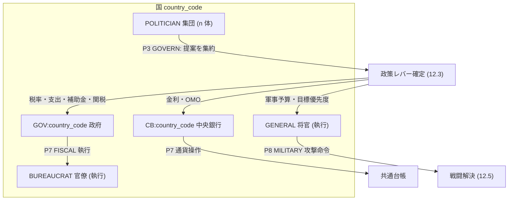
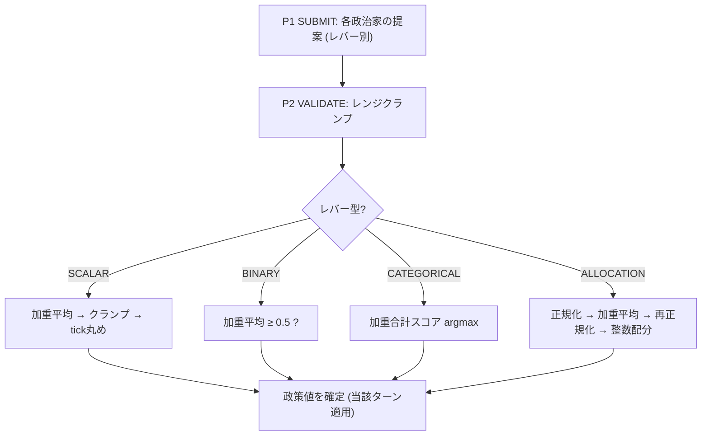
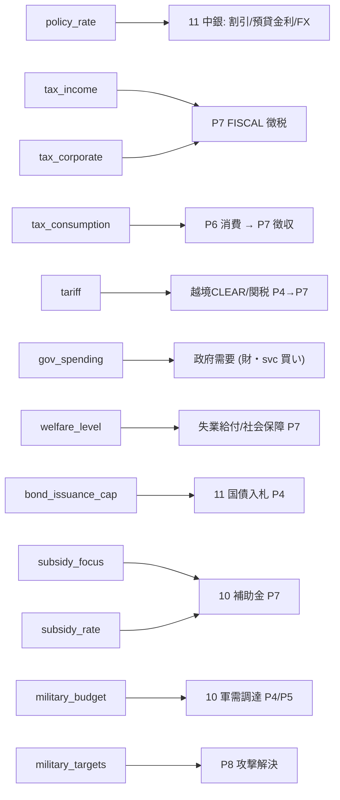
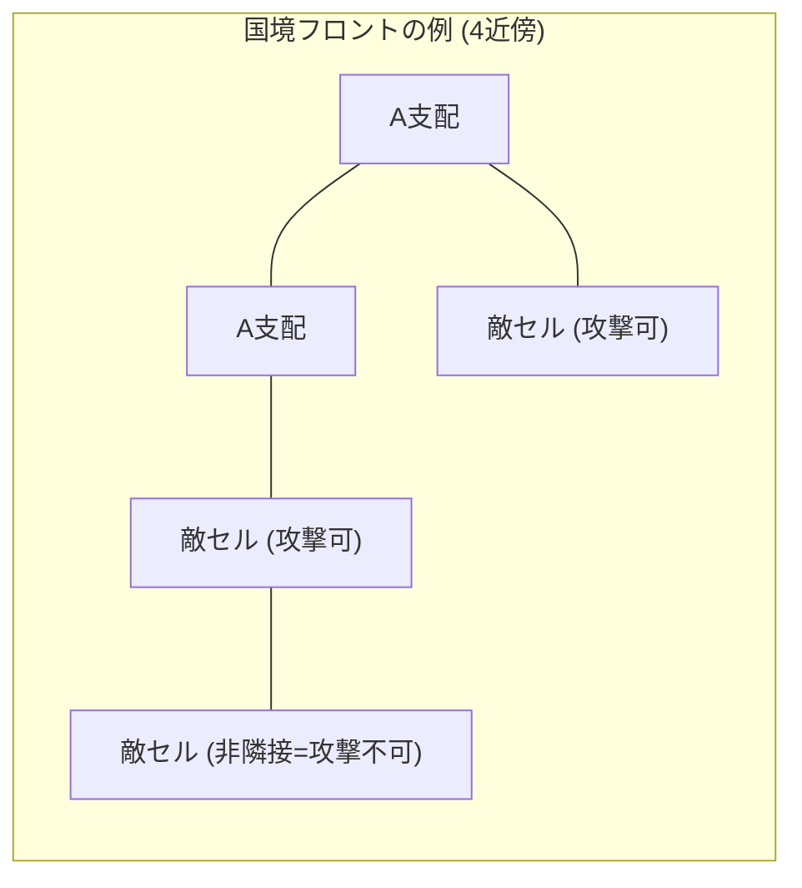
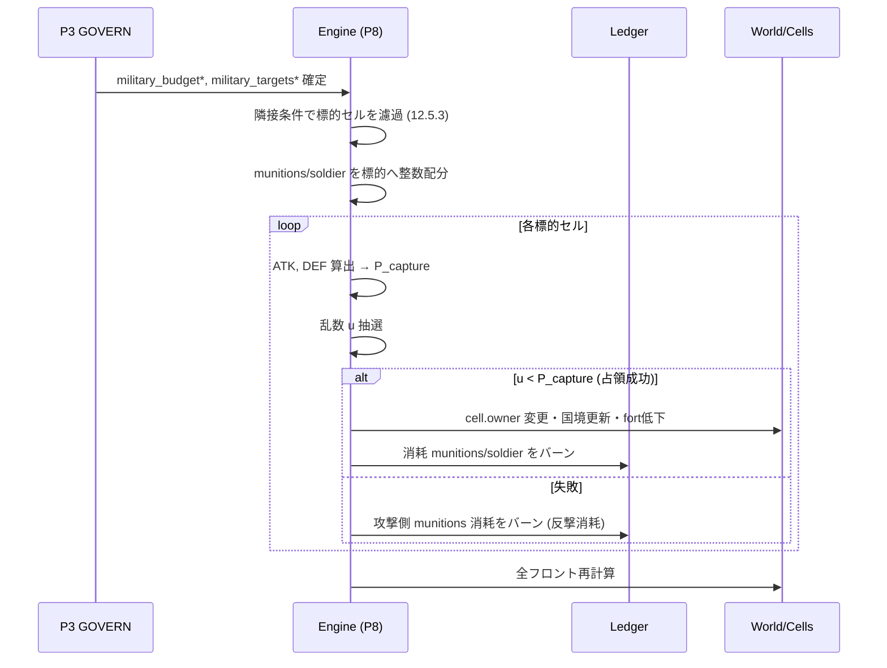
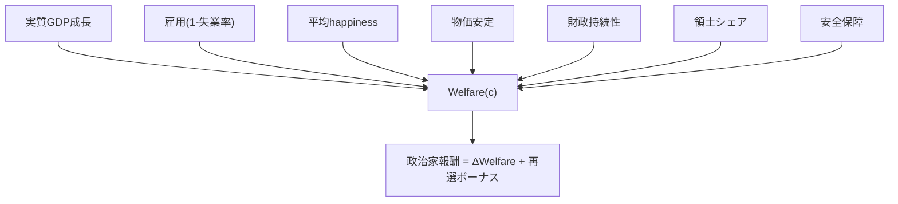

# 12. 政治と統治

本書は FinBox の政治・統治サブシステムの正準仕様である。各国の統治構造、政治家集団による意思決定の集約、政策レバー、課税、軍事、領土、外交・関税を実装可能な水準まで定義する。横断定義 (ID体系・列挙値・集約規則・ターンパイプライン・保存則) は [用語集](00-glossary.md) を唯一の真実として参照し、本書はそれを再定義せず詳細化する。特に政治意思決定の集約規則は [00-glossary.md 0.12](00-glossary.md)、徴税・補助金・軍需消費などのプロトコル移転は [00-glossary.md 0.10](00-glossary.md)、ターンフェーズ (P3 GOVERN / P7 FISCAL / P8 MILITARY) は [00-glossary.md 0.11](00-glossary.md) を正とする。

関連: 領土とセルは [04 世界と地理](04-world-and-geography.md)、財政・国債・中央銀行は [11 金融と金融商品](11-finance-and-instruments.md)、軍需品生産は [10 産業と生産](10-industry-and-production.md)、政治家報酬と学習は [07 機械学習](07-machine-learning.md)、選挙タイミングは [03 時間とターン](03-time-and-turns.md)、税の会計は [08 経済と台帳](08-economy-and-ledger.md)。

## 12.1 統治構造 (Governance Structure)

各国 `country_code` は1つの政府 `GOV:<country_code>`、1つの中央銀行 `CB:<country_code>`、および複数の政治家エージェント (ロール `POLITICIAN`) を持つ。政府は財政・徴税・国債発行・軍事の主体であり台帳上のエンティティ ([00-glossary.md 0.4](00-glossary.md))、中央銀行は通貨の発行/吸収と政策金利の執行を担う制度的主体である。政治家は機械学習で駆動する `AGENT` であり、毎ターン P3 GOVERN で政策提案を提出し、それを集約して政府・中央銀行の政策が確定する。

政治家は政策を「決定」するが、政策を「執行」するのは政府・中央銀行・官僚 (`BUREAUCRAT`)・将官 (`GENERAL`) である。執行ロールは政治家が確定した政策パラメーターに従ってプロトコル移転 (徴税・補助金・国債入札・軍需調達) を機械的に実施し、独自裁量を持たない (裁量は政策レバーの値として既に集約済み)。



### 12.1.1 政治家集団の構成

| 項目 | 既定値 | 説明 |
| --- | --- | --- |
| `n_politicians` | 国あたり 7 | 1国の `POLITICIAN` 数。奇数で多数決の同点を避ける。構成可 ([16](16-configuration-and-initialization.md)) |
| `vote_weight` | 全員 1.0 | 各政治家の集約上の重み。既定は等重み。役職 (与党/野党) による重み付けは任意拡張 |
| `term_length_turns` | 192 (=4年) | 任期。年境界の選挙で再評価 (12.10) |

> 政治家は与党/野党などの内部役職を持たず、全員が同じ集約に等重みで参加するのを既定とする。党派モデルは拡張 (12.10.1) として定義する。

## 12.2 政治意思決定の集約 (Political Aggregation)

P3 GOVERN では、各政治家エージェントが各政策レバーに対する提案 (行動空間の一部、[07](07-machine-learning.md)) を提出済みである (P1 SUBMIT で収集、P2 VALIDATE でレンジクランプ済み)。エンジンはレバーの型に応じて [00-glossary.md 0.12](00-glossary.md) の4規則で集約し、政策値を確定する。集約は決定論的で、提案順序に依存しない。

レバー型は4種: SCALAR (連続値)、BINARY (Yes/No)、CATEGORICAL (複数選択肢から1つ)、ALLOCATION (配分ベクトル)。各政治家の提案は `vote_weight` で加重し、以下の式で集約する。記号: 政治家集合 `V = {1..n}`、政治家 `i` の重み `w_i`、`W = Σ w_i`。

### 12.2.1 SCALAR (連続値) = 加重平均

政治家 `i` の提案値 `x_i` に対し、確定値は加重平均をレンジ `[lo, hi]` でクランプし tick (最小刻み) へ丸める。

```
x* = round_to_tick( clamp( (Σ_i w_i · x_i) / W , lo, hi ) )
```

例 (等重み): 政策金利を A が `100bps`、B が `200bps` と提案 → `x* = (100+200)/2 = 150bps`(1.5%)。3人目 C が `300bps` を加えれば `(100+200+300)/3 = 200bps`。

### 12.2.2 BINARY (Yes/No) = 加重平均が 0.5 以上で Yes

各政治家は `[0,1]` の連続値 `b_i` で判断する (確信度を含意)。

```
Yes  ⟺  (Σ_i w_i · b_i) / W ≥ 0.5
```

例: 国債緊急増発の是非を 4 人が `{0.8, 0.6, 0.3, 0.2}`(等重み) → 平均 `0.475 < 0.5` → No。

### 12.2.3 CATEGORICAL (複数選択肢) = 合計スコア最大

選択肢集合 `C = {c_1..c_m}`。政治家 `i` は各選択肢に実数スコア `s_i(c)` を付ける。加重合計が最大の選択肢を採用し、同点は最小インデックス `c` を採る (決定論)。

```
c* = argmax_{c ∈ C} ( Σ_i w_i · s_i(c) )      (同点は最小インデックス)
```

例: 補助金の重点産業を `{AGRICULTURE, MANUFACTURING, ENERGY}` から選ぶ。合計スコアが `{12.0, 15.5, 9.0}` → `MANUFACTURING` を採用。

### 12.2.4 ALLOCATION (配分ベクトル) = 正規化重みベクトルの平均

予算配分・軍事目標優先度など、合計が 1 になるべき配分は、各政治家の提案ベクトルを L1 正規化してから加重平均し、再正規化する。次元 `K`(配分先の数)、政治家 `i` の生ベクトル `a_i ∈ R≥0^K`。

```
â_i = a_i / Σ_k a_i,k                          (各政治家のベクトルを正規化)
p   = (Σ_i w_i · â_i) / W                       (加重平均)
p*  = p / Σ_k p_k                               (数値誤差補正の再正規化、p*_k の和 = 1)
```

確定した配分 `p*` を予算総額に乗じ、整数化はラウンド後の残差を最大端数の次元へ加算する最大剰余法 (largest remainder) で整数配分する (合計を厳密に保存)。

例 (等重み, 軍事目標優先度 3 目標): A が `[2,1,1]`→`[0.5,0.25,0.25]`、B が `[0,1,3]`→`[0,0.25,0.75]`。平均 `[0.25,0.25,0.5]`。予算 100 単位なら `[25,25,50]`。



確定した政策値は当該ターンの後続フェーズ (P4 CLEAR の金利依存、P7 FISCAL の徴税・補助金、P8 MILITARY の攻撃命令) で即時適用される。政策値は P9 ADVANCE まで不変で、観測として P0 SNAPSHOT で全クライアントに公開される ([14](14-api-reference.md))。

## 12.3 政策レバー一覧 (Policy Levers)

各レバーは型・レンジ・刻み・既定値・適用主体・波及先を持つ。bps はベーシスポイント (0.01%)。レンジ・刻みは構成で上書き可 ([16](16-configuration-and-initialization.md))。「波及先」は当該レバーが効果を及ぼすドキュメントを示す。

| lever_id | 型 | レンジ / 選択肢 | 刻み | 既定 | 適用主体 | 波及先 |
| --- | --- | --- | --- | --- | --- | --- |
| `policy_rate` | SCALAR | -100..4000 bps | 25 bps | 250 bps | CB | [11](11-finance-and-instruments.md) 金利・割引・FX |
| `tax_income` | SCALAR | 0..6000 (=60.00%) bp | 50 bp | 1500 | GOV | 12.4.1 労働所得課税 |
| `tax_corporate` | SCALAR | 0..6000 bp | 50 bp | 2000 | GOV | 12.4.2 企業利益課税 |
| `tax_consumption` | SCALAR | 0..3000 bp | 25 bp | 800 | GOV | 12.4.3 消費課税 (P6) |
| `tariff[partner]` | SCALAR×5 | 0..10000 bp | 50 bp | 500 | GOV | 12.4.4, 12.6 越境取引 |
| `gov_spending` | SCALAR | 0..GDP上限 (通貨単位) | 1 unit | 動的 | GOV | 12.4.5 政府需要・福祉 |
| `welfare_level` | SCALAR | 0..10000 bp | 50 bp | 3000 | GOV | 12.4.5 失業給付・社会保障 |
| `bond_issuance_cap` | SCALAR | 0..debt上限 (通貨単位) | 1 unit | 動的 | GOV | [11](11-finance-and-instruments.md) 国債入札枠 |
| `subsidy_focus` | CATEGORICAL | 産業分類 ([00-glossary.md 0.15](00-glossary.md)) | — | NONE | GOV | 12.4.6, [10](10-industry-and-production.md) |
| `subsidy_rate` | SCALAR | 0..5000 bp | 50 bp | 0 | GOV | 12.4.6 補助金率 |
| `military_budget` | SCALAR | 0..GDP上限 (通貨単位) | 1 unit | 動的 | GOV | 12.5 軍需調達 |
| `military_targets` | ALLOCATION | 隣接敵セル群への攻撃優先度 (攻撃専用) | — | 均等 | GEN | 12.5 攻撃配分 |
| `min_wage` | SCALAR | 0..賃金上限 (通貨単位/labor) | 1 unit | 0 | GOV | [09](09-markets-and-trading.md) 労働市場下限 |
| `immigration_openness` | SCALAR | 0..10000 bp | 100 bp | 5000 | GOV | [04](04-world-and-geography.md) 越境移住 |

補足:
- `tariff[partner]` は自国を除く 5 か国それぞれに対する個別関税であり、5 本の SCALAR レバーとして集約される (相手国別)。
- `gov_spending`・`bond_issuance_cap`・`military_budget` の「上限」は当期名目 GDP と既存債務に対する構成比 (既定: 支出 ≤ 0.6×GDP、債務発行は債務対 GDP 比が `debt_ceiling_ratio`=2.5 を超えない枠) で動的に決まる。この上限は対 GDP 250% であり、構成キー `gov_debt_ceiling_ratio_bps` = 25000 ([16](16-configuration-and-initialization.md)) と同値である (`debt_ceiling_ratio` 2.5 = 25000 bps)。レンジ上限を超える提案は P2 VALIDATE でクランプされる。
- `subsidy_focus = NONE` は補助金を出さない選択肢を含む CATEGORICAL の特別値。`subsidy_rate` は焦点産業の出荷に対する補助率。
- `min_wage` は労働市場 ([09](09-markets-and-trading.md)) の約定価格下限として作用する (下限未満の労働需要は不約定)。`immigration_openness` は移住の流入係数 ([04](04-world-and-geography.md))。両者は任意レバーだが既定で有効。

### 12.3.1 レバー波及の依存図



## 12.4 課税 (Taxation)

すべての税はプロトコル移転 ([00-glossary.md 0.10](00-glossary.md)) であり、市場を経由しない。徴収はすべて P7 FISCAL で実施し、納税主体の現金残高から政府 `GOV:<country_code>` の現金残高へ二重仕訳で移転する ([08](08-economy-and-ledger.md))。税はその納税主体が属する国の通貨建てで徴収する。残高不足の場合は滞納 (12.4.7) として処理する。

各税は当期の課税標準 `base` に税率 `rate` (bp、1bp=0.01%) を乗じ、`tax = floor(base × rate / 10000)` の整数で徴収する (端数切り捨て、納税者有利)。

| 税目 | 課税標準 base | レバー | 課税タイミング | 納税主体 |
| --- | --- | --- | --- | --- |
| 所得税 | 当期労働所得 (賃金受取総額) | `tax_income` | P7 | 労働者エージェント |
| 法人税 | 当期企業利益 (>0 のみ) | `tax_corporate` | 四半期境界 P7 | `FIRM` |
| 消費税 | 当期消費支出 (財・svc 購入額) | `tax_consumption` | P7 (P6消費に対し) | 消費したエージェント |
| 関税 | 越境取引の約定額 | `tariff[partner]` | P7 (P4越境約定に対し) | 輸入側エンティティ |

### 12.4.1 所得税

労働者エージェントが P4 CLEAR の労働市場で受け取った当期賃金総額 `wage_income` を課税標準とする。`income_tax = floor(wage_income × tax_income / 10000)`。累進化は任意拡張で、既定は比例税 (フラット)。徴収後、福祉対象 (失業者・退職者) には `welfare_level` に基づく給付がプロトコル移転で支給される (12.4.5)。

### 12.4.2 法人税

企業 `FIRM` の当期利益 `profit = 売上 − 投入費 − 賃金 − 利息 − 設備減耗` が正の場合のみ課税する。会計は四半期 (3か月=12ターン、[00-glossary.md 0.7](00-glossary.md)) で締め、四半期末ターンの P7 で `corp_tax = floor(quarter_profit × tax_corporate / 10000)` を徴収する。損失は次四半期へ繰り越し、繰越損失を当期利益から控除してから課税する (欠損金繰越、上限 8 四半期)。利益・利息・減耗の定義は [10](10-industry-and-production.md)/[11](11-finance-and-instruments.md) と整合させる。

### 12.4.3 消費税

P6 CONSUME でエージェントが購入・消費した財・サービスの当期支出額 `consumption_spend` を課税標準とし、P7 で徴収する。消費税は購入時点の約定額 (税抜) に対して課す方式 (消費後徴収) を正準とする。`consumption_tax = floor(consumption_spend × tax_consumption / 10000)`。これにより消費税はエージェントの実効購買力を下げ、ニーズ回復量に間接的に作用する ([05](05-agents.md))。

### 12.4.4 関税

越境取引 (買い手と売り手の国が異なる P4 CLEAR 約定、12.6) について、輸入側エンティティが約定額に対し相手国別関税 `tariff[partner]` を P7 で支払う。`duty = floor(cross_border_cash × tariff[seller_country] / 10000)`。関税は輸入側の国の政府が収受する。関税は越境財の実効価格を押し上げ、貿易収支・国内産業保護に作用する (12.6)。FX 取引 (`CUR/CUR`) 自体には関税を課さない (財・svc・mat の越境物流にのみ課す)。

### 12.4.5 政府支出・福祉

`gov_spending` は政府が P4 CLEAR で財・サービス (公共財・軍需・インフラ建設労働力) を買い入れる予算枠であり、政府需要として市場に流れる (これは市場決済であり徴税の逆方向)。`welfare_level` は失業者 (`UNEMPLOYED`)・退職者 (`RETIREE`)・低所得層へのプロトコル移転給付率を定める。給付額は `welfare_payment = floor(welfare_base × welfare_level / 10000)`(`welfare_base` は国の最低生計費基準、[16](16-configuration-and-initialization.md))。給付は P7 で `GOV` から対象エージェントへ移転され、`security`・`loyalty`・`happiness` ニーズに作用する ([00-glossary.md 0.13](00-glossary.md), [05](05-agents.md))。

### 12.4.6 産業補助金

`subsidy_focus` (CATEGORICAL) で重点産業を1つ選び、`subsidy_rate` (SCALAR) でその産業の企業の当期出荷額に対する補助率を定める。補助金は P7 で `GOV` から該当産業の `FIRM` へプロトコル移転される: `subsidy = floor(firm_shipment_value × subsidy_rate / 10000)`。補助金は生産インセンティブと価格競争力に作用する ([10](10-industry-and-production.md))。`armaments` 細分産業への補助は軍需品増産を促し 12.5 と連動する。

### 12.4.7 滞納と財政会計

- 納税者の現金残高が税額に満たない場合、支払える分のみ徴収し、不足分を `tax_arrears[entity]` に計上する (負債、非負残高不変条件 [00-glossary.md 0.17](00-glossary.md) を維持)。滞納は次ターン以降、現金が入り次第優先弁済される。
- 政府の財政収支 `fiscal_balance = 税収 + 補助金回収等 − 政府支出 − 福祉給付 − 国債利払い − 軍事支出`。赤字は国債発行 (`bond_issuance_cap`, [11](11-finance-and-instruments.md)) で賄う。税・補助金・福祉の移転はすべて [08](08-economy-and-ledger.md) の二重仕訳で記録し、`GOV` 残高・債務残高が監査可能であること。

## 12.5 軍事システム (Military System)

軍事は調達 (P4/P5)、命令の集約 (P3)、攻撃解決 (P8) の3段で構成される。軍需品は `COMM:mil.munitions` であり、製造業 ([10](10-industry-and-production.md)) の `armaments` 細分が生産する貯蔵可能財である ([00-glossary.md 0.5.3](00-glossary.md))。

### 12.5.1 軍需品の生産・調達

`military_budget` の予算枠で、政府は P4 CLEAR の財市場から `COMM:mil.munitions` を購入し国 (`GOV`) の軍需在庫に積む。需要を喚起しても供給が不足すれば在庫は積み上がらない (空白を作らない経済原則、[00-glossary.md 0.2](00-glossary.md))。`armaments` 産業の生産・地域上限・投入レシピは [10](10-industry-and-production.md) に従う。軍需品在庫は国別マクロ指標 ([00-glossary.md 0.16](00-glossary.md)) として公開される。

兵員は労働力 `COMM:labor.soldier` (`SOLDIER` ロールが供給) で表し、軍は munitions (火力) と soldier (人員) の両方を消費する。守備力にも soldier が寄与する (12.5.4)。

### 12.5.2 攻撃の意思決定 (P3)

攻撃の意思決定は政治家集団 (将官 `GENERAL` が指揮提案を補助) の集約で確定する2要素からなる。

- `military_budget` (SCALAR): 軍事支出総額。集約は加重平均 (12.2.1)。
- `military_targets` (ALLOCATION): 攻撃専用のレバーで、攻撃対象となる「自国支配セルに隣接する敵セル群」への戦力投入優先度ベクトル。配分次元は攻撃可能な隣接敵セルのみで構成し、防御 (自国セルの守備) はこのレバーに含めない (防御配分は 12.5.5 が一意に定める)。集約は正規化重みベクトルの平均 (12.2.4)。

確定した優先度 `p*` を当期投入可能 munitions (在庫と当期調達分の上限) に乗じ、最大剰余法で各標的セルへ整数配分する。配分先が0なら攻撃なし (平時)。隣接条件を満たさない標的への提案は P2 VALIDATE で配分次元から除外される (12.5.3)。

### 12.5.3 隣接条件 (Adjacency Constraint)

攻撃可能なのは、攻撃国が支配する (`cell.owner == 攻撃国`) いずれかのセルに地理的に隣接する敵セルのみである。隣接はセルグリッドの4近傍 (または [04](04-world-and-geography.md) が定める近傍関係) で判定する。海洋・通行不能セルを挟む場合は隣接しない: `terrain_locked` のセルを4近傍隣接から除外する規則は [04 §4.8](04-world-and-geography.md) を典拠とし、本節はそれを参照する (上陸作戦は拡張)。これによりフロント (戦線) が地続きに形成され、飛び地攻撃を禁止する。



セル `E1`/`E2` は A 支配セルに隣接するため攻撃可。`E3` は A 支配セルに直接隣接しないため当該ターンは攻撃不可 (E1 を占領すれば翌ターン以降 E3 が隣接化する)。

### 12.5.4 攻撃解決 (P8 MILITARY)

各標的セルについて、配分された攻撃戦力と守備戦力を比較し占領を確率的に判定する。すべて整数演算・決定論的乱数 ([03](03-time-and-turns.md) のサブシード) で解く。

戦力定義:
- 攻撃戦力 `ATK = munitions_committed × mun_power + soldier_committed × sol_power_atk`。
- 守備戦力 `DEF = fortification(cell) × fort_power + garrison_soldier × sol_power_def + munitions_defense × mun_power`。
- `fortification(cell)` はセルの防御度 (12.6 / [04](04-world-and-geography.md))、`garrison_soldier` は当該セルに配置された守備兵、`munitions_defense` は防御側が割り当てた軍需。係数 `mun_power, sol_power_atk, sol_power_def, fort_power` は構成 ([16](16-configuration-and-initialization.md))。

占領確率 (戦力比のロジスティック):
```
ratio = ATK / max(DEF, 1)
P_capture = clamp( ratio^k / (ratio^k + 1) , 0, P_max )      (既定 k=2, P_max=0.95)
```
ターン乱数 `u ∈ [0,1)` を引き、`u < P_capture` なら占領成功。

解決の結果 (成功/失敗いずれでも) 消耗が発生する:
- 攻撃側: 投入 munitions の `attrition_atk` 割 (既定 60%) を消費 (消滅、プロトコル移転)。占領成功時は追加で soldier 消耗 `cas_atk`。
- 防御側: `min(DEF, ATK)` に比例した fortification 低下と garrison/munitions 消耗。
- すべての消滅は `COMM:mil.munitions` / `COMM:labor.soldier` のバーンとして二重仕訳記録 ([00-glossary.md 0.10](00-glossary.md))。

占領成功時の領土更新:
- `cell.owner` を攻撃国へ変更する。
- セルの資源産出枠・人口 (とその課税基盤) が新所有国へ移る (12.7)。
- 国境を再計算し、隣接関係を更新する (フロント前進)。
- 当該セルの fortification は占領時に既定 `post_capture_fort` まで低下 (奪取直後は脆弱)。



### 12.5.5 反撃・消耗・防御の維持

防御側は明示の攻撃命令を出さなくても、自国セルへの攻撃に対し garrison_soldier と munitions_defense で自動的に防御する (DEF に算入)。防御配分は政策レバーを用いず、エンジンが決定論的・自動で行う (攻撃のみが `military_targets` で指定され、防御は規則配備)。

防御配備規則 (攻撃側の整数配分 12.5.2 と対称): 各ターン P8 の直前に、防御側が保有する garrison_soldier 在庫と munitions_defense (= `military_budget` の防御リザーブで調達した軍需在庫) を、自国の前線セル (敵セルに 12.5.3 の隣接条件で隣接する自国支配セル) へ自動配備する。配備の重みは各前線セルの `defense_weight(cell) = fortification(cell) + pop_weight(cell)`(`pop_weight` は当該セル人口を `fort_pop_coeff` で換算した整数、[16](16-configuration-and-initialization.md)) とし、garrison_soldier と munitions_defense をそれぞれ `defense_weight` 比で最大剰余法により整数配分する (合計を厳密に保存)。前線でない内陸セルには配備しない (重み 0)。前線セルが存在しない (敵と隣接しない) 国は防御配備を行わない。これにより防御配分も攻撃配分と同一の整数化規則・隣接判定で一意に定まる。

継続的な戦線維持には毎ターン munitions の補給が必要で、補給が途絶えると fortification と garrison が逓減し占領されやすくなる (消耗戦)。

## 12.6 領土と防御度 (Territory & Fortification)

領土はセル単位の支配で表される ([04](04-world-and-geography.md))。各セル `cell` は `owner` (country_code または NONE=無主)、資源産出枠、人口、`fortification` (防御度、非負整数) を持つ。

- **支配と混在**: 1つの地域 (region) 内に複数国が支配するセルが混在しうる。国の領土は所有セルの集合であり、地域は行政区画にすぎない。地域内のセル所有比率が支配の度合いを表す。
- **占領による獲得**: セル占領で当該セルの資源産出枠・人口・課税基盤が新所有国へ移る (12.7)。無主セル (`owner==NONE`) は隣接条件下で無抵抗 (DEF は fortification のみ) で確保しうる。
- **防御度 fortification**: 政府は `military_budget` または `gov_spending` の一部で `COMM:build.construction_labor` および munitions を投入してセルの fortification を強化できる (要塞建設)。`fortification += floor(invested_construction × fort_build_coeff)`、上限 `fort_max`。fortification は時間経過で `fort_decay` 逓減し、維持には継続投資が要る。fortification は攻撃解決 (12.5.4) の DEF に直結する。

## 12.7 占領による資源・人口・課税基盤の移転

セル占領が成立すると P8 内で以下を更新する (すべて決定論):

| 移転対象 | 内容 |
| --- | --- |
| 資源産出枠 | 抽出系 (AGRICULTURE/MINING/ENERGY) の地域上限のうち当該セル分が新所有国の上限へ移る ([10](10-industry-and-production.md)) |
| 人口 | セル居住エージェントの所属国が変わる (国籍・徴税対象・徴兵基盤の変更)。移住ではなく所属変更 |
| 課税基盤 | 当該人口の所得税・消費税、域内企業の法人税が新所有国 `GOV` へ計上される (翌ターン以降) |
| loyalty | 占領されたエージェントの `loyalty` は旧国家から新国家へ初期低値で再設定 (反乱リスクは拡張) |

占領による人口・企業の所属変更は、徴税 (12.4) と国家厚生 (12.9) の計算基盤を即時に更新する。これにより領土の得失が経済・財政・厚生に直結する。

## 12.8 外交・関税・貿易 (Diplomacy, Tariffs, Trade)

- **関税の貿易反映**: 越境取引は P4 CLEAR では国内取引と同じ板で約定するが、輸入側に P7 で `tariff[seller_country]` が課される (12.4.4)。これにより越境財の実効コストが上がり、関税は国内産業保護・貿易収支調整・報復 (相手国別の引き上げ) の手段となる。
- **貿易収支**: 国 `c` の貿易収支 `trade_balance(c) = 越境輸出額 − 越境輸入額` (当期 P4 越境約定を国別に集計、WUI または自国通貨建て)。マクロ指標として公開 ([00-glossary.md 0.16](00-glossary.md))。
- **同盟・敵対 (任意拡張)**: 国対は `relation[c1][c2] ∈ {ALLIED, NEUTRAL, HOSTILE}` を持ちうる。`HOSTILE` でのみ攻撃命令が有効、`ALLIED` 間は関税減免・相互不可侵を既定とする。関係遷移は政治家の BINARY 投票 (宣戦・講和・同盟締結) で行う。既定シナリオは全 `NEUTRAL` 開始で、関係モデルは拡張として有効化できる ([16](16-configuration-and-initialization.md))。

## 12.9 国家厚生関数 (National Welfare Function)

政治家エージェントの報酬は、自国の状態を表す国家厚生 `Welfare(c)` の改善 (ターン差分) を中心に与えられる ([07](07-machine-learning.md) と整合)。厚生は正規化済み指標の加重和で、各項は `[0,1]` に正規化してから重み付けする。重み `β` は構成 ([16](16-configuration-and-initialization.md)) 既定値、合計 1.0。

```
Welfare(c) = β_gdp·gdp~ + β_emp·employment~ + β_hap·happiness~ + β_cpi·price_stability~
           + β_fis·fiscal_sustainability~ + β_terr·territory~ + β_sec·security~
```

| 項 | 記号 | 既定重み β | 正規化定義 (代表) |
| --- | --- | --- | --- |
| 実質GDP | `gdp~` | 0.25 | 実質GDP成長率をシグモイド正規化 |
| 雇用 | `employment~` | 0.15 | `1 − 失業率` |
| 幸福 | `happiness~` | 0.20 | 国民平均 `happiness` / 100 ([00-glossary.md 0.13](00-glossary.md)) |
| 物価安定 | `price_stability~` | 0.15 | 目標インフレ (既定2%/年) からの乖離をガウス減衰 |
| 財政持続性 | `fiscal_sustainability~` | 0.10 | 債務対GDP比を `debt_ceiling_ratio`=2.5 (=`gov_debt_ceiling_ratio_bps` 25000、[16](16-configuration-and-initialization.md)) で正規化した逆値 |
| 領土 | `territory~` | 0.05 | 支配セル数 / 全セル数 |
| 安全保障 | `security~` | 0.10 | 国民平均 `security` ニーズと軍需在庫・フロント安定度の合成 |

政治家報酬 `r_politician = Welfare(c)_T − Welfare(c)_{T-1} + ε_term`(任期末の選挙再選ボーナス `ε_term`、12.10)。報酬整形・割引・学習方式の詳細は [07](07-machine-learning.md) を正とする。



## 12.10 選挙・任期・ロール再配属 (Elections & Tenure)

年境界イベント ([03](03-time-and-turns.md) の年次イベント、`tick % TURNS_PER_YEAR == 0`) で各国は選挙評価を行う。選挙は P9 ADVANCE の年次フックで決定論的に実行する。

- 各 `POLITICIAN` の評価スコア `eval_i` を、在任中の `Welfare(c)` 寄与・公約整合・国民 loyalty 等で算定する。
- スコア下位の政治家を交代させ、候補プール (高 loyalty・高 education のエージェント、または新規生成) から補充する。交代人数は比率 `replace_fraction` (既定 2/7 ≈ 0.2857) から `n_replace = floor(replace_fraction × n_politicians)` で一意に定める (n_politicians=7・replace_fraction=2/7 なら `floor(2) = 2` 人)。`replace_fraction` は比率であり、`n_politicians` を構成 (12.1.1/[16](16-configuration-and-initialization.md)) で変更しても交代人数は floor 整数化で一意に決まる。スコア同点による下位 `n_replace` 人の選定は最小 `entity_id` を優先する (決定論)。`term_length_turns` を満了した政治家は再評価対象となる。
- 交代はロール再配属イベントであり、退任者は労働者系ロール ([00-glossary.md 0.14](00-glossary.md)) へ戻る (またはプール待機)。新任者は `POLITICIAN` を獲得し、学習済み政策方策を継承する (世代間の方策継承は [07](07-machine-learning.md))。
- 再選された政治家には報酬ボーナス `ε_term` が与えられ、厚生改善と再選が学習目標として整合する。

### 12.10.1 党派モデル (任意拡張)

`n_party` 個の党派を導入し、各政治家を党派に割り当て、選挙で議席配分を厚生・公約への国民支持に比例させる拡張を定義する。党派が導入されると `vote_weight` は議席数に比例し、集約 (12.2) はそのまま重み付き集約として機能する。既定シナリオでは無党派 (全員等重み) で運用する。

## 12.11 不変条件と決定論 (Invariants)

- 政策集約 (12.2)・課税 (12.4)・軍事解決 (12.5) はすべて整数演算と決定論的サブシードで実行し、同一シード・構成・行動列から同一結果を再現する ([00-glossary.md 0.17](00-glossary.md))。
- 税・補助金・福祉・軍需消耗はすべてプロトコル移転 ([00-glossary.md 0.10](00-glossary.md)) として二重仕訳記録され、現物残高は非負を保つ (滞納は負債計上、軍需消耗はバーン)。
- `cell.owner` の変更は P8 MILITARY のみで発生し、隣接条件 (12.5.3) を満たす占領を通じてのみ起こる。領土総セル数 (全国合計+無主) は保存される。
- 政策値・税率・関税・軍需在庫・領土セル数はすべて P0 SNAPSHOT で観測として公開され、情報の非対称性を作らない ([00-glossary.md 0.2](00-glossary.md), [14](14-api-reference.md))。
