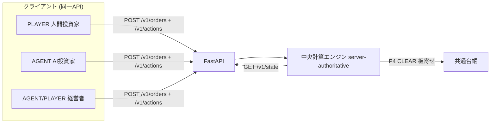
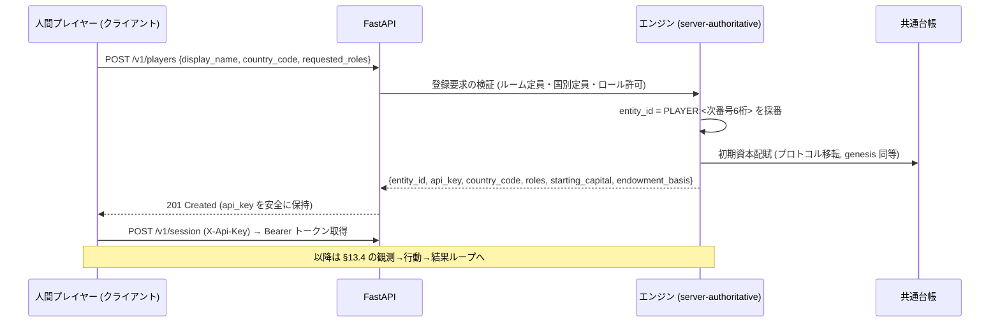
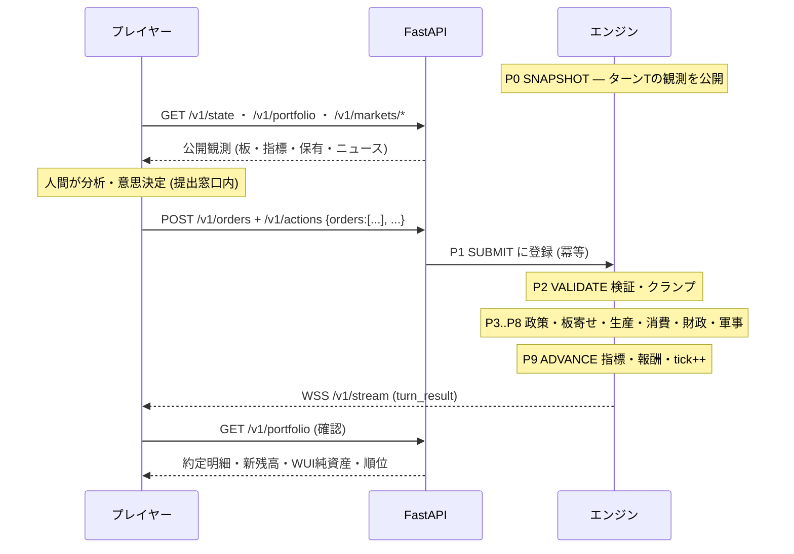
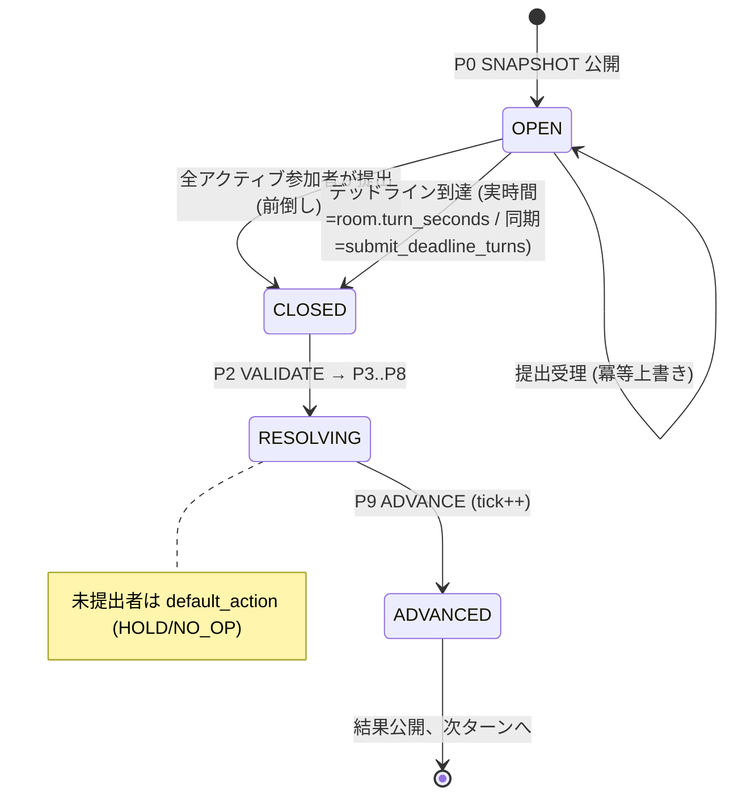
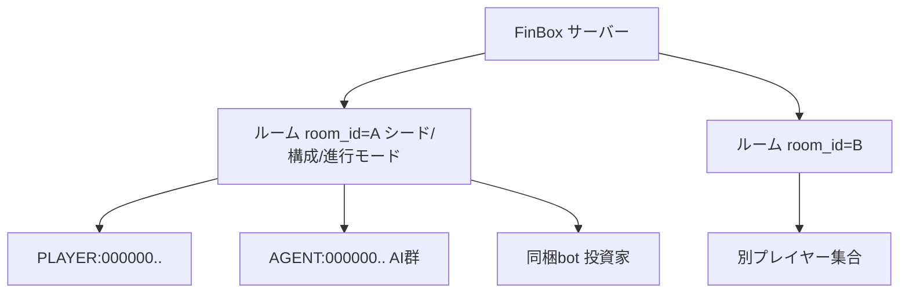
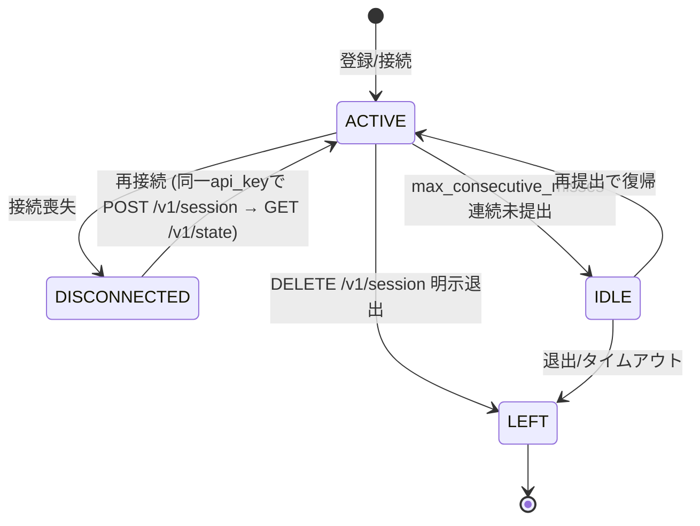

# 13. プレイヤーとマルチプレイヤー

本書は、人間プレイヤーが FinBox のシミュレーションへどのように参加し、機械学習エージェントと対等に競争するかを定義する。FinBox の根本原則である「エンジンは権威 (server-authoritative)」「エージェントとプレイヤーは同一インターフェース」([00-glossary.md](00-glossary.md) §0.2) を前提に、参加モデル・オンボーディング・公平性・ランキング・観戦・マルチプレイヤー運用を実装可能な水準で規定する。横断定義 (ID体系・列挙値・時間定数・WUI・ターンパイプライン) はすべて [00-glossary.md](00-glossary.md) を唯一の真実とし、本書はそれを参照・詳細化する。

関連: [02-architecture.md](02-architecture.md)(サーバー権威・データフロー)、[03-time-and-turns.md](03-time-and-turns.md)(ターン進行・提出窓口)、[07-machine-learning.md](07-machine-learning.md)(エージェントの観測/行動空間)、[14-api-reference.md](14-api-reference.md)(API・認証)、[16-configuration-and-initialization.md](16-configuration-and-initialization.md)(初期資本・構成)。

## 13.1 設計原則 (Player Design Tenets)

- **プレイヤーはクライアントである**: 人間プレイヤーも、機械学習エージェントと完全に同一の FastAPI エンドポイント・認証・行動スキーマを用いる ([00-glossary.md](00-glossary.md) §0.2)。プレイヤーは状態を直接書き換えられず、観測の取得と行動の提出のみを行う。中央計算エンジンが権威を持つ ([02-architecture.md](02-architecture.md))。
- **特権なし・情報非対称なし**: プレイヤーは AI エージェントと同じ公開観測のみを受け取る。プレイヤー専用の追加情報・先読み・割り込みは存在しない ([07-machine-learning.md](07-machine-learning.md) と整合)。差異はロールによる行動の可否 (role-gating, [06-roles.md](06-roles.md)) のみである。
- **均等初期条件**: 全プレイヤーは同一の初期資本・同一の参加手続きで開始する。AI エージェントとの公平性は、同一行動空間・同一価格・同一締切によって担保される。
- **人間向けの時間的配慮はあるが、ルールの優遇はない**: 人間が思考・操作する時間を確保するためプレイヤールームの実時間ターン秒数を長く取るが (13.5)、これは情報や行動の優位を与えるものではない。締切超過時の既定行動は AI と同一規則 (hold/no-op) で処理する。

## 13.2 プレイヤー参加モデル (Participation Model)

プレイヤーは `entity_id = PLAYER:<6桁>` (例 `PLAYER:000007`, [00-glossary.md](00-glossary.md) §0.4) を持つ口座として参加し、共通台帳 (§0.9) で AI エージェントと対等に残高を保持する。

### 13.2.1 解禁されるロール

| ロール | 既定 | 解禁条件 | 行動範囲 (詳細は [06-roles.md](06-roles.md)) |
| --- | --- | --- | --- |
| `INVESTOR` | 全プレイヤーに付与 | 常時 | 全市場での売買 (FX・財・債券・株式)、ポジション保有、出資 |
| `ENTREPRENEUR` | 無効 | 構成 `player.allow_entrepreneur=true` | 企業設立・運営・雇用・生産計画・増資・社債発行 |
| `MARKET_MAKER` | 無効 | 構成 `player.allow_market_maker=true`(`INVESTOR` から派生) | 継続的両面気配の提示・流動性供給 ([00-glossary.md](00-glossary.md) §0.14・§0.4) |
| 公共系 (`POLITICIAN`/`CENTRAL_BANKER`/`BUREAUCRAT`/`GENERAL`/`DIPLOMAT`) | AI 専用 | 構成 `player.allow_public_roles=true`(競技モードでは非推奨) | [12-politics-and-government.md](12-politics-and-government.md) の集約規則に従う |

- 既定ではプレイヤーは `INVESTOR` ロール1つで参加する ([00-glossary.md](00-glossary.md) §0.14)。これは公平な競争 (純粋な投資パフォーマンス勝負) を保証するための既定である。
- `ENTREPRENEUR` を解禁すると、プレイヤーは経営者として企業を設立し実体経済に介入できる。`INVESTOR` と併せ持つことができる (複数ロール可)。
- 公共系ロールは政策レバーを直接動かせるため、競技の公平性を損なう。既定で AI 専用とし、サンドボックス/協調シナリオでのみ構成で解禁する。

### 13.2.2 AI エージェントとの混在

プレイヤーと AI 投資家は同一の取引ペア・同一の板寄せ清算 (P4 CLEAR) に注文を出し、同一の価格優先・時間優先規則で約定する ([09-markets-and-trading.md](09-markets-and-trading.md))。エンジンは注文の出自 (人間/AI) を約定ロジックで一切区別しない。リーダーボード (13.7) も AI とプレイヤーを単一の順位表で扱う。

## 13.3 オンボーディング (Onboarding)

新規プレイヤーの参加は以下の手順で完了する。スキーマ・エラーは [14-api-reference.md](14-api-reference.md) を正とし、本書は手続きと既定値を規定する。

### 13.3.1 登録フロー

### 13.3.2 登録パラメーター

| フィールド | 必須 | 既定 | 説明 |
| --- | --- | --- | --- |
| `display_name` | 必須 | — | リーダーボード/観戦表示名。ルーム内で一意。1..32 文字 |
| `country_code` | 任意 | ルーム構成の `player.default_country` | 参加国。基軸通貨と初期資本の建値通貨を決める ([00-glossary.md](00-glossary.md) §0.6) |
| `requested_roles` | 任意 | `["INVESTOR"]` | 要求ロール集合。ルームが許可するロールのみ受理。不許可は 403 |
| `room_id` | 任意 | 既定ルーム | 参加するシミュレーションルーム (13.9) |

- **entity_id 採番**: `PLAYER:<6桁>` をルーム単位で 0 から連番採番する ([00-glossary.md](00-glossary.md) §0.4)。採番は決定論的でリプレイ再現可能 (§0.2)。
- **参加国/基軸通貨**: プレイヤーは6か国 (`ALD`/`BOR`/`CYR`/`DOR`/`ESM`/`FAR`) のいずれかに所属する。所属国の通貨 `CUR:<country_code>` を基軸 (建値) 通貨とし、初期資本はこの通貨で配賦される。WUI 換算 (§0.16) は通貨横断の評価に用いる。
- **国別定員**: 公平性のため、構成 `player.max_players_per_country` で国ごとのプレイヤー上限を設ける (既定: 無制限だが推奨は均等割当)。

### 13.3.3 認証

- 登録成功時に長期 `api_key` を発行する。これは AI エージェントの認証と同一機構であり、`POST /v1/session` に `X-Api-Key` で提示して短期セッショントークン (Bearer JWT) を得る ([14-api-reference.md](14-api-reference.md) §14.2)。
- 以後すべての `GET /v1/state`・`GET /v1/portfolio`・`POST /v1/orders`・`POST /v1/actions` 呼び出しは `Authorization: Bearer <token>` を必須とする。トークンは `sub`=`entity_id` に束縛され、他エンティティの行動は提出できない。
- セッショントークンは短命で、失効前に `POST /v1/session/refresh` で更新する。長期 `api_key` の失効・再発行は `POST /v1/session` 経路の管理機能に従う ([14-api-reference.md](14-api-reference.md))。切断/再接続 (13.9) では同一 `api_key` でセッションを張り直す。

### 13.3.4 初期資本 (均等性)

- **均等初期条件**: 同一ルーム・同一エピソードの全プレイヤーは、参加時点で完全に同額の初期資本を受け取る。値・内訳は [16-configuration-and-initialization.md](16-configuration-and-initialization.md) の `player.starting_capital` を正とする。
- 配賦は **プロトコル移転** (genesis 配賦, [00-glossary.md](00-glossary.md) §0.10) として記録し、市場を経由しない。`mint_id` 相当の原因識別子を持ち監査可能 (§0.9)。
- **配賦基準 `player.endowment_basis ∈ {WUI, CURRENCY}`**: `CURRENCY` は所属国通貨 `CUR:<country_code>` 建ての固定額を配賦する。`WUI` は配賦時点の FX で全プレイヤーの WUI 評価額が等価になるよう国別現金額を逆算して配賦する (構成 `player.initial_endowment_wui` が WUI 建て初期額)。競技モードの既定は **WUI** (国差による初期有利不利を排除)。
- 途中参加 (late join) を許可する構成では、参加時点の中央値プレイヤー純資産ではなく、常に同一の初期資本を `endowment_basis` に従って配賦する (公平性優先)。途中参加者はランキングのハンディキャップ表示で区別する (13.7)。

## 13.4 観測・行動・結果ループ (Observe–Act–Resolve Loop)

プレイヤーの1ターンは、AI エージェントの意思決定ループ ([07-machine-learning.md](07-machine-learning.md)) と同一構造を持つ。

- **観測 (P0)**: プレイヤーは AI 投資家と同一の公開観測を受け取る。板情報 (気配・直近約定・OHLC)・マクロ指標 ([00-glossary.md](00-glossary.md) §0.16)・自己保有残高・配当/クーポン予定・ニュース/イベントを含む。私的情報・先読みはない。
- **行動 (P1 SUBMIT)**: プレイヤーは投資家として注文 (指値/成行/取消, TIF 等は [09-markets-and-trading.md](09-markets-and-trading.md)) を提出する。`ENTREPRENEUR` 解禁時は生産計画・雇用・企業操作も提出できる。行動スキーマは AI と同一 ([14-api-reference.md](14-api-reference.md))。
- **検証 (P2 VALIDATE)**: 残高不足・非合法手・隣接条件違反などは AI と同一規則で棄却またはクランプされる ([00-glossary.md](00-glossary.md) §0.11)。プレイヤーだから通る/通らないは存在しない。
- **結果 (P9 後)**: 約定明細・新残高・WUI 純資産・順位・報酬相当を、WebSocket `/v1/stream` の `turn_result` で push し、ポーリングのみのクライアントは `GET /v1/portfolio` で再構成する ([14-api-reference.md](14-api-reference.md) §14.10)。結果は同一ターンに対し確定後は不変。

## 13.5 ターン進行とプレイヤー (Turn Progression)

ターン進行モードは [03-time-and-turns.md](03-time-and-turns.md) を正とし、本書はプレイヤー視点での締切規則を定める。

### 13.5.1 進行モード

| モード | 説明 | 締切の決まり方 | 主な用途 |
| --- | --- | --- | --- |
| 同期 (synchronous/lockstep) | 全参加者の提出が揃うか論理デッドラインでターンを進める | `all_submitted` または `submit_deadline_turns` 経過 (壁時計に非依存) | 少人数・対戦・デバッグ |
| 実時間 (real-time/wall-clock) | 一定の壁時計周期で機械的にターンを進める | 各ターンに固定の実時間ターン秒数 (`room.turn_seconds`) | 多人数・観戦・常時稼働ルーム |

- **実時間ターン秒数 `room.turn_seconds`**: 実時間モードでは各ターンの提出窓口 (P1 SUBMIT) を壁時計で締め切る。エンジン既定 `time.turn_seconds = 30` ([16-configuration-and-initialization.md](16-configuration-and-initialization.md)) を、プレイヤールームは `room.turn_seconds`(**既定 60 秒**) で上書きし、人間の分析・操作時間を確保する。AI 専用ルームでは短縮 (例 2 秒) してよい。
- **同期モードの締切**: 同期モードは壁時計デッドラインを持たない。`all_submitted` (全アクティブ参加者の提出完了) で即時締め切るか、論理デッドライン `submit_deadline_turns` を超過した時点で締め切る。壁時計に依存しないためデバッグ・リプレイで決定論的に進む。
- **全員提出での前倒し締切**: 登録済みの全アクティブ参加者 (人間+AI) が当該ターンの行動を提出した時点で、デッドライン (同期は `submit_deadline_turns`、実時間は `room.turn_seconds`) を待たずにターンを前倒しで締め切り進行する (`early_close_on_all_submitted=true`, 既定 true)。切断中/棄権中の参加者はこの判定から除外する (13.9)。
- **冪等な再提出**: 締切前は同一ターンへ何度でも上書き提出でき、最後の提出が採用される。人間の操作ミス訂正を許容する。

### 13.5.2 未提出時の既定行動

締切までに提出がなかった参加者 (人間/AI 共通) は、以下の **既定行動 (default action)** で P2 以降を進める。

| 既定種別 | 構成キー | 挙動 |
| --- | --- | --- |
| `HOLD` (既定) | `turn.default_action="hold"` | 新規行動なし。既存の未約定 GTC 注文は TIF に従い板に残る。保有はそのまま |
| `NO_OP` | `turn.default_action="no_op"` | 新規行動なし、かつ当該参加者の未約定注文を全取消 (板から除去) |

- 既定は `HOLD` とする。人間が1ターン操作できなくても、それまでに置いた継続注文 (GTC) は生き続け、ポートフォリオは現状維持される。
- 連続して `max_consecutive_misses` (既定 8 ターン) 提出がない人間プレイヤーは「離席 (idle)」とみなし、`all_submitted` 判定の母集団から除外する (13.9)。再提出で自動復帰する。

### 13.5.3 締切状態遷移

## 13.6 公平性と不正対策 (Fairness & Anti-Cheat)

- **サーバー権威**: 全状態遷移はエンジンが決定論的に実行する ([02-architecture.md](02-architecture.md))。クライアントは台帳・価格・約定を捏造できない。クライアント送信値はすべて P2 VALIDATE で検証・クランプされる。
- **均等初期条件**: 全プレイヤーは同一初期エンドウメント・同一公開情報・同一行動空間で開始する (13.3.4)。
- **情報非対称の排除**: プレイヤーへの観測は AI と同一の公開スナップショット (P0) のみ。先読み・私的フィード・低遅延優遇は提供しない。約定は価格優先・時間優先で公平に処理する ([09-markets-and-trading.md](09-markets-and-trading.md))。
- **レート制限**: 読み取り (`GET /v1/state` 等) と書き込み (`POST /v1/orders`・`/v1/actions`) にトークン単位のレート制限を課す。具体数値 (req/s・バースト・`429`/`Retry-After`) は [14-api-reference.md](14-api-reference.md) §14.8 を正準とし、本書はその参照のみとする。注文スパムによる板操作・DoS を防ぐ。
- **注文数上限**: 1ターンあたりの新規注文数上限 `max_orders_per_turn` (既定 256) を課す。AI/人間共通。
- **リプレイ監査 (replay audit)**: シード・構成・全参加者の行動列を保存し、いつでもエピソードを再実行して同一結果を再現できる (§0.2 決定論)。不正の疑いがあるエピソードは決定論再実行で検証する。台帳変動は原因識別子付き (§0.9) で全件監査可能。
- **検証フェーズ (P2)**: 不正・非合法・残高超過の行動はターン解決前に棄却/丸めされ、不正者が有利を得ることはない ([00-glossary.md](00-glossary.md) §0.11)。
- **自己約定/共謀の検知**: 同一エンティティの自己約定 (wash trade) はエンジンが拒否する。複数プレイヤー間の協調は市場ルール上は合法だが、リプレイ監査で異常パターンを検出可能とする。

## 13.7 スコアリングとランキング (Scoring & Ranking)

- **主要指標 = WUI 純資産**: プレイヤーと AI 投資家の成績は、保有ポジションを最新の板寄せ清算価格でマークし FX を介して WUI 換算した **純資産 (net worth, [00-glossary.md](00-glossary.md) §0.16)** で評価する。通貨横断で一貫した単一指標となる。
- **混在リーダーボード**: 単一の順位表に AI エージェント (投資家ロール) と人間プレイヤーを混在させてランク付けする。出自による区別はせず、純粋な WUI 純資産で序列を決める。
- **パーセンタイル**: 各参加者に、投資家集団 (AI+人間) 内での WUI 純資産パーセンタイルを付与する。「上位 N%」表示によりルーム規模に依存しない相対評価を提供する。

| 指標 | 定義 | 用途 |
| --- | --- | --- |
| `net_worth_wui` | WUI 換算純資産 (§0.16) | 主順位 |
| `percentile` | 投資家集団内での純資産パーセンタイル | 相対評価 |
| `roi` | `(net_worth_wui / endowment_wui) - 1` | 初期資本対比リターン |
| `drawdown_max` | エピソード中の最大ドローダウン | リスク評価 (補助) |
| `rank` | 純資産降順の整数順位 (1始まり) | 表示 |

- **`endowment_wui` の定義**: ROI 分母は配賦時点の初期資本を WUI 換算した額。`player.endowment_basis = WUI` のときは `player.initial_endowment_wui` に一致し、`= CURRENCY` のときは配賦現金額を配賦時点 FX で WUI 換算した値を用いる (13.3.4)。
- **同点処理**: WUI 純資産が同値の場合は `roi`、次に登録順 (`entity_id` 昇順) で安定的に順位を決める (決定論)。
- **途中参加の扱い**: late join 者は `joined_tick` を併記し、ROI 評価ウィンドウを参加時点起点とした補正値も提供する (13.3.4)。

### 13.7.1 シーズン/エピソード区切り

- **エピソード (episode)**: 1回のシミュレーション実行 (genesis から終了条件まで)。終了条件は構成 `scenario.episode_turns` (既定 `TURNS_PER_YEAR × 10` = 480 ターン = 10 年) または手動終了。エピソード終了時に最終リーダーボードを確定する。
- **シーズン (season)**: 複数エピソードを束ねた競技単位。各エピソード終了時の順位/パーセンタイルをポイント化し、シーズン累計でシーズン順位を決める。AI のチェックポイント更新 ([07-machine-learning.md](07-machine-learning.md)) はエピソード境界で行うため、シーズンは AI の世代交代とも整合する。
- エピソード境界では全プレイヤーの口座とランキングがリセットされ、次エピソードは再び均等初期条件で開始する。

## 13.8 観戦・可視化 (Spectating & Visualization)

- **公開状態エンドポイント**: 認証なしで参照できる公開系 `GET /v1/public/*`(状態スナップショット・リーダーボード・ニュース) を提供する。返すのは P0 で公開済みの情報のみ (私的残高は含まない) で、観戦者・ダッシュボード・配信が利用する ([14-api-reference.md](14-api-reference.md))。
- **ニュース/イベント**: P9 ADVANCE が生成するイベント/ニュース (政策変更・倒産・戦闘結果・指標確定・大口約定・新記録) を時系列で配信する ([00-glossary.md](00-glossary.md) §0.11 P9)。プレイヤー観測にも同一ストリームが含まれる。
- **ダッシュボード想定**: 標準ダッシュボードは以下のパネルを想定する。各国マクロ指標 (GDP/CPI/失業率/政策金利/為替)、主要取引ペアの板と OHLC チャート、混在リーダーボード、ニュースフィード、世界地図 (領土・人口移動, [04-world-and-geography.md](04-world-and-geography.md))、自己ポートフォリオ (認証時)。
- **可観測性の上限**: 観戦者・プレイヤーが見られるのは常に公開観測の範囲に限られ、未公開の内部状態 (未確定の板寄せ中間状態・他者の私的残高・乱数サブシード) は露出しない ([00-glossary.md](00-glossary.md) §0.2 情報非対称の排除と整合)。

## 13.9 マルチプレイヤー運用 (Multiplayer Operations)

### 13.9.1 セッションとルーム

- **ルーム (room)**: 独立したシミュレーション実例。各ルームは固有の `room_id`・シード・構成・参加者集合・進行モードを持ち、複数ルームを同一サーバーで同時実行できる ([16-configuration-and-initialization.md](16-configuration-and-initialization.md))。`PLAYER:<6桁>` の採番はルーム単位 (13.3.2)。
- **セッション (session)**: プレイヤーの接続。`POST /v1/session` で得る Bearer トークン (`sub`=`entity_id`) で識別され、複数デバイスからの同時接続は構成で禁止 (既定) または許可できる。セッションは状態を持たず、エンジン側の `entity_id` 口座が唯一の権威。

### 13.9.2 切断と再接続

- **切断中の進行**: プレイヤーが切断してもシミュレーションは止まらない。切断中のターンは未提出として `default_action` (既定 `HOLD`, 13.5.2) で処理され、GTC 注文は板に残る。口座と残高は保持される。
- **再接続**: 同一 `api_key` で `POST /v1/session` してトークンを取り直し `GET /v1/state`・`GET /v1/portfolio` を呼べばその時点の最新ターン状態へ復帰する。過去ターンの結果は `GET /v1/markets/{pair}/ohlc?from_tick=` と `GET /v1/portfolio` 差分で遡れる (構成 `history.retain_turns` ターン分保持)。
- **IDLE/LEFT**: `max_consecutive_misses` (既定 8) 連続未提出で `IDLE` 化し `all_submitted` 母集団から除外、`DELETE /v1/session` (明示退出) または長時間タイムアウト (`leave_after_misses`, 既定 48) で `LEFT` 化し口座を清算扱い (保有はそのまま、注文は全取消) とする。
- **離脱口座の扱い**: `LEFT` の口座はランキングには最終 WUI 純資産で残るが、`all_submitted` には算入しない。再参加は新規 `entity_id` を採番する (公平性のため過去口座の再利用は不可)。

### 13.9.3 同梱 bot (Bundled Bots)

- **bot 同梱**: ルームは AI エージェント (機械学習駆動, [07-machine-learning.md](07-machine-learning.md)) に加え、軽量な参照 bot (ルールベースの投資家/マーケットメイカー) を同梱して定員を満たし、市場流動性と対戦相手を保証できる。
- bot もプレイヤー/AI と同一 API・同一台帳・同一行動空間で動作し、特権を持たない。`AGENT:<6桁>` として採番され、リーダーボードにも混在する。
- 構成 `room.min_market_makers` を満たすよう、起動時に `MARKET_MAKER` bot を自動配置し、薄い板での約定不能を防ぐ ([00-glossary.md](00-glossary.md) §0.14・§0.4, [09-markets-and-trading.md](09-markets-and-trading.md))。

### 13.9.4 ルーム運用パラメーター (代表)

| 構成キー | 既定 | 説明 |
| --- | --- | --- |
| `room.max_players` | 64 | ルームの人間プレイヤー上限 |
| `room.progression_mode` | `real_time` | `synchronous`/`real_time` (13.5) |
| `room.turn_seconds` | 60 | 実時間モードのターン秒数 (人間向け既定、`time.turn_seconds=30` を上書き) |
| `room.submit_deadline_turns` | — | 同期モードの論理デッドライン (壁時計非依存) |
| `turn.default_action` | `hold` | 未提出時の既定 (13.5.2) |
| `turn.early_close_on_all_submitted` | true | 全員提出で前倒し締切 |
| `turn.max_consecutive_misses` | 8 | IDLE 判定の連続未提出数 |
| `turn.leave_after_misses` | 48 | LEFT 判定の連続未提出数 |
| `player.allow_entrepreneur` | false | 経営者ロール解禁 |
| `player.allow_public_roles` | false | 公共系ロール解禁 (非競技用) |
| `room.min_market_makers` | 2 | MM bot 最小数 |
| `scenario.episode_turns` | 480 | エピソード長 (10年) |

これらの正準デフォルトは [16-configuration-and-initialization.md](16-configuration-and-initialization.md) に集約し、本書はプレイヤー運用上の意味を記述する。
