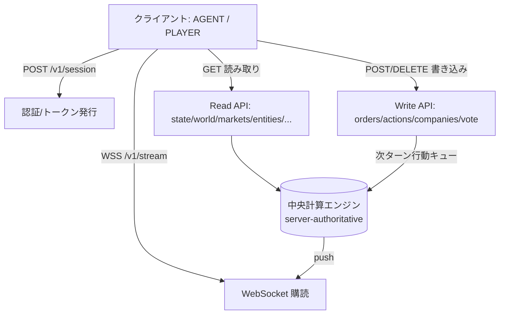
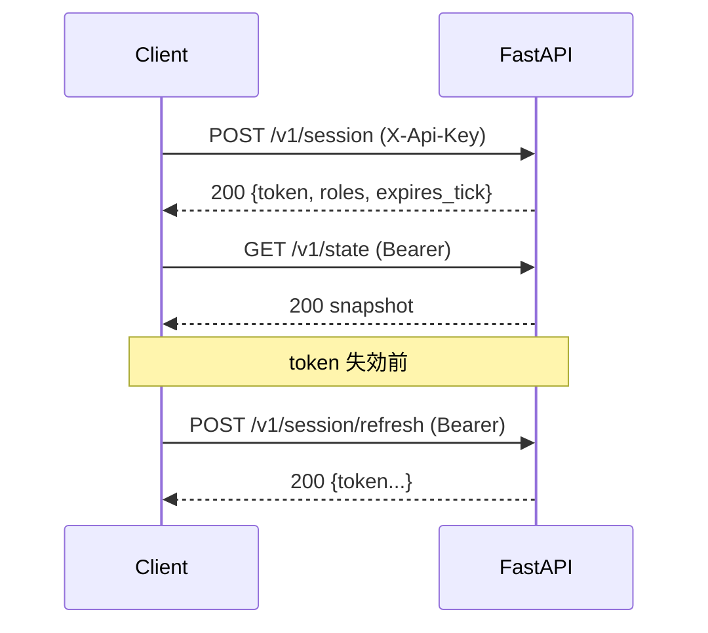
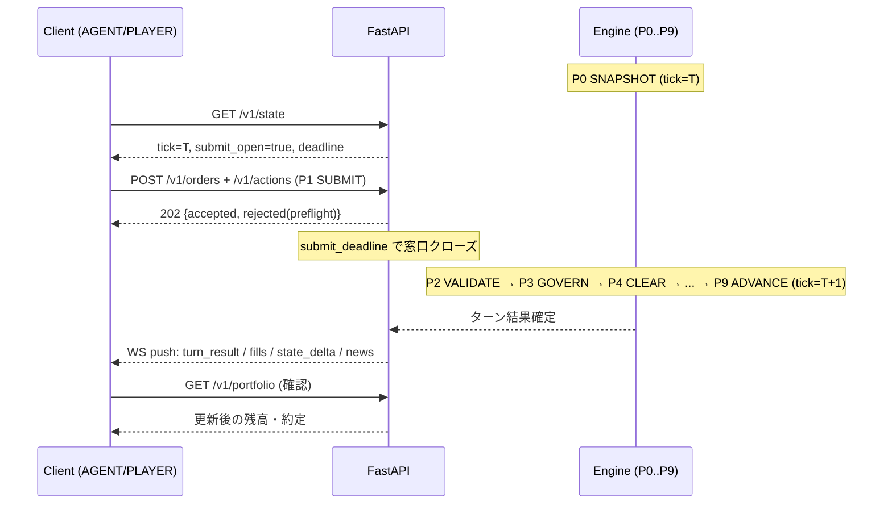

# 14. API リファレンス

本書は FinBox の唯一のクライアント接点である HTTP/WebSocket API を定義する。識別子・資産ID・列挙値・時間定数・ターンパイプラインのフェーズ名 (P0..P9) は [用語集と正準仕様](00-glossary.md) を唯一の真実として参照し、再定義しない。データスキーマの正準定義は [データモデル](15-data-model.md) にあり、本書はその転送表現 (JSON) を示す。アーキテクチャ全体は [アーキテクチャ](02-architecture.md)、ターン同期の時間軸は [時間とターン](03-time-and-turns.md)、プレイヤー固有の扱いは [プレイヤーとマルチプレイヤー](13-players-and-multiplayer.md) を参照する。

## 14.1 概要 (Overview)

- **実装**: FastAPI (ASGI)。同期読み取りは REST、リアルタイム配信は WebSocket。本文・ペイロードはすべて JSON (UTF-8)。
- **サーバー権威**: API は観測の取得 (read) と行動の提出 (write) のみを担う。状態遷移は中央計算エンジンが P0..P9 のパイプラインで決定論的に実行する ([00-glossary.md 0.11](00-glossary.md))。クライアントは台帳・市場・世界状態を直接書き換えられない。書き込みエンドポイントは「次ターンの行動キューへ意図を登録する」セマンティクスを持ち、即時に状態を変えない。
- **エージェントとプレイヤーは同一**: 機械学習エージェントも人間プレイヤーも同じエンドポイント・同じ認証・同じスキーマを用いる。差異はトークンの `role` クレームによる行動可否 (role-gating) のみで、情報の非対称性や特権エンドポイントは存在しない ([00-glossary.md 0.2](00-glossary.md), [13](13-players-and-multiplayer.md))。
- **バージョニング**: すべてのパスは `/v1` 接頭辞を持つ。破壊的変更は `/v2` を新設して行い、`/v1` は非破壊的にのみ拡張する。レスポンスヘッダ `X-FinBox-Api: v1` を常に付与する。
- **基底 URL**: `https://{host}/v1`。WebSocket は `wss://{host}/v1/stream`。
- **時刻の表現**: すべての時間軸は `tick` (整数、0始まりのターン通し番号) と `clock` 表記 `Y{年}-M{月}-T{ターン}` で返す ([00-glossary.md 0.3, 0.7](00-glossary.md))。壁時計時刻 (`server_time`) は提出窓口の判断にのみ用い、シミュレーション状態には影響しない。
- **数値**: すべての `quantity`・`price`・`cash`・残高は整数 (最小通貨単位) で送受信する。JSON 上は number で表現するが、`2^53` を超え得る台帳金額は精度欠落を避けるため文字列化した十進整数で返す (`amount_str` フィールド規約、14.10)。人間可読の小数表示 (`minor_unit=1000` による小数3桁＋3桁区切り、例 内部 `1500000000` → `1,500,000.000`) は**クライアント側の整形**であり、API は常に整数 minor 単位を送受する ([16 §16.3.1](16-configuration-and-initialization.md))。
- **表示名**: 国・通貨・企業・エージェントのレスポンスは人間可読の表示名 (`name`/`display_name`) を含みうる (フレーバー、[16 §16.14](16-configuration-and-initialization.md))。表示名は提示専用であり、約定・順位・role-gating 等のロジックは常に正準ID ([00-glossary.md 0.4/0.5](00-glossary.md)) に基づく。



## 14.2 認証とセッション (Authentication)

認証は2層からなる。長期の **API キー** で `POST /v1/session` を呼び、短期の **セッショントークン** (Bearer JWT) を得る。以後の全リクエストは `Authorization: Bearer <token>` を付与する。

- **API キー**: エンティティ登録時に発行される長期秘密。`AGENT:*` には学習基盤が、`PLAYER:*` には参加登録時に払い出す ([16](16-configuration-and-initialization.md))。ヘッダ `X-Api-Key: <key>` で `POST /v1/session` のみに用いる。
- **セッショントークン**: 署名付き JWT。クレームに `sub` (entity_id)、`roles` (ロール配列、[00-glossary.md 0.14](00-glossary.md))、`exp` (失効 tick と壁時計)、`scope` を含む。既定 TTL は 4 ターン相当または 1 時間の短い方。失効前に `POST /v1/session/refresh` で更新する。
- **role-gating**: 書き込みエンドポイントは要求ロールを持つトークンのみ受理する。ロール不一致は `403 role_not_permitted` ([14.9 エラーモデル](#149-エラーモデル-error-model))。読み取りは公開情報のみを返すため認証不要のものと、自己ポジション等のため認証必須のものがある (各エンドポイント表の Auth 列)。
- **roles クレームと細分化ロール**: `roles` クレームには [00-glossary.md 0.14](00-glossary.md) の正準ロールがそのまま入り、`INVESTOR` 派生の細分化・流動性ロール (`YIELD_INVESTOR`・`ARBITRAGEUR`・`AMM`) を含む。投資ロールは取引モード `trade_mode ∈ {SPOT,MARGIN}` × 投資スタイル `style ∈ {FUNDAMENTAL,TECHNICAL,YIELD}` の2軸で細分化され、`MARKET_MAKER` と同様に `INVESTOR` から派生する特化ロールである (独立のエンティティ種別ではない、[00-glossary.md 0.4/0.14](00-glossary.md)、[06](06-roles.md))。役割ゲートの要点は次のとおり。
  - **MARGIN (信用取引)**: `trade_mode=MARGIN` の注文 (14.5.1) は margin-capable ロール (`INVESTOR`・`YIELD_INVESTOR`・`ARBITRAGEUR`・`MARKET_MAKER`、構成 `allow_margin`) のみが提出できる。信用対象ペア (`CUR/CUR`・`EQ/CUR`・storable `COMM/CUR`) 以外、または非対応ロールでの `MARGIN` は `403 role_not_permitted`。
  - **貸借プール供給** (`/v1/lending/{asset_id}/deposit|withdraw`、14.5.9): margin-capable ロールが供給者となれる。
  - **AMM (自動マーケットメイカー)**: `AMM` ロールは既定 AI 専用 (`allow_amm`、継続・自動運用のため `MARKET_MAKER` に準じる)。ただし AMM プールへの LP 出資 (準備金供給) は任意の投資家・プレイヤーが行える。
- **エンティティの同一視**: トークンの `sub` が台帳上の `entity_id` であり、書き込みは常にこの主体として記録される。代理提出 (他 entity の行動提出) は不可。

### 14.2.1 `POST /v1/session`

リクエスト (ヘッダ `X-Api-Key`、本文任意):

```json
{ "requested_scope": ["read", "trade", "act"], "client": "agent-runner/1.4" }
```

レスポンス `200`:

```json
{
  "token": "<jwt>",
  "token_type": "Bearer",
  "entity_id": "AGENT:000123",
  "roles": ["FACTORY_WORKER"],
  "expires_tick": 124,
  "expires_at": "2026-06-16T09:30:00Z",
  "scope": ["read", "trade", "act"]
}
```

`POST /v1/session/refresh` は有効トークンを受け取り、同形のレスポンスで新トークンを返す。`scope` は `read`/`trade`/`act`/`govern` の部分集合で、`govern` は `POLITICIAN`/`CENTRAL_BANKER` 等の公共ロール保有時のみ付与される。

### 14.2.2 `POST /v1/players` (プレイヤー登録)

人間プレイヤーの新規参加登録。認証不要 (招待コード等のオンボーディング検証は構成依存)。`entity_id` `PLAYER:<6桁>` を採番し、長期 API キーを払い出す ([13](13-players-and-multiplayer.md), [16](16-configuration-and-initialization.md))。プレイヤーは既定で `INVESTOR` ロールを得る ([00-glossary.md 0.14](00-glossary.md))。

リクエスト:

```json
{ "display_name": "Hina", "country": "ALD", "base_currency": "CUR:ALD", "endowment_basis": "WUI" }
```

レスポンス `201`:

```json
{
  "entity_id": "PLAYER:000007",
  "api_key": "<long-lived-secret>",
  "country": "ALD",
  "base_currency": "CUR:ALD",
  "endowment_basis": "WUI",
  "starting_capital_str": "1500000",
  "roles": ["INVESTOR"]
}
```

- `country` は参加国 ([00-glossary.md 0.6](00-glossary.md))、`base_currency` は基軸通貨 (`CUR:<country>`)。`endowment_basis` は `WUI`/`CURRENCY` ([16](16-configuration-and-initialization.md) `player.endowment_basis`、競技モード既定 `WUI`)。初期資本は `player.starting_capital` から配賦される。
- 払い出された `api_key` は `X-Api-Key` ヘッダで `POST /v1/session` に用いる (14.2.1)。以後の認証・行動はエージェントと完全に同一経路 ([00-glossary.md 0.2](00-glossary.md))。

### 14.2.3 `DELETE /v1/session` (退出・セッション失効)

Bearer 必須。現在のセッショントークンを失効させる (退出)。レスポンス `200 { "revoked": true }`。台帳上の `entity_id` と保有資産は保持され、再 `POST /v1/session` で復帰できる。観戦のみのクライアントは `GET /v1/public/*` で認証なしに観測を続けられる (14.4)。



## 14.3 共通規約 (Conventions)

- **ヘッダ**: 全レスポンスに `X-FinBox-Tick`(現在 tick)・`X-FinBox-Phase`(現在パイプライン位置 P0..P9)・`X-FinBox-Submit-Open`(提出窓口が開いていれば `1`) を付与する。これにより読み取り1回で提出可否を判断できる。
- **ページング**: 一覧系は `?limit=`(既定 100、最大 1000)・`?cursor=` のカーソル方式。レスポンスは `{ "items": [...], "next_cursor": "<opaque|null>" }`。オフセット方式は用いない (台帳成長に対し安定なため)。
- **フィルタ**: クエリパラメータはすべて AND 結合。範囲は `field_min`/`field_max`、集合は `?field=a,b,c`。
- **時刻指定**: 履歴系は `?from_tick=&to_tick=` の閉区間 (省略時は最新窓)。
- **冪等性**: 全書き込みは `Idempotency-Key: <uuid>` ヘッダを受理する (14.8)。
- **整数金額**: 残高・約定額など `2^53` を超え得る値は `*_str` (十進文字列) で返す。`quantity`・`price`・`tick`・件数など範囲が有界な整数は number で返す。
- **資産・エンティティ参照**: すべて [00-glossary.md 0.4/0.5](00-glossary.md) の ID 文字列をそのまま用いる。

## 14.4 読み取りエンドポイント (Read Endpoints)

| メソッド | パス | Auth | 説明 |
| --- | --- | --- | --- |
| GET | `/v1/state` | 任意 | 現在の `tick`/`clock`/`phase`/提出窓口/主要マクロ指標 (StateSnapshot) |
| GET | `/v1/world/countries` | 任意 | 6か国の一覧と通貨・政府・中央銀行・マクロ要約 |
| GET | `/v1/world/regions` | 任意 | 地域 (region) の一覧。`?country=` で絞り込み |
| GET | `/v1/world/cells` | 任意 | マス (cell) の一覧。`?country=&region=&biome=&resource=&owner=&bbox=` でフィルタ |
| GET | `/v1/assets` | 任意 | Tradable Assets のカタログ。`?class=&namespace=` でフィルタ |
| GET | `/v1/markets/pairs` | 任意 | 全取引ペアの一覧と最終清算価格・出来高 |
| GET | `/v1/markets/{pair}/book` | 任意 | 指定ペアの板 (集約後)。`?depth=` で段数 |
| GET | `/v1/markets/{pair}/ohlc` | 任意 | OHLC 時系列。`?interval=turn|month|quarter|year&from_tick=&to_tick=` |
| GET | `/v1/markets/{pair}/last` | 任意 | 直近の清算価格・出来高・mid |
| GET | `/v1/entities/{id}` | 任意 | エンティティの公開プロフィール (ロール・国・公開指標) |
| GET | `/v1/portfolio` | 必須 | 自己 (`sub`) の残高・ポジション・WUI 純資産・未約定注文 |
| GET | `/v1/companies` | 任意 | 企業一覧。`?country=&industry=&listed=` でフィルタ |
| GET | `/v1/companies/{id}` | 任意 | 企業詳細 (産業・設備・在庫・財務・発行株式/社債) |
| GET | `/v1/governments/{country}` | 任意 | 政府の財政・債務・現行政策・軍事 |
| GET | `/v1/policies` | 任意 | 現行政策レバーの値と直近の確定履歴。`?country=` |
| GET | `/v1/bonds` | 任意 | 発行済 `BOND`/`BILL` の一覧と条件。`?issuer=&maturity_max=` |
| GET | `/v1/news` | 任意 | ニュース/イベント流。`?from_tick=&category=&country=` |
| GET | `/v1/leaderboard` | 任意 | WUI 純資産順のランキング ([13](13-players-and-multiplayer.md)) |
| GET | `/v1/public/snapshot` | 不要 | 観戦用の世界スナップショット (`/v1/state` の公開部分集合、認証不要) |
| GET | `/v1/public/leaderboard` | 不要 | 観戦用ランキング (`/v1/leaderboard` の公開ビュー) |
| GET | `/v1/public/news` | 不要 | 観戦用ニュース/イベント流 (`/v1/news` の公開ビュー) |

`/v1/public/*` は認証なしで観戦できる公開ビューで、公開情報のみを返す (自己ポジション等は含まない)。観戦者は登録 (14.2.2) なしにこれらを購読できる。

`{pair}` はパス上で `base/quote` を含むため、スラッシュを保持するワイルドカード経路で受ける (例 `/v1/markets/COMM:agri.grain/CUR:ALD/book`)。エスケープ不要。

### 14.4.1 `GET /v1/state` → StateSnapshot

```json
{
  "tick": 123,
  "clock": "Y3-M07-T2",
  "year": 3, "month": 7, "turn_in_month": 2,
  "phase": "P0",
  "submit_open": true,
  "submit_deadline_at": "2026-06-16T09:25:00Z",
  "server_time": "2026-06-16T09:20:11Z",
  "wui_level": 1024,
  "macro": {
    "world_gdp_str": "184320000000",
    "world_trade_volume_str": "42100000000",
    "fx": { "CUR:ALD/CUR:BOR": 985, "CUR:ALD/CUR:CYR": 1120 },
    "countries": {
      "ALD": { "policy_rate_bps": 150, "cpi": 10240, "inflation_bps": 230, "unemployment_bps": 540, "gdp_real_str": "31200000000", "debt_to_gdp_bps": 6200 }
    }
  },
  "lending_pools": [
    { "asset_id": "CUR:ALD", "supplied_str": "2000000", "borrowed_str": "1600000", "available_str": "400000", "utilization_bps": 8000, "borrow_rate_bps": 470, "supply_rate_bps": 338 },
    { "asset_id": "EQ:firm.000042", "supplied_str": "5000", "borrowed_str": "1000", "available_str": "4000", "utilization_bps": 2000, "borrow_rate_bps": 280, "supply_rate_bps": 50 }
  ],
  "insurance": { "CUR:ALD": { "balance_str": "1000000" }, "CUR:BOR": { "balance_str": "1000000" } },
  "amm_pools": [
    { "pair": "CUR:ALD/CUR:BOR", "invariant": "CONCENTRATED", "spread_bps": 10, "r_base_str": "1000000", "r_quote_str": "985000000", "invariant_str": "985000000000000" }
  ]
}
```

`macro` の指標集合は [00-glossary.md 0.16](00-glossary.md) のマクロ指標と一致させる。レート系は bps、指数系は基準100=`10000` のスケール整数で返す。

- `lending_pools[]` は信用対象アセットごとの貸借プール (`POOL:<asset_id>`、[00-glossary.md 0.4](00-glossary.md)、[15 §15.6.1](15-data-model.md) `LendingPool`) の現況。`supplied_str`=預入総量、`borrowed_str`=貸出残、`available_str`=利用可能残高 (`= supplied − borrowed`、= プール現物残高、[09](09-markets-and-trading.md) 貸借プール節)、`utilization_bps`=利用率 `U = borrowed/supplied`、`borrow_rate_bps`/`supply_rate_bps`=利用率連動カーブで定まる当ターンの借入/供給金利 (キンク・モデル、[09](09-markets-and-trading.md)、[11 §11.7.1](11-finance-and-instruments.md))。通貨プールの `base_rate` は当該国 `policy_rate[s]`、アセットプールは構成既定 (`lending.base_rate`、[16](16-configuration-and-initialization.md))。
- `insurance` は通貨別の保険基金 (`INSF:<cc>`、[15 §15.6.1](15-data-model.md) `InsuranceFund`) 残高で、清算ペナルティ・金利スプレッド (`reserve_factor` 分) を積み立て、不良債権 (`equity < 0`) の first-loss バッファとして機能する ([09](09-markets-and-trading.md) 強制決済節)。
- `amm_pools[]` は自動マーケットメイカーのプール (`AMM:<pair_id>`、[15 §15.6.1](15-data-model.md) `AMMPool`) で、`pair`・`invariant` (`CONST_PRODUCT`/`CONCENTRATED`、[00-glossary.md 0.19](00-glossary.md))・`spread_bps` (内蔵気配幅、手数料ではない)・準備金 `r_base_str`/`r_quote_str`・不変量 `invariant_str` を返す。`mid = r_quote // r_base`。既定無効 (`amm.enabled=false`、[16](16-configuration-and-initialization.md)) で、有効時のみ非空。

### 14.4.2 `GET /v1/markets/{pair}/book` → OrderBook

板はプライバシーと帯域のため価格段で集約して返す (個別注文 ID は自己注文のみ `/v1/portfolio` で見える)。

```json
{
  "pair": "COMM:agri.grain/CUR:ALD",
  "tick": 123,
  "bids": [ { "price": 412, "quantity": 1500 }, { "price": 411, "quantity": 800 } ],
  "asks": [ { "price": 415, "quantity": 600 }, { "price": 416, "quantity": 2200 } ],
  "last_price": 413,
  "mid": 4135
}
```

`mid` は `(best_bid+best_ask)/2` を 0.1 tick 精度の整数 (×10) で返す。板寄せ ([09](09-markets-and-trading.md)) は P4 CLEAR で一括約定するため、`book` は P0 時点の提出済キューの集約スナップショットである。

### 14.4.3 `GET /v1/markets/{pair}/ohlc` → OHLCBar[]

```json
{ "pair": "COMM:agri.grain/CUR:ALD", "interval": "turn",
  "bars": [ { "tick": 122, "clock": "Y3-M07-T1", "o": 410, "h": 418, "l": 408, "c": 413, "volume": 5200, "vwap": 412 } ] }
```

各ターンの板寄せは単一清算価格を持つため、`interval=turn` では `o=h=l=c=` 清算価格、`volume` は約定数量、`vwap=` 清算価格となる。`month`/`quarter`/`year` は構成ターン数 ([00-glossary.md 0.7](00-glossary.md)、`TURNS_PER_MONTH=4`/`TURNS_PER_YEAR=48`) で集約する。`interval` は [15](15-data-model.md) の `OHLCBar.period {TURN,MONTH,QUARTER,YEAR}` に対応する。

### 14.4.4 `GET /v1/portfolio` → Portfolio

```json
{
  "entity_id": "AGENT:000123",
  "tick": 123,
  "balances": [
    { "asset_id": "CUR:ALD", "amount_str": "1250000" },
    { "asset_id": "COMM:good.food", "amount_str": "12" },
    { "asset_id": "EQ:firm.000042", "amount_str": "300" }
  ],
  "open_orders": [ { "order_id": "ORD:000123:0007", "pair": "COMM:agri.grain/CUR:ALD", "side": "BUY", "order_type": "LIMIT", "price": 412, "quantity": 100, "filled": 0, "tif": "GTT", "expires_tick": 130 } ],
  "net_worth_wui_str": "1383500",
  "positions": [
    {
      "position_id": "POS:000031",
      "pair": "EQ:firm.000099/CUR:ALD",
      "side": "SHORT",
      "qty": 50,
      "entry_price": 1200,
      "borrowed_asset": "EQ:firm.000099",
      "borrowed_qty": 50,
      "collateral_asset": "CUR:ALD",
      "collateral_qty": 72000,
      "accrued_interest_str": "30",
      "open_tick": 118,
      "equity_str": "12000",
      "margin_ratio_bps": 2000
    }
  ]
}
```

`net_worth_wui_str` は最新清算価格でマークし FX 経由で WUI 換算した純資産 ([00-glossary.md 0.16](00-glossary.md))。純資産は「マーク済み台帳残高 + 貸借/AMM プール持分の債権 − Σ ポジション負債」で構成し、プール債権とポジション負債はエンティティ間でネットして系全体で保存する ([00-glossary.md 0.16](00-glossary.md)、[08 §8.8](08-economy-and-ledger.md)、[11 §11.9.2](11-finance-and-instruments.md))。
- `positions[]` は信用ポジション (`Position`、[15 §15.6.1](15-data-model.md)) の配列。空売り (ショート) は独立の負債行ではなく、この `Position` の負債 (`borrowed_asset`/`borrowed_qty`) として表現する (現物残高は常に非負、借入アセットはプールから `loan_id` を原因に移転され、ポジションの返済債務として計上される。[00-glossary.md 0.9/0.17](00-glossary.md))。
- フィールドは [15 §15.6.1](15-data-model.md) `Position` の転送形。`side` は `LONG`/`SHORT` ([00-glossary.md 0.19](00-glossary.md))。`equity_str` = `担保時価 − 借入時価 − accrued_interest` (quote 建て)、`margin_ratio_bps` = `equity / position_notional` を当ターン P4 清算価格 `p*` でマーク・トゥ・マーケットした証拠金率 ([09](09-markets-and-trading.md) 証拠金節、[08 §8.8.2](08-economy-and-ledger.md))。`margin_ratio_bps` が維持証拠金 (資産クラス別、FX `1000`/COMM `1200`/EQ `1500` bps) を割ると当ターン P4 で強制決済対象となる。

## 14.5 書き込みエンドポイント (Write Endpoints)

すべて Bearer 必須・role-gated。書き込みは「現在の提出窓口 (P1 SUBMIT) へ行動を登録する」。窓口が閉じている (P2 以降) 場合は `409 submit_closed`。同一窓口での再提出は冪等キーで重複排除する。

| メソッド | パス | 必要ロール (いずれか) | 行動の種別 |
| --- | --- | --- | --- |
| POST | `/v1/orders` | `trade` scope (全ロール) | 注文のバッチ提出 |
| DELETE | `/v1/orders/{id}` | `trade` scope | 未約定注文の取消 |
| POST | `/v1/lending/{asset_id}/deposit` | margin-capable ロール (`INVESTOR`/`YIELD_INVESTOR`/`ARBITRAGEUR`/`MARKET_MAKER`) | 貸借プールへの供給 (預入、pool share 取得) |
| POST | `/v1/lending/{asset_id}/withdraw` | margin-capable ロール (同上) | 貸借プールからの引出 (pool share 償還) |
| POST | `/v1/actions` | 各 action が要求するロール | 汎用行動エンベロープ (消費/労働供給/移住/投票/軍事/企業操作) |
| POST | `/v1/labor/offer` | 労働者系ロール | 労働供給 (`COMM:labor.*` の売り注文の高水準版) |
| POST | `/v1/consume` | 全ロール | 消費計画 (P6 CONSUME 用の財・サービス消費) |
| POST | `/v1/companies` | `ENTREPRENEUR` | 企業設立 |
| POST | `/v1/companies/{id}/production` | `ENTREPRENEUR` (当該企業経営者) | 生産計画 (P5) |
| POST | `/v1/companies/{id}/expand` | `ENTREPRENEUR` | 設備・能力拡張 (建設労働力消費) |
| POST | `/v1/companies/{id}/issue-equity` | `ENTREPRENEUR` | 増資 (株式発行) |
| POST | `/v1/companies/{id}/issue-bond` | `ENTREPRENEUR` | 社債発行 |
| POST | `/v1/companies/{id}/dividend` | `ENTREPRENEUR` | 配当宣言 |
| POST | `/v1/governments/{country}/vote` | `POLITICIAN` (当該国配属) | 政策投票 ([00-glossary.md 0.12](00-glossary.md)) |
| POST | `/v1/central-bank/{country}/policy` | `CENTRAL_BANKER` (当該国配属、`govern` scope) | OMO 執行 (`omo_target` の方向と量) ([11](11-finance-and-instruments.md)) |
| POST | `/v1/governments/{country}/fiscal-exec` | `BUREAUCRAT` (当該国配属、`govern` scope) | 財政執行 (補助金/福祉の配分執行) ([12](12-politics-and-government.md)) |

`/v1/orders`・`/v1/labor/offer`・`/v1/consume`・`/v1/companies/*`・`/v1/governments/*/vote`・`/v1/central-bank/*/policy`・`/v1/governments/*/fiscal-exec` はいずれも内部的に `ActionEnvelope` (14.6.2) に正規化され、同一の行動キューに入る。専用パスは型安全な利便ショートカットであり、`POST /v1/actions` で等価な行動をすべて提出することもできる。`CENTRAL_BANKER`/`BUREAUCRAT` の公共行動はこれらの専用経路を一次手段とする ([00-glossary.md 0.14](00-glossary.md))。

### 14.5.1 `POST /v1/orders` (バッチ) → Order[]

リクエスト:

```json
{
  "orders": [
    { "client_ref": "a1", "pair": "COMM:agri.grain/CUR:ALD", "side": "BUY", "order_type": "LIMIT", "price": 412, "quantity": 100, "tif": "GTT", "expires_tick": 130 },
    { "client_ref": "a2", "pair": "EQ:firm.000042/CUR:ALD", "side": "SELL", "order_type": "IOC", "quantity": 50, "tif": "GFT" },
    { "client_ref": "a3", "pair": "EQ:firm.000042/CUR:ALD", "side": "SELL", "order_type": "LIMIT", "price": 1180, "quantity": 50, "tif": "GFT", "trade_mode": "MARGIN", "position_side": "SHORT", "intent": "OPEN" },
    { "client_ref": "a4", "pair": "EQ:firm.000042/CUR:ALD", "side": "BUY", "order_type": "MARKET", "quantity": 50, "tif": "GFT", "trade_mode": "MARGIN", "intent": "CLOSE", "position_id": "POS:000031" }
  ]
}
```

レスポンス `202 Accepted` (受理は提出登録であり約定確約ではない):

```json
{
  "tick": 123,
  "accepted": [ { "client_ref": "a1", "order_id": "ORD:000123:0042", "status": "QUEUED" } ],
  "rejected": [ { "client_ref": "a2", "code": "insufficient_balance", "message": "EQ:firm.000042 balance 0 < 50" } ]
}
```

- `side`: `BUY`/`SELL`。`order_type` ([00-glossary.md 0.19](00-glossary.md)): `LIMIT`(指値)/`MARKET`(成行)/`IOC`(即時約定・残数取消)/`FOK`(全数即時か取消)。`tif` (Time In Force, [00-glossary.md 0.18/0.19](00-glossary.md)): `GFT`(当ターン限り、既定)/`GTC`(取消まで有効)/`GTT`(`expires_tick` で指定 tick まで)。`IOC`/`FOK` は注文種別であり TIF ではない (`IOC`/`FOK` は即時系のため `tif` は `GFT` を取る)。詳細な注文種別は [09](09-markets-and-trading.md)。
- `price` は LIMIT で必須、MARKET では無視。すべて整数 price tick ([00-glossary.md 0.8](00-glossary.md))。
- `trade_mode` ([00-glossary.md 0.19](00-glossary.md)): `SPOT`(現物、既定) / `MARGIN`(信用)。`MARGIN` は信用対象ペア (`CUR/CUR`・`EQ/CUR`・storable `COMM/CUR`) でのみ受理され、`MARKET_MAKER`/`INVESTOR`/`YIELD_INVESTOR`/`ARBITRAGEUR` のいずれか (= margin-capable ロール) を要する (なければ `403 role_not_permitted`)。それ以外のペア (perishable `COMM`・`labor.*`・`BOND`/`BILL`) は `SPOT` のみ。
- `position_side` ([00-glossary.md 0.19](00-glossary.md)): `LONG` / `SHORT`。`trade_mode=MARGIN` かつ `intent=OPEN` のとき必須。`LONG` は `quote` をプールから借りて `base` を買い建て、`SHORT` は `base` をプールから借りて売り建てる ([09](09-markets-and-trading.md) 信用取引節)。`SPOT` では無視。
- `intent` ([00-glossary.md 0.19](00-glossary.md)): `OPEN`(新規建て/増し建て) / `CLOSE`(決済)。`trade_mode=MARGIN` のとき必須。`OPEN` は初期証拠金 `initial_margin = 2000 bps`(レバレッジ5倍) を満たす範囲で建てられ、満たさない数量は P2 VALIDATE でクランプ/棄却される (14.9.1)。
- `position_id` ([00-glossary.md 0.4](00-glossary.md)、`POS:NNNNNN`): `intent=CLOSE` のとき決済対象ポジションを指定する。`/v1/portfolio` の `positions[]` の `position_id` と一致させる。`OPEN`/`SPOT` では省略する。
- 検証 (残高・合法手・初期証拠金・プール利用可能残高) は受理時に予備チェック (P2 と同等の preflight) を行い、確定的な棄却・クランプ結果は P2 VALIDATE 完了後に確定する (14.7)。

### 14.5.2 `DELETE /v1/orders/{id}`

提出窓口内の未約定注文を取消す。レスポンス `200 { "order_id": "...", "status": "CANCELLED" }`。既約定・既締切は `409 order_not_cancellable`。

### 14.5.3 `POST /v1/labor/offer`

労働者が当ターンの労働力を供給する高水準ショートカット。内部的に `COMM:labor.<skill>/CUR:<country>` の SELL・`order_type=IOC`・`tif=GFT` 注文へ展開される (`labor.*` は perishable のため当ターン約定のみ、[00-glossary.md 0.5.3](00-glossary.md))。

```json
{ "skill": "factory", "quantity": 1, "reserve_price": 850, "country": "ALD" }
```

`skill` は `COMM:labor.*` の末尾キー。`quantity` は供給単位 (通常 1 ターン=1 単位)。`reserve_price` 未満では約定しない。

### 14.5.4 `POST /v1/consume`

P6 CONSUME 用の消費計画。保有財・サービスをニーズ回復に充てる ([00-glossary.md 0.13](00-glossary.md))。市場購入ではなく保有資産の消費宣言であるため注文ではない。

```json
{ "items": [ { "asset_id": "COMM:good.food", "quantity": 2 }, { "asset_id": "COMM:svc.healthcare", "quantity": 1 } ] }
```

不足分はクランプされ、P6 で実際に消費された数量とニーズ更新結果は WebSocket / `/v1/portfolio` 差分で返る。

### 14.5.5 企業操作

```json
// POST /v1/companies (設立)
{ "country": "ALD", "industry": "MANUFACTURING", "subindustry": "electronics", "name": "Helios Devices", "seed_capital": { "asset_id": "CUR:ALD", "amount_str": "5000000" } }
```

```json
// POST /v1/companies/{id}/production (生産計画, P5)
{ "recipe": "COMM:good.electronics", "target_quantity": 200, "inputs_policy": "buy_to_fill" }
```

```json
// POST /v1/companies/{id}/expand (能力拡張)
{ "construction_labor_units": 40, "target_capacity_delta": 50 }
```

```json
// POST /v1/companies/{id}/issue-equity (増資)
{ "new_shares": 10000, "offer_price": 120, "currency": "CUR:ALD" }
```

```json
// POST /v1/companies/{id}/issue-bond (社債)
{ "face_total_str": "2000000", "currency": "CUR:ALD", "coupon_bps": 350, "maturity_clock": "Y6-M01-T1" }
```

```json
// POST /v1/companies/{id}/dividend (配当)
{ "per_share_str": "5", "currency": "CUR:ALD" }
```

設立・増資・社債は対応する `EQ:`/`BOND:` 資産の発行であり、P4 CLEAR の金融商品市場を通じて配賦・売却される。配当・クーポンは P7 FISCAL のプロトコル移転 ([00-glossary.md 0.10](00-glossary.md))。生産・拡張の制約 (地域上限・設備・労働) は [10](10-industry-and-production.md)。

### 14.5.6 `POST /v1/governments/{country}/vote`

`POLITICIAN` (当該国配属) のみ。1人1票相当の判断を提出し、P3 GOVERN で [00-glossary.md 0.12](00-glossary.md) の集約規則に従い確定される。

```json
{
  "votes": [
    { "lever": "policy_rate", "kind": "SCALAR", "value": 175 },
    { "lever": "tax_consumption", "kind": "SCALAR", "value": 1000 },
    { "lever": "tariff[BOR]", "kind": "SCALAR", "value": 800 },
    { "lever": "subsidy_focus", "kind": "CATEGORICAL", "scores": { "AGRICULTURE": 0.5, "MANUFACTURING": 0.3, "ENERGY": 0.2 } },
    { "lever": "military_targets", "kind": "ALLOCATION", "weights": { "CELL:BOR.3.4.2": 0.6, "CELL:BOR.3.5.2": 0.4 } }
  ]
}
```

- `lever` は [12 §12.3](12-politics-and-government.md) の `lever_id` を正準とする (`policy_rate`/`tax_income`/`tax_corporate`/`tax_consumption`/`tariff[partner]`/`gov_spending`/`welfare_level`/`bond_issuance_cap`/`subsidy_focus`/`subsidy_rate`/`military_budget`/`military_targets`/`min_wage`/`immigration_openness`)。本書独自の別名 (`vat_bps`/`budget_allocation`/`trade_stance` 等) は用いない。SCALAR の `value` は当該レバーの単位 (bps または通貨単位、[12 §12.3](12-politics-and-government.md))。`tariff[partner]` は相手国別 (5本) のうち1本を指定する。
- `kind` は `SCALAR`/`BINARY`/`CATEGORICAL`/`ALLOCATION` のいずれかで [00-glossary.md 0.12](00-glossary.md) の集約規則に正確に対応する。`BINARY` は宣戦・講和・同盟など国家間関係の遷移 ([12 §12.8](12-politics-and-government.md) の関係モデル拡張) に用いる。レバーの完全な列挙・型・レンジは [12 §12.3](12-politics-and-government.md)。

### 14.5.7 `POST /v1/central-bank/{country}/policy`

`CENTRAL_BANKER` (当該国配属、`govern` scope) のみ。政策金利そのものは P3 GOVERN で `POLITICIAN` の投票により決定され ([00-glossary.md 0.12](00-glossary.md)、`policy_rate_bps`)、本経路は中央銀行による**公開市場操作 (OMO) の執行**を担う。確定した政策金利へ短期金利を誘導するため、`omo_target` の方向 (買入/売却) と量を提出する。執行は P7 FISCAL の通貨発行/吸収 (プロトコル移転、[00-glossary.md 0.10](00-glossary.md)) として反映され、買入対象資産の授受は P4 CLEAR の市場経由で行う。

```json
{ "omo_target": { "direction": "INJECT", "amount_str": "500000000", "instrument": "BILL:gov.ALD.2031Q1" } }
```

- `direction`: `INJECT`(資産買入・現金注入) / `DRAIN`(資産売却・現金吸収)。`amount_str` は注入/吸収する自国通貨量 (最小単位)。`instrument` は対象資産 (国庫短期証券・国債等、省略時はエンジンが既定の OMO バスケットを用いる)。
- 本入力は [15](15-data-model.md) `CentralBank.omo_target` の入力経路であり、[03](03-time-and-turns.md) の `cb_policy` 供給元と整合する。`policy_rate_bps` をここで直接設定することはできない (P3 投票が唯一の決定経路)。

### 14.5.8 `POST /v1/governments/{country}/fiscal-exec`

`BUREAUCRAT` (当該国配属、`govern` scope) のみ。P3 GOVERN で確定した福祉・補助の政策値 (`welfare_level`/`subsidy_rate`/`subsidy_focus`/`gov_spending`、[12 §12.3/§12.4.5/§12.4.6](12-politics-and-government.md)) に基づき、実際の受益者・対象産業へ支給を執行する。執行は P7 FISCAL のプロトコル移転 (補助金・社会保障・失業給付の支給、[00-glossary.md 0.10](00-glossary.md)) として反映される。確定政策値から算定される枠を超える配分はクランプされる (14.9.1)。

```json
{
  "allocations": [
    { "program": "welfare", "target": "UNEMPLOYED", "amount_str": "20000000" },
    { "program": "subsidy", "target": "INDUSTRY:AGRICULTURE", "amount_str": "15000000" }
  ]
}
```

- `program`: `welfare`(福祉・社会保障・失業給付) / `subsidy`(産業補助金)。`target` は受益者ロール (`UNEMPLOYED` 等) または対象産業 (`INDUSTRY:<産業>`、[00-glossary.md 0.15](00-glossary.md))。`amount_str` は自国通貨量。
- 各 `program` の総額は P3 で確定した政策値から算定される枠 (`welfare`: `welfare_level × welfare_base`、`subsidy`: `subsidy_rate × 対象産業出荷額`、いずれも `gov_spending` の歳出枠内、[12 §12.4.5/§12.4.6](12-politics-and-government.md)) を上限とし、超過分は P2 VALIDATE でクランプされる。`subsidy` の対象産業は `subsidy_focus` で選ばれた産業に限る。

### 14.5.9 `POST /v1/lending/{asset_id}/deposit` ・ `/withdraw`

margin-capable ロール (`INVESTOR`/`YIELD_INVESTOR`/`ARBITRAGEUR`/`MARKET_MAKER`) のみ。信用取引の借入原資を供給する貸借プール (`POOL:<asset_id>`、[15 §15.6.1](15-data-model.md) `LendingPool`) への預入・引出を登録する。`{asset_id}` は信用対象アセット (`CUR:*` 各通貨・各 `EQ:firm.*`・storable な各 `COMM:*`) の正準ID ([00-glossary.md 0.4/0.5](00-glossary.md))。他の書き込みと同じく行動キューへの登録であり即時には状態を変えない。**プール操作は次ターン P4 開始時、板寄せ (board-clearing) より前に確定する**。確定順は「預入 → 引出 → 板寄せ (新規ポジションの借入)」で、引出は当ターン頭の利用可能残高 `available` の範囲でのみ可能、超過分はクランプされる ([09](09-markets-and-trading.md) プール操作の順序節)。

```json
// POST /v1/lending/CUR:ALD/deposit (供給)
{ "amount_str": "500000" }
```

```json
// POST /v1/lending/CUR:ALD/withdraw (引出)
{ "shares_str": "120000" }
```

- `deposit`: `amount_str` の現物をプールへ移し、`pool_value` に対する持分 `shares` を発行する (`qty·total_shares/pool_value`、空プールなら `qty`)。受理レスポンス `202 { "tick", "accepted": [ { "shares_str": "...", "pool_share_bps": ... } ] }`。
- `withdraw`: `shares_str` の持分を償還し、持分按分の現物を払い戻す。償還額は当ターン頭の `available`(= `supplied − borrowed`)を上限にクランプする (プールは在庫以上を払い戻さない)。`available` 不足は `422 insufficient_balance` の preflight 棄却ではなくクランプとして P2 VALIDATE 結果で返す (14.9.1)。
- 供給金利 `supply_rate` は P7 FISCAL でプールに残る利息分の持分按分の値上がり (share appreciation) として実現する。供給者は別途インカムを受け取らず、引出時に成長した `pool_value` で清算される ([09](09-markets-and-trading.md) 貸借プール節、[11 §11.7.1](11-finance-and-instruments.md))。

## 14.6 主要スキーマ (Core Schemas)

データモデルの正準定義は [15](15-data-model.md)。本節は JSON 転送形を要約する。

### 14.6.1 Order

| フィールド | 型 | 説明 |
| --- | --- | --- |
| `order_id` | string | `ORD:<entity6>:<seq4>`。サーバー採番 |
| `client_ref` | string? | クライアント側の相関キー (バッチ内一意) |
| `pair` | string | `base/quote` ([00-glossary.md 0.3](00-glossary.md)) |
| `side` | enum | `BUY`/`SELL` |
| `order_type` | enum | `LIMIT`/`MARKET`/`IOC`/`FOK` ([00-glossary.md 0.19](00-glossary.md)) |
| `price` | int? | LIMIT 必須、price tick |
| `quantity` | int | 非負整数 |
| `filled` | int | 約定済数量 |
| `tif` | enum | `GFT`(既定)/`GTC`/`GTT` ([00-glossary.md 0.19](00-glossary.md)) |
| `expires_tick` | int? | `GTT` のとき有効 |
| `trade_mode` | enum | `SPOT`(既定)/`MARGIN` ([00-glossary.md 0.19](00-glossary.md))。`MARGIN` は信用対象ペア + margin-capable ロールのみ |
| `position_side` | enum? | `LONG`/`SHORT` ([00-glossary.md 0.19](00-glossary.md))。`MARGIN`+`OPEN` で必須 |
| `intent` | enum? | `OPEN`/`CLOSE` ([00-glossary.md 0.19](00-glossary.md))。`MARGIN` で必須 |
| `position_id` | string? | `POS:<seq6>`。`intent=CLOSE` で決済対象を指定 |
| `status` | enum | `QUEUED`/`PARTIAL`/`FILLED`/`CANCELLED`/`REJECTED`/`EXPIRED` |

### 14.6.2 ActionEnvelope

すべての非注文行動の汎用エンベロープ。`POST /v1/actions` の本文は `{ "actions": [ActionEnvelope...] }`。

| フィールド | 型 | 説明 |
| --- | --- | --- |
| `action_id` | string? | クライアント相関キー |
| `type` | enum | `CONSUME`/`LABOR_OFFER`/`MIGRATE`/`VOTE`/`CB_POLICY`/`FISCAL_EXEC`/`MILITARY`/`COMPANY_FOUND`/`COMPANY_PRODUCE`/`COMPANY_EXPAND`/`COMPANY_ISSUE_EQUITY`/`COMPANY_ISSUE_BOND`/`COMPANY_DIVIDEND` |
| `payload` | object | `type` ごとのスキーマ (14.5 各リクエスト本文に対応) |
| `subject_id` | string? | 対象 entity (例 企業操作の `FIRM:*`)。省略時は `sub` |

`MILITARY` の payload は目標マス・部隊・命令 (攻撃/守備/移動) を持ち、P8 MILITARY で解決する ([12](12-politics-and-government.md))。`MIGRATE` は移住先 region/cell を指定し P6 で解決する ([04](04-world-and-geography.md))。

### 14.6.3 Portfolio / OrderBook / OHLCBar / StateSnapshot / PolicyVote

それぞれ 14.4.4 / 14.4.2 / 14.4.3 / 14.4.1 / 14.5.6 の例に示す。`PolicyVote` は `{ lever, kind, value|weights|scores }` で、kind により有効フィールドが排他的に決まる。

## 14.7 ターン同期フロー (Turn Synchronization)

提出窓口・締切・結果取得は [03](03-time-and-turns.md) の暦・パイプラインに従う。クライアントの1ターン往復は以下の通り。



- **提出窓口**: P0 SNAPSHOT 公開と同時に開き、`submit_deadline_at` (壁時計) で閉じる。`X-FinBox-Submit-Open` ヘッダと `/v1/state.submit_open` で判定する。締切後の書き込みは `409 submit_closed`。
- **提出確認**: `202 Accepted` は「行動キューへの登録成功」であり、約定や合法性の最終確定ではない。preflight 段階の `rejected` は確定棄却 (残高・ロール等の即判定可能な不正)。最終的な P2 VALIDATE 結果 (クランプ・約定不成立) はターン結果として配信される。
- **結果取得**: WebSocket 購読が一次手段。ポーリングのみのクライアントは `GET /v1/state` で `tick` の前進を検出し、`GET /v1/portfolio`・`GET /v1/markets/{pair}/ohlc?from_tick=T` で結果を取得する。
- **冪等**: 同一窓口・同一 `Idempotency-Key` の再提出は同じ結果を返し、重複登録しない (14.8)。

## 14.8 冪等性・レート制限・ページング

- **冪等性**: 全書き込みは `Idempotency-Key: <uuid>` を受理。同一キーの再送は最初の応答を再生 (replay) し、行動を二重登録しない。キーは当該提出窓口内でのみ有効。注文の `client_ref` も窓口内一意制約により二重投入を防ぐ。
- **レート制限**: トークン単位のトークンバケット。既定: 読み取り 20 req/s・バースト 40、書き込み 5 req/s・バースト 10。超過は `429 rate_limited` と `Retry-After` (秒) ヘッダ。`X-RateLimit-Remaining`/`X-RateLimit-Limit` を全応答に付与。バッチ提出 (`/v1/orders` の複数注文) は1リクエストとして数えるため、エージェントは行動をバッチ化すること。
- **ページング**: カーソル方式 (14.3)。`next_cursor` が `null` で終端。`limit` 上限 1000。

## 14.9 エラーモデル (Error Model)

すべてのエラーは下記の統一ボディで返す。

```json
{ "error": { "code": "insufficient_balance", "message": "human-readable", "tick": 123, "details": { "asset_id": "CUR:ALD", "have_str": "100", "need_str": "412" } } }
```

| HTTP | code | 意味 |
| --- | --- | --- |
| 400 | `validation_failed` | スキーマ/型/列挙値の不正、必須欠落 |
| 401 | `unauthenticated` | トークン欠落・失効・署名不正 |
| 403 | `role_not_permitted` | ロール/スコープ不足 (role-gating) |
| 403 | `illegal_move` | 合法手でない (隣接条件・所有権・産業制約違反など) |
| 404 | `not_found` | エンティティ/ペア/企業/国が存在しない |
| 409 | `submit_closed` | 提出窓口が閉じている (P2 以降) |
| 409 | `order_not_cancellable` | 既約定・既締切・既取消の注文取消 |
| 422 | `insufficient_balance` | 残高不足 (現物・現金・担保) |
| 429 | `rate_limited` | レート超過 (`Retry-After`) |
| 500 | `internal_error` | サーバー内部エラー (再現性保証外) |

### 14.9.1 P2 VALIDATE 結果の返却形式

P2 VALIDATE は提出済行動を検証・クランプする。preflight で即棄却できないもの (例: 同一窓口の他者行動に依存する約定不成立、地域上限による生産クランプ) は受理 (`202`) 後にターン結果として配信する。

```json
{
  "type": "validation_result",
  "tick": 123,
  "results": [
    { "ref": "ORD:000123:0042", "outcome": "ACCEPTED" },
    { "ref": "ORD:000123:0043", "outcome": "CLAMPED", "field": "quantity", "from": 500, "to": 320, "reason": "region_output_cap" },
    { "ref": "ORD:000123:0044", "outcome": "CLAMPED", "field": "quantity", "from": 100, "to": 40, "reason": "initial_margin_shortfall" },
    { "ref": "ORD:000123:0045", "outcome": "CLAMPED", "field": "quantity", "from": 200, "to": 0, "reason": "pool_available_cap" },
    { "ref": "ACT:cmp-prod-1", "outcome": "REJECTED", "code": "illegal_move", "reason": "not_owner_of_FIRM:000042" },
    { "ref": "ACT:lend-wd-1", "outcome": "CLAMPED", "field": "shares_str", "from": "120000", "to": "80000", "reason": "pool_available_cap" }
  ]
}
```

`outcome` は `ACCEPTED`/`CLAMPED`/`REJECTED`。`CLAMPED` は丸め後の値で実行された (棄却ではない)。これにより [00-glossary.md 0.11 P2](00-glossary.md) の「棄却または丸め」が機械可読に表現される。

信用取引・貸借プール固有の `reason` ([09](09-markets-and-trading.md))。
- `initial_margin_shortfall`: `trade_mode=MARGIN`+`intent=OPEN` で初期証拠金 (`initial_margin = 2000 bps`、レバレッジ5倍) を満たす数量を超えた分。差し入れ可能な自己証拠金でファンドできるサイズへクランプし、不足分は失効する ([09](09-markets-and-trading.md) 証拠金節)。
- `pool_available_cap`: 新規建ての借入要求、またはプール引出が当ターンの利用可能残高 `available`(= `supplied − borrowed`、引出を先に反映済み) を超えた分。プールは在庫以上を貸さない/払い戻さないため、超過分は約定不可としてクランプする (供給者の引出権を借り手の新規与信に優先、[09](09-markets-and-trading.md) プール操作の順序節)。

## 14.10 WebSocket ストリーム (`/v1/stream`)

接続は `wss://{host}/v1/stream` に Bearer をサブプロトコルまたは初回 `subscribe` メッセージで提示する。サーバーは購読チャンネルに応じてターン進行に同期したメッセージを push する。

購読 (クライアント→サーバー):

```json
{ "op": "subscribe", "channels": ["turn", "fills", "state_delta", "news"], "pairs": ["COMM:agri.grain/CUR:ALD"] }
```

| チャンネル | メッセージ `type` | 内容 |
| --- | --- | --- |
| `turn` | `turn_result` | P9 完了通知。新 `tick`/`clock`・自分の `validation_result` 要約・報酬 (エージェント) |
| `fills` | `fill` | 自分の約定明細 (order_id・pair・price・quantity・cash_str) |
| `state_delta` | `state_delta` | 購読 pair の板/価格更新・マクロ差分 |
| `news` | `news` | イベント/ニュース ([00-glossary.md 0.16](00-glossary.md) の流れ) |

`fill` 例:

```json
{ "type": "fill", "tick": 123, "order_id": "ORD:000123:0042", "pair": "COMM:agri.grain/CUR:ALD", "side": "BUY", "price": 413, "quantity": 100, "cash_str": "41300", "trade_id": "TRD:000123:0001" }
```

`fills` と `state_delta` はターン結果確定 (P9 ADVANCE) 直後に一括配信され、`trade_id` は台帳の二重仕訳原因識別子 ([00-glossary.md 0.9](00-glossary.md)) と一致する。WebSocket が切断されたクライアントは `GET /v1/portfolio` と `GET /v1/markets/{pair}/ohlc?from_tick=` で同じ結果を再構成できる (push は配信の最適化であり唯一の真実源ではない)。

## 14.11 エンドポイント分類図

```mermaid
flowchart TD
  ROOT[/v1]
  ROOT --> SESS[認証/登録: POST /players, /session, /session/refresh, DELETE /session]
  ROOT --> R[読み取り Read]
  ROOT --> W[書き込み Write auth+role-gated]
  ROOT --> WS[WSS /stream]

  R --> R1[/state, /world/*, /assets/]
  R --> R2[/markets/* : pairs, book, ohlc, last/]
  R --> R3[/entities/id, /portfolio auth/]
  R --> R4[/companies, /governments, /policies, /bonds, /news, /leaderboard/]
  R --> R5[/public/* : snapshot, leaderboard, news 認証不要/]

  W --> W1[/orders batch, DELETE /orders/id/]
  W --> W2[/actions 汎用 envelope/]
  W --> W3[/labor/offer, /consume/]
  W --> W8[/lending/asset_id/deposit, withdraw margin-capable/]
  W --> W4[/companies founding & ops/]
  W --> W5[/governments/country/vote POLITICIAN/]
  W --> W6[/central-bank/country/policy CENTRAL_BANKER/]
  W --> W7[/governments/country/fiscal-exec BUREAUCRAT/]
```

## 14.12 関連ドキュメント

- [02. アーキテクチャ](02-architecture.md) — エンジン/クライアント分離・権限モデル・データフロー。
- [03. 時間とターン](03-time-and-turns.md) — 提出窓口・締切・パイプライン P0..P9 の時間軸。
- [06. ロール](06-roles.md) — 投資ロールの細分化 (`trade_mode` × `style`)・流動性ロール (`ARBITRAGEUR`/`AMM`)・role-gating。
- [08. 経済と台帳](08-economy-and-ledger.md) — 純資産評価・信用ポジションの会計・保存則。
- [09. 市場と取引](09-markets-and-trading.md) — 板寄せアルゴリズム・注文種別・信用取引/貸借プール/強制決済・通貨ペアの正準定義。
- [11. 金融と商品](11-finance-and-instruments.md) — 利息・利回り・政策金利・WUI 換算経路。
- [12. 政治と統治](12-politics-and-government.md) — 政策レバーの完全列挙・軍事命令スキーマ。
- [13. プレイヤーとマルチプレイヤー](13-players-and-multiplayer.md) — プレイヤーのロール解禁・公平性・ランキング。
- [15. データモデル](15-data-model.md) — Order/ActionEnvelope/Portfolio/Position/LendingPool/InsuranceFund/AMMPool 等の正準スキーマ。
