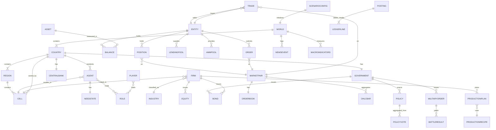
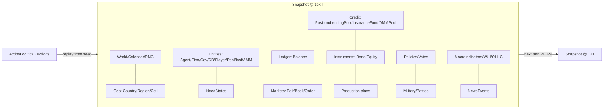

# 15. データモデル

本書は FinBox の**正準データモデル**を定義する。世界・地理・エンティティ・台帳・市場・金融商品・産業・政治・軍事・指標の各エンティティについて、フィールド名・型・制約・説明を最小テーブルで与え、エンティティ関係を Mermaid `erDiagram` で示し、永続化 (スナップショット) とアクションログの形式を確定する。ID体系・列挙値・資産分類・ニーズ・フェーズ名・保存則は [用語集 (00)](00-glossary.md) を唯一の真実とし、本書では再定義せず参照する。台帳の意味論は [経済と台帳 (08)](08-economy-and-ledger.md)、APIスキーマは [API リファレンス (14)](14-api-reference.md)、各ドメインの詳細フィールドは [世界と地理 (04)](04-world-and-geography.md) / [市場と取引 (09)](09-markets-and-trading.md) / [産業と生産 (10)](10-industry-and-production.md) / [金融と金融商品 (11)](11-finance-and-instruments.md) / [政治と統治 (12)](12-politics-and-government.md) を参照する。

## 15.1 型表記と共通規約 (Type Notation)

本書のスキーマは言語非依存の論理型で記述する。永続化の物理表現 (15.13) はこの論理型に従う。

| 論理型 | 意味 | 制約 |
| --- | --- | --- |
| `int` | 符号付き整数 (任意精度) | 文脈で範囲を別記 |
| `uint` | 非負整数 (`≥ 0`) | 数量・残高・価格・tick に用いる ([00 §0.8](00-glossary.md)) |
| `str` | 文字列 | 識別子は [00 §0.3](00-glossary.md) の命名規約に従う |
| `enum<X>` | 列挙 | 値域は 00 で定義 (ロール/産業/ニーズ/資産クラス等) |
| `id<T>` | 型 `T` の識別子参照 (外部キー) | 参照先が台帳/レジストリに存在すること |
| `bool` | 真偽 | |
| `decimal` | 固定小数 (係数・確率・率) | 状態には保持せず構成 ([16](16-configuration-and-initialization.md)) と導出のみで使用。台帳・価格・数量には用いない |
| `map<K,V>` | キー→値の写像 | 疎表現 (値0は省略可) |
| `list<T>` | 順序付き列 | |
| `tuple(...)` | 固定長組 | |

- **不変条件の表記**: スキーマの「制約」列に保存則 ([00 §0.17](00-glossary.md)) 由来の不変条件を明記する。`quantity: uint`、`price: uint`、`balance: uint`、外部キー、二重仕訳の借方=貸方をスキーマレベルで強制する。
- **時刻**: すべての時間参照は `tick: uint` ([00 §0.7](00-glossary.md)) を正準とし、表示用に `Y{年}-M{月}-T{ターン}` を派生する。
- **金額**: すべての金額は `(asset_id, quantity: uint)` の組で表現し、浮動小数を状態に保持しない。価格は `quote` 最小単位/`base` 1単位の `uint` ([00 §0.8](00-glossary.md))。

## 15.2 エンティティ関係全体図 (ER Overview)

`ENTITY` は `AGENT`/`FIRM`/`GOVERNMENT`/`CENTRALBANK`/`PLAYER`/`EXCH`/`LENDINGPOOL`/`INSURANCEFUND`/`AMMPOOL` の抽象基底であり、`entity_id` で台帳・注文・取引の主体となる ([00 §0.4](00-glossary.md))。`ASSET` はレジストリ上の資産定義 ([00 §0.5](00-glossary.md))。`BALANCE` は `entity_id × asset_id` の交点に1つ存在する。`LENDINGPOOL`/`INSURANCEFUND`/`AMMPOOL` は信用取引・貸借・自動做市のファシリティで、独立のエンティティ種別として実在の台帳残高を保持し (15.6.x)、`POSITION` は信用ポジションの負債・担保会計を保持する (`ENTITY ||--o{ POSITION : holds`、15.6.x)。

## 15.3 世界・地理 (World / Country / Region / Cell)

地理の生成・意味論は [04](04-world-and-geography.md) を参照。本節は永続スキーマのみを定める。

### World

| フィールド | 型 | 制約 | 説明 |
| --- | --- | --- | --- |
| `seed` | `uint` | 不変 | 世界生成シード ([00 §0.2 決定論](00-glossary.md))。再現性の起点 |
| `tick` | `uint` | `≥ 0` | 現在のターン通し番号 ([00 §0.7](00-glossary.md)) |
| `calendar` | `tuple(year:uint, month:uint, turn:uint)` | `month∈1..12`, `turn∈1..TURNS_PER_MONTH` | `tick` から導出される表示暦 |
| `scenario_id` | `id<ScenarioConfig>` | 必須 | 初期化したシナリオ ([16](16-configuration-and-initialization.md)) |
| `country_ids` | `list<id<Country>>` | 長さ6 | 構成国 ([00 §0.6](00-glossary.md)) |
| `wui` | `WUIState` | — | 計数単位バスケットの状態 (15.12) |
| `rng_state` | `bytes` | — | ターン乱数導出のための親シード状態 ([03](03-time-and-turns.md)) |

### Country

| フィールド | 型 | 制約 | 説明 |
| --- | --- | --- | --- |
| `country_code` | `str` | 3文字大文字, 一意 | [00 §0.6](00-glossary.md) |
| `name` | `str` | — | 国の表示名 (フレーバー、既定 Aldoria 等)。シード由来でプール割当可 ([16 §16.14](16-configuration-and-initialization.md))。正準IDは `country_code` |
| `currency` | `id<Asset>` | `= CUR:<country_code>` | 法定通貨 |
| `government_id` | `id<Government>` | `= GOV:<country_code>` | 政府 |
| `central_bank_id` | `id<CentralBank>` | `= CB:<country_code>` | 中央銀行 |
| `region_ids` | `list<id<Region>>` | 非空 | 構成地域 |
| `capital_cell_id` | `id<Cell>` | 自国マス | 首都マス |
| `population` | `uint` | — | 在籍エージェント数 (派生・キャッシュ) |

外部キー不変条件: `currency.country == government_id.country == central_bank_id.country == country_code`。

### Region

| フィールド | 型 | 制約 | 説明 |
| --- | --- | --- | --- |
| `region_id` | `str` | `REGION:<country_code>.<region_index>`(非ゼロ埋め) | 一意 ([00 §0.3](00-glossary.md), [04 §4.1.1](04-world-and-geography.md)) |
| `country_code` | `id<Country>` | 必須 | 所属国 (外部キー) |
| `name` | `str` | — | 地域名 |
| `cell_ids` | `list<id<Cell>>` | 非空 | 構成マス |
| `climate` | `enum<Climate>` | `{TROPICAL,ARID,TEMPERATE,CONTINENTAL,POLAR,HIGHLAND}`(6帯、緯度帯順) | 気候帯 ([04 §4.4.1](04-world-and-geography.md), [16](16-configuration-and-initialization.md)) |
| `extraction_caps` | `map<asset_id, uint>` | 値 `≥ 0` | 抽出系産業の地域総産出上限 ([00 §0.15](00-glossary.md), [10](10-industry-and-production.md)) |

### Cell

| フィールド | 型 | 制約 | 説明 |
| --- | --- | --- | --- |
| `cell_id` | `str` | `CELL:<country_code>.<region_index>.<x>.<y>`(非ゼロ埋め), 一意 | 格子座標マス ([00 §0.3](00-glossary.md), [04 §4.1.1](04-world-and-geography.md)) |
| `x`, `y` | `uint` | グリッド内 | 座標 |
| `owner` | `id<Country>` | 外部キー → Country | 領有国。軍事 (P8) で変化しうる ([12](12-politics-and-government.md)) |
| `region_id` | `id<Region>` | 外部キー → Region | 所属地域 |
| `terrain` | `enum<Terrain>` | `{PLAIN,FOREST,MOUNTAIN,DESERT,COAST,TUNDRA,SWAMP}`(7値) | 地形 ([04 §4.2.1](04-world-and-geography.md))。海洋は `terrain_locked`/`COAST`、都市は `development_level` で表現し terrain に含めない |
| `fertility` | `map<asset_id, uint>` | 作物→`0..1000` | 作物別の農業ポテンシャル ([04 §4.3](04-world-and-geography.md)) |
| `mineral_deposits` | `map<asset_id, {stock:uint, grade:uint}>` | `grade 0..1000` | 鉱床の残存埋蔵量と品位 ([04 §4.3](04-world-and-geography.md)) |
| `forest_stock` | `uint` | `0..1_000_000` | 立木在庫 (再生、[04 §4.3](04-world-and-geography.md)) |
| `water` | `uint` | `0..1000` | 淡水利用可能度 (灌漑・飲料・工業用水) |
| `infrastructure` | `uint` | `0..1000` | インフラ水準 (物流・生産効率に影響) |
| `development_level` | `uint` | `0..1000` | 開発度 (設備立地容量・需要密度。都市性の表現; [04 §4.2.1](04-world-and-geography.md)) |
| `terrain_locked` | `bool` | — | 建設不可フラグ (COAST 以外の純海洋セル; [04 §4.2.1](04-world-and-geography.md)) |
| `population` | `uint` | — | 居住エージェント数 (派生) |
| `fortification` | `uint` | `≥ 0` | 防御度 (P8 戦闘に影響) |
| `adjacency` | `list<id<Cell>>` | — | 隣接マス (移動・侵攻の隣接条件、派生・キャッシュ) |

不変条件: `cell.region_id.country_code == cell.owner` は genesis 時のみ成立し、占領後は `owner` のみ更新され `region_id` は地理的所属として保持する (領土と行政地域の分離; [12](12-politics-and-government.md))。

## 15.4 資産レジストリ (Asset)

`Asset` はレジストリ上の不変な資産定義。残高は台帳 (15.6) が、価格は市場 (15.7) が保持する。クラス・名前空間・性質フラグは [00 §0.5](00-glossary.md) を参照し再定義しない。

| フィールド | 型 | 制約 | 説明 |
| --- | --- | --- | --- |
| `asset_id` | `str` | `<CLASS>:<path>`, 一意 | [00 §0.5](00-glossary.md) |
| `asset_class` | `enum<AssetClass>` | `{CUR,COMM,BOND,EQ,BILL,FUT}` | [00 §0.5.1](00-glossary.md) |
| `namespace` | `str` | `COMM` のみ (`agri/raw/energy/mat/good/labor/svc/build/mil`) | [00 §0.5.2](00-glossary.md) |
| `perishable` | `bool` | `labor.*`/`svc.*`/`energy.electricity` は `true` | 在庫繰越不可 ([00 §0.5.3](00-glossary.md)) |
| `storable` | `bool` | `= not perishable` | 翌ターン繰越可否 |
| `min_unit` | `uint` | 通貨のみ意味を持つ (既定 1000) | 価格 tick の最小通貨単位 ([00 §0.8](00-glossary.md), [16](16-configuration-and-initialization.md))。表示は `internal/min_unit` を小数3桁＋3桁区切り (16 §16.3.1) |
| `display_name` | `str?` | `CUR` 等で表示名 | 人間可読の通貨名 (フレーバー、[16 §16.14](16-configuration-and-initialization.md))。正準IDは `asset_id`、ロジック・観測の数値特徴に非依存 |
| `issuer` | `id<Entity>?` | `BOND`/`BILL`/`EQ` で必須 | 発行体 (国債→`GOV`, 社債→`FIRM`, 株式→`FIRM`) |
| `meta` | `map<str,int>` | `FUT` および拡張資産のみ | `FUT`: `delivery_tick`。`BOND`/`BILL`/`EQ` の属性は `meta` に重複させず、正準スキーマ `Bond`(15.8)/`Equity`(15.8) を唯一の真実とする (source-of-truth 競合の回避) |

不変条件: `asset_class∈{BOND,BILL}` ⇒ `issuer` は `GOV:*`(国債) または `FIRM:*`(社債)。`asset_class==EQ` ⇒ `issuer` は `FIRM:*`。`asset_class∈{BOND,BILL,EQ}` の銘柄属性 (額面・クーポン・満期・発行済株数等) は `Bond`/`Equity`(15.8) が正準で、`Asset.meta` には格納しない。資産の総量は保存され、ミント/バーンは [00 §0.10](00-glossary.md) の点でのみ生じる。

## 15.5 エンティティ (Entity / Agent / Firm / Government / CentralBank / Player)

### Entity (基底)

すべての残高保有主体の共通基底。`entity_id` で台帳・注文・取引に参加する ([00 §0.4](00-glossary.md))。

| フィールド | 型 | 制約 | 説明 |
| --- | --- | --- | --- |
| `entity_id` | `str` | [00 §0.4](00-glossary.md) 形式, 一意 | `AGENT:*`/`FIRM:*`/`GOV:*`/`CB:*`/`PLAYER:*`/`EXCH`/`POOL:<asset_id>`/`INSF:<cc>`/`AMM:<pair_id>` |
| `entity_kind` | `enum<EntityKind>` | `{AGENT,FIRM,GOVERNMENT,CENTRAL_BANK,PLAYER,EXCHANGE,LENDING_POOL,INSURANCE_FUND,AMM_POOL}` | 種別判別子。`LENDING_POOL`/`INSURANCE_FUND`/`AMM_POOL` は信用・貸借・自動做市のファシリティで、実在の台帳残高を保持する (15.6.x) |
| `country_code` | `id<Country>?` | `EXCH` および資産横断のファシリティ (`POOL:*`/`AMM:*`) は `null`、`INSF:<cc>` は当該通貨国 | 帰属国 (徴税・国籍判定) |
| `created_tick` | `uint` | `≤ tick` | 生成ターン |
| `active` | `bool` | — | 清算/死亡で `false` |

残高はここに埋め込まず、台帳 (15.6) が `entity_id` をキーに保持する。

### Agent (extends Entity)

意思決定・ニーズ・ライフサイクルは [05](05-agents.md)、ロールは [06](06-roles.md)、観測/行動/報酬は [07](07-machine-learning.md) を参照。

| フィールド | 型 | 制約 | 説明 |
| --- | --- | --- | --- |
| `entity_id` | `str` | `AGENT:<6桁>` | 継承 |
| `residence_cell` | `id<Cell>` | 外部キー → Cell | 居住マス (`*..1`) |
| `roles` | `list<enum<Role>>` | 非空 | 保有ロール ([00 §0.14](00-glossary.md)) |
| `need_state_id` | `id<NeedState>` | 1:1 | ニーズ状態 (15.5.1) |
| `employer` | `id<Firm>?` | 外部キー → Firm | 雇用先 (労働市場約定で更新) |
| `policy_net_id` | `str?` | — | 推論ポリシー識別子 ([07](07-machine-learning.md)) |
| `birth_tick` | `uint` | — | 出生 tick (`age` の基準) |
| `display_name` | `str?` | — | エージェントの人名 (フレーバー、[16 §16.14](16-configuration-and-initialization.md))。`names.assign_person_names=false` で `null`→`entity_id` 表示。正準IDは `entity_id` |
| `alive` | `bool` | — | 死亡で `false` (台帳残高は相続/清算処理) |

### NeedState (15.5.1)

ニーズは Tradable Asset ではない内部連続値 ([00 §0.13](00-glossary.md))。状態としては既定 `0..100` を `int` で保持 (固定小数を避け、減衰・回復は整数演算で行う; [05](05-agents.md))。

| フィールド | 型 | 制約 | 説明 |
| --- | --- | --- | --- |
| `agent_id` | `id<Agent>` | 1:1, 外部キー | 所有者 |
| `physio` | `map<enum<PhysioNeed>, int>` | 値 `0..100` | `{satiety,hydration,stamina,health,rest}` ([00 §0.13](00-glossary.md)) |
| `psycho` | `map<enum<PsychoNeed>, int>` | 値 `0..100` | `{happiness,stress,comfort,social,security,leisure}` |
| `skill` | `map<enum<LaborKind>, int>` | 値 `0..100` | 労働種別ごとの技能 (`COMM:labor.*` に対応) |
| `education` | `int` | `0..100` | 教育水準 |
| `age` | `uint` | `= tick - birth_tick` 換算 | 年齢 (派生だがキャッシュ) |
| `wealth_wui` | `int` | — | WUI 換算純資産 (P9 で再評価, 15.12) |
| `loyalty` | `int` | `0..100` | 国家忠誠 |

### Firm (extends Entity)

生産・雇用・在庫の法人。詳細は [10](10-industry-and-production.md)。

| フィールド | 型 | 制約 | 説明 |
| --- | --- | --- | --- |
| `entity_id` | `str` | `FIRM:<6桁>` | 継承 |
| `industry` | `enum<Industry>` | 外部キー → Industry ([00 §0.15](00-glossary.md)) | 所属産業 (`*..1`) |
| `sub_industry` | `str?` | `MANUFACTURING` のみ | `heavy/chemical/electronics/food/textile/automotive/pharma/armaments` |
| `site_cell` | `id<Cell>` | 外部キー → Cell | 立地マス |
| `equity_asset` | `id<Asset>` | `= EQ:firm.<6桁>` | 自社株 asset_id |
| `capacity` | `uint` | `≥ 0` | 生産能力上限 (建設労働力消費で拡張; P5) |
| `recipe_ids` | `list<id<ProductionRecipe>>` | — | 運用可能なレシピ |
| `ceo` | `id<Agent>` | `ENTREPRENEUR` ロール | 経営者 |
| `incorporated_tick` | `uint` | — | 設立 tick |
| `display_name` | `str` | 一意 (国群内) | 企業の人間可読名 (フレーバー)。設立時指定 ([14 §14.5.5](14-api-reference.md)) または プール割当 ([16 §16.14](16-configuration-and-initialization.md))。正準IDは `entity_id` |
| `state` | `enum<FirmLifecycle>` | `{FOUNDING,OPERATING,EXPANDING,RAISING,DISTRIBUTING,INSOLVENT,LIQUIDATING}` | ライフサイクル状態機械 ([10 §10.8](10-industry-and-production.md)) |

在庫・現金は台帳残高 (`balance[FIRM:*][*]`) として保持し、Firm に重複保持しない。

### Government (extends Entity)

| フィールド | 型 | 制約 | 説明 |
| --- | --- | --- | --- |
| `entity_id` | `str` | `GOV:<country_code>` | 継承 |
| `country_code` | `id<Country>` | 1:1 | 統治国 |
| `tax_rates` | `map<enum<TaxKind>, int>` | 値 bps, `≥ 0` | `{income,corporate,consumption,tariff}` (P3 確定, P7 徴収) |
| `bond_issue_quota` | `uint` | `≥ 0` | 当ターン国債発行枠 (P3) |
| `military_budget` | `uint` | `≥ 0` | 軍事予算 (自国通貨, P3) |
| `subsidies` | `map<str, uint>` | — | 補助金・社会保障・失業給付の枠 (P7, [12](12-politics-and-government.md)) |
| `territory_cells` | `list<id<Cell>>` | — | 領有マス (派生; `cell.owner == country_code`) |

### CentralBank (extends Entity)

| フィールド | 型 | 制約 | 説明 |
| --- | --- | --- | --- |
| `entity_id` | `str` | `CB:<country_code>` | 継承 |
| `country_code` | `id<Country>` | 1:1 | 管轄国 |
| `policy_rate_bps` | `int` | `-100..4000` bps | 政策金利 (P3 で集約確定; [00 §0.12](00-glossary.md), [11 §11.10](11-finance-and-instruments.md)) |
| `omo_target` | `int` | — | 公開市場操作の純注入目標 (自国通貨; 正=供給) |
| `reserve_holdings` | `map<asset_id, uint>` | — | 保有準備資産 (台帳に反映, 重複保持しない) |

通貨の発行/吸収は `CB:*` のみが行えるミント/バーン点 ([00 §0.10, §0.17](00-glossary.md))。

### Player (extends Entity)

人間プレイヤーの口座。台帳上エージェントと対等 ([00 §0.4](00-glossary.md), [13](13-players-and-multiplayer.md))。

| フィールド | 型 | 制約 | 説明 |
| --- | --- | --- | --- |
| `entity_id` | `str` | `PLAYER:<6桁>` | 継承 |
| `display_name` | `str` | 一意 | 表示名 |
| `roles` | `list<enum<Role>>` | 既定 `[INVESTOR]` | 構成で `ENTREPRENEUR` 解禁可 ([13](13-players-and-multiplayer.md)) |
| `home_country` | `id<Country>` | — | 拠点国 (基準通貨・課税) |
| `auth_token_hash` | `str` | — | 認証 ([14](14-api-reference.md))。生の鍵は保存しない |
| `joined_tick` | `uint` | — | 参加 tick |

## 15.6 台帳 (Balance / Posting)

台帳の意味論は [08](08-economy-and-ledger.md)、不変条件は [00 §0.9, §0.17](00-glossary.md)。

### Balance

| フィールド | 型 | 制約 | 説明 |
| --- | --- | --- | --- |
| `entity_id` | `id<Entity>` | 外部キー | 保有主体 |
| `asset_id` | `id<Asset>` | 外部キー | 資産 |
| `quantity` | `uint` | `≥ 0` (非負残高) | 現物保有量 ([00 §0.9](00-glossary.md)) |

主キーは `(entity_id, asset_id)`。疎表現とし `quantity==0` は省略可。**現物残高は決して負にならない**: 空売り・借入は金融商品の負債計上 (`BOND` 発行残高・`Position` のショート) で表現する ([11](11-finance-and-instruments.md))。

### Posting (二重仕訳)

1件の posting は資産ごとに借方合計=貸方合計となる仕訳明細の集合。市場決済もプロトコル移転も同一構造で記録する ([00 §0.10](00-glossary.md), [08 §8.4](08-economy-and-ledger.md))。

| フィールド | 型 | 制約 | 説明 |
| --- | --- | --- | --- |
| `posting_id` | `uint` | 単調増加・一意 | 記帳識別子 (リプレイ順序、[08 §8.4](08-economy-and-ledger.md)) |
| `cause` | `enum<Cause>` | `{TRADE,PRODUCTION,CONSUMPTION,FISCAL,TAX,TARIFF,SUBSIDY,COUPON,REDEEM,DIVIDEND,MINT,BURN,MILITARY,LIQUIDATION,GENESIS,EXPIRE,POOL_SUPPLY,POOL_WITHDRAW,LOAN,REPAY,INTEREST,LIQUIDATION_PENALTY,HAIRCUT,AMM_SUPPLY,AMM_WITHDRAW}` | 原因種別 ([00 §0.10](00-glossary.md), [08 §8.4.2](08-economy-and-ledger.md))。信用・貸借・AMM 系の `POOL_SUPPLY`/`POOL_WITHDRAW`/`LOAN`/`REPAY`/`INTEREST`/`LIQUIDATION_PENALTY`/`HAIRCUT`/`AMM_SUPPLY`/`AMM_WITHDRAW` は保存系 (ミント/バーン点に含まれない、各資産で総和ゼロ) |
| `cause_ref` | `str?` | — | 原因の参照 (`trade_id`/`production_id`/`policy_id`/`battle_id`/`loan_id`/`liquidation_id`)。`LOAN`/`REPAY`/`INTEREST`/`HAIRCUT` は `loan_id`、強制決済の記帳は `liquidation_id` を参照する (15.6.x) |
| `tick` | `uint` | — | 発生ターン |
| `phase` | `enum<Phase>` | `P0..P9` ([00 §0.11](00-glossary.md)) | 発生フェーズ |
| `lines` | `list<LedgerLine>` | 非空 | 仕訳明細 |

### LedgerLine

| フィールド | 型 | 制約 | 説明 |
| --- | --- | --- | --- |
| `entity_id` | `id<Entity>` | 外部キー | 主体 |
| `asset_id` | `id<Asset>` | 外部キー | 資産 |
| `delta` | `int` | `≠ 0` | 増減 (借方=正の受取, 貸方=負の払出) |

**二重仕訳不変条件**: 任意の `asset_id` について `Σ delta == 0`。ただし `cause∈{MINT,BURN,PRODUCTION,CONSUMPTION,GENESIS,MILITARY,EXPIRE,REDEEM,LIQUIDATION}` の生成/消滅点では当該資産の総和が非ゼロとなることを許容し、それ以外では総和ゼロ (保存) を強制する ([00 §0.10, §0.17](00-glossary.md))。信用・貸借・AMM 系の `cause∈{POOL_SUPPLY,POOL_WITHDRAW,LOAN,REPAY,INTEREST,LIQUIDATION_PENALTY,HAIRCUT,AMM_SUPPLY,AMM_WITHDRAW}` は保存系 (ミント/バーン点に含めない) として各資産で総和ゼロを強制する。各ラインの適用後 `balance ≥ 0` でなければ posting 全体を棄却する。

## 15.6.1 信用・貸借・自動做市 (Position / LendingPool / InsuranceFund / AMMPool)

信用取引・貸借プール・保険基金・自動做市の正準スキーマ。意味論・証拠金・強制決済・利率は [09 §信用取引/貸借プール/強制決済](09-markets-and-trading.md)、純資産反映は [08 §8.8](08-economy-and-ledger.md)、利息・配当・利回りは [11](11-finance-and-instruments.md)、構成パラメーターは [16](16-configuration-and-initialization.md) を参照する。ファシリティ (`POOL:*`/`INSF:*`/`AMM:*`) はいずれも実在の台帳残高 (15.6 `Balance`) を保持するエンティティであり、貸付・利息・清算・準備金移転はすべて `Posting` の二重仕訳 (保存系 cause) として記帳される。すべての金額・数量・持分は `uint`/`int` の整数で保持し、丸めは [00 §0.20](00-glossary.md) の `floor`/largest-remainder に従う。

### Position

信用ポジション。空売り・レバレッジは現物残高をマイナスにせず本スキーマの負債・担保として計上する (15.6 `Balance` 非負則、[08 §8.8](08-economy-and-ledger.md) の旧 `margin_owed` を本スキーマの `borrowed_*` + `accrued_interest` へ具体化)。

| フィールド | 型 | 制約 | 説明 |
| --- | --- | --- | --- |
| `position_id` | `str` | `POS:<6桁>`(ゼロ埋め, 単調増加), 一意 | ポジション識別子 |
| `entity` | `id<Entity>` | 外部キー → Entity | 建玉主体 (信用可能ロール; [06](06-roles.md)) |
| `pair_id` | `id<MarketPair>` | 外部キー; `CUR/CUR`・`EQ/CUR`・storable `COMM/CUR` のみ | 対象ペア (信用対象市場) |
| `side` | `enum<PositionSide>` | `{LONG,SHORT}` | 建て方向 |
| `qty` | `uint` | `> 0`, `lot_size` の倍数 | ポジション数量 (`base` 建て) |
| `entry_price` | `uint` | `quote` 単位 | 建値 (約定価格) |
| `borrowed_asset` | `id<Asset>` | LONG=`quote`/SHORT=`base` | プールから借り入れたアセット |
| `borrowed_qty` | `uint` | `≥ 0` | 借入数量 (負債) |
| `collateral_asset` | `id<Asset>` | LONG=`base`(+余剰 `quote`)/SHORT=`quote` | 担保アセット |
| `collateral_qty` | `uint` | `≥ 0` | 担保数量 |
| `accrued_interest` | `uint` | `≥ 0`, `quote` 単位 | 未払利息 (P7 で `cause==INTEREST` 支払、未払分を累積) |
| `open_tick` | `uint` | `≤ tick` | 建玉 tick |

評価 (いずれも `quote` 建ての整数、P4 清算価格 `p*` でマーク): `borrowed_value = borrowed_qty`(LONG) または `borrowed_qty × mark`(SHORT)、`equity = collateral_value − borrowed_value − accrued_interest`、`notional = qty × mark`、`margin_ratio = equity / notional`(bps)。新規建ては P2 VALIDATE で `margin_ratio ≥ initial_margin`(16 `margin.initial_margin`=2000 bps) を要求しクランプ、`margin_ratio < maintenance_margin`(クラス別 16 `margin.maintenance_margin[fx|comm|equity]`) のポジションを P4 で強制決済する ([09 §強制決済](09-markets-and-trading.md))。`borrowed_qty` の現物はプール→建玉主体へ `cause==LOAN`、返済は `cause==REPAY`、清算ペナルティは `cause==LIQUIDATION_PENALTY` で `INSF:<cc>` へ移転する (`cause_ref` に `loan_id`/`liquidation_id`)。

### LendingPool

信用対象アセットごとに1つ開設する貸借プール (エンティティ `POOL:<asset_id>`)。供給者の預入アセットを借り手へ貸し出し、利用率連動金利で需給を均衡させる。

| フィールド | 型 | 制約 | 説明 |
| --- | --- | --- | --- |
| `asset` | `id<Asset>` | 1:1; 信用対象アセット (`CUR:*`/`EQ:firm.*`/storable `COMM:*`) | プール対象アセット (`POOL:<asset>` の `<asset>`) |
| `supplied` | `uint` | `≥ borrowed` | 供給総量 (預入累計、現物は台帳残高で保持) |
| `borrowed` | `uint` | `0 ≤ borrowed ≤ supplied` | 貸出中数量 (借り手の負債合計) |
| `total_shares` | `uint` | `≥ 0` | 発行済プール持分総数 |
| `shares` | `map<id<Entity>, uint>` | 値 `≥ 0`, `Σ == total_shares` | 供給者別持分 (引出は持分按分) |

利用可能残高 `available = ledger(POOL, asset) = supplied − borrowed`。利用率 `U = borrowed / supplied`(bps)。借入金利はキンク・モデル: `U ≤ U_kink` で `borrow_rate = base_rate + U·slope1/10000`、`U > U_kink` で `borrow_rate = base_rate + U_kink·slope1/10000 + (U−U_kink)·slope2/10000`、`supply_rate = floor(borrow_rate · U/10000 · (10000−reserve_factor)/10000)`(既定 16 `lending.*`: `U_kink`=8000, `slope1`=400, `slope2`=6000, `reserve_factor`=1000、通貨プール `base_rate=policy_rate[s]`、アセットプール `base_rate`=`lending.base_rate`=200)。預入は `qty·total_shares/pool_value`(空のとき `qty`) の持分をミントし `cause==POOL_SUPPLY`、引出は持分按分で `available` を上限に償還し `cause==POOL_WITHDRAW`(預入→引出は P4 板寄せより前に確定; [09 §プール操作の順序](09-markets-and-trading.md))。利息は P7 で `borrow_rate` 分を借り手が支払い、`reserve_factor` 分が `INSF:<cc>` へ、残りはプールに留保され供給者は持分価値の上昇で実現する。genesis は home 通貨プールのみシード (16 `lending.genesis_supply`=2,000,000、持分はシード投資家)。

### InsuranceFund

通貨ごとに1つ開設する保険基金 (エンティティ `INSF:<cc>`)。不良債権 (`equity < 0`) の first-loss バッファ。

| フィールド | 型 | 制約 | 説明 |
| --- | --- | --- | --- |
| `cc` | `id<Country>` | 1:1; 通貨国 | 基金通貨 (`INSF:<cc>` の `<cc>`) |
| `balance` | `uint` | `≥ 0` | 基金残高 (`CUR:<cc>` 建て、台帳残高で保持) |

積み増し: genesis シード (16 `insurance.genesis_seed`=1,000,000) + 清算ペナルティ (`cause==LIQUIDATION_PENALTY`) + 金利スプレッド (`reserve_factor` 分の `cause==INTEREST`)。補填: 不良債権の不足分を `cause==HAIRCUT` でプール/借り手へ移転する。基金が尽きた残余は供給者持分の按分ヘアカット (largest-remainder; [00 §0.20](00-glossary.md)) としてプール持分を書き下げ (`LendingPool.supplied`/`borrowed` 減)、`cause==HAIRCUT` で記帳する。ミントは行わず損失は実在保有者間で清算する。

### AMMPool

ペアごとの自動マーケットメイカー (エンティティ `AMM:<pair_id>`)。RL クォートに依らず決定論的価格カーブで全ペアに流動性を供給する受動做市ファシリティ。既定無効 (16 `amm.enabled`=False、iceberg と同様の opt-in)。

| フィールド | 型 | 制約 | 説明 |
| --- | --- | --- | --- |
| `pair_id` | `id<MarketPair>` | 1:1 | 対象ペア (`AMM:<pair_id>` の `<pair_id>`) |
| `base` | `id<Asset>` | `= pair.base` | 準備金の `base` アセット |
| `quote` | `id<Asset>` | `= pair.quote`, `asset_class==CUR` | 準備金の `quote` 通貨 |
| `invariant` | `enum<AMMInvariant>` | `{CONST_PRODUCT,CONCENTRATED}` | 価格カーブ不変量 (16 `amm.invariant[class]`: FX→`CONCENTRATED`, EQ/COMM→`CONST_PRODUCT`) |
| `spread_bps` | `uint` | `≥ 0` | カーブ内蔵の気配幅 (手数料ではない、撤廃対象外; 16 `amm.spread_bps[class]`: FX 10/EQ 50/COMM 30) |
| `r_base` | `uint` | `≥ 0` | `base` 準備金 (台帳残高で保持) |
| `r_quote` | `uint` | `≥ 0` | `quote` 準備金 (台帳残高で保持) |
| `total_shares` | `uint` | `≥ 0` | 発行済 LP 持分総数 |
| `shares` | `map<id<Entity>, uint>` | 値 `≥ 0`, `Σ == total_shares` | LP 別持分 (引出は準備金比按分) |

mid `= r_quote // r_base`。毎ターン mid を中心に `spread_bps` を内蔵した BUY/SELL の梯子 (`amm.ladder_levels`=8 水準) を `LIMIT` 注文として板寄せ ([09 §9.3](09-markets-and-trading.md)) へ投入し、約定後に約定量だけ `r_base`/`r_quote` を更新する。LP 供給 (`cause==AMM_SUPPLY`) は `base`+`quote` を準備金へ預け持分をミント、引出 (`cause==AMM_WITHDRAW`) は持分按分で準備金比に償還する。genesis シード 16 `amm.genesis_seed`=1,000,000。`AMM` は在庫 (準備金) 以上を約定しないため非負・保存則を破らず支払不能に陥らない。

## 15.7 市場 (MarketPair / OrderBook / Order / Trade / OHLCBar)

板寄せ・注文種別・通貨ペアは [09](09-markets-and-trading.md)、APIスキーマは [14](14-api-reference.md)。

### MarketPair

| フィールド | 型 | 制約 | 説明 |
| --- | --- | --- | --- |
| `pair_id` | `str` | `<base>/<quote>`, 一意 | [00 §0.3](00-glossary.md) |
| `base` | `id<Asset>` | 外部キー | 取引対象資産 |
| `quote` | `id<Asset>` | `asset_class==CUR` | 建値通貨 |
| `kind` | `enum<MarketKind>` | `{LABOR,GOODS,FX,BOND,EQUITY}` | 市場種別 |
| `tick_size` | `uint` | `≥ 1` | 価格刻み (`quote` 最小単位) |
| `lot_size` | `uint` | `≥ 1` | 数量刻み |
| `active` | `bool` | — | 取引可否 |

不変条件: `kind==FX` ⇒ `base.asset_class==CUR`。`kind==LABOR` ⇒ `base.namespace=="labor"`。`price` は `quote` 単位の `uint`。`kind==BOND` は `asset_class∈{BOND,BILL}` を含む (短期割引証券 `BILL:*` も BOND 市場で取引; [09 §9.2.2](09-markets-and-trading.md))。`kind==LABOR` の `base` は `COMM:labor.*`(労働力) に加え `COMM:build.construction_labor`(建設労働力=資本財) を含む ([09 §9.2.2](09-markets-and-trading.md))。

### Order

| フィールド | 型 | 制約 | 説明 |
| --- | --- | --- | --- |
| `order_id` | `str` | 一意 | 注文識別子 |
| `entity_id` | `id<Entity>` | 外部キー → Entity (`*..1`) | 注文主体 ([00 §0.4](00-glossary.md)) |
| `pair_id` | `id<MarketPair>` | 外部キー | 対象ペア |
| `side` | `enum<Side>` | `{BUY,SELL}` | 売買方向 |
| `order_type` | `enum<OrderType>` | `{LIMIT,MARKET,IOC,FOK}` | 注文種別 ([00 §0.19](00-glossary.md), [09](09-markets-and-trading.md)) |
| `limit_price` | `uint?` | `LIMIT` で必須, `tick_size` の倍数 | 指値 (`quote` 単位) |
| `qty` | `uint` | `> 0`, `lot_size` の倍数 | 数量 |
| `filled` | `uint` | `0 ≤ filled ≤ qty` | 約定済数量 |
| `tif` | `enum<TIF>` | `{GFT,GTC,GTT}`(既定 `GFT`) | 有効期間 ([00 §0.19](00-glossary.md)) |
| `expires_tick` | `uint?` | `tif==GTT` で必須・提出 tick より後, それ以外 `null` | `GTT` の失効 tick ([00 §0.19](00-glossary.md)) |
| `submit_seq` | `uint` | — | 提出順序キー (P1、時間優先 [09 §9.6.3](09-markets-and-trading.md)) |
| `status` | `enum<OrderStatus>` | `{OPEN,PARTIAL,FILLED,CANCELLED,REJECTED,EXPIRED}` | 状態 |

検証 (P2): `side==BUY` は必要 `quote` 残高 (`price×quantity` 上限) を、`side==SELL` は `base` 残高を保有していること。不足は棄却またはクランプ ([00 §0.11](00-glossary.md))。

### OrderBook

| フィールド | 型 | 制約 | 説明 |
| --- | --- | --- | --- |
| `pair_id` | `id<MarketPair>` | 1:1 | 対象ペア |
| `bids` | `list<id<Order>>` | 価格降順 | 買い注文 (`OPEN`/`PARTIAL`) |
| `asks` | `list<id<Order>>` | 価格昇順 | 売り注文 |
| `last_price` | `uint?` | — | 直近約定価格 |
| `last_clear_tick` | `uint` | — | 最終板寄せ tick (P4) |

板寄せは P4 で単一清算価格を決定し ([09](09-markets-and-trading.md))、約定を `Trade` として生成、台帳へ `cause==TRADE` の `Posting` で反映する。

### Trade / Fill

1約定はちょうど2エンティティ (買い手・売り手) を結ぶ ([00 §0.4, §0.8](00-glossary.md))。

| フィールド | 型 | 制約 | 説明 |
| --- | --- | --- | --- |
| `trade_id` | `str` | 一意 | 約定識別子 |
| `pair_id` | `id<MarketPair>` | 外部キー | ペア |
| `buyer` | `id<Entity>` | 外部キー | 買い手 (`base` 受取・`quote` 払出) |
| `seller` | `id<Entity>` | 外部キー (`≠ buyer`) | 売り手 |
| `buy_order_id` | `id<Order>` | 外部キー | 約定した買い注文 |
| `sell_order_id` | `id<Order>` | 外部キー | 約定した売り注文 |
| `price` | `uint` | 清算価格 | 約定単価 |
| `quantity` | `uint` | `> 0` | 約定数量 |
| `cash` | `uint` | `= price × quantity` | 現金移動額 (端数なし; [00 §0.8](00-glossary.md)) |
| `tick` | `uint` | — | 約定ターン (P4) |

不変条件: `buyer ≠ seller`。生成する `Posting` は `base` で `+quantity`(buyer)/`-quantity`(seller)、`quote` で `-cash`(buyer)/`+cash`(seller) と各資産で総和ゼロ。約定に手数料は存在しない (`EXCH` は清算・決済のみを担い手数料を収受しない; [00 §0.8](00-glossary.md)、[08 §8.5](08-economy-and-ledger.md)、[09 §9.6.1](09-markets-and-trading.md))。

### OHLCBar

価格時系列の集計。表示・指標・観測 ([07](07-machine-learning.md)) に供する。

| フィールド | 型 | 制約 | 説明 |
| --- | --- | --- | --- |
| `pair_id` | `id<MarketPair>` | 外部キー | ペア |
| `period` | `enum<BarPeriod>` | `{TURN,MONTH,QUARTER,YEAR}` | 集計粒度 |
| `index_tick` | `uint` | — | バー開始 tick |
| `open`,`high`,`low`,`close` | `uint` | `low ≤ open,close ≤ high` | OHLC (`quote` 単位) |
| `volume` | `uint` | `≥ 0` | 出来高 (`base` 数量) |
| `vwap` | `uint` | — | 出来高加重平均価格 (整数丸め) |

## 15.8 金融商品 (Bond / Equity)

利息・配当・償還・指標は [11](11-finance-and-instruments.md)。`Asset.meta` に重複させず正準スキーマをここに置く。

### Bond

国債 (`BOND:gov.*`) と社債 (`BOND:firm.*`)、短期割引証券 (`BILL:*`) を含む。

| フィールド | 型 | 制約 | 説明 |
| --- | --- | --- | --- |
| `asset_id` | `id<Asset>` | `BOND:*`/`BILL:*`, 一意 | 銘柄 |
| `issuer` | `id<Entity>` | 外部キー → Entity (`*..1`); `GOV:*` または `FIRM:*` | 発行体 ([00 §0.5.1](00-glossary.md)) |
| `currency` | `id<Asset>` | `asset_class==CUR` | 額面通貨 |
| `face` | `uint` | `> 0` | 額面 (1単位あたり償還額) |
| `coupon_bps` | `int` | `≥ 0`; `BILL` は `0` | 年率クーポン (bps) |
| `issue_tick` | `uint` | — | 発行 tick |
| `maturity_tick` | `uint` | `> issue_tick` | 満期 tick |
| `outstanding` | `uint` | `≥ 0` | 発行残高 (保有合計と一致) |

クーポンは四半期境界 ([03 §3.5](03-time-and-turns.md)) で保有口数 `q` に対し `coupon = floor(q × face × coupon_bps / 10000 / 4)` を P7 で `cause==COUPON` 移転として支払う (年率の四半期按分=単利, [00 §0.7](00-glossary.md)。丸めは [00 §0.20](00-glossary.md) の `floor`、[08 §8.6.2](08-economy-and-ledger.md)・[11 §11.4.3](11-finance-and-instruments.md) と同一)。償還は満期 tick に `cause==REDEEM` で元本払出と債券バーン。`BILL` は割引発行 (クーポンなし、満期に額面償還)。

### Equity

| フィールド | 型 | 制約 | 説明 |
| --- | --- | --- | --- |
| `asset_id` | `id<Asset>` | `EQ:firm.<6桁>`, 一意 | 銘柄 |
| `firm_id` | `id<Firm>` | 外部キー → Firm (`*..1`) | 発行企業 |
| `shares_outstanding` | `uint` | `≥ 0` | 発行済株式数 (保有合計と一致) |
| `par` | `uint` | `≥ 0` | 額面 (清算・配当基準) |
| `dividend_policy_bps` | `int` | `≥ 0` | 利益配当率 (P7 で `cause==DIVIDEND`) |
| `listed` | `bool` | — | 上場 (株式市場で売買可) |

不変条件: `EQ` の保有合計 `== shares_outstanding`。増資/自社株買い/清算でのみ増減 ([00 §0.5.1, §0.17](00-glossary.md))。

## 15.9 生産 (ProductionPlan / ProductionRecipe)

生産の制約・能力拡張は [10](10-industry-and-production.md)、生成/消滅の記録は [00 §0.10 P5](00-glossary.md)。

### ProductionRecipe

| フィールド | 型 | 制約 | 説明 |
| --- | --- | --- | --- |
| `recipe_id` | `str` | 一意 | レシピ識別子 |
| `industry` | `enum<Industry>` | [00 §0.15](00-glossary.md) | 対象産業 |
| `inputs` | `map<asset_id, uint>` | 値 `> 0` | 1バッチの投入財 (`labor.*`/中間財/原料) |
| `outputs` | `map<asset_id, uint>` | 値 `> 0` | 1バッチの産出財 |
| `capacity_cost` | `uint` | `≥ 0` | 1バッチに要する能力 (`Firm.capacity` 消費上限内) |
| `cell_requirement` | `map<asset_id, uint>?` | — | 抽出系: マス/地域資源賦存への依存 ([04](04-world-and-geography.md)) |

不変条件: 投入と産出はすべて整数。`build` レシピの産出は `COMM:build.construction_labor`(資本財)。`labor`/`svc` 投入はそのターンに消費されなければ消滅 ([00 §0.5.3](00-glossary.md))。

### ProductionPlan

| フィールド | 型 | 制約 | 説明 |
| --- | --- | --- | --- |
| `plan_id` | `str` | 一意 | 計画識別子 |
| `firm_id` | `id<Firm>` | 外部キー | 生産主体 |
| `recipe_id` | `id<ProductionRecipe>` | 外部キー (`*..1`) | 採用レシピ |
| `batches` | `uint` | `> 0` | 計画バッチ数 |
| `submit_tick` | `uint` | — | 提出ターン (P1) |
| `production_id` | `str?` | P5 で付与 | 実行結果の生成/消滅原因識別子 ([00 §0.9](00-glossary.md)) |
| `executed_batches` | `uint` | `0 ≤ executed ≤ batches` | 実行済 (投入不足・能力/地域上限でクランプ) |

P5: 投入財を台帳から消費 (`cause==PRODUCTION` の負ライン)、産出財を生成 (正ライン)、`Firm.capacity` と地域 `extraction_caps` でクランプ。建設レシピの産出消費による `capacity` 拡張も P5 で反映 ([10](10-industry-and-production.md))。

## 15.10 政治 (Policy / PolicyVote)

集約規則は [00 §0.12](00-glossary.md)、レバーは [12](12-politics-and-government.md)。

### Policy

| フィールド | 型 | 制約 | 説明 |
| --- | --- | --- | --- |
| `policy_id` | `str` | 一意 | 政策識別子 |
| `country_code` | `id<Country>` | 外部キー | 対象国 |
| `lever` | `enum<PolicyLever>` | `{POLICY_RATE,INCOME_TAX,CORPORATE_TAX,CONSUMPTION_TAX,TARIFF,BOND_QUOTA,MILITARY_BUDGET,SUBSIDY,MILITARY_TARGET}` | 政策レバー |
| `agg_kind` | `enum<AggKind>` | `{SCALAR,BINARY,CATEGORICAL,ALLOCATION}` | 集約方式 ([00 §0.12](00-glossary.md)) |
| `value` | `int \| list<int>` | レンジ内, tick 丸め | 確定値 (SCALAR/BINARY=スカラ, ALLOCATION=正規化ベクトル) |
| `decided_tick` | `uint` | — | 確定ターン (P3) |
| `effective_from` | `uint` | `≥ decided_tick` | 適用開始 tick |

### PolicyVote

| フィールド | 型 | 制約 | 説明 |
| --- | --- | --- | --- |
| `vote_id` | `str` | 一意 | 投票識別子 |
| `policy_id` | `id<Policy>` | 外部キー (`*..1`) | 対象政策 |
| `politician_id` | `id<Agent>` | `POLITICIAN` ロール, 外部キー | 投票者 |
| `proposal` | `int \| list<int>` | レンジ内 | 提案値 (SCALAR=値, BINARY=`[0,1]`, CATEGORICAL=選択肢スコア, ALLOCATION=重みベクトル) |
| `submit_tick` | `uint` | — | 提出ターン (P1) |

P3 集約: SCALAR=平均→クランプ→丸め、BINARY=平均 `≥0.5`、CATEGORICAL=合計スコア最大 (同点最小インデックス)、ALLOCATION=正規化重み平均 ([00 §0.12](00-glossary.md))。

## 15.11 軍事 (MilitaryOrder / BattleResult)

軍需品消費・占領・領土更新は [12](12-politics-and-government.md) (P8)。

### MilitaryOrder

| フィールド | 型 | 制約 | 説明 |
| --- | --- | --- | --- |
| `order_id` | `str` | 一意 | 命令識別子 |
| `country_code` | `id<Country>` | 外部キー | 命令国 |
| `commander` | `id<Agent>` | `GENERAL` ロール | 指揮官 |
| `action` | `enum<MilAction>` | `{ATTACK,DEFEND,FORTIFY,MOVE}` | 行動 |
| `source_cell` | `id<Cell>` | 自国マス | 起点 |
| `target_cell` | `id<Cell>` | `source_cell` に隣接 (隣接条件) | 目標 |
| `munitions` | `uint` | `≤ balance[GOV][COMM:mil.munitions]` | 投入軍需品 |
| `submit_tick` | `uint` | — | 提出ターン (P1) |

不変条件: `target_cell ∈ source_cell.adjacency`(隣接条件)。軍需品は P8 で消費・消滅 (`cause==MILITARY` バーン; [00 §0.10](00-glossary.md))。

### BattleResult

| フィールド | 型 | 制約 | 説明 |
| --- | --- | --- | --- |
| `battle_id` | `str` | 一意 | 戦闘識別子 |
| `order_id` | `id<MilitaryOrder>` | 外部キー | 起因命令 |
| `cell_id` | `id<Cell>` | 外部キー | 戦域マス |
| `attacker`,`defender` | `id<Country>` | 外部キー | 交戦国 |
| `munitions_spent` | `tuple(att:uint, def:uint)` | — | 消費軍需品 |
| `outcome` | `enum<Outcome>` | `{CAPTURED,REPELLED,STALEMATE}` | 結果 |
| `new_owner` | `id<Country>` | `CAPTURED` 時のみ変化 | 占領後領有国 (`Cell.owner` 更新) |
| `tick` | `uint` | — | 解決ターン (P8) |

## 15.12 マクロ指標と WUI (MacroIndicators / WUIState)

定義は [00 §0.16](00-glossary.md)、計算は [11](11-finance-and-instruments.md)。P9 で確定する。

### MacroIndicators

| フィールド | 型 | 制約 | 説明 |
| --- | --- | --- | --- |
| `scope` | `enum<ScopeMacro>` | `{COUNTRY,WORLD}` | 集計範囲 (NewsEvent の `ScopeNews` とは別の列挙。15.13) |
| `country_code` | `id<Country>?` | `WORLD` は `null` | 対象国 |
| `tick` | `uint` | — | 確定ターン (P9) |
| `gdp_nominal`,`gdp_real` | `uint` | `≥ 0` | 名目/実質GDP (自国通貨; WORLD は WUI) |
| `cpi` | `uint` | `≥ 0` | 物価指数 (genesis=10000 基準) |
| `inflation_bps` | `int` | — | 前ターン比インフレ (bps) |
| `unemployment_bps` | `uint` | `0..10000` | 失業率 |
| `policy_rate_bps` | `int` | `-100..4000` bps | 政策金利 ([11 §11.10](11-finance-and-instruments.md)) |
| `fx_rates` | `map<pair_id, uint>` | — | 対基準通貨レート |
| `gov_debt`,`debt_to_gdp_bps` | `uint` | `≥ 0` | 政府債務・対GDP比 |
| `fiscal_balance`,`trade_balance` | `int` | — | 財政収支・貿易収支 |
| `money_supply` | `uint` | `≥ 0` | マネーサプライ |
| `industrial_output` | `uint` | `≥ 0` | 鉱工業生産 |
| `avg_happiness` | `int` | `0..100` | 平均幸福度 |
| `population` | `uint` | `≥ 0` | 人口 |
| `gini_bps` | `uint` | `0..10000` | ジニ係数 |
| `territory_cells` | `uint` | `≥ 0` | 領土マス数 |
| `munitions_stock` | `uint` | `≥ 0` | 軍需品在庫 |

### WUIState

| フィールド | 型 | 制約 | 説明 |
| --- | --- | --- | --- |
| `weights` | `map<asset_id, int>` | `CUR:*`, 合計=10000 (正規化 bps) | 6通貨の貿易加重 (genesis 等加重; [00 §0.16](00-glossary.md)) |
| `level` | `uint` | genesis=10000 | WUI 水準 |
| `reweight_tick` | `uint` | — | 最終再加重 tick (定期再加重) |

純資産評価: 各エンティティのポジションを最新清算価格でマークし、FX で `quote` 通貨へ、さらに WUI 重みで合成して `wealth_wui` を P9 で算出 (15.5.1; [11](11-finance-and-instruments.md))。

## 15.13 ニュース/イベント (NewsEvent)

P9 で生成される世界イベントの監査・観測ログ ([07](07-machine-learning.md) の観測, [12](12-politics-and-government.md))。

| フィールド | 型 | 制約 | 説明 |
| --- | --- | --- | --- |
| `event_id` | `str` | 一意 | イベント識別子 |
| `tick` | `uint` | — | 発生ターン |
| `phase` | `enum<Phase>` | `P0..P9` | 発生フェーズ |
| `kind` | `enum<NewsKind>` | `{POLICY,MARKET,BATTLE,FIRM,MACRO,DISASTER,DEMOGRAPHIC}` | 種別 |
| `scope` | `enum<ScopeNews>` | `{WORLD,COUNTRY,REGION,ENTITY}` | 影響範囲 (MacroIndicators の `ScopeMacro` とは別の列挙。15.12) |
| `ref` | `str?` | — | 関連エンティティ/資産/政策ID |
| `payload` | `map<str,int>` | — | 数値ペイロード (規模・変化量) |
| `text_key` | `str` | — | 表示テキストの国際化キー |

## 15.14 構成 (ScenarioConfig)

世界生成・既定値・再現性は [16](16-configuration-and-initialization.md)。

| フィールド | 型 | 制約 | 説明 |
| --- | --- | --- | --- |
| `scenario_id` | `str` | 一意 | シナリオ識別子 |
| `seed` | `uint` | — | 世界生成シード ([00 §0.2](00-glossary.md)) |
| `turns_per_month` | `uint` | 既定 4 | `TURNS_PER_MONTH` ([00 §0.7](00-glossary.md)) |
| `countries` | `list<CountryInit>` | 長さ6 | 国・通貨・地理パラメーター |
| `genesis_endowments` | `list<EndowmentRule>` | — | 初期配賦 (`cause==GENESIS` 移転; [00 §0.10](00-glossary.md)) |
| `assets` | `list<AssetDef>` | — | 追加資産定義 ([00 §0.5](00-glossary.md)) |
| `recipes` | `list<ProductionRecipe>` | — | 生産レシピ表 |
| `min_units` | `map<asset_id, uint>` | `CUR:*` | 通貨ごとの価格最小単位 (`money_minor_unit` の通貨別上書き。未指定通貨は既定 1000) |
| `population_init` | `map<country_code, uint>` | — | 初期人口 |
| `wui_init_weights` | `map<asset_id, int>` | 合計=10000 | WUI 初期重み (等加重) |
| `names` | `NameConfig?` | — | 命名プール (`country_names`/`currency_names`/`firm_names`/`person_given`/`person_family` 等)。表示名のシード由来決定論割当 ([16 §16.14](16-configuration-and-initialization.md)) |
| `money_minor_unit` | `uint` | 既定 1000 | 全通貨共通の最小単位/表示比 ([16 §16.3](16-configuration-and-initialization.md)。`min_units` で通貨別上書き)。表示は小数3桁＋3桁区切り (表示専用、16 §16.3.1) |

`turns_per_month` の変更は `TURNS_PER_YEAR` と全利率按分に波及するため、シナリオ確定後は不変とする ([00 §0.7](00-glossary.md))。

## 15.15 永続化とスナップショット (Persistence & Snapshot)

エンジン状態の永続化は [02](02-architecture.md) のデータフローに整合する。状態は2層で表現する。

### スナップショットに含む状態 (完全状態)

スナップショットは P0 (SNAPSHOT) 時点の権威状態の完全な複製であり、これ単体から次ターン以降を実行できる。

- `World` (seed, tick, calendar, scenario_id, wui, rng_state)
- 地理: `Country` / `Region` / `Cell` 全件 (領有 `owner` を含む)
- レジストリ: `Asset` 全件
- エンティティ: `Agent` / `Firm` / `Government` / `CentralBank` / `Player` / `EXCH` / `LendingPool`(`POOL:*`) / `InsuranceFund`(`INSF:*`) / `AMMPool`(`AMM:*`) 全件と `active`/`alive`
- `NeedState` 全件
- 台帳: `Balance` 全件 (疎; `quantity>0` のみ)
- 市場: `MarketPair` / `OrderBook` / 未約定 `Order` (`OPEN`/`PARTIAL`)
- 信用・貸借・做市: 建玉中 `Position`(`POS:*`) 全件、`LendingPool`(`supplied`/`borrowed`/`total_shares`/`shares`)、`InsuranceFund`(`balance`)、`AMMPool`(`r_base`/`r_quote`/`invariant`/`spread_bps`/`total_shares`/`shares`) (15.6.1)
- 金融商品: `Bond` / `Equity` (`outstanding`/`shares_outstanding` を含む)
- 生産: 当ターンの `ProductionPlan`、運用 `ProductionRecipe`
- 政治: 有効 `Policy`、当ターンの `PolicyVote`
- 軍事: 当ターンの `MilitaryOrder`、直近 `BattleResult`
- 指標: `MacroIndicators` (COUNTRY/WORLD)、`WUIState`、各 `pair` の `OHLCBar` (TURN/MONTH/QUARTER/YEAR の最新)
- ログ: 当ターン生成の `NewsEvent`

不変条件の自己検証 (スナップショット整合): 全資産で `Σ balance == 発行/生成総量`(保存則; 貸付債権 (+) と返済債務 (−)、プール/AMM 持分とファシリティ残高はネットしてゼロ)、全 `Balance.quantity ≥ 0`、`EQ` 保有合計 `== shares_outstanding`、`BOND` 保有合計 `== outstanding`、各 `LendingPool` で `borrowed ≤ supplied` かつ `Σ shares == total_shares` かつ `ledger(POOL,asset) == supplied − borrowed`、各 `AMMPool` で `Σ shares == total_shares`、外部キー (`Cell.owner→Country`, `Firm.industry→Industry`, `Order.entity→Entity`, `Bond.issuer→Entity`, `Equity.firm→Firm`, `Position.entity→Entity`, `Position.pair_id→MarketPair`) の充足を満たすこと ([00 §0.17](00-glossary.md))。

### アクションログ (ActionLog)

決定論的再現の正準入力。`(seed, ScenarioConfig)` に各ターンの提出行動列を加えることで、任意の `tick` を完全再現できる ([00 §0.2 決定論](00-glossary.md), [03](03-time-and-turns.md))。

| フィールド | 型 | 制約 | 説明 |
| --- | --- | --- | --- |
| `tick` | `uint` | — | 対象ターン |
| `entity_id` | `id<Entity>` | 外部キー | 提出主体 |
| `action_kind` | `enum<ActionKind>` | `{ORDER,CANCEL,VOTE,PRODUCTION,LABOR_SUPPLY,MILITARY,FIRM_OP,CONSUME}` | 行動種別 ([00 §0.11 P1](00-glossary.md)) |
| `seq` | `uint` | ターン内一意・単調 | 提出順 (決定論のためのタイブレーク) |
| `payload` | `map<str,int\|str>` | 行動別スキーマ ([14](14-api-reference.md)) | 行動内容 |
| `accepted` | `bool` | — | P2 検証結果 (棄却/クランプの記録) |

ログとスナップショットの関係: スナップショットは高速復元用のチェックポイント、アクションログは正準の真実。両者は `(seed, tick)` で一致検証可能でなければならない (同一シード・同一行動列→同一スナップショット; [00 §0.17 決定論](00-glossary.md))。
