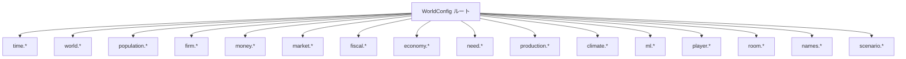
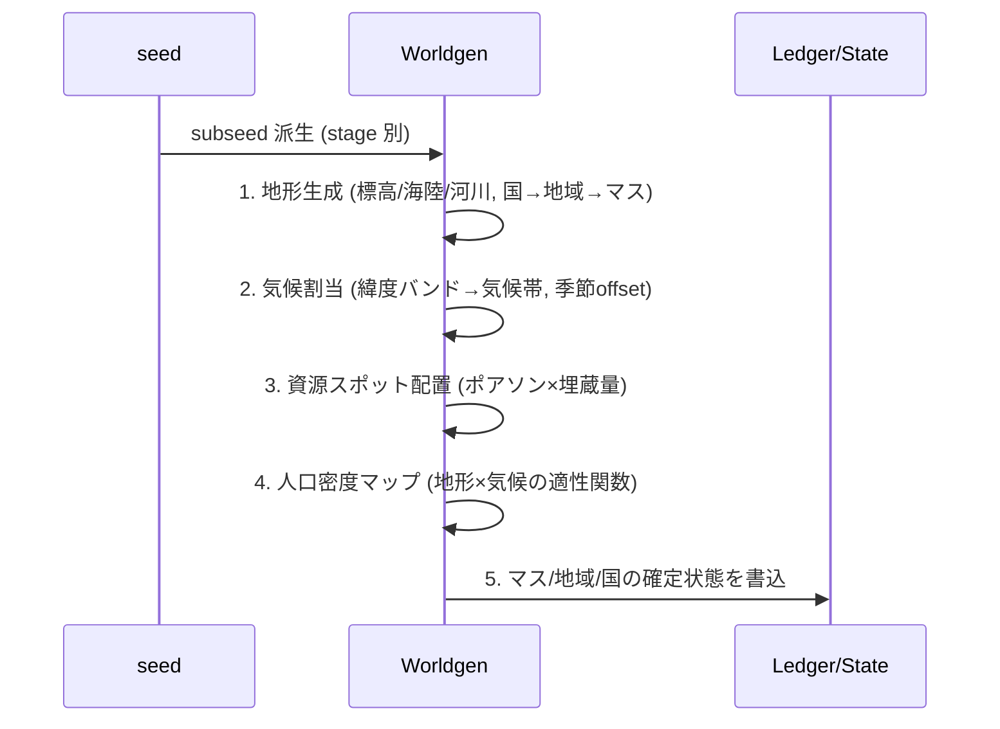
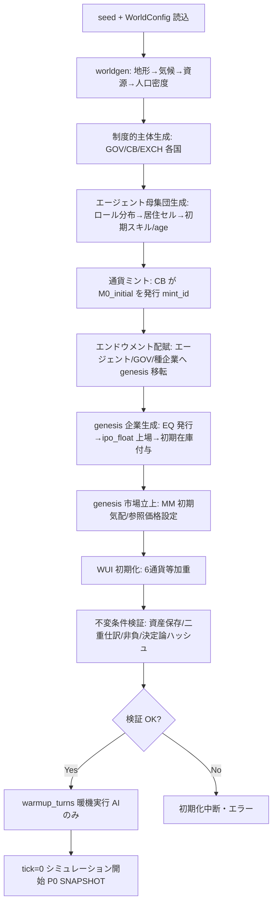

# 16. 構成と初期化

本書は FinBox の**構成パラメーター (configuration)** と**初期化手順 (initialization / worldgen)** を定義する。横断定義は [用語集と正準仕様](00-glossary.md) を唯一の真実として参照し、ここでは具体値・既定値・生成手続きを実装可能な水準まで確定する。世界生成は [世界と地理](04-world-and-geography.md)、母集団は [エージェント](05-agents.md) と [ロール](06-roles.md)、学習エピソードは [機械学習](07-machine-learning.md)、初期金融条件は [金融と金融商品](11-finance-and-instruments.md)、プレイヤー参加は [プレイヤーとマルチプレイヤー](13-players-and-multiplayer.md) と整合させる。

すべての初期化は単一の整数シード `seed` から決定論的に導出され、同一 `seed` と同一構成からは bit-identical な初期世界が再現される ([用語集 0.2](00-glossary.md))。

## 16.1 構成オブジェクトの構造

構成は単一のルートオブジェクト `WorldConfig` として与えられる。プリセット (16.9) はこのオブジェクトの差分上書きである。各サブセクションのキーは名前空間化され、構成ファイル (JSON/TOML) のキーパスと一対一に対応する。未指定キーは本書の既定値で補完される。

## 16.2 時間と世界の寸法 (`time.*`, `world.*`)

時間定数は [用語集 0.7](00-glossary.md) に従う。世界寸法は [世界と地理](04-world-and-geography.md) の階層 (国→地域→マス) を確定する。

| キー | 既定値 | 定義 |
| --- | --- | --- |
| `seed` | `0xF1B0C0DE` | 32bit 整数。全決定論派生の根。シナリオ未固定時は実行時に乱数化 |
| `time.turns_per_month` | 4 | 1か月のターン数 ([0.7](00-glossary.md) `TURNS_PER_MONTH`) |
| `time.months_per_year` | 12 | 1年の月数 (固定) |
| `time.turns_per_year` | 48 | 派生値 `turns_per_month × months_per_year`。構成不可 (計算で確定) |
| `time.cadence_mode` | `SYNC_REALTIME` | ターン進行様式。`SYNC_REALTIME`(実時間同期) / `SYNC_BARRIER`(全提出待ち) / `FAST`(待たず即時) |
| `time.turn_seconds` | 30 | エンジン既定の `SYNC_REALTIME` 時の1ターンの実時間 (秒)。提出窓口 P1 の締切間隔。プレイヤールームは `room.turn_seconds`(16.7.4) で上書きする |
| `time.warmup_turns` | 96 | ウォームアップ期間 (2年)。この間プレイヤー参加と報酬記録を抑止 (16.10) |
| `world.num_countries` | 6 | 国数 ([0.6](00-glossary.md))。固定 |
| `world.regions_per_country` | 16 | 1国の地域数 (4×4 グリッド) |
| `world.region_grid` | `[4, 4]` | 地域グリッドの `[幅, 高さ]` |
| `world.cells_per_region` | 96 | 1地域のマス数 (12×8 グリッド) |
| `world.cell_grid` | `[12, 8]` | マスグリッドの `[幅, 高さ]` |
| `world.cells_total` | 9216 | 派生値 `6 × 16 × 96`。全世界のマス総数 |

- `cadence_mode` の意味: `SYNC_REALTIME` は `turn_seconds` 経過で P1 を締め切り P2..P9 を実行する。`SYNC_BARRIER` は全登録クライアントの提出か個別タイムアウトで締め切る。`FAST` は学習・バッチ評価用で実時間待ちなし。いずれもパイプライン ([0.11](00-glossary.md)) は同一。
- [03 §3.4](03-time-and-turns.md)・[13 §13.5](13-players-and-multiplayer.md) の概念2モードとの対応: **real-time (壁時計デッドライン) = `SYNC_REALTIME`**、**synchronous (壁時計非依存。全提出 `all_submitted` または論理デッドライン `submit_deadline_turns` で締切) = `SYNC_BARRIER` および `FAST`**(`FAST` は論理デッドラインも待たず全提出を即時締切する synchronous の派生で、学習・リプレイ用)。`room.turn_seconds`(16.7.4) は `SYNC_REALTIME` のときのみ `time.turn_seconds` を上書きする。
- 提出窓口・締切の詳細は [時間とターン](03-time-and-turns.md) に従う。

## 16.3 通貨・市場・手数料 (`money.*`, `market.*`)

通貨と最小単位、価格刻み、手数料は [用語集 0.8](00-glossary.md) と [金融と金融商品](11-finance-and-instruments.md)、[市場と取引](09-markets-and-trading.md) に整合させる。

| キー | 既定値 | 定義 |
| --- | --- | --- |
| `money.minor_unit` | 1000 | 1通貨単位の最小単位分割数 (例: 1.000 = 1000 minor)。全通貨共通。価格・現金・残高は minor 単位の整数。表示小数桁は `log10(minor_unit)=3` |
| `money.display_decimals` | 3 | 人間表示の小数桁数 (派生値 `log10(minor_unit)`)。**表示専用**で台帳・API・観測・決定論には影響しない (16.3.1) |
| `money.thousands_separator` | `","` | 整数部の3桁グルーピング文字 (表示専用)。空文字で無効化 |
| `money.decimal_separator` | `"."` | 小数点文字 (表示専用)。`thousands_separator` と異なる文字であること |
| `money.numeraire` | `WUI` | 計数単位 ([0.16](00-glossary.md))。純資産順位の基準 |
| `money.wui_weighting` | `TRADE_GDP` | WUI 再加重方式。`EQUAL`(等加重) / `TRADE_GDP`(GDP×貿易シェア)。genesis は強制的に `EQUAL` 開始 |
| `money.wui_reweight_period_turns` | 48 | WUI 再加重の周期 (1年) |
| `market.fee_rate_bps` | 5 | 取引手数料率 (bps, 0.05%)。`fee = ceil(cash × fee_rate)` を `EXCH` が収受 ([0.8](00-glossary.md)) |
| `market.fx_fee_rate_bps` | 2 | FX ペアの手数料率 (bps)。FX は薄利化のため低め |
| `market.tick_size` | 1 | 価格刻み (minor 単位)。最小価格変動 |
| `market.price_band_bps` | 2000 | 1ターンの参照価格からの値幅制限 (±20%)。逸脱注文はクランプ ([09](09-markets-and-trading.md)) |
| `market.max_open_orders` | 64 | 1エンティティ・1ペアあたりの未約定注文上限 |

- WUI 初期加重: genesis 直後は6通貨等加重 (`1/6` ずつ)。`wui_reweight_period_turns` ごとに各国名目GDP×貿易シェアの正規化で再加重する ([11](11-finance-and-instruments.md))。`money.wui_weighting = EQUAL` の場合は再加重を行わず等加重を維持する。
- 価格・残高は常に `quote` の minor 単位整数 ([0.8](00-glossary.md))。`minor_unit = 1000` により最小通貨単位は `0.001` 通貨。

### 16.3.1 通貨数量の表示整形 (Display Formatting, 表示専用)

人間可読の通貨表示は、整数 minor 単位で保持される内部値を**フロントエンドで整形するだけ**の提示専用処理であり、台帳・API 転送値・観測・報酬・決定論ハッシュには一切影響しない ([00 §0.8/§0.20](00-glossary.md))。API は常に整数 minor 単位 (または `*_str` の十進整数、[14 §14.3](14-api-reference.md)) を送受し、整形はクライアント側で行う。

- **整形規則**: `display = group(internal // minor_unit) + decimal_separator + zero_pad(internal % minor_unit, display_decimals)`。`group(n)` は整数部を3桁ごとに `thousands_separator` で区切る。`minor_unit = 1000` のとき小数3桁。
- **例** (`minor_unit=1000`, `thousands_separator=","`, `decimal_separator="."`): 内部 `1000` → `1.000`、内部 `1500000` → `1,500.000`、内部 `1500000000` → `1,500,000.000`、内部 `1` → `0.001`。
- **正準採用フォーマット**は `1,500,000.000`(カンマ3桁区切り＋ピリオド小数3桁)。`thousands_separator`/`decimal_separator` はロケール対応のため構成可能だが、内部表現・約定計算・保存則 ([00 §0.17](00-glossary.md)) はこれに依存しない。
- WUI 建ての純資産・ランキング ([11 §11.9.3](11-finance-and-instruments.md)) も同じ整形規則で表示する (内部は整数、表示のみ小数3桁＋区切り)。

## 16.4 初期マクロ政策値 (`fiscal.*`, 金融初期条件)

税・関税・政策金利・財政の初期値は P3 GOVERN ([0.11](00-glossary.md)) が更新するまでの初期状態であり、以後は政治集約 ([0.12](00-glossary.md)) と中央銀行政策 ([11](11-finance-and-instruments.md)) で変動する。

| キー | 既定値 | 定義 |
| --- | --- | --- |
| `fiscal.policy_rate_bps` | 250 | 政策金利初期値 (年率, bps = 2.50%)。ターン利率は `r_turn = r_annual / 48` ([0.7](00-glossary.md)) |
| `fiscal.income_tax_rate_bps` | 1500 | 所得税初期 (15.00%) |
| `fiscal.corporate_tax_rate_bps` | 2000 | 法人税初期 (20.00%) |
| `fiscal.consumption_tax_rate_bps` | 800 | 消費税初期 (8.00%) |
| `fiscal.tariff_rate_bps` | 500 | 既定関税初期 (5.00%)。国・品目別に [12](12-politics-and-government.md) で上書き |
| `fiscal.reserve_ratio_bps` | 1000 | 法定準備率初期 (10.00%) |
| `fiscal.gov_debt_ceiling_ratio_bps` | 25000 | 国債発行枠初期 (対GDP 250.00%、`debt_ceiling_ratio = 2.5` 相当 [12](12-politics-and-government.md))。P3 で調整 |
| `fiscal.unemployment_benefit_per_turn` | 30 | 失業給付 (1ターン, minor 単位の現地通貨建て名目額) |
| `fiscal.discount_rate_gamma` | 0.995 | 報酬割引率 γ ([07](07-machine-learning.md))。年率換算 `γ^48 ≈ 0.786` |

- すべての利息・クーポンは単利按分 `r_turn = r_annual / 48`、成長指標は複利 `g_turn = (1+g)^(1/48) - 1` を用いる ([0.7](00-glossary.md))。
- `discount_rate_gamma` は学習報酬の割引であり、本書では既定値のみ定義する。報酬関数の詳細は [07](07-machine-learning.md)。

## 16.5 ニーズ減衰・割引 (`need.*`)

ニーズ状態は [用語集 0.13](00-glossary.md) で列挙される `0..100` の連続値。本表は1ターンあたりの線形減衰量 `decay_per_turn`(P6 CONSUME 後に適用) の既定を定める。詳細な回復関数・死亡条件は [05](05-agents.md)。

| ニーズ | `decay_per_turn` 既定 | 致死/警告 |
| --- | --- | --- |
| `satiety` | 8 | `≤ 0` が連続8ターンで餓死リスク |
| `hydration` | 12 | `≤ 0` が連続4ターンで脱水死リスク |
| `stamina` | 6 | 低下で労働供給能力低下 |
| `health` | 3 | `≤ 0` で死亡判定 ([05](05-agents.md)) |
| `rest` | 5 | 低下で生産性ペナルティ |
| `happiness` | 2 | 派生 (他ニーズの加重) |
| `stress`(逆値) | 4(上昇) | 高ストレスで health 追加減衰 |
| `comfort` | 3 | 住居なしで加速 |
| `social` | 4 | — |
| `security` | 0(国家状態で決定) | 戦時に低下 |
| `leisure` | 6 | — |
| `loyalty` | 1 | 福祉・治安・課税で増減 |

- `need.global_decay_scale`(既定 `1.0`): 全減衰量への一括スケール。シナリオ難易度調整に用いる。
- `need.death_check_enabled`(既定 `true`): 致死判定の有効化。学習初期の安定化のため `false` 化可能。

## 16.6 生産・資源・気候 (`production.*`, `climate.*`)

生産レシピ係数・地域資源埋蔵スケール・気候/災害確率の既定を定める。レシピ本体 (投入→産出の係数表) は [10](10-industry-and-production.md) が正準で、本書は係数の**全体スケール**と確率パラメーターを与える。

| キー | 既定値 | 定義 |
| --- | --- | --- |
| `production.recipe_yield_scale` | 1.0 | 全レシピ産出係数への一括スケール。経済規模の基礎調整 |
| `production.labor_intensity_scale` | 1.0 | 投入労働量への一括スケール |
| `production.capacity_expand_per_build` | 1 | `COMM:build.construction_labor` 1単位消費あたりの設備能力増分 ([10](10-industry-and-production.md)) |
| `production.depreciation_bps_per_turn` | 50 | 設備の減耗率 (0.50%/ターン)。年率換算 `≈ 21.4%` |
| `production.resource_scale` | 1.0 | 資源スポット埋蔵量・地域抽出上限への一括スケール ([04](04-world-and-geography.md)) |
| `production.resource_spots_per_region` | 3 | 1地域あたりの資源スポット期待数 (ポアソン平均) |
| `production.resource_regen_bps_per_turn` | 5 | 再生可能資源 (`agri.*`) の再生率 (0.05%/ターン)。`raw.*` は再生なし (=0) |
| `climate.season_amplitude` | 0.30 | 季節振幅。農業産出の年周期変動の最大相対幅 (±30%) |
| `climate.disaster_prob_per_region_turn` | 0.002 | 1地域・1ターンの災害発生確率 (0.2%) |
| `climate.disaster_severity_mean` | 0.40 | 災害時の被災マス産出減少の平均相対幅 |
| `climate.climate_zones` | 6 | 気候帯数。6帯 `{tropical, arid, temperate, continental, polar, highland}`([04](04-world-and-geography.md), [0.15](00-glossary.md))。緯度バンドと標高で割当 |

- 季節は `month` から導出する周期関数。農業 (`AGRICULTURE`) レシピ産出に `1 + season_amplitude × sin(2π × (month-offset)/12)` を乗じる。`offset` は気候帯ごとに異なる ([04](04-world-and-geography.md))。
- 災害はシード派生のサブ乱数 ([03](03-time-and-turns.md)) で判定し、被災地域の P5 産出を `1 - severity` 倍する。決定論を保つため災害乱数は `(tick, region_id)` から導出する。

## 16.7 母集団とエンドウメント (`population.*`, `economy.*`)

エージェント母集団のロール分布と初期残高 (genesis エンドウメント) を定める。配賦はプロトコル移転 ([0.10](00-glossary.md) genesis 配賦) として二重仕訳で記録する。ロール分類は [0.14](00-glossary.md)、エンティティ種別は [0.4](00-glossary.md) に従う。

### 16.7.1 規模とロール分布

| キー | 既定値 | 定義 |
| --- | --- | --- |
| `population.num_agents` | 600 | 全世界のエージェント総数 (数百規模)。国別に均等割 (各国 100) |
| `population.agents_per_country` | 100 | 派生値 `num_agents / num_countries` |
| `population.politicians_per_country` | 7 | 各国政治家数 K ([0.12](00-glossary.md) 集約の母数) |
| `population.central_bankers_per_country` | 1 | 各国中央銀行家数 |
| `population.bureaucrats_per_country` | 2 | 各国官僚数 |
| `population.generals_per_country` | 1 | 各国将官数 |
| `population.market_makers_per_country` | 2 | 各国 MM 数 ([0.4](00-glossary.md), [11](11-finance-and-instruments.md)) |
| `population.entrepreneurs_per_country` | 6 | 各国経営者数 (genesis 企業の初期運営者) |
| `population.investors_per_country` | 4 | 各国 AI 投資家数 |

残り (各国 `100 - (7+1+2+1+2+6+4) = 77` 体) は労働者系ロール ([0.14](00-glossary.md)) に以下の比率で配分する。比率は正規化後、各国人口へ最大剰余法で整数割当する。

| ロール | 相対比率 | 主たる `COMM:labor.*` |
| --- | --- | --- |
| `FARMER` | 14 | `labor.farm` |
| `MINER` | 6 | `labor.mine` |
| `BUILDER` | 8 | `labor.build` |
| `FACTORY_WORKER` | 18 | `labor.factory` |
| `SERVICE_WORKER` | 16 | `labor.service` |
| `OFFICE_WORKER` | 12 | `labor.office` |
| `LOGISTICS_WORKER` | 6 | `labor.unskilled` |
| `ENGINEER` | 4 | `labor.engineer` |
| `HEALTHCARE_WORKER` | 5 | `labor.health` |
| `TEACHER` | 4 | `labor.research` |
| `RESEARCHER` | 3 | `labor.research` |
| `SOLDIER` | 4 | `labor.soldier` |

- `STUDENT` / `UNEMPLOYED` / `RETIREE` は genesis では割当せず、ライフサイクル ([05](05-agents.md)) の中で `age` と就労状態から動的に派生する。
- 各労働者系ロールの「主たる `COMM:labor.*`」は [06 §6.3](06-roles.md) のロール→労働種別マッピングと一致する (`LOGISTICS_WORKER`=`labor.unskilled`、`TEACHER`/`RESEARCHER`=`labor.research`)。`labor.research` を供給する `TEACHER`/`RESEARCHER`、および `ENGINEER`/`HEALTHCARE_WORKER` は学歴ゲート `edu_gate` ([05 §5.3](05-agents.md): research=50, engineer=40, health=45) を満たす必要があるため、これらのロールの genesis `education` は対応する `edu_gate` 以上で初期化する (16.7.2 の一般範囲 `30..60` に対する下限保証)。
- 全ロール集合は [0.14](00-glossary.md) と一致する。本表に現れないロールは初期母集団に存在せず、運用中に創発する。

### 16.7.2 ロール別 genesis エンドウメント

各エージェントは居住国の通貨 `CUR:<country_code>` で初期現金を受け取る (minor 単位、現地名目額)。経営者・投資家は厚め、労働者系は生活防衛的な薄めとする。`MARKET_MAKER` は流動性供給のため全6通貨の大量現金に加え、担当する主要コモディティ/上場銘柄の基準在庫も genesis で配賦する ([09](09-markets-and-trading.md) §9.7.2)。

| ロール区分 | 初期現金 (minor) | 初期保有財 |
| --- | --- | --- |
| 労働者系 (全 `labor.*`) | 50000 | `good.food` 4, `good.clothing` 1 |
| `ENTREPRENEUR` | 2000000 | なし (出資は企業へ) |
| `INVESTOR` | 1500000 | なし |
| `MARKET_MAKER` | 全6通貨 各 5000000 | 主要コモディティ/上場銘柄の基準在庫 (下記) |
| `POLITICIAN` | 120000 | `good.food` 4 |
| `CENTRAL_BANKER` | 120000 | なし |
| `BUREAUCRAT` | 100000 | なし |
| `GENERAL` | 120000 | なし |

- MM の通貨配賦: 居住国通貨のみでなく全6通貨を各 `5000000` 配賦し、FX を含む全ペアに両側気配を置ける初期バランスシートを与える ([09](09-markets-and-trading.md) §9.7.2)。
- MM の基準在庫: 担当する各主要コモディティ (`good.*` / `agri.*` / `raw.*` / `mat.*` / `energy.fuel` の流動性付与対象) を `mm_base_inventory_commodity`(既定 `2000` 単位/銘柄)、担当する各上場銘柄 `EQ:firm.*` を `mm_base_inventory_equity`(既定 `2000` 株/銘柄) で genesis 配賦する。これにより初ターンから売り側気配も成立し、在庫ゼロによる片側板を防ぐ。在庫の不足分は以後の運用 (両建て約定) で補充する。
- `perishable`(`labor.*`/`svc.*`/`energy.electricity`) は繰越不可 ([0.5.3](00-glossary.md)) のため基準在庫を配賦せず、当該ペアの気配は当ターンの需給に応じて MM が建てる。

- 初期スキル: 各エージェントの主ロールに対応する `skill[labor.*]` を `40..70`(シード派生の一様乱数) で付与し、他種別技能は `0..20`。`education` は `30..60`。`skill` 上限は `100` ([0.13](00-glossary.md))。
- 居住セル割当: エージェントは居住国の地域・マスへ、人口密度マップ (16.8) に比例して確率配置する。資源・気候より沿岸/平地マスへ重み付けする ([04](04-world-and-geography.md))。
- `age` 初期: `20..65` tick換算 (シード派生)。退職判定・出生は [05](05-agents.md)。

### 16.7.3 制度的主体のエンドウメント

| エンティティ | 初期残高 |
| --- | --- |
| `GOV:<cc>` | 自国通貨 `100000000` minor。国債未発行残高 0 |
| `CB:<cc>` | 自国通貨の発行能力を持つ。初期保有現金 0 (発行で供給)。準備預金台帳を保持 |
| `EXCH` | 全通貨残高 0。手数料収受で累積 |
| `PLAYER:*` | 16.7.4 のプレイヤー初期資本 |

- 通貨総量の初期供給: 各国 `CB:<cc>` が genesis で `M0_initial = agents_per_country × 平均初期現金 + GOV初期現金` を自国通貨でミントし ([0.10](00-glossary.md) 中央銀行発行)、エンドウメント配賦の原資とする。ミントは `mint_id` を持つ ([0.9](00-glossary.md))。

### 16.7.4 プレイヤーとルーム (`player.*`, `room.*`)

プレイヤー初期資本・参加制約・ルーム (対戦セッション) の構成を定める。[13](13-players-and-multiplayer.md) はプレイヤー参加の手続きを定義し、初期資本・参加上限・基準などの構成値は本表の `player.*`/`room.*` と `scenario.episode_turns`(16.10) を参照する (独自の既定値を再定義しない)。プレイヤーの登録・退出・観戦・結果取得の API 経路は [14](14-api-reference.md) の `/v1` 正準パスに従う。

| キー | 既定値 | 定義 |
| --- | --- | --- |
| `player.starting_capital` | 1500000 | プレイヤー初期資本 (minor)。`endowment_basis = CURRENCY` 時は選択所属国の通貨建て。AI `INVESTOR` と同額で公平性を担保 ([13](13-players-and-multiplayer.md)) |
| `player.endowment_basis` | `WUI` | 初期資本の基準 ([0.16](00-glossary.md))。`WUI`(競技モード既定、`player.initial_endowment_wui` を WUI 建てで配賦し参加時の FX で通貨換算) / `CURRENCY`(`player.starting_capital` を所属国通貨で配賦) |
| `player.initial_endowment_wui` | 15000 | `endowment_basis = WUI` 時の WUI 建て初期額。通貨価値差を排し国選択を中立化する |
| `player.default_role` | `INVESTOR` | 既定ロール ([0.14](00-glossary.md)) |
| `player.allow_entrepreneur` | `false` | `ENTREPRENEUR` 解禁フラグ ([13](13-players-and-multiplayer.md)) |
| `player.allow_market_maker` | `false` | `MARKET_MAKER` 解禁フラグ。既定は AI 専用 ([13](13-players-and-multiplayer.md)) |
| `player.default_country` | `null` | プレイヤーの既定所属国 (`country_code`)。`null` のとき参加時に選択。未選択時はプレイヤー数最少の国へ割当 |
| `player.max_players_per_country` | 16 | 1国あたりの同時参加プレイヤー上限 |
| `room.max_players` | 64 | 1ルームの同時参加プレイヤー上限 |
| `room.turn_seconds` | 60 | プレイヤールームの1ターン実時間 (秒)。エンジン既定 `time.turn_seconds = 30`(16.2) を上書きする |
| `room.min_market_makers` | 2 | ルーム成立に必要な最小 MM 数 (AI 補充を含む)。流動性確保のため割れ込み時は AI MM を追加配賦する |

## 16.8 世界生成 (worldgen)

世界生成は `seed` から決定論的に進む手続きである。各段は前段の出力のみに依存し、独立サブシードを用いる。サブシード導出は [03 §3.6.1](03-time-and-turns.md) の正準規則に従い、`master_seed = seed`・`tick = -1`(パイプライン外)・`stream_id` は段別の固定文字列とする: `subseed = H(seed, -1, "worldgen.<stage>", cell_id|region_id|agent_id)`(`H` = SHA-256 → 先頭8バイト LE uint64、PRNG = PCG64)。数値マジック (`0x01` 等) は用いず文字列 `stream_id` に統一する (3.6.1 の worldgen ストリーム列挙と一致)。地形・気候・資源・人口の意味は [04](04-world-and-geography.md) が正準。

1. **地形生成**: 各国 16 地域 (4×4)、各地域 96 マス (12×8) を確定。マスごとに `elevation`(標高)・`is_water`(海陸)・`is_coast`(沿岸)・`fertility`(地力)・`ruggedness`(地形険しさ) をフラクタルノイズ (value noise, stream_id `"worldgen.terrain"`) で生成。国境は地域グリッド境界に一致。
2. **気候割当**: 国の南北位置から緯度バンドを定め、標高と併せて `climate.climate_zones`(6帯 `{tropical, arid, temperate, continental, polar, highland}`) のいずれかをマスへ割当。`highland` は高標高マスに割当てる。気候帯ごとに季節 `offset`(農業周期の位相) と基礎降水・気温を設定 (stream_id `"worldgen.climate"`)。
3. **資源スポット配置**: 各地域に `production.resource_spots_per_region`(平均3) のポアソン過程でスポットを置き、各スポットに `raw.*` または `agri.*` 適性と埋蔵量 `endowment = base × resource_scale × Gamma乱数` を割当。`raw.*` は非再生 (`regen=0`)、`agri.*` は地力 `fertility` に比例する再生上限を持つ (stream_id `"worldgen.resource"`)。地域の抽出上限は当該地域内スポット埋蔵の合計 ([10](10-industry-and-production.md))。
4. **人口密度マップ**: マス適性 `habitability = w1·(1-elevation) + w2·is_coast + w3·fertility + w4·(1-disaster_risk)` を正規化し、母集団の居住確率分布とする (stream_id `"worldgen.popdensity"`。ロール割当は `"worldgen.roles"`)。
5. **確定状態の書込**: 上記をエンジン状態とし、台帳には未だ残高を置かない (エンドウメントは 16.7 で配賦)。

- 決定論保証: 全段が `(seed, stage_id, cell_id 等)` のみから乱数を引くため、並列生成しても結果は順序非依存で一意 ([0.2](00-glossary.md))。
- 地名・国名は [0.6](00-glossary.md) の既定呼称を用い、地理パラメーターのみシード生成する。

## 16.9 企業の初期配置 (genesis 企業)

経済の「空白を作らない」原則 ([0.2](00-glossary.md)) を満たすため、genesis では各国に**全産業の種企業 (genesis firms)** を1社以上配置する。これにより初ターンから抽出→加工→最終財→消費の財の流れが接続される。以後の企業は経営者の起業で創発する ([10](10-industry-and-production.md))。

| キー | 既定値 | 定義 |
| --- | --- | --- |
| `firm.genesis_firms_per_country` | 12 | 各国の種企業数。下表の産業割当に対応 |
| `firm.genesis_initial_cash` | 800000 | 種企業の初期現金 (自国通貨 minor) |
| `firm.genesis_initial_capacity` | 4 | 種企業の初期設備能力 (生産能力単位) |
| `firm.genesis_initial_inventory_turns` | 2 | 初期在庫を「2ターン分の投入財相当」で付与 |
| `firm.ipo_float_bps` | 3000 | genesis 企業の公開比率 (30.00%)。残りは設立経営者保有 |
| `firm.initial_shares` | 100000 | 1社あたり初期発行株式数 (`EQ:firm.*`) |

各国の種企業の産業割当 ([0.15](00-glossary.md) 産業分類):

| 産業 | 種企業数/国 |
| --- | --- |
| `AGRICULTURE` | 2 |
| `MINING` | 1 |
| `ENERGY` | 1 |
| `CONSTRUCTION` | 1 |
| `MANUFACTURING` | 3 |
| `LOGISTICS` | 1 |
| `FINANCE` | 1 |
| `SERVICES` | 1 |
| `RESEARCH` | 1 |

- `MANUFACTURING` の3社は細分 ([0.15](00-glossary.md)) のうち food/heavy/electronics を初期割当とし、残る細分 (chemical/textile/automotive/pharma/armaments) は起業で創発する。
- 種企業は genesis で `EQ:firm.<6桁>` を `initial_shares` 発行し、`ipo_float_bps` を金融商品市場へ初期上場 ([11](11-finance-and-instruments.md))。残株は設立経営者 (`ENTREPRENEUR`) が保有 (プロトコル移転で配賦)。
- 初期在庫: 種企業のレシピ ([10](10-industry-and-production.md)) の `inventory_turns` 分の投入財を `storable` 範囲で付与。`perishable`(labor/svc/electricity) は付与せず初ターンの市場で調達。
- 種企業の設備は減耗 (`depreciation_bps_per_turn`) の対象。能力拡張は `build.construction_labor` 消費による ([10](10-industry-and-production.md))。

## 16.10 シナリオ・プリセットと再現性 (`scenario.*`)

プリセットは `WorldConfig` への差分上書きであり、`seed` 固定で完全再現される。学習・評価のエピソード長やウォームアップもここで定める。

| キー | 既定値 | 定義 |
| --- | --- | --- |
| `scenario.preset` | `BALANCED` | プリセット名 (下表) |
| `scenario.episode_turns` | 480 | 学習1エピソードのターン数 (10年)。`FAST` cadence で消化 ([07](07-machine-learning.md)) |
| `scenario.reset_on_episode` | `true` | エピソード終端で `seed` から再初期化するか (学習用) |
| `scenario.warmup_turns` | 96 | `time.warmup_turns` の別名。プレイヤー参加・報酬記録の開始を遅らせる暖機 |

プリセット定義 (差分の要点):

| プリセット | 主な差分 | 狙い |
| --- | --- | --- |
| `BALANCED` | 既定値そのまま。資源を全国へ準均等配置 (`resource_scale=1.0`)、関税 5% | 標準・学習基準 |
| `RESOURCE_SKEW` | 資源スポットを2国へ偏在 (該当国 `resource_scale≈2.0`、他国 `≈0.5`)、`tariff_rate_bps=1000` | 資源偏在・交易依存・貿易摩擦の検証 |
| `CONFLICT` | `climate.disaster_prob` 据置、軍事予算枠拡大、`SOLDIER` 比率 ×1.5、国境隣接の緊張高、関税 `1500` | 紛争多発・軍事と領土の動学検証 ([12](12-politics-and-government.md)) |
| `STABLE_LEARN` | `need.death_check_enabled=false`、`global_decay_scale=0.8`、`market.price_band_bps=1000` | 学習初期の安定化・崩壊回避 |
| `SANDBOX` | `player.allow_entrepreneur=true`、`room.max_players=64`、`room.turn_seconds=60`、`cadence_mode=SYNC_REALTIME` | 人間プレイヤー対戦・運用 ([13](13-players-and-multiplayer.md)) |

- 再現性: プリセット名と `seed` の組で初期世界は一意に定まる ([0.2](00-glossary.md))。プリセットは構成差分として記録され、監査可能。
- ウォームアップ: `warmup_turns` の間、AIエージェントのみで経済を回し価格・在庫・雇用を定常化させてからプレイヤー参加と報酬記録を開始する。これにより初期過渡 (空板・価格未形成) によるプレイヤー不利益を排除する ([13](13-players-and-multiplayer.md))。

## 16.11 バランス調整の指針

初期値は「経済が崩壊 (流動性枯渇・連鎖倒産・餓死連鎖) も暴走 (ハイパーインフレ・価格発散) もしない」定常近傍から開始することを目的に選ぶ。崩壊・暴走を避けるための設計則を以下に固定する。

- **流動性**: 初期マネーサプライ `M0_initial`(16.7.3) は「平均的家計が約 6..10 ターン分の基礎消費を現金で賄える」水準に設定する。薄すぎると板が約定せず、厚すぎると即時インフレになる。労働者初期現金 50000 と消費財初期価格 (下記) はこの比から逆算する。
- **初期価格**: genesis 市場には MM が初期気配を置く。基礎財の初期参照価格は「労働1単位の賃金で最終財を数単位買える」実質賃金が正になるよう設定する。例: `good.food` の初期参照価格 ≈ 3000 minor、`labor.unskilled` の初期賃金気配 ≈ 12000 minor/ターン。これにより初ターンから消費が成立する。
- **MM 配賦**: MM の潤沢な初期現金 (全6通貨 各 5000000) と主要コモディティ/上場銘柄の基準在庫 (16.7.2) により、全主要ペアに両側気配を供給し `price_band_bps`(±20%) 内の連続性を確保する。MM 不在ペアは価格未形成となるため、genesis では全 `good.*` / `labor.*` / 主要 FX に最低1 MM を割当てる。`perishable` ペアは在庫を持てないため当ターン需給で気配を建てる。
- **税率**: 初期税率 (所得15% / 法人20% / 消費8%) は可処分所得を圧迫しすぎず、政府が補助金・福祉を回せる中庸値。高すぎると消費が止まり、低すぎると政府破綻 ([12](12-politics-and-government.md))。
- **金利**: 政策金利初期 2.50% は実質正・名目低位。高すぎると投資・起業が止まり、低すぎると過剰信用。準備率 10% と合わせ信用乗数を抑制する ([11](11-finance-and-instruments.md))。
- **減衰と致死**: ニーズ減衰 (16.5) と初期現金・初期価格の比は「健全な労働→消費ループで全ニーズが維持できる」よう調整する。学習初期は `STABLE_LEARN` で致死を無効化し、定常化後に有効化する。
- **生産係数**: `recipe_yield_scale=1.0` を基準に、抽出→加工→最終財の各段の歩留まりが下流需要を満たす量比 ([10](10-industry-and-production.md)) になるよう種企業能力 (`genesis_initial_capacity=4`) と母集団規模 (各国100) を釣り合わせる。
- **保存則の検証**: 初期化直後に全資産の総量・二重仕訳の借貸一致・非負残高を検証する不変条件チェック ([0.17](00-glossary.md)) を必須とし、違反時は初期化を中断する。

## 16.12 初期化シーケンス (全体)

`seed` と `WorldConfig` から確定世界とシミュレーション開始 (`tick=0`) までの全体手順。各段はプロトコル移転または生成として台帳に記録され、最後に不変条件を検証する。

- 上記シーケンスは決定論的であり、同一入力から同一の初期状態ハッシュを生む。ハッシュは再現性検証 ([0.2](00-glossary.md)) と監査に用いる。
- 表示名の割当 (16.14): 国名・通貨名は worldgen (B) の確定時、人名はエージェント母集団生成 (D)、企業名は genesis 企業生成 (G) の各段で決定論的に付与する (台帳非変更・状態ハッシュには表示名を含めるが数値ロジックには影響しない)。
- `warmup_turns` の暖機後にプレイヤー受付を開放し、`tick=0` を「正式開始」と定義する (暖機ターンは負の `tick` または別系列で記録し、報酬・順位に算入しない)。
- 以降のターン進行は [時間とターン](03-time-and-turns.md) のパイプライン ([0.11](00-glossary.md)) に従う。

## 16.13 構成の検証と既定の優先順位

- **優先順位**: コマンドライン/環境変数上書き > シナリオプリセット差分 > 本書既定値。派生値 (`turns_per_year`, `cells_total`, `agents_per_country`) は上書き不可で常に再計算する。
- **整合検証**: 読込時に以下を検証し、違反は起動拒否とする。
  - `regions_per_country == region_grid[0] × region_grid[1]` かつ `cells_per_region == cell_grid[0] × cell_grid[1]`。
  - ロール分布の合計が `agents_per_country` を超えない (労働者系で残数を充足)。
  - `fee_rate_bps`, 各税率, `policy_rate_bps` が `[0, 上限]` レンジ内。
  - `minor_unit ≥ 1` かつ価格・初期残高がすべて整数 ([0.8](00-glossary.md))。
- 検証通過後の `WorldConfig` は不変 (immutable) とし、シミュレーション中の構成変更はプリセット切替=再初期化でのみ行う。

## 16.14 命名とフレーバー (Naming & Flavor)

国・通貨・企業・エージェントには、curated な名前プールからシード由来で決定論的に割当てる**人間可読の表示名 (display name)** を与える。これは純粋なフレーバー (提示) 層であり、正準IDとは独立である。

- **ID は常に正準**: `country_code`(`ALD` 等, [0.6](00-glossary.md))・通貨 `CUR:<cc>`・`FIRM:<6桁>`・`AGENT:<6桁>`・`PLAYER:<6桁>`([0.4](00-glossary.md)) はロジック・台帳・約定・観測ベクトル ([07](07-machine-learning.md))・決定論ハッシュ ([0.17](00-glossary.md)) の唯一の参照キーである。表示名はこれらに**一切影響しない**。割当の手続きのみがシードから決定論的に定まる (同一 `seed` → 同一割当)。
- **表示名は観測の数値特徴に入れない**: 名前は API・ニュース・リーダーボード・地図の**ラベル**としてのみ用い、方策の観測テンソル ([07 §7.3](07-machine-learning.md)) には含めない (学習は ID/数値特徴のみに依存し、名前の言語的内容に依存しない)。

### 16.14.1 名前プール (`names.*`)

| キー | 既定 | 定義 |
| --- | --- | --- |
| `names.locale_pack` | `DEFAULT` | 名前プールのプリセット束 (言語・テーマ)。プールはこのパックの差分で上書き可 |
| `names.country_names` | 既定6国名 + 予備 (≥ `num_countries`) | 国の表示名候補。既定は [0.6](00-glossary.md) の `Aldoria/Borealis/Cyrene/Doria/Esmark/Faros` を含む拡張リスト |
| `names.currency_names` | 国別通貨名候補 (≥6) | 通貨 `CUR:<cc>` の表示名 (例 `Aldor`/`Boreal Krona`)。国名から派生生成も可 |
| `names.firm_names` | 企業名プール | 企業の表示名候補。`names.firm_name_parts`(接頭辞×接尾辞) からの組合せ生成も可 (プール拡張) |
| `names.person_given` | 個人名プール | エージェントの given name 候補 |
| `names.person_family` | 姓プール | エージェントの family name 候補。表示名は `given family` で合成 |
| `names.assign_person_names` | `true` | エージェントへ人名を割当てるか。`false` なら `entity_id` を表示名にフォールバック |

- プールは `num_countries`(6)・初期企業数・母集団規模 ([16.7](16-configuration-and-initialization.md)) に対し一意割当が可能な大きさを要求する (検証は 16.13)。人名は `|person_given| × |person_family|` の組合せ数が母集団 (既定 600) を十分上回るよう構成する。

### 16.14.2 決定論的割当規則

すべて [03 §3.6.1](03-time-and-turns.md) の subseed (SHA-256→PCG64、`tick=-1` は genesis 外) を用い、走査順は正準 ID 昇順 ([03 §3.7](03-time-and-turns.md))。

- **国名・通貨名**: `rng(seed, -1, "naming.country")` / `rng(seed, -1, "naming.currency")` でプールをシャッフルし、`country_code` 辞書順 (`ALD<BOR<...<FAR`) に重複なく割当てる。占領で `cell.owner` が変わっても国の表示名・通貨名は不変。
- **企業名**: genesis 企業は `rng(seed, -1, "naming.firm", firm_id)`、運用中の起業企業は `rng(seed, founding_tick, "naming.firm", firm_id)` でプールから割当てる。経営者 (`ENTREPRENEUR`/解禁プレイヤー) が設立時に名前を指定した場合 ([14 §14.5.5](14-api-reference.md) の `name`) はそれを優先し、未指定時のみプール割当。
- **人名**: エージェントは出生時 (genesis または P6 出生) に `rng(seed, birth_tick, "naming.person", agent_id)` で `given`×`family` を割当てる。プレイヤーは登録時の `display_name`([13](13-players-and-multiplayer.md)) を用いる。
- **一意性とフォールバック**: 同種内 (同一国群・同一エピソードの企業/人名) で表示名が衝突する場合は、決定論的に連番サフィックスを付して一意化する (例 `Helios Devices` → `Helios Devices (2)`)。プール枯渇時も同様にサフィックスで一意性を保証する。

### 16.14.3 初期化シーケンスへの組込

16.12 のシーケンスにおいて、名前割当は状態確定の一部として次の位置で行う (いずれも決定論・台帳非変更)。

- 国・通貨名: worldgen (16.8) の確定状態書込時に割当 (国・通貨は genesis で確定するため)。
- 企業名: genesis 企業生成 (16.9) 時に割当。
- 人名: エージェント母集団生成 (16.7) 時に割当 (`assign_person_names=true` のとき)。

名前は [15](15-data-model.md) の表示名フィールド (`Country.name`・`Asset.display_name`・`Firm.display_name`・`Agent.display_name`) に格納し、API ([14](14-api-reference.md)) の国・エンティティ・企業レスポンスで公開する。同一 `(seed, WorldConfig)` から同一の名前割当が再現される ([0.2](00-glossary.md))。
