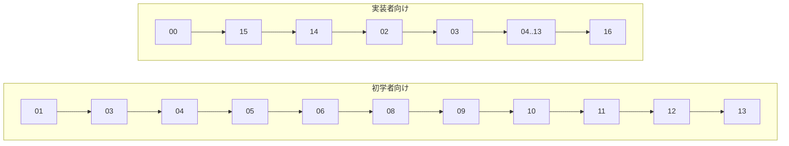
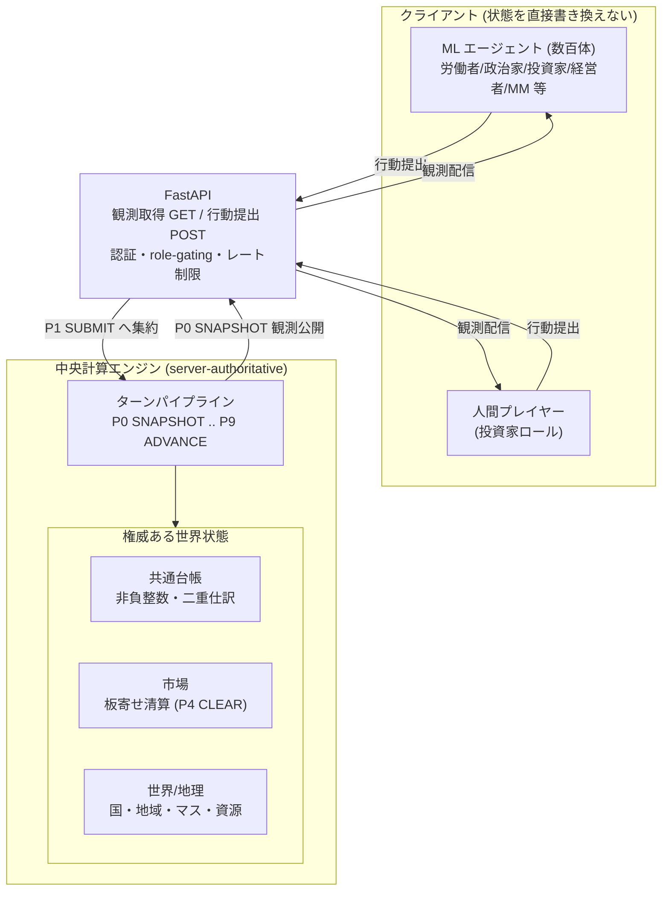

# FinBox ドキュメント

FinBox は、機械学習で駆動する数百体のエージェント (労働者・政治家・投資家・経営者・マーケットメイカーなど) が6か国に分かれて経済を回す、ターン制の経済シミュレーションである。中央計算エンジンが唯一の権威 (server-authoritative) として状態遷移を決定論的に実行し、エージェントも人間プレイヤーも FastAPI 経由で観測の取得と行動の提出のみを行う、サーバー/クライアント完全分離モデルを採る。人間プレイヤーは投資家ロールで参加し、AIエージェントや他プレイヤーと同一のインターフェース・同一の認証・同一の行動スキーマで競争する。経済はすべて公開市場の板寄せ約定 (call-auction clearing) と、数量を非負整数で扱う共通台帳の二重仕訳 (double-entry ledger) の上で動く。本ドキュメント群は、この箱庭経済を曖昧さなく実装可能な水準まで定義した設計仕様 (design specification) である。

FinBox という名称は「金融 (Finance) を回す箱 (Box)」を意味し、抽出から加工・最終財・消費・資本形成・金融・財政・軍事までの経済の流れを断絶なく1つの世界に閉じ込めることを目的とする。すべての横断定義 (ID体系・列挙値・通貨/国コード・時間定数・ターンパイプライン・保存則と不変条件) は [00-glossary.md](00-glossary.md) に集約され、本ファイルを含む各ドキュメントはそれを唯一の真実 (single source of truth) として参照する。

## 読書順の推奨

読者の目的に応じて2系統の読書順を推奨する。

- **初学者向け (概念を順に積み上げる)**: [01 概要](01-overview.md) → [03 時間とターン](03-time-and-turns.md) → [04 世界と地理](04-world-and-geography.md) → [05 エージェント](05-agents.md) → [06 ロール](06-roles.md) → [08 経済と台帳](08-economy-and-ledger.md) → [09 市場と取引](09-markets-and-trading.md) → [10 産業と生産](10-industry-and-production.md) → [11 金融と金融商品](11-finance-and-instruments.md) → [12 政治と統治](12-politics-and-government.md) → [13 プレイヤーとマルチプレイヤー](13-players-and-multiplayer.md)。
- **実装者向け (契約と境界を先に固める)**: [00 用語集と正準仕様](00-glossary.md) → [15 データモデル](15-data-model.md) → [14 API リファレンス](14-api-reference.md) → [02 アーキテクチャ](02-architecture.md) → [03 時間とターン](03-time-and-turns.md) → [04 世界と地理](04-world-and-geography.md) → [05 エージェント](05-agents.md) → [06 ロール](06-roles.md) → [07 機械学習](07-machine-learning.md) → [08 経済と台帳](08-economy-and-ledger.md) → [09 市場と取引](09-markets-and-trading.md) → [10 産業と生産](10-industry-and-production.md) → [11 金融と金融商品](11-finance-and-instruments.md) → [12 政治と統治](12-politics-and-government.md) → [13 プレイヤーとマルチプレイヤー](13-players-and-multiplayer.md) → [16 構成と初期化](16-configuration-and-initialization.md)。

## ドキュメント体系

各ファイルは独立して読めるが、横断定義は [00-glossary.md](00-glossary.md) に集約される。下表は用語集 0.1 のドキュメント体系表と整合する。

| ファイル | 表題 | 主題 |
| --- | --- | --- |
| [README.md](README.md) | 目次と読み方 | ドキュメント全体の索引・読書順・全体図 (本書) |
| [00-glossary.md](00-glossary.md) | 用語集と正準仕様 | 横断定義・ID体系・列挙値・不変条件 (唯一の真実) |
| [01-overview.md](01-overview.md) | システム概要 | ビジョン・目的・全体アーキテクチャ・リアリティ設計 |
| [02-architecture.md](02-architecture.md) | アーキテクチャ | エンジン/クライアント分離・FastAPI・データフロー・権限モデル |
| [03-time-and-turns.md](03-time-and-turns.md) | 時間とターン | 暦・ターンパイプライン詳細・提出窓口・決定論・乱数 |
| [04-world-and-geography.md](04-world-and-geography.md) | 世界と地理 | 国・地域・マス・資源・気候・季節・地図生成・人口移動 |
| [05-agents.md](05-agents.md) | エージェント | ニーズ状態・ライフサイクル・意思決定ループ・消費・労働 |
| [06-roles.md](06-roles.md) | ロール | ロール分類・責務・許可される行動・配属と流動性 |
| [07-machine-learning.md](07-machine-learning.md) | 機械学習 | 観測/行動空間・報酬関数・学習方式・推論配信・評価 |
| [08-economy-and-ledger.md](08-economy-and-ledger.md) | 経済と台帳 | Tradable Assets分類・台帳・ID・整数不変条件・決済・保存則 |
| [09-markets-and-trading.md](09-markets-and-trading.md) | 市場と取引 | 板寄せアルゴリズム・注文種別・通貨ペア・マーケットメイカー |
| [10-industry-and-production.md](10-industry-and-production.md) | 産業と生産 | 産業・生産レシピ・設備・地域上限・建設労働力・企業ライフサイクル |
| [11-finance-and-instruments.md](11-finance-and-instruments.md) | 金融と金融商品 | 通貨・国債・社債・株式・中央銀行・金融財政政策・利息計算・指標 |
| [12-politics-and-government.md](12-politics-and-government.md) | 政治と統治 | 政治意思決定の集約・政策レバー・軍事・領土・関税・課税 |
| [13-players-and-multiplayer.md](13-players-and-multiplayer.md) | プレイヤーとマルチプレイヤー | プレイヤー参加・エージェントとの同等性・公平性・ランキング |
| [14-api-reference.md](14-api-reference.md) | API リファレンス | FastAPI エンドポイント・認証・スキーマ・エラー・レート制限 |
| [15-data-model.md](15-data-model.md) | データモデル | 正準データスキーマ・エンティティ関係・フィールド定義 |
| [16-configuration-and-initialization.md](16-configuration-and-initialization.md) | 構成と初期化 | 構成パラメーター・デフォルト値・世界生成・シナリオ・再現性 |

## 全体アーキテクチャ

中央計算エンジンが世界状態 (台帳・市場・世界/地理) を保持し、ターンパイプライン (P0 SNAPSHOT..P9 ADVANCE、[00-glossary.md](00-glossary.md) 0.11) を決定論的に駆動する。クライアント (機械学習エージェントと人間プレイヤー) は FastAPI を介して観測を取得し行動を提出するのみで、状態を直接書き換えることはできない。

詳細は [02 アーキテクチャ](02-architecture.md) (分離モデルとデータフロー)、[03 時間とターン](03-time-and-turns.md) (パイプライン)、[08 経済と台帳](08-economy-and-ledger.md) (台帳)、[09 市場と取引](09-markets-and-trading.md) (板寄せ)、[14 API リファレンス](14-api-reference.md) (エンドポイント) を参照すること。本ドキュメント群はあくまで設計仕様であり、実装状況や進捗を記述しない。
